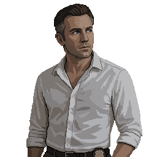

# Detective Aaron Cole

> Portrait generated 2026-08-13 with PixelLab's Create Image (Pro) tool, via the established
> two-step pipeline (semi-realistic source photo → `create_image_pro` reference-image pass) — see
> [`README.md`](README.md) → "Convention: reference portraits for named characters." Since he's
> never seen on-screen alive or dead, his appearance below was interpreted for this portrait
> (generic, unremarkable — early 40s, tired eyes, a few days of stubble) rather than independently
> established elsewhere.

> Proposed (2026-08-13), alongside the "Vanguard's Grip on Ravenwood PD" addition to
> [`CANON.md`](../CANON.md). Never seen alive or dead — his disappearance predates the outbreak by
> some unspecified span (weeks or months, not decided), making him a different flavor of absence
> than [Fennimore](Fennimore.md) or [Corporal Eli Reyes](Eli_Reyes.md), both of whom died the night
> of the outbreak itself. Cole's story is an older wound Jim uncovers, not a fresh one — a
> deliberate way to signal that Vanguard's corruption of the department predates Black Vein
> escaping containment. Treat as a draft pending review, same as any new character.

## Role

A Ravenwood PD detective who secretly investigated a pattern of local disappearances, traced them
to Vanguard's "V-CASE" program, and was discredited and removed before he could act on what he
found. Never appears on-screen; entirely reconstructed through his abandoned office and the
investigation he hid from Vanguard. The primary discovery trail for the Police Station's Vanguard
sub-plot (see [`CANON.md`](../CANON.md) → "Vanguard's Grip on Ravenwood PD").

## Background

No biography established beyond his role as a detective. Presumably worked out of a desk/small
office near the Bullpen — not otherwise distinguished from any other officer until he started
noticing the pattern.

## Appearance

Not established — never seen on-screen, alive or dead. His office is furnished with the ordinary
personal effects of someone who expected to come back: a coffee cup left on the desk, a family
photograph, a coat still hanging behind the door.

## Personality

Reconstructed entirely through his own writing (see "Dialogue Characteristics," below) —
methodical, quietly persistent, and increasingly disturbed by what he's finding without losing his
investigator's habit of writing things down precisely. Not written as paranoid or unstable — the
internal-affairs case built against him (evidence tampering, prescription drug abuse, harassment,
misconduct, stealing department property) is explicitly fabricated, not a portrait of a man
unraveling.

## Relationships

- **[Sergeant Ruth Calloway](Ruth_Calloway.md)** — coworker; no specific personal relationship
  established, though she may be aware of what happened to him (see her own file's "Unresolved
  Ideas"). Any scripted acknowledgment of Cole in her dialogue is a small, deliberately restrained
  hook per the game's "environmental discovery, not exposition" convention — not a full retelling
  of his story in her own words.
- **Officer Daniels** — a minor, unnamed-beyond-a-surname colleague referenced in an internal
  email exchange found in Cole's investigation, pushing back on the department's Vanguard-referral
  policy on behalf of a missing teenager's mother before being shut down by the Chief ("That's
  enough, Daniels.") and later "transferred" — with no record he ever joined another department.
  Kept as a background document detail, not a full character file, unless a future decision expands
  his role.
- **The Vanguard Liaison** — not a personal relationship so much as Cole's investigative target;
  see [`CANON.md`](../CANON.md) for the Liaison Program itself. The Liaison is not otherwise named.

## Story Arc

- Began connecting a string of missing-person cases — ordinary, unrelated people, but nearly all
  with a recent police interaction beforehand (a traffic stop, a public-intoxication charge, a
  domestic-disturbance call, a welfare check, a trespassing complaint) — and found the common
  factor: every one of them was marked **V-CASE TRANSFERRED**.
- Secretly investigated Vanguard and eventually obtained a Vanguard security image proving one of
  the "transferred" people was still alive months later — but horrifically mutated by Ashen
  experimentation. Realized Vanguard wasn't transferring patients; it was supplying subjects.
- Went further and found evidence Vanguard had been deliberately directing increased police
  patrols into contamination-adjacent neighborhoods rather than evacuating them, to gather data on
  early-stage exposure — see `CANON.md` for the full "town as a field study" thread this uncovers.
- When Vanguard discovered the investigation, they didn't move against him directly — they used
  the department itself: a sudden internal-affairs case (fabricated evidence-tampering, drug-abuse,
  harassment, misconduct, and property-theft allegations) got his badge suspended and his
  investigation confiscated. He then disappeared. Officially, "Detective Cole resigned following
  disciplinary proceedings" — but there's no record he ever joined another department, raising the
  open question of whether Vanguard disappears people beyond just V-CASEs.
- His office was left exactly as it was — coffee cup, family photo, coat on the hook — because
  nobody wanted to be the one to clear it out. The investigation Vanguard missed is hidden inside
  his desk or the ceiling tiles above it, along with a duplicate/stolen **Vanguard Access Card**
  (see [`Items/Key_Items/Vanguard_Access_Card.md`](../Items/Key_Items/Vanguard_Access_Card.md)) he
  used to get as far as he did.

## Important Scenes

Not yet scripted scene-by-scene — see
[`Locations/Police_Station.md`](../Locations/Police_Station.md) → "Storyline" for the current
prose-level design of his office and investigation as an optional discovery.

## Dialogue Characteristics

Cole has no spoken dialogue — he's known entirely through his own written notes, in a precise,
methodical, investigator's voice that gets quietly more unsettled as the notes progress without
ever losing its procedural habits (dates, cross-references, exact quotes from the emails he found).
One line is locked as his defining note, meant to be found near the end of his hidden investigation
trail:

> *"We thought Vanguard was helping us protect Ravenwood. I think Ravenwood is what they've been
> studying."*

## Established Facts

New (2026-08-13) — see `CANON.md` → "Vanguard's Grip on Ravenwood PD." Proposal pending full
review, built to not contradict anything already locked about the Police Station.

## Unresolved Ideas

- Whether Cole is alive somewhere, dead, or himself became a V-CASE — deliberately left open, the
  same way Fennimore's exact circumstances and the Chief's fate are left open elsewhere in this
  district.
- The Vanguard Liaison's name and eventual fate.
- Whether Officer Daniels' disappearance connects to Cole's in any more concrete way, or stays a
  parallel, unconnected data point implying this has happened more than once.
- Full scene-by-scene scripting of Cole's office and the hidden-investigation discovery sequence.
