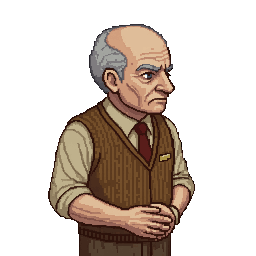

# Earl Whitaker

> Reference portrait uploaded by the project owner (2026-08-13): older man, cardigan vest and name
> tag over hotel-clerk attire — matches the "settled into itself completely" description below.
> Labeled "normal" to distinguish from his post-infection appearance, which is not yet portrayed
> in reference art.

## Role

Ravenwood Hotel night desk clerk. Checks Jim in. Becomes the game's first confirmed infected.

## Background

Worked the Ravenwood Hotel's night desk for **32 years.** No other biographical detail
established.

## Appearance

Pre-infection: an older man, visibly tired but maintaining professionalism. "The kind of face that
has settled into itself completely — not unkind, just finished becoming what it was going to be a
long time ago." Post-infection: blood covering his mouth, chin, and vest front; pale, flat eyes;
jaw hanging at an unnatural angle; stiff, deliberate, animalistic movement.

## Personality

Tired, plainly decent, unremarkable in the best way — a man doing an ordinary job on an
extraordinary night, with **zero foreknowledge** of what's coming and **nothing suspicious about
his behavior.** This is an explicit, locked design choice (see [`CANON.md`](../CANON.md) → "Retcons"): earlier
drafts gave him a knowing hesitation and a line that "landed wrong," implying he suspected
something. That's been deliberately cut. His death is meant to land harder specifically *because*
he was never written as a villain, or even as someone who saw it coming.

## Relationships

Meets [Jim](Jim_Mercer.md) for the first time at check-in. No established relationships with other
hotel guests beyond ordinary desk-clerk familiarity (he clearly recognizes/greets guests routinely,
e.g. brief asides with [Richard Dalton](Richard_Dalton.md)).

## Story Arc

Checks Jim into Room 104 → present during the pre-outbreak "thud" moment (dismisses it genuinely,
not performatively) → becomes the game's first on-screen infected, found by Jim feeding on a guest
in the wrecked lobby → Jim's first combat encounter, fought off with a baseball bat → dies in that
fight → his body yields the Manager's Key, opening the rest of Chapter 1's progression.

## Important Scenes

- Check-in / the "thud" — [`Scripts/Chapter_1_One_Night_Only.md`](../Scripts/Chapter_1_One_Night_Only.md), Scene 6.
- Optional dialogue — Scene 8.
- Lobby reveal (first infected) — Scene 21.
- First combat — Scene 22.
- Search Earl's body (Manager's Key) — Scene 25.

## Dialogue Characteristics

Plain, warm-but-tired, matter-of-fact. Doesn't editorialize. *"Thirty-two years. I know where
everything is."* / *"Old building makes all kinds of noise."* — said the way a man says something
he genuinely believes, not performing calm.

## Established Facts

See [`CANON.md`](../CANON.md). Locked: 32 years at the hotel; first infected encounter; drops the Manager's Key;
no foreknowledge of the outbreak.

## Unresolved Ideas

None currently open.
