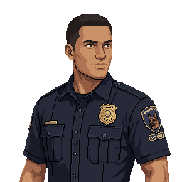

# Corporal Eli Reyes

> Portrait generated 2026-08-13 with PixelLab's Create Image (Pro) tool — the same tool/pipeline
> used for the originally-uploaded Chapter 1 portraits — a design/continuity reference only,
> consistent with the [`Characters/README.md`](README.md) convention that "never seen alive
> on-screen" characters can still get one. No specific appearance was previously established; this
> interprets his role (athletic K-9 handler build, a K-9 Unit shoulder patch) rather than locking
> new canon.

## Role

Ravenwood PD's K-9 unit handler — Diesel and Baxter's partner and, per the Chief's own logbook,
the last person to go check on them before everything went quiet. Never seen alive on-screen; his
body, in the K-9 Unit Room, is both the source of the Armory Key and the direct narrative reason
the district's signature encounter exists where it does.

> Note: added as a new character (2026-08-13) as part of the Police Station's RE-style
> restructure — see [`STORY_NOTES.md`](../STORY_NOTES.md) for the full rationale. Occupies the
> same structural role [Fennimore](Fennimore.md) played for the hotel's courtyard endgame:
> established entirely through what's found after his death.

## Background

K-9 handler, Ravenwood PD. No further biography established beyond what's inferable from the
Chief's logbook and the scene of his death: trusted enough with the department's two service dogs
to be the one who checked on them personally when they started acting up, and — per how he's
found — unwilling to abandon them even once things had clearly gone wrong.

## Appearance

Not directly described while alive beyond the reference portrait above (athletic build, short dark
hair, K-9 Unit patch on his uniform). In death (Police Station, K-9 Unit Room): uniform torn open
across one shoulder, slumped against the kennel wall, a leash still wrapped twice around his fist.

## Personality

Inferred entirely from the circumstances of his death, same as Fennimore before him — a man who
went to go check on two dogs he was responsible for rather than waiting it out, and who was still
holding on to one of their leashes when Jim finds him, having apparently made no attempt to let go
and save himself. Never characterized through dialogue; the player only ever encounters him after
the fact.

## Relationships

- **[Diesel and Baxter](../Creatures/Ashen_Hound.md)** — his K-9 partners. He's the reason they're
  in the story at all rather than being anonymous department dogs; his death is what turns them
  from a stray encounter into a specific tragedy.
- **[Sergeant Ruth Calloway](Ruth_Calloway.md)** — coworker. She's the one who tells Jim where he
  went and gives the Chief's Office key in his place; she and Reyes never interact on-screen, but
  her dialogue makes clear she was hoping he'd come back.
- No established relationship with Jim — they never meet alive.

## Story Arc

Never appears in person. His story is told entirely through environmental discovery, in order:

1. **Calloway's dialogue**
   ([`Scripts/Chapter_2_Police_Station.md`](../Scripts/Chapter_2_Police_Station.md),
   Scene 5) — first mention: he has the armory key, went to check on the K-9 unit around
   midnight, hasn't been heard from since.
2. **The Chief's Office** (Scene 6) — the Chief's own logbook confirms the timeline: Reyes went
   to check on the dogs, didn't come back, and the Chief went after him in turn (the Chief's own
   fate is left unresolved — a deliberate loose thread, not connected to Reyes).
3. **The K-9 Unit Room** (Scene 7) — his body, the Armory Key still on his belt, and the Ashen
   Hound fight that follows immediately after Jim finds him.
4. **Municipal Garage** (Scene 32, optional) — his parked patrol cruiser, door open, radio still
   crackling — a small, non-mandatory detail implying he left the car here and walked the rest of
   the way in on foot.

## Important Scenes

- First mentioned — [`Scripts/Chapter_2_Police_Station.md`](../Scripts/Chapter_2_Police_Station.md),
  Scene 5.
- Chief's logbook entry — Scene 6.
- Body, Armory Key, and the Ashen Hound fight — Scene 7.
- Parked cruiser (optional) — Scene 32.

## Dialogue Characteristics

None spoken on-screen. His only "voice" in the game is secondhand, through Calloway's dialogue and
the Chief's logbook — both plain and procedural rather than dramatic, consistent with how the rest
of the department is written.

## Established Facts

Killed by Diesel and/or Baxter after they turned (implied, not shown); found in the K-9 Unit Room
holding a leash, the Armory Key still on his belt. New (2026-08-13), written as part of the
approved Police Station restructure.

## Unresolved Ideas

- Exact circumstances of his death (whether he was bitten trying to calm them, or caught off guard
  entirely) — deliberately left unstated, consistent with how Fennimore's own death was handled.
- Whether he has any connection to Officer Dale Pruitt or the Chief beyond both being Ravenwood
  PD — not decided, not necessary to decide.
- The Chief's own fate — mentioned in his logbook as having gone to look for Reyes, but never
  found as a body anywhere in this district. Deliberately left open.
