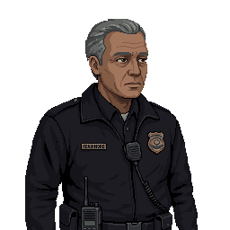

# Fennimore

> Portrait generated 2026-08-13 with PixelLab's Create Image (Pro) tool — the same tool/pipeline
> used for the originally-uploaded Chapter 1 portraits — a design/continuity reference only,
> consistent with the [`Characters/README.md`](README.md) convention that "never seen alive
> on-screen" characters can still get one. No specific appearance was previously established; this
> interprets him as an older, methodical hotel security guard rather than locking new canon.

## Role

Ravenwood Hotel night-shift security guard. Never seen alive on-screen — established only through
his locker (West Wing Staff Room) and his body (Hotel Courtyard) — but his choices during the
outbreak directly shape the chapter's endgame: he's the reason the maintenance shed is chained shut
at all.

> Note: added as a full character file once his death scene, note, and reanimation were approved
> (2026-08-13) — he now has a real, if entirely posthumous, story beat, so he gets a file per the
> "no random background NPCs" rule.

## Background

Hotel night-shift security. No further biography established beyond what's inferable from his
locker and his note: methodical, took his job seriously enough to personally place the gate's
manual release handle in secure storage himself (per his own account), and kept a small personal
stash of a medkit and spare ammunition in his locker that he never got the chance to use.

## Appearance

Not directly described while alive beyond the reference portrait above (older, graying, average
build — a methodical, unremarkable-looking career security guard). In death (Scene 42): security
uniform, badge still pinned, found near the courtyard's north gate. Reanimated (Scene 44): the
same uniform, soaked through, eyes gone the same "wrong pale" as every other infected Jim has
fought.

## Personality

Inferred entirely from his note and his choices — a man who, faced with finding his coworker
mid-transformation, chose containment over confrontation ("made the call to chain the shed shut
instead of going near him. Seemed like the right call at the time") and then tried to do the
practical, procedural thing (get to a working radio) rather than panic. Never characterized through
dialogue; the player only ever encounters him after the fact.

## Relationships

- **[The Caretaker / Roy Bullock](../Creatures/The_Caretaker.md)** — coworker. Fennimore is the one
  who found Roy mid-transformation and chained the maintenance shed shut, which is why the shed is
  sealed (and straining) by the time Jim reaches the courtyard. The two never interact on-screen.
- No established relationship with Jim — they never meet alive.

## Story Arc

Never appears in person. His story is told entirely through environmental discovery, in order:

1. **West Wing Staff Room** (Scene 37) — his locker, tagged with his name, containing a medkit and
   handgun ammunition "he never has to use, until now he isn't around to use them." First hint
   something happened to him.
2. **Hotel Courtyard** (Scene 42) — his body, found near the north gate, with a handwritten note
   and the Housekeeping Closet key. The note reveals he found Roy Bullock transforming, chained the
   shed shut himself, and tried to escape through the gate — only to discover the manual release
   handle was exactly where he'd stored it himself (per hotel security protocol): the East Wing
   Housekeeping Closet, between Rooms 114 and 116.
3. **Return to the Courtyard** (Scene 44) — after Jim retrieves the crank handle and comes back,
   Fennimore's body is gone; he's reanimated, and attacks from behind the fountain. Mechanically an
   ordinary Shambler fight, played completely straight — no unique mechanics, no extended dialogue.

## Important Scenes

- Locker (medkit, ammunition) — [`Scripts/Chapter_1_One_Night_Only.md`](../Scripts/Chapter_1_One_Night_Only.md), Scene 37.
- Body, note, and Housekeeping Closet key — Scene 42.
- Reanimated Shambler fight — Scene 44.

## Dialogue Characteristics

None spoken on-screen. His only "voice" in the game is his note (Scene 42), which is plain,
procedural, and trails off mid-thought rather than ending cleanly — consistent with being written
in a hurry, under pressure, not knowing if he'd survive to need it read.

## Established Facts

Killed by Roy Bullock (implied, not shown) after chaining the maintenance shed shut; reanimates and
is fought by Jim in the courtyard. This is locked (2026-08-13), approved directly by the project
owner.

## Unresolved Ideas

- First name — never established; "R. Fennimore" is the only form confirmed anywhere (locker tag,
  note is unsigned). Not currently needed narratively.
- Exact circumstances of his death (bitten by Roy before the shed was fully secured? caught by
  something else on the way back to the gate?) — deliberately left unstated; see
  [`STORY_NOTES.md`](../STORY_NOTES.md).
