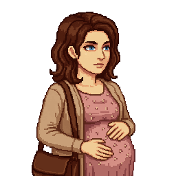
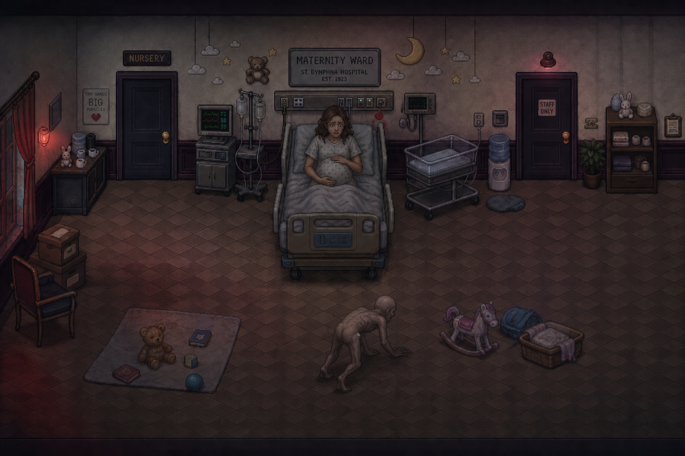

# Maria Dalton

> Reference portrait uploaded by the project owner (2026-08-13) — visibly pregnant, travel bag over
> one shoulder, matching her established Appearance and pregnancy detail below.

> AI-generated scene concept (2026-08-14, regenerated same day to fix a full-isometric perspective
> drift and match the room's own established flat-back-wall camera angle — see
> [`Locations/Hospital.md`](../Locations/Hospital.md) → "Storyline" for the full correction note)
> for her death scene — see "Story Arc," below, and
> [`Scripts/Chapter_2_Hospital.md`](../Scripts/Chapter_2_Hospital.md), Scene 15. The actual
> birth/death moment repeatedly failed image-generation content filters even though the written
> scene is explicit by design (see [`README.md`](../README.md) → "Content Rating & Tone"); this is
> the closest depiction — Maria alive and reacting to the Broodling — that could be generated.

## Role

Hotel guest, Room 118, sharing the room with her husband Richard. Visibly pregnant; her medical
complications are the reason she and Richard leave the hotel before the outbreak begins.

## Background

No biography established beyond her marriage to Richard and her pregnancy (described as roughly
along in the pregnancy — "six months" of hearing "I'll be fine once this night's over," per
Richard's teasing).

## Appearance

Visibly pregnant; seen seated in the east waiting area, hand resting near her stomach, "the
careful stillness of someone who has found the one position that works and is committed to it."

## Personality

Dry humor despite discomfort; stoic. Deflects concern with a joke rather than dwelling on it
(*"If this kid doesn't stop kicking me I'm naming him after the storm."*). Pushes back
good-naturedly when Richard teases her (*"Don't start."*).

## Relationships

- **[Richard Dalton](Richard_Dalton.md)** — husband. Their dynamic is warm, familiar, teasing —
  clearly a couple who have weathered plenty together already.

## Story Arc

Present in the lobby pre-outbreak with abdominal pain that worsens over the course of the evening.
Per the Manager's Office incident report (found by Jim in Chapter 1), she's transported to
**St. Dymphna Hospital** at 11:42 PM, accompanied by Richard, shortly before the outbreak fully
erupts at the hotel — meaning neither of them is present for the chaos that follows.

**Her fate is now resolved (2026-08-13):** admitted to the Maternity Ward, she's exposed to Black
Vein sometime during the outbreak (mechanism not specified — the hospital's own chaos, per
[`Locations/Hospital.md`](../Locations/Hospital.md) → "Outbreak Night," made isolating any single
patient impossible long before anyone understood what they were isolating patients *from*).
Per the hospital's own pathology discovery that traumatic damage provokes rather than suppresses
Ashen mutation, the extreme physical trauma of childbirth triggers a catastrophic, accelerated
mutation in her unborn child rather than in her directly. She does not survive the birth.

**Shown on-screen, not implied (revised 2026-08-14):** Jim doesn't arrive to a finished aftermath —
he hears screaming before he reaches the door, walks in on her still alive and mid-labor, and
watches the birth itself go wrong: visible Black Vein discoloration spreading up her arms, her
abdomen moving on its own, and the Broodling tearing free of her as she dies as a direct result.
Per the project owner's explicit direction ("this is m rated game... actually show it crawling out
and her dying as a result") and [`README.md`](../README.md) → "Content Rating & Tone," this is
staged explicitly rather than kept off-screen. See
[`Scripts/Chapter_2_Hospital.md`](../Scripts/Chapter_2_Hospital.md), Scene 15, for the full scene.
The resulting creature, **[the Broodling](../Creatures/Broodling.md)**, turns hostile immediately
once free of her. See that creature's file for the full mutation explanation.

**Richard's presence at this scene depends on player sequencing** — see
[`Characters/Richard_Dalton.md`](Richard_Dalton.md) and [`CANON.md`](../CANON.md) → "Survivor
System" → "Tier 2b." If Jim met him alive earlier (0–1 emblems on arrival), Richard is already at
her side when Jim reaches the room, gripping her hand, and dies alongside her — reaching for the
Broodling rather than protecting himself. If Richard was already dead at the Ambulance Bay (2+
emblems), Maria dies alone here, with only Jim as a witness. Her death itself is **not** conditional
either way; only whether Richard is there to die with her is.

## Important Scenes

- Lobby introduction / optional dialogue — [`Scripts/Chapter_1_One_Night_Only.md`](../Scripts/Chapter_1_One_Night_Only.md), Scenes 5, 8.
- Her death / the Broodling's birth, shown on-screen — [`Scripts/Chapter_2_Hospital.md`](../Scripts/Chapter_2_Hospital.md), Scene 15.
- (Referenced, not shown) the Manager's Office incident report confirming her transport to the
  hospital — Scene 27.

## Dialogue Characteristics

Warm, dry, unbothered — jokes to keep from making a scene about her own discomfort.

## Established Facts

See [`CANON.md`](../CANON.md)/[`STORY_NOTES.md`](../STORY_NOTES.md). Locked: pregnant; leaves for St. Dymphna Hospital with Richard at
11:42 PM, before the outbreak reaches the lobby. **New (2026-08-13):** dies giving birth to
the Broodling in the Maternity Ward; found by Jim regardless of visit order (this part of her
fate is not conditional — see "Story Arc," above).

## Unresolved Ideas

- The exact mechanism/moment of her own Black Vein exposure inside the hospital — deliberately
  left unspecified; the hospital's own overwhelmed, contradictory triage during the outbreak (see
  [`Locations/Hospital.md`](../Locations/Hospital.md)) makes a single clean answer feel less true
  than leaving it as "somewhere in the chaos."
- Whether Richard, if he survives (see [`Characters/Richard_Dalton.md`](Richard_Dalton.md)), ever
  learns exactly what happened to Maria and the child, or only that both are gone — not yet
  decided; a strong candidate for an emotionally weighty beat if/when this is scripted
  scene-by-scene.
