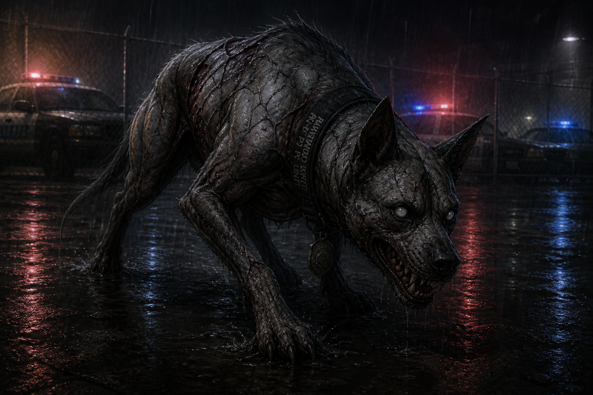

# Ashen Hound

> Proposed (2026-08-13) as the game's second infected-creature classification, introduced in the
> Southwest District's **K-9 Unit Room, inside the main Police Station building itself** (moved
> here from an earlier draft that placed it at the Municipal Garage — see
> [`STORY_NOTES.md`](../STORY_NOTES.md) for why) to answer the "at least one major encounter"
> requirement each district needs per [`AI.json`](../AI.json)'s city-design notes. Treat this as a
> draft pending review, same as any new creature type.

*Concept art (2026-08-13), for visual reference only — not a literal in-game screenshot. Depicts
"Diesel," one of the two Ashen Hounds fought in the Police Station's K-9 Unit Room
([`Scripts/Chapter_2_Police_Station.md`](../Scripts/Chapter_2_Police_Station.md), Scene 7): ash-gray,
cracked hide over visibly wrong musculature, faint dark vein-like discoloration beneath the skin,
pale clouded eyes, low predatory stance, and the tattered RAVENWOOD PD K-9 UNIT collar that
identifies what it used to be.

## Concept

The game's first **fast** infected type — a deliberate contrast to the [Shambler](Shambler.md)'s
slow, deliberate movement. Introduced as a pair (named individuals **Diesel** and **Baxter**,
Ravenwood PD's K-9 unit dogs) rather than a single unique encounter, establishing "Ashen Hound" as
a recurring creature class the other districts can draw on, not a one-off boss.

## Origin

A domestic animal (specifically, in this first appearance, a police service dog) infected with
**Black Vein** (see [`CANON.md`](../CANON.md)). Presented as evidence that Black Vein isn't
exclusively a human-infection agent — it crosses to at least some animals, and does so with a
different mutation profile than it produces in humans: speed and aggression over the Shambler's
slow-and-relentless presentation. Diesel and Baxter were Ravenwood PD's own K-9 unit, partnered
with handler **[Corporal Eli Reyes](../Characters/Eli_Reyes.md)**, kenneled at the station itself —
they turned in their own kennel room rather than out in the field.

## Appearance

Larger than the source animal, musculature visibly wrong beneath a hide gone patchy and
ash-gray — the same "wrong" quality as human infected, expressed differently. Faint dark
vein-like discoloration branches visibly beneath the cracked skin — a literal, visual nod to
**Black Vein** itself, not yet described this explicitly for any other infected creature but worth
considering as a consistent visual motif going forward (see concept art, below). Eyes carry the
same pale, clouded look established across every other infected creature. Moves low to the ground,
head level with its shoulders rather than raised. A tattered **RAVENWOOD PD K-9 UNIT** collar is
the only remaining trace of what it used to be.

## Behavior

Fast, low, and — critically — **pack-hunting**: Diesel and Baxter circle rather than approach in a
straight line, splitting up to flank instead of both closing from the same direction. This is a
deliberate design contrast with every enemy encountered so far (Shamblers, the Caretaker, The
Maw), none of which hunt cooperatively. Vocalizes with a low, wet growl before committing to a
charge, giving the player an audio tell distinct from a Shambler's silence-until-it's-close
approach.

## Gameplay Role

The Southwest District's signature encounter (per [`AI.json`](../AI.json)'s "at least one major
encounter or boss" rule for each district) — deliberately placed **inside the main station
building** rather than a secondary location, so the district's densest content also carries its
hardest fight. It happens immediately after finding Corporal Reyes' body and *before* the shotgun
(see [`Scripts/Chapter_2_Police_Station.md`](../Scripts/Chapter_2_Police_Station.md), Scenes 7–8) — Jim has
to survive it with whatever he's already carrying, and the shotgun that follows reads as a reward
for getting through it rather than a tool handed out in advance. Not framed as a full boss fight on
the Caretaker's scale — no phases, no unique arena mechanic — just a hard, fast, two-on-one fight in
a tight concrete kennel room that gives the player nowhere to retreat to.

## Encounter Progression

- First (and so far only) appearance: the Police Station's K-9 Unit Room, Southwest District
  ([`Scripts/Chapter_2_Police_Station.md`](../Scripts/Chapter_2_Police_Station.md), Scene 7) — encountered
  immediately after finding Corporal Reyes' body, one kennel gate already bent open and the second
  straining as Jim investigates.
- Expected to recur as a creature class in later districts (not yet decided which ones); this file
  establishes the baseline for any future Ashen Hound encounters so they don't need to be
  redesigned from scratch.

## Major Appearances

- [`Scripts/Chapter_2_Police_Station.md`](../Scripts/Chapter_2_Police_Station.md), Scene 7 (Diesel
  and Baxter, K-9 Unit Room).

## Story Significance

Minor but deliberate: confirms Black Vein affects animals as well as humans, without turning that
into a larger plot point yet. Diesel's collar tag gives the encounter a small, specific moment of
sadness (Jim reads it; doesn't check the second dog's) consistent with the game's general approach
to infected who were people — or, here, someone's working animal — before the outbreak. Finding
them right after Corporal Reyes' body, still holding his leash, sharpens that into something more
specific: he didn't abandon them, and it cost him.

## Open Design Gap

No formal combat spec (health, attack patterns, exact speed/range values) has been written yet —
same gap flagged for the Shambler in its own file. This entry establishes concept/lore/behavior
only.
