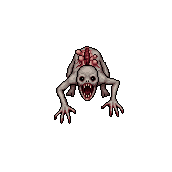
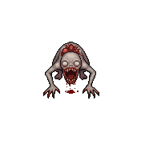
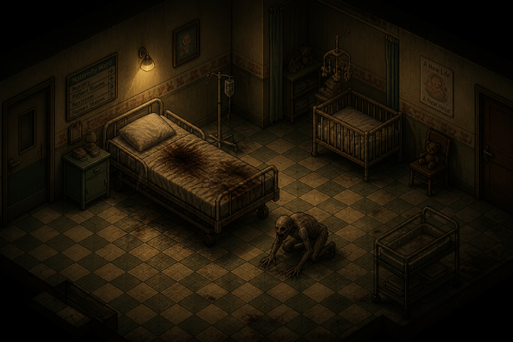

# The Broodling

> **New creature, proposed 2026-08-13, pending review — not locked canon.** The project owner
> described this creature's origin directly as part of
> [Maria Dalton's](../Characters/Maria_Dalton.md) fate at
> [St. Dymphna Hospital](../Locations/Hospital.md), then uploaded the real in-game sprite directly
> to the repo (see "Reference Material," below) — superseding this file's first-draft, text-only
> Appearance guess, which read closer to a wrongly-shaped infant than the actual sprite's small
> hunched parasite design. See "Open Design Gaps," below, for a still-flagged ambiguity: the
> project owner originally asked for **two** new creature-folder files alongside this reveal, but
> only one creature (this one) has been described/uploaded so far.

**Classification:** proposed Ashen Mutant, non-human origin (tentative — see "Concept," below, for
why this doesn't cleanly fit the existing classification split between "Ashen Mutant" and "Ashen
Hound")
**Encounter Type:** Signature/unique encounter (one-off, tied to a specific story beat — same
structural role as the Police Station's Ashen Hound pair, not a repeating enemy type)
**Known Population:** one confirmed specimen

## Reference Material

Real in-game sprite, uploaded directly by the project owner (2026-08-13): 8-directional rotation
sheets of a small, emaciated humanoid parasite creature.

> Two sprite files were uploaded together — `spr_broodling.gif` (warmer/pinker tone) and
> `spr_broodling_alt.gif` (cooler/grayer tone). Both show the same 8-direction rotation set for the
> same creature; which one is the "real" in-game asset versus a palette-variant draft isn't stated,
> so both are kept here rather than guessing which to discard. This **supersedes** the file's
> original AI-generated concept-art placeholder (a realistic, sleeping-infant-shaped render),
> which is now known to be a significantly incorrect guess — deleted rather than kept as
> misleading reference.

> AI-generated scene concept (2026-08-14) showing the Broodling on the floor beside the
> blood-marked bed, immediately after emerging — see
> [`Scripts/Chapter_2_Hospital.md`](../Scripts/Chapter_2_Hospital.md), Scene 15. Generated without a
> human figure present; attempts to include Maria (or Maria and blood/injury together) repeatedly
> failed the image generation tool's own content filters, even though the written scene itself is
> explicit by design — see [`README.md`](../README.md) → "Content Rating & Tone" and
> [`Characters/Maria_Dalton.md`](../Characters/Maria_Dalton.md) for the companion image that does
> include her, generated separately without the injury detail.

## Concept

Deadlock Protocol's most extreme body-horror beat so far, and a deliberate escalation from
"infected adult" to something the game hasn't shown before: a full live birth, corrupted by Black
Vein into something that isn't a human infant at all. **Shown on-screen, not implied (revised
2026-08-14):** an earlier version of this scene deliberately kept the birth itself off-screen —
Jim arriving only after it was already over, finding Maria's body and fighting the Broodling as a
pure aftermath beat. The project owner explicitly reversed that: *"this is m rated game blood guts
for nudity cursing is all on the table... you walk in to find her screaming... something is
crawling or crying its way out of her, baby has mutated into the broodling... actually show it
crawling out and her dying as a result."* Per [`README.md`](../README.md) → "Content Rating &
Tone," Deadlock Protocol is explicitly M-rated and shouldn't self-censor scenes that call for
intensity — this scene calls for it. See
[`Locations/Hospital.md`](../Locations/Hospital.md) → "Maternity Ward" and
[`Scripts/Chapter_2_Hospital.md`](../Scripts/Chapter_2_Hospital.md), Scene 15, for the scripted
beat this creature is attached to.

## Origin

[Maria Dalton](../Characters/Maria_Dalton.md) — six months pregnant, transported from the
Ravenwood Hotel to St. Dymphna Hospital the night of the outbreak for a worsening medical
complication (see her character file) — is exposed to Black Vein while a patient at the hospital.
Per [`Locations/Hospital.md`](../Locations/Hospital.md) → "Outbreak Night," the hospital's own
pathology discovers that Ashen mutation isn't disease but corrupted regeneration, and that trauma
seems to *provoke* it rather than suppress it — childbirth itself, the most extreme physical trauma
the body undergoes, appears to have triggered a catastrophic, accelerated version of that process
in her unborn child. The result isn't a child affected by Black Vein; it's a new organism Black
Vein built out of one, using a human pregnancy as its growth medium. Maria does not survive.

## Appearance

Per the real sprite: small and noticeably emaciated rather than infant-proportioned — a hunched
humanoid built low to the ground, weight forward on long, clawed hands as much as its legs, closer
to a quadrupedal stance than an upright one. Bald, pale gray-pink skin; a disproportionately wide,
gaping mouth lined with visible teeth, framed by raw, reddened, blood-marked skin around the head
and jaw — plausibly birth trauma made permanent rather than an intentional "wound" design. No
visible standout eyes in the sprite — the head reads as a smooth, wrong shape rather than having a
legible human-infant face. This is a meaningfully different read than this file's original
text-only guess (translucent skin, distended abdomen, recognizably infantile face) — that draft is
superseded, not layered on top of the sprite.

## Behavior

Aggressive immediately, with no passive/unaware phase (unlike Della Marsh) — it has no memory of
being anything else to hesitate over. The hunched, forward-weighted, clawed-hand stance in the
sprite supports a fast, low, scrabbling movement pattern rather than an upright gait — closer to
something that scuttles/crawls at speed than something that walks. Small profile makes it hard to
hit reliably; proposed (not yet designed in detail) as a fast, low-health, high-annoyance
encounter rather than a damage check, rewarding precision over brute force.

**Kills whoever is closest, not just Jim (revised 2026-08-14).** If Richard Dalton is present (see
[`Locations/Hospital.md`](../Locations/Hospital.md) and
[`Characters/Richard_Dalton.md`](../Characters/Richard_Dalton.md)), he's the one holding Maria's
hand when it happens and reaches for the creature rather than pulling back — it kills him before
Jim can reach either of them. This was a deliberate fix: an "aggressive immediately, no passive
phase" creature sparing a second person standing right next to Maria never held together on its own
terms, so the design no longer asks it to.

## Gameplay Role / Combat Role

The Maternity Ward's signature encounter — the emotional and mechanical low point of that wing.
The player watches Maria (and, in one branch, Richard too) die in real time rather than arriving
after the fact, then fights it the instant it's free of her. Not a recurring enemy type; a single,
unique specimen tied to this one scene, per its "Known Population: one confirmed specimen"
classification above.

## Encounter Progression

Single, one-off encounter in the Maternity Ward — see
[`Locations/Hospital.md`](../Locations/Hospital.md) for the scripted beat. Full combat kit
(specific attacks, health, weaknesses) not yet designed.

## Major Appearances

See [`Scripts/Chapter_2_Hospital.md`](../Scripts/Chapter_2_Hospital.md), Scene 15 — the Maternity
Ward birth and fight, staged on-screen and explicitly, per this file's "Concept" section above.

## Story Significance

The hospital's clearest, most personal illustration of the district's thematic core (per the
project owner: *"We tried to save everyone until we realized Vanguard never wanted everyone
saved"*) — Maria and Richard Dalton are civilians with no connection to Vanguard, the police, or
any prior thread in the story; their fate exists purely to show what Black Vein does to an
ordinary family caught in it, at its most extreme. **Neither of them survives, in either branch**
(see [`Characters/Richard_Dalton.md`](../Characters/Richard_Dalton.md)) — the family is destroyed
completely, not partially, which is the more honest version of "at its most extreme" than leaving
one Dalton alive to grieve. Also the game's first on-screen confirmation that Ashen mutation can
act on a fetus, not just an already-born person — a detail with obvious, disturbing implications
for the "town as a field study" material already established for the Police Station's Vanguard
sub-plot, not yet explored further.

## Open Design Gaps

- ~~No real reference art yet.~~ **Resolved (2026-08-13):** the real sprite was uploaded directly;
  see "Reference Material," above. The Appearance/Behavior sections above now describe the actual
  sprite rather than a text-only guess.
- Which of the two uploaded sprite files (`spr_broodling.gif` vs. `spr_broodling_alt.gif`) is the
  canonical in-game asset, if only one is meant to be kept — not stated; both are documented here.
- **"Two new files" ambiguity.** The project owner asked for two new files in the creatures folder
  alongside this reveal, but described only one creature. Per the established rule (see
  [`Creatures/README.md`](README.md) and the Della Marsh / Earl Whitaker / Officer Pruitt
  precedent: a named character who was alive on-screen before turning/dying stays documented in
  their own `Characters/` file, not a separate `Creatures/` entry), Maria's own death/birth scene
  is documented in [`Characters/Maria_Dalton.md`](../Characters/Maria_Dalton.md) rather than as a
  second creature file here. This file (the Broodling) is the only new creature actually described
  in the text. **Flagging rather than inventing a second creature** — possibilities considered but
  not written: a later-stage "grown" version of the same creature (would tie into the still-open
  "Origin: not yet decided" question on
  [`Creatures/Unnamed_Hospital_Boss.md`](Unnamed_Hospital_Boss.md), but nothing in the text
  supports it and it isn't written here), or a duplicate/second specimen elsewhere in the hospital.
  Needs the project owner's clarification once the concept art itself is actually uploaded.
- Full combat kit, specific attacks, and exact health/damage numbers — not yet designed.
- Whether "Ashen Mutant" (currently defined as specifically the human-mutation-stage
  classification) needs a broader definition to cleanly cover a creature that was never a born
  human in the first place — flagged alongside the same open classification question in
  [`The_Maw.md`](The_Maw.md) and [`Unnamed_Hospital_Boss.md`](Unnamed_Hospital_Boss.md).
