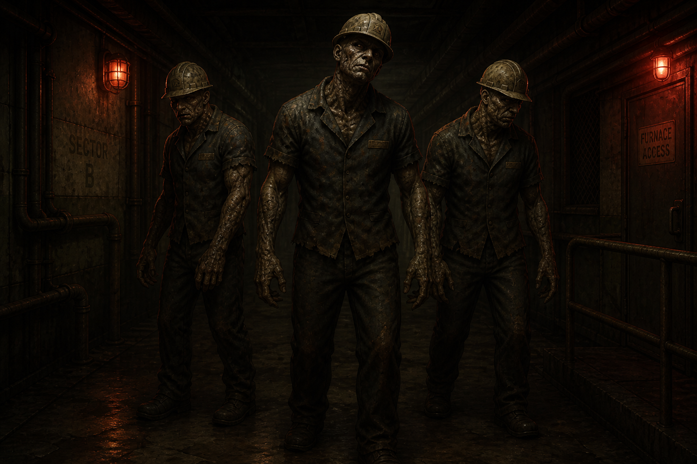

# The Exposure Cohort

> **New creature type, proposed 2026-08-13, pending review — not locked canon.** Written to fill
> the same structural role the Ashen Hound pair fills at the Police Station and "The Surgeon"
> fills at the Hospital: [Steelgate Refinery's](../Locations/Foundry_Refinery.md) own
> signature/major encounter type, distinct from a standard Shambler. Proposed directly from
> [`Locations/Foundry_Refinery.md`](../Locations/Foundry_Refinery.md) → "Outbreak Night" material
> (Vanguard's decades-long "EXPOSURE COHORTS" occupational-monitoring program) — not from any
> uploaded reference art. Concept art below is a first-pass AI generation pending the project
> owner's review, same status the Hospital Boss's text-only draft had before real reference art
> replaced it.

**Classification:** proposed Ashen Mutant, chronic/long-term exposure variant (distinct from the
standard Shambler's acute, single-night mutation — see "Concept," below)
**Encounter Type:** Pack/signature encounter (multiple individuals fought together, same
structural role as the Ashen Hound pair)
**Known Population:** several confirmed individuals (Foundry employees who were part of Vanguard's
"exposure cohort" monitoring program), not a single unique specimen

*Concept art (2026-08-13), generated as a fresh in-house-style piece — not based on any uploaded
reference (none provided for this creature). Depicts the "advanced/adapted" mutation read described
below in a Foundry security-checkpoint setting.*

## Concept

Every other infected creature so far mutates over the course of **one night** — Black Vein acting
fast, visibly, on a single acute exposure. The Exposure Cohort inverts that: these are Foundry
employees Vanguard has been monitoring and chronically, low-level exposing for **years** (see
"Origin," below), whose mutation was already underway, slowly, long before Outbreak Night. The
result should read as more *advanced* and *adapted* than a standard Shambler — less like someone
who just turned, more like something that's had time to settle into what it's becoming. Where a
Shambler is chaotic, freshly wrong, and shambling, the Exposure Cohort should read as unsettlingly
more capable: steadier on its feet, stronger, with visible old-scar-tissue-like mutation rather
than fresh wounds — the physical evidence of a years-long process, not a one-night transformation.

## Origin

Per [`Locations/Foundry_Refinery.md`](../Locations/Foundry_Refinery.md) → "Outbreak Night," every
Steelgate Refinery employee underwent mandatory "occupational health examinations" that were
actually Vanguard tracking chronic, low-level Black Vein exposure from working near its
underground access point — sorted internally into **EXPOSURE COHORTS** by exposure duration and
severity, with Vanguard privately aware of "which ones were beginning to change" long before the
outbreak. On Outbreak Night, several members of the most heavily-exposed cohorts finish
transforming at once, converging at the Refinery's restricted underground levels — encountered as
a group at the **Security Checkpoint** (see that location's Storyline entry) rather than as
isolated individuals.

## Appearance

Not yet illustrated from real reference — proposed baseline: former Refinery workers, still in
recognizable work coveralls/coveralls fused with mutated tissue rather than torn away, with
visible old, healed-over mutation (thickened, discolored patches of skin/bone rather than open
wounds) reflecting years of slow change rather than one night's damage. Kept visually distinct from
standard Shamblers specifically through this "settled/adapted" quality rather than a wholly
different silhouette, so the contrast reads clearly on sight.

## Behavior

Proposed (not yet mechanically detailed): more coordinated and dangerous in a group than an
equivalent number of Shamblers — less erratic movement, closer to deliberate stalking/positioning,
reflecting the "years to adapt" concept. Encountered exclusively as a pack (per "Known Population,"
above), never as a single isolated individual, distinguishing the encounter structurally from a
standard Shambler fight.

## Gameplay Role / Combat Role

Proposed as the Foundry district's signature multi-enemy encounter, guarding the passage toward
the Founder's Boardroom and the Black Vein Cavern beyond it — see
[`Locations/Foundry_Refinery.md`](../Locations/Foundry_Refinery.md) → "Storyline" → "The Security
Checkpoint." Full combat kit (health, damage, specific attacks) not yet designed.

## Encounter Progression

Single, one-off pack encounter — not proposed as a recurring enemy type found throughout the rest
of the game, consistent with how the Ashen Hound pair and "The Surgeon" are each scoped to their
own district only.

## Major Appearances

Not yet scripted scene-by-scene — see
[`Locations/Foundry_Refinery.md`](../Locations/Foundry_Refinery.md) → "The Security Checkpoint."

## Story Significance

The clearest embodiment of the Foundry's specific thematic angle on Vanguard (per the project
owner: *"Vanguard turned Ravenwood's workers into long-term exposure subjects"*) — where the
Police Station shows institutional betrayal and the Hospital shows medical betrayal, the Exposure
Cohort shows Vanguard quietly, deliberately harvesting data from people for years while never once
warning them, with this creature type as the literal, physical end point of that neglect made
visible all at once.

## Open Design Gaps

- No real reference art — this is a first-pass, unreviewed proposal, more speculative than the
  Broodling or Hospital Boss (which were both eventually corrected against real uploaded
  material). Expect this file to change if/when the project owner weighs in.
- Full combat kit, exact pack size, and specific attacks — not yet designed.
- Whether "Ashen Mutant" needs a formal sub-classification for "chronic/adapted" versus "acute"
  presentations, or whether this stays an informal distinction — same open classification question
  flagged in [`The_Maw.md`](The_Maw.md), [`Unnamed_Hospital_Boss.md`](Unnamed_Hospital_Boss.md),
  and [`Broodling.md`](Broodling.md).
- Whether any specific named Exposure Cohort individual should get a Characters/Creatures
  crossover treatment (matching how Della Marsh or the Hospital Boss are one named/one nicknamed) —
  not proposed here; kept as an anonymous group per the source material's own framing (a list of
  names and case files, not individual character arcs).
