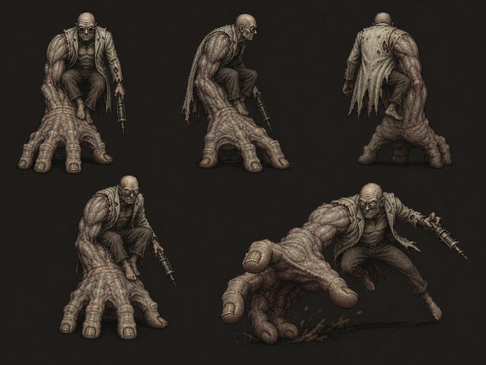

# Hospital Boss ("The Surgeon")

> St. Dymphna Hospital's (Northeast/Medical district) boss, fought in the Surgical Wing's deepest
> operating room at the end of the Quarantine Puzzle — see
> [`Locations/Hospital.md`](../Locations/Hospital.md) and
> [`Scripts/Chapter_2_Hospital.md`](../Scripts/Chapter_2_Hospital.md), Scene 10. Built from real
> reference art uploaded by the project owner; "The Surgeon" is hospital staff's own working
> nickname, not a confirmed real name/identity — see "Origin," below.

**Classification:** proposed Ashen Mutant (tentative — see [`The_Maw.md`](The_Maw.md)'s Open Design
Gaps for the open question of whether "Ashen Mutant" is a formal shared tier)
**Encounter Type:** Boss (major encounter)
**Known Population:** unconfirmed; assumed a single unique specimen, consistent with every other
named boss so far (the Caretaker, and — in a different, unkillable register — the Zombie
Conglomerate)

*Real reference art, uploaded directly by the project owner (2026-08-13) — supersedes this file's
earlier AI-generated reconstruction (`Assets/Reference/hospital_unnamed_boss_concept.png`, now
deleted; see [`Assets/README.md`](../Assets/README.md) for the note on why), which was written
from a text description of this same sheet before the actual file reached the repo.*

## Reference Material

Real five-pose concept-art sheet (see image above), uploaded directly to this repo (2026-08-13):
a hulking, heavily muscled humanoid with a bald, deeply wrinkled, aged human face, glasses, and a
torn, dirty coat/shirt hanging off broken shoulders. One arm is entirely replaced by an enormous,
clawed, root-like hand structure large enough for the creature to sit on, crouch on, and drag
itself with — **its primary means of locomotion**, per the project owner's explicit clarification
(2026-08-13): *it rides the giant hand and the hand does the walking for it*, rather than the hand
being a passive perch. The giant hand also doubles as an attack (see mid-lunge pose, driving it
into the ground). The other, ordinary human-proportioned arm carries a metallic injector device —
described by the project owner as **"a medical sort of tranquilizer gun"** rather than a simple
handheld syringe; the reference art shows a compact cylindrical device with a visible plunger/dart
mechanism, closer to a dart-gun than something merely held and stabbed with. Poses on the sheet
show it seated/perched on the giant hand from the front, from behind (a torn, mostly bare back
under the tattered coat), seated at a slight angle, and mid-lunge/leap, driving the giant hand down
into the ground to propel itself forward.

A second reference — a photo of a physical 3D-printed sculpture ("Biocreator," credited to
sculptor Bogdan Stepanenko, sourced from a modeling/sculpting social post, not project-owner
original art) — was described earlier in the same session but not itself uploaded to the repo;
it showed the same basic silhouette in miniature-figure form and was shared as third-party
inspiration/silhouette reference only, not this creature's actual in-game model.

## Concept

A hospital-appropriate boss built around a single, legible mutation: one arm has overgrown into an
enormous clawed hand-limb that **is the creature's actual mode of locomotion** — it rides on/is
carried by the hand rather than walking on its own legs, which per the reference art hang loose
and mostly unused — and doubles as its primary weapon (a ground-slam/lunge attack), while its
other, still-recognizably-human hand carries a compact medical tranquilizer-gun-style injector, a
visual echo of the hospital setting and, thematically, of the same kind of injection/dosing imagery
already established for Project Ashen's mutagen delivery. Where the Caretaker reads as raw physical
size and Della Marsh as a quiet, unsettling reveal, this creature is proposed to read as **clinical
corruption** — something that was being treated, or was doing the treating, when it turned, now
grotesquely embodying the process instead of surviving it.

## Origin

Per [`Locations/Hospital.md`](../Locations/Hospital.md) → "Outbreak Night," this creature's origin
is the abdominal-trauma surgical patient described there: brought in for emergency surgery, his
organs began regenerating — malformed — faster than the surgical team could work, forcing them to
stop the procedure entirely (*"We stopped the procedure because every incision produced additional
growth"*). He didn't die on the table. He got up. This explains both the "aged, deeply wrinkled"
face (a patient, not a new character) and why the fight is placed in the Surgical Wing. The
oversized syringe is OR equipment — possibly medical staff's own failed attempt to sedate or
euthanize what the patient was becoming — repurposed as a weapon once it turned fully hostile, not
a tool from a former profession. Hospital staff who encountered it before losing the wing
nicknamed it **"The Surgeon"** — a dark, ironic staff nickname for what took over their operating
room, not a claim about the creature's actual pre-mutation job. His real name/identity remains
deliberately unconfirmed, same convention as Roy Bullock being the only named exception among
Chapter 1's creatures.

## Appearance

A hulking, heavily muscled humanoid with a bald, deeply wrinkled, aged human face and glasses —
age and human detail kept legible in the face specifically, contrasting with the inhuman scale of
the mutated arm, the same "person versus mutation" contrast rule established for
[The Maw](The_Maw.md). Wears the tattered remains of a coat or shirt, torn away across much of the
back and one shoulder. One arm has overgrown into an enormous, clawed, gnarled hand-like structure
large enough for the creature to sit on entirely — **its legs hang loose/mostly unused in the
reference art, confirming the hand is its actual means of getting around, not a perch it
occasionally leans on.** The other arm remains ordinary human proportions and carries a compact
metallic injector — a tranquilizer-gun-style device, not a plain oversized syringe.

## Behavior

The creature moves by riding/being propelled by its own giant hand rather than walking upright, and
that same hand is used offensively (the reference art's mid-lunge pose — driving the hand into the
ground to launch itself forward) in the same design family as the Caretaker's overhead slam, rather
than a fast/agile boss type. The tranquilizer-gun arm is a second, distinct weapon — a ranged/
utility attack (e.g. a dart that slows or disorients Jim) that complements the giant hand's
close-range slam, giving the fight a genuine two-weapon rhythm rather than one attack repeated.
Exact numbers/timing not yet designed — see "Open Design Gaps," below.

## Encounter Progression

Placed in the Surgical Wing's deepest operating room, reached once the pressure-gradient sequence
(the isolation manual page plus the backup damper control, per the Quarantine Puzzle) opens the
wing itself — see [`Locations/Hospital.md`](../Locations/Hospital.md) → "The Quarantine System" and
"Storyline." This creature is the Hospital district's boss-tier encounter, filling the same
structural role the Caretaker fills for the Hotel and the Ashen Hound pair fills for the Police
Station.

## Major Appearances

See [`Scripts/Chapter_2_Hospital.md`](../Scripts/Chapter_2_Hospital.md), Scene 10 — the boss
encounter in OR 3, deepest room of the Surgical Wing. Narrated at the level of move-set/behavior
(the giant hand's lunge/slam, the tranquilizer-gun's ranged threat) rather than exact numbers,
consistent with "Open Design Gaps," below.

## Story Significance

Per [`Locations/Hospital.md`](../Locations/Hospital.md) → "Outbreak Night," the Surgical Wing is
where the hospital's central horror becomes physically undeniable: every normal medical
response — surgery specifically — actively makes Ashen mutation worse, because trauma provokes
regeneration rather than suppressing it. This creature is the literal end state of that discovery,
fought in the same room where the surgical team gave up trying to explain what they were seeing.
[Maria and Richard Dalton's](../Characters/Maria_Dalton.md) fate elsewhere in the same building
(see [`Creatures/Broodling.md`](Broodling.md)) makes the same point from a different angle — this
creature makes it from the perspective of the people who were trying, and failing, to save lives
using rules that no longer applied.

## Open Design Gaps

- Whether "The Surgeon" (hospital staff's working nickname) should become his permanent title, or
  whether he should stay formally unnamed like Roy Bullock's "the Caretaker" naming convention.
- Whether this creature is the Hospital district's sole boss/major encounter, or one of several.
- Full combat kit (exact attacks/timing, phases, weaknesses, arena hazards) — not yet designed in
  mechanical detail, beyond the two-weapon (hand-slam / tranquilizer-dart) shape described above.
- Whether "Ashen Mutant" applies here as a formal classification, or is specific to The Maw (shared
  open question, see [`The_Maw.md`](The_Maw.md)).
