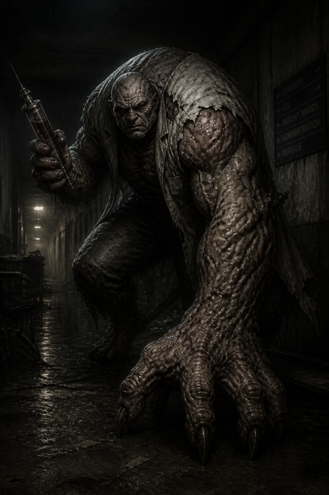

# Hospital Boss (Unnamed)

> **New creature, proposed 2026-08-13, pending review — not locked canon.** The project owner
> uploaded reference art for a new boss creature intended for [`Locations/Hospital.md`](../Locations/Hospital.md)
> (St. Dymphna Hospital, the Northeast/Medical district — not yet scripted), explicitly noting it's
> "unnamed right now." Everything below is a proposal reconciling that reference art with the game's
> existing rules, the same treatment given to every other new creature (see
> [`Zombie_Conglomerate.md`](Zombie_Conglomerate.md) for the precedent) — treat all of it as a draft,
> not locked, until named and formally approved.

**Classification:** proposed Ashen Mutant (tentative — see [`The_Maw.md`](The_Maw.md)'s Open Design
Gaps for the open question of whether "Ashen Mutant" is a formal shared tier)
**Encounter Type:** Boss (major encounter)
**Known Population:** unconfirmed; assumed a single unique specimen, consistent with every other
named boss so far (the Caretaker, and — in a different, unkillable register — the Zombie
Conglomerate)

*Concept art (2026-08-13), generated as a fresh in-house-style piece reconstructing the project
owner's uploaded reference material (see "Reference Material," below) — not a direct copy of it, and
not a literal in-game screenshot. Depicts the defining silhouette from the reference: a hunched,
muscular humanoid perched atop one arm mutated into an enormous clawed hand, gripping an oversized
hypodermic syringe in its other hand, in a dark hospital corridor.*

## Reference Material

The project owner uploaded two images directly in chat (not pushed as real files — per the
file-access limitation noted in [`STORY_NOTES.md`](../STORY_NOTES.md), these can't be saved into this
repo directly, so they're described here instead):

1. **A five-pose concept-art sheet** of a hulking, heavily muscled humanoid: a bald, deeply wrinkled,
   aged human face; a torn, dirty coat or shirt hanging off broken shoulders; one arm entirely
   replaced/overgrown by an enormous, clawed, root-like hand structure large enough for the creature
   to perch, crouch, or lean on as a fifth limb; the other arm is a normal-proportioned human arm,
   holding a large hypodermic syringe with visible plunger and a green/dark fluid inside. Poses show
   it seated/perched on the giant hand, viewed from the front, from behind (showing a torn, mostly
   bare back under the tattered coat), and mid-lunge, driving the giant hand down into the ground as
   a leaping attack.
2. **A photo of a physical 3D-printed sculpture** ("Biocreator," credited to sculptor Bogdan
   Stepanenko, sourced from a modeling/sculpting social post, not project-owner original art) showing
   the same basic design in miniature-figure form — the hunched aged humanoid perched on the giant
   clawed hand. This is third-party sculptor reference/inspiration material the project owner shared
   for the silhouette and pose, not an asset created for this project, and shouldn't be treated as
   this creature's actual in-game model — the concept-art render above is the project's own
   reconstruction of the design for documentation purposes.

## Concept

A hospital-appropriate boss built around a single, legible mutation: one arm has overgrown into an
enormous clawed hand-limb the creature uses as both a mobility aid (perching, lunging, dragging
itself) and a weapon, while its other, still-recognizably-human hand carries an oversized syringe —
a visual echo of the hospital setting and, thematically, of the same kind of injection/dosing
imagery already established for Project Ashen's mutagen delivery. Where the Caretaker reads as raw
physical size and Della Marsh as a quiet, unsettling reveal, this creature is proposed to read as
**clinical corruption** — something that was being treated, or was doing the treating, when it
turned, now grotesquely embodying the process instead of surviving it.

## Origin

Not yet decided. Given the hospital setting, a plausible (not yet approved) origin is a patient
undergoing treatment or a staff member (doctor, orderly, or similar) exposed to a concentrated dose
of the mutagen on-site — either scenario would explain the syringe as either the tool of the
character's former profession or the literal cause of the mutation, and either would need to be
decided alongside the rest of the Hospital chapter's writing (currently a `_TBD_` placeholder — see
[`Locations/Hospital.md`](../Locations/Hospital.md)).

## Appearance

A hulking, heavily muscled humanoid with a bald, deeply wrinkled, aged human face — age and human
detail kept legible in the face specifically, contrasting with the inhuman scale of the mutated arm,
the same "person versus mutation" contrast rule established for [The Maw](The_Maw.md). Wears the
tattered remains of a coat or shirt, torn away across much of the back and one shoulder. One arm has
overgrown into an enormous, clawed, gnarled hand-like structure large enough for the creature to
perch or lean its full weight on — functioning as a fifth limb rather than a conventional arm. The
other arm remains ordinary human proportions and carries a large hypodermic syringe.

## Behavior

Not yet written — pending the Hospital chapter being scripted. The reference art's mid-lunge pose
(driving the giant hand into the ground to propel itself) suggests a heavy, ground-slam-style attack
in the same design family as the Caretaker's overhead slam, rather than a fast/agile boss type.

## Gameplay Role / Combat Role

Not yet designed. Flagged as an open item below rather than invented here.

## Encounter Progression

Not yet scripted — [`Locations/Hospital.md`](../Locations/Hospital.md) is entirely `_TBD_`. This
creature is the Hospital district's first proposed boss-tier encounter, filling the same structural
role the Caretaker fills for the Hotel and the Ashen Hound pair fills for the Police Station, per the
per-district "major encounter" design rule established in [`AI.json`](../AI.json).

## Major Appearances

None scripted yet.

## Story Significance

Not yet decided beyond the general thematic fit noted above (Concept, Origin) — should be developed
alongside the rest of the Hospital chapter's story content (Maria & Richard Dalton's still-open fate
is also tied to this location — see [`STORY_NOTES.md`](../STORY_NOTES.md) → "Still-Open Questions").

## Open Design Gaps

- **No name yet** — the project owner explicitly flagged this as "unnamed right now." This file uses
  a placeholder title; rename the file and update all references once one is chosen.
- Whether this creature is the Hospital district's sole boss/major encounter, or one of several.
- Full combat kit (attacks beyond the implied ground-slam lunge, phases, weaknesses, arena hazards) —
  not yet designed.
- Origin story (patient vs. staff vs. something else) — not yet decided.
- Whether "Ashen Mutant" applies here as a formal classification, or is specific to The Maw (shared
  open question, see [`The_Maw.md`](The_Maw.md)).
- Not yet integrated into any script — [`Locations/Hospital.md`](../Locations/Hospital.md) and
  [`Scripts/`](../Scripts/) have no Hospital chapter content written yet.
