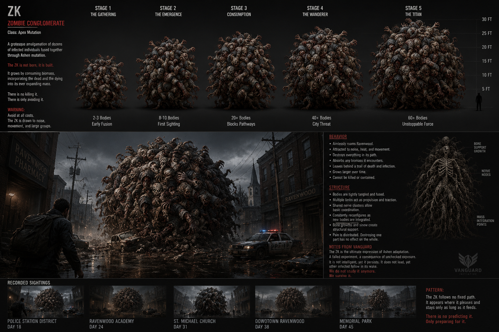
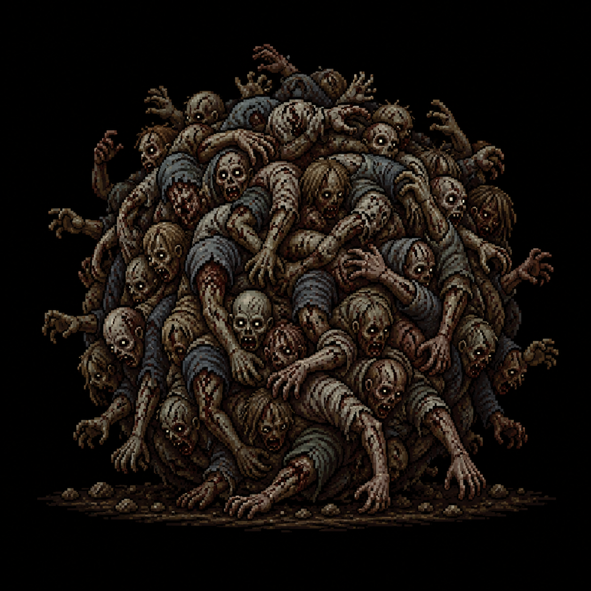

# The Zombie Conglomerate ("The Zombie King")

*Concept art and a rough rolling-motion animation test uploaded by the project owner (2026-08-13)
— see also `Assets/Reference/zombie_conglomerate_roll_animation.gif`. The dossier image is treated
as the primary design reference for this creature; its content is summarized and reconciled with
existing canon below. **One part of the dossier directly conflicts with locked canon (the "Day
18–45" sighting timeline) — see "Canon Conflict," below. Do not treat that timeline as locked.***

> New creature (2026-08-13), proposed by the project owner: *"Think of it as a rat king... this is
> a zombie king and it rolls around the town randomly, first displays after you collect your first
> emblem."* Everything below beyond that one-sentence brief is either drawn from the uploaded
> concept dossier or proposed by this write-up to reconcile it with the game's existing rules —
> treat all of it as a draft pending review, same as any new creature.

## Concept

A "rat king"-style mass of infected bodies, fused together by advanced Ashen mutation into a single
rolling, grasping conglomerate — dozens (eventually dozens more) of individual infected tangled
into one entity. Classified in the concept dossier as **"ZK" — Zombie Conglomerate, Class: Apex
Mutation**. In-world, per the dossier's own tone, this is also colloquially called **"the Zombie
King"** by anyone unlucky enough to survive seeing it and talk about it afterward — the same
initials as its technical designation, which is treated here as a deliberate, in-world coincidence
worth keeping rather than a naming conflict to resolve.

Unlike every other creature in the game, the Zombie Conglomerate is explicitly **not a fight** — it
is a roaming, unpredictable, unkillable environmental hazard, structurally closer to a natural
disaster than an enemy. Per the dossier: *"There is no killing it. There is only avoiding it."*

## Origin

A "grotesque amalgamation of dozens of infected individuals fused together through Ashen
mutation," per the dossier. It is explicitly **not born, but built** — it grows by consuming
biomass, incorporating the dead and dying (and, implicitly, the living) into its ever-expanding
mass. This makes it mechanically and thematically distinct from every other Black Vein
presentation documented so far: Shamblers, the Caretaker, and The Maw are each *one* mutated
individual; the Ashen Hound is a mutated *animal*; the Zombie Conglomerate is what happens when
that same mutation is allowed to keep absorbing bodies indefinitely, with no known upper limit.

## Appearance

A writhing, spherical mass of tangled infected bodies, faces and grasping arms visible across its
entire surface, growing in size as it incorporates more bodies. Per the dossier, five referenced
growth stages:

| Stage | Name | Body Count | Approx. Size | Description |
|---|---|---|---|---|
| 1 | The Gathering | 2–3 bodies | ~5 ft | Early fusion; easy to mistake for a pile of corpses at a glance |
| 2 | The Emergence | 8–10 bodies | ~10 ft | First sighting-tier size; unmistakably wrong |
| 3 | Consumption | 20+ bodies | ~15–20 ft | Large enough to block pathways/streets outright |
| 4 | The Wanderer | 40+ bodies | ~25 ft | A city-wide threat |
| 5 | The Titan | 60+ bodies | ~30–36 ft | "Unstoppable force" |

## Behavior

Per the dossier: aimlessly roams Ravenwood, with no fixed path and no predictable pattern — *"It
appears where it pleases and stays only as long as it feeds. There is no predicting it. Only
preparing for it."* Attracted to noise, heat, and movement. Destroys everything in its path and
absorbs any biomass (dead or alive) it encounters, growing larger over time. Leaves a visible trail
of death and infection behind it. Cannot be killed or meaningfully contained — destroying part of
it has no effect on the whole, since (per the dossier's "Structure" notes) its bodies are tightly
tangled and fused, propelled by multiple limbs acting in loose shared coordination via distributed
nerve clusters, and pain itself is distributed across the mass rather than localized.

## Canon Conflict — the dossier's sighting timeline

The concept dossier includes a "Recorded Sightings" log spanning **Day 18 through Day 45** across
several city locations. **This directly contradicts locked canon**: per [`CANON.md`](../CANON.md),
*"the entire game takes place over the course of one night,"* and Ravenwood is explicitly ordinary
and outbreak-free right up until the night Jim arrives — nothing in Chapter 1 suggests weeks of a
prior, unfolding public crisis. A 45-day visible sighting history is not compatible with that
premise as written, and this is flagged here rather than silently imported or silently dropped.

**Proposed resolution (new, pending approval):** the sightings log describes a **secret, contained
history internal to Vanguard**, not a public one. The Zombie Conglomerate began forming weeks
before Jim's arrival, but entirely within Vanguard's own knowledge and containment (consistent
with the dossier's own "Notes from Vanguard" — *"We do not study it anymore. We survive it"* —
which already implies an internal history the public never saw). It only becomes a citywide,
visible threat **the same night as the main outbreak**, when Vanguard's broader containment fails
along with everything else — meaning its "public" appearances all happen within Jim's one night,
while the Day 18–45 log represents a Vanguard-internal record Jim could plausibly find later (e.g.
in Chapter 3's underground facility) rather than something that happened in full view of the town.
This preserves nearly all of the dossier's flavor text while resolving the contradiction. The
location names in the sighting log (e.g. "St. Michael Church," not yet an established Ravenwood
location) should be reconciled with the game's actual five-district names
(e.g. [Our Lady of Solace Monastery](../Locations/Monastery.md)) if/when this document is ever
written into the actual game as a found record.

## Gameplay Role

Per the project owner's brief: **first appears after Jim collects his first emblem** (i.e., after
finishing the [Police Station](../Locations/Police_Station.md)), and roams the city randomly for
the remainder of Chapter 2's open-world exploration. Proposed design intent (pending approval):

- **Not a fight, ever.** No weapon, including the eventual shotgun, does anything to it. The
  correct player response is always to break line of sight, get indoors, or otherwise get out of
  its path — closer to a stalker/hazard mechanic (in the vein of an unkillable pursuer) than any
  combat encounter in the game so far.
- **Roams unpredictably, not on a fixed route or schedule.** It can plausibly appear on any city
  street between districts once unlocked, forcing the player to stay alert during open-world
  traversal rather than treating the streets as fully safe once cleared of ordinary Shamblers.
- **Proposed encounter size:** Stage 3 ("Consumption," 20+ bodies, ~15–20 ft) for Jim's first
  sighting — large enough to be an unmistakable, city-altering spectacle and to physically block a
  street/pathway, forcing a detour, without immediately reading as unbeatable-by-design in a way
  that undercuts the reveal. Later encounters could escalate toward Stage 4 if the player
  encounters it repeatedly, though dynamic in-fiction growth within a single night is not yet
  confirmed as an actual mechanic — flagged as an open question below.
- **Also serves as a natural pacing/tension tool** for the open city sections between districts,
  giving Chapter 2's "safe once cleared" streets an ongoing source of dread the way the Caretaker
  and Fennimore's pincer ambush did for the hotel's back half.

## Encounter Progression

Not yet scripted scene-by-scene. Proposed to first appear somewhere in the city streets shortly
after Jim exits the Police Station with the Authority Crest, then recur unpredictably (not on a
fixed schedule) through the rest of Chapter 2's open-world sections.

## Major Appearances

None scripted yet.

## Story Significance

Represents the most extreme, unchecked expression of Ashen mutation/Black Vein shown in the game —
per the dossier's own framing, "a failed experiment, a consequence of unchecked exposure." Where
every other infected creature is legible as *a person* (or an animal) who turned, the Zombie
Conglomerate is what happens when that process is allowed to continue indefinitely without
intervention — an argument, made physically rather than through exposition, for why Vanguard's
containment failing at all is catastrophic on a scale beyond "some people get infected." Reinforces
the game's broader theme (see [`CANON.md`](../CANON.md)) that Vanguard's hubris created something
its own internal notes admit they no longer understand or control.

## Open Design Gaps

- No formal combat/avoidance mechanic has been specified (detection range, how the player breaks
  line of sight, what happens if caught, whether "caught" is an instant fail-state or a damage/
  chase sequence).
- Whether it dynamically grows within a single playthrough/night, or is simply placed at a fixed
  stage for any given encounter, is undecided.
- Not yet integrated into [`Scripts/Chapter_2_Ravenwood.md`](../Scripts/Chapter_2_Ravenwood.md) as
  an actual scripted or systemic encounter — this file establishes concept/lore/behavior only.
- The proposed resolution to the sighting-timeline conflict (see above) needs explicit approval
  before being treated as locked.
