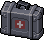

# Medkit

> The game's standardized healing item name (locked — see [`STORY_NOTES.md`](../../STORY_NOTES.md)
> for the naming decision that replaced earlier inconsistent healing-item names).

*Real in-game sprite, uploaded by the project owner (2026-08-13).*

## Description

A standard first-aid kit — bandages, antiseptic, basic trauma supplies. The game's primary healing
consumable, found throughout every location as optional exploration reward.

## Story Placement

- **Ravenwood Hotel** (Chapter 1) — four total: a guest-room suitcase on the second-floor east
  hallway (Scene 30), the East Wing Pantry (Scene 31), the West Wing Liquor Storage (Scene 37), and
  the West Wing Staff Room locker (Scene 37). See
  [`Locations/Ravenwood_Hotel.md`](../../Locations/Ravenwood_Hotel.md) → "Key Items."
- **Police Station** (Chapter 2) — the Break Room (optional, alongside ammo) and the Old Holding
  Cells (optional). See [`Locations/Police_Station.md`](../../Locations/Police_Station.md).

## Open Question

The project owner also uploaded a second, visually distinct sprite for a **[Small
Medkit](Small_Medkit.md)** — see that file for whether this is a genuinely smaller/lesser healing
tier (not yet distinguished anywhere in the location docs, which only ever say "Medkit") or simply
alternate art for the same item.
