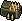

# Rifle Ammo

> Ammo for the [Vanguard M-15 AR Platform](../../Weapons/Vanguard_M15_AR_Platform.md). Note: the
> uploaded sprite's filename ("riffle ammo") has a typo, corrected to `spr_rifle_ammo.png` here —
> flagged, not silently left as a confusing filename.

*Real in-game sprite, uploaded by the project owner (2026-08-13).*

## Description

A box of 5.56mm rounds, compatible with the Vanguard M-15 AR Platform.

## Story Placement

Not yet placed in any scripted content — matches the Vanguard M-15's own "not yet placed" status
(see that file's "Story Placement" section). Will need a pickup location once the AR Platform
itself is placed in a chapter/district.
