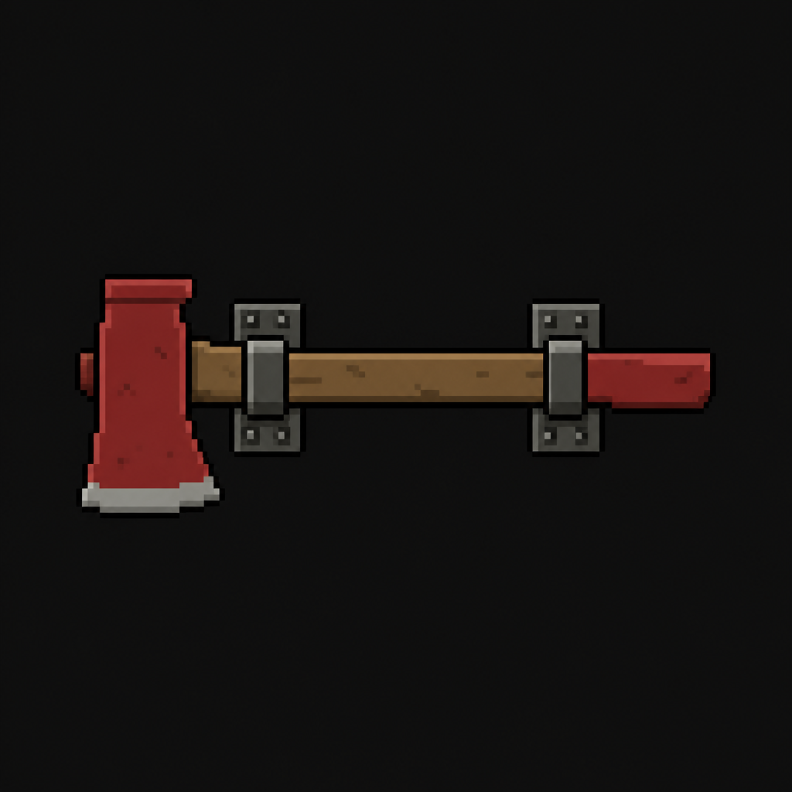

# Fire Axe (Worthy Academy)

*AI-generated inventory-icon concept (2026-08-14) — no real sprite uploaded yet for this item;
style-anchored to the real uploaded weapon/item sprites. Filed as "Academy_Fire_Axe" to avoid a
naming collision with [St. Dymphna Hospital's own Fire Axe](Fire_Axe.md) — a distinct item tied to
a different building/story, same convention as the Manager's Office Key/Manager's Key distinction.*

## Description

A standard boiler-room fire axe, mounted on a wall bracket in the Maintenance Basement. Forces the
East Academic Wing's jammed fire doors — a deliberate cross-room backtrack within the main
building.

## Story Placement

**Worthy Academy** (Chapter 2) — found in the Maintenance Basement; forces the East Academic
Wing's jammed fire doors. See [`Locations/Academy.md`](../../Locations/Academy.md) → "Key Items"
and "Puzzles."
