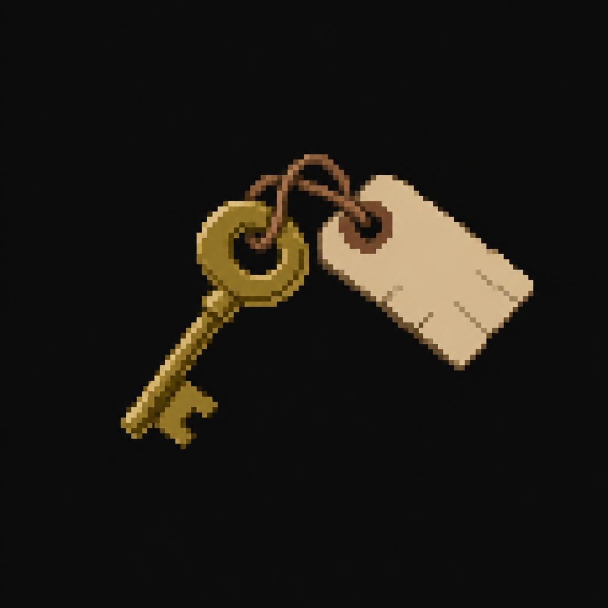

# Library Key (Worthy Academy)

*AI-generated inventory-icon concept (2026-08-14) — no real sprite uploaded yet for this item;
style-anchored to the real uploaded weapon/item sprites. Filed as "Academy_Library_Key" to avoid a
future naming collision — [`Locations/Monastery.md`](../../Locations/Monastery.md) also references
its own, separate "Library Key" for its Library/Archive room, not yet written up as its own file.*

## Description

A key tagged in a child's careful printing rather than an adult's rushed hand, found backstage in
the Auditorium — the Library Group relocated the youngest children there mid-crisis and kept the
door barricaded from the inside. Opens the Library.

## Story Placement

**Worthy Academy** (Chapter 2) — found in the Auditorium; opens the Library. See
[`Locations/Academy.md`](../../Locations/Academy.md) → "Key Items" and "Puzzles."
