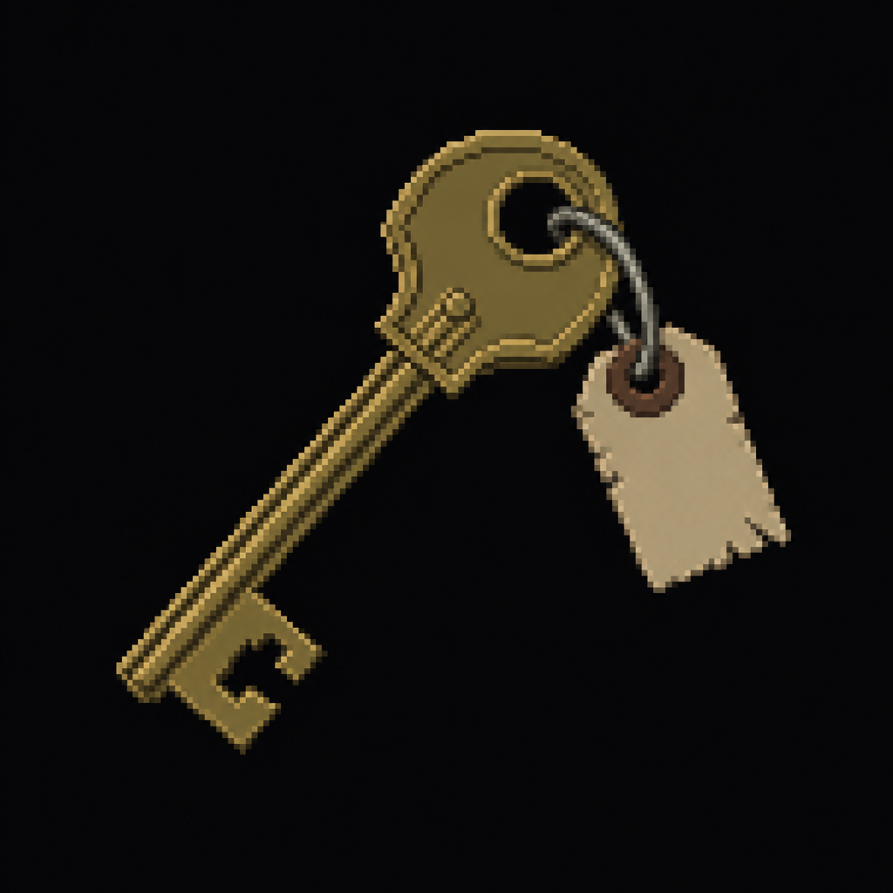

# Administration Key

*AI-generated inventory-icon concept (2026-08-13) — no real sprite uploaded yet for this item;
style-anchored to the real uploaded weapon/item sprites.*

## Description

A door key left in an unlocked desk drawer in the Laboratory, tagged with a small paper label
reading "ADMIN" in a pathologist's own handwriting — kept close at hand rather than carried, since
she expected to need it again before the night was over. Opens Administration.

## Story Placement

**St. Dymphna Hospital** (Chapter 2) — found in the Laboratory (opened with the
[Laboratory Key](Laboratory_Key.md)); opens Administration, a lore-only stop that deliberately
doesn't gate anything further. See [`Locations/Hospital.md`](../../Locations/Hospital.md) → "Key
Items" and "Puzzles."
