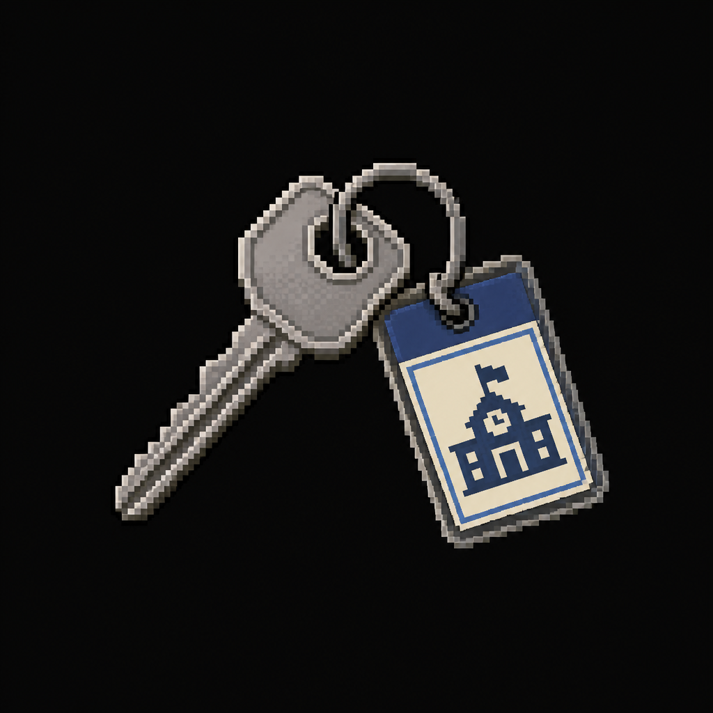

# Administration Office Key

*AI-generated inventory-icon concept (2026-08-14) — no real sprite uploaded yet for this item;
style-anchored to the real uploaded weapon/item sprites.*

## Description

A key ring, dropped and tangled in an overturned chair leg during the Cafeteria's panic. Opens the
Administration Office.

## Story Placement

**Worthy Academy** (Chapter 2) — found in the Cafeteria, off the Gymnasium hub; opens the
Administration Office. See [`Locations/Academy.md`](../../Locations/Academy.md) → "Key Items" and
"Puzzles."
