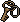

# Armory Key

*Real in-game sprite, uploaded by the project owner (2026-08-13) — reusing the generic
`spr_managerKey.png` icon (one of three interchangeable "physical key" templates; see
[`../README.md`](../README.md) → "Reusable key/keycard icon templates"), not a unique piece of art
for this specific key.*

## Description

A key found still on the belt of Corporal Eli Reyes' body. Opens the Armory.

## Story Placement

**Police Station** (Chapter 2) — from Corporal Reyes' body, K-9 Unit Room (found immediately after
surviving the two-Ashen-Hound fight); opens the Armory, where the
[Ranger 870 Pump Shotgun](../../Weapons/Ranger_870_Pump_Shotgun.md) and
[Shotgun Shells](../Consumables/Shotgun_Shells.md) are recovered. See
[`Locations/Police_Station.md`](../../Locations/Police_Station.md) → "Key Items."
