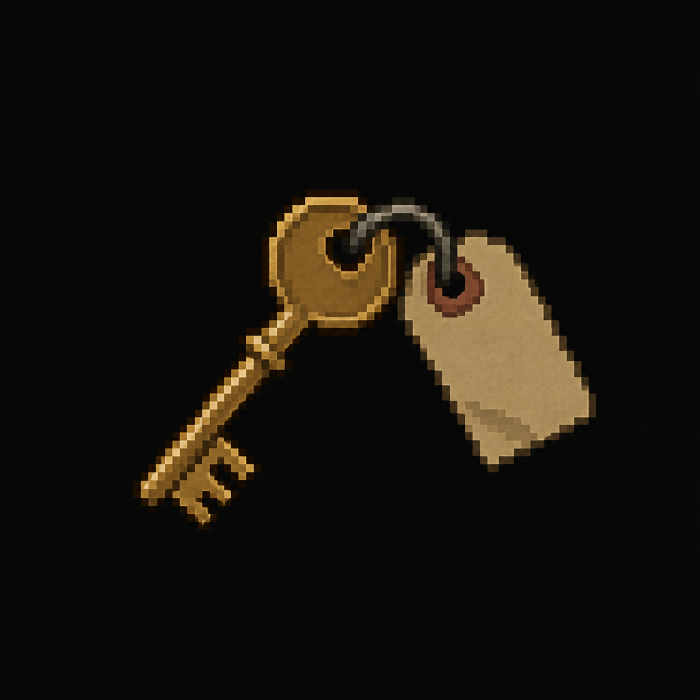

# Auditorium Key

*AI-generated inventory-icon concept (2026-08-14) — no real sprite uploaded yet for this item;
style-anchored to the real uploaded weapon/item sprites.*

## Description

A key hanging behind the front desk at Student Housing. Opens the Auditorium back at the main
Academy building — a deliberate cross-location backtrack.

## Story Placement

**Worthy Academy** (Chapter 2) — found at Student Housing (secondary location); opens the
Auditorium. See [`Locations/Academy.md`](../../Locations/Academy.md) → "Key Items" and "Puzzles."
