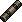

# Auxiliary Fuse

*Real in-game sprite, uploaded by the project owner (2026-08-13).*

## Description

A replacement fuse, part of a spare stock that ended up stored on the guest floor after a basement
flood (per the West Wing Maintenance Room's maintenance log). Installed at the breaker panel — once
opened with the [Screwdriver](Screwdriver.md) — to restore West Wing power.

## Story Placement

**Ravenwood Hotel** (Chapter 1) — recovered from the West Wing Maintenance Room, on the guest floor
near the West Public Stairwell. See
[`Locations/Ravenwood_Hotel.md`](../../Locations/Ravenwood_Hotel.md) → "Key Items."
