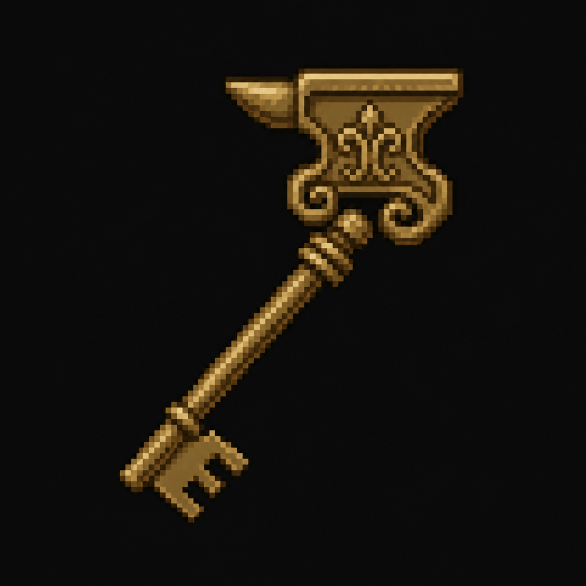

# Boardroom Key

*AI-generated inventory-icon concept (2026-08-13) — no real sprite uploaded yet for this item;
style-anchored to the real uploaded weapon/item sprites, given a subtly ornate silhouette
distinguishing it from the plant's plainer, more utilitarian keys.*

## Description

An old brass key, dropped by one of the Exposure Cohort once the Security Checkpoint's signature
pack encounter is cleared — the district's final key, appropriately won rather than simply found.
Opens the Founder's Boardroom.

## Story Placement

**Steelgate Refinery** (Chapter 2) — dropped after clearing [the Exposure Cohort](../../Creatures/Exposure_Cohort.md)
at the Security Checkpoint; opens the Founder's Boardroom, where the **Industry Crest** is kept.
See [`Locations/Foundry_Refinery.md`](../../Locations/Foundry_Refinery.md) → "Key Items,"
"Puzzles," and "Crest Progression."
