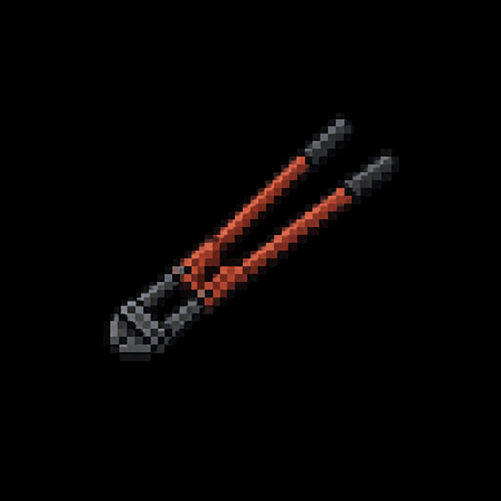

# Bolt Cutters

*AI-generated inventory-icon concept (2026-08-13) — no real sprite uploaded yet for this item;
style-anchored to the real uploaded weapon/item sprites.*

## Description

A pair of long-handled bolt cutters, found at the Ravenwood Fire Station. Opens a padlocked
evidence locker *inside* the Property & Evidence Room (2026-08-14, revised — the room's own door
now resets electronically via the Lockdown Puzzle; this padlock is a separate, optional locker the
department added on top, not a gate on the critical path).

## Story Placement

**Police Station** (Chapter 2, optional) — found at the Ravenwood Fire Station (secondary
location); opens a padlocked locker inside the Property & Evidence Room, holding bonus loot and
the [Evidence Room Key](Evidence_Room_Key.md) — a bonus-loot detour, not required to reach the
Authority Crest. See [`Locations/Police_Station.md`](../../Locations/Police_Station.md) → "The
Lockdown System" and "Key Items," and
[`Scripts/Chapter_2_Police_Station.md`](../../Scripts/Chapter_2_Police_Station.md).
