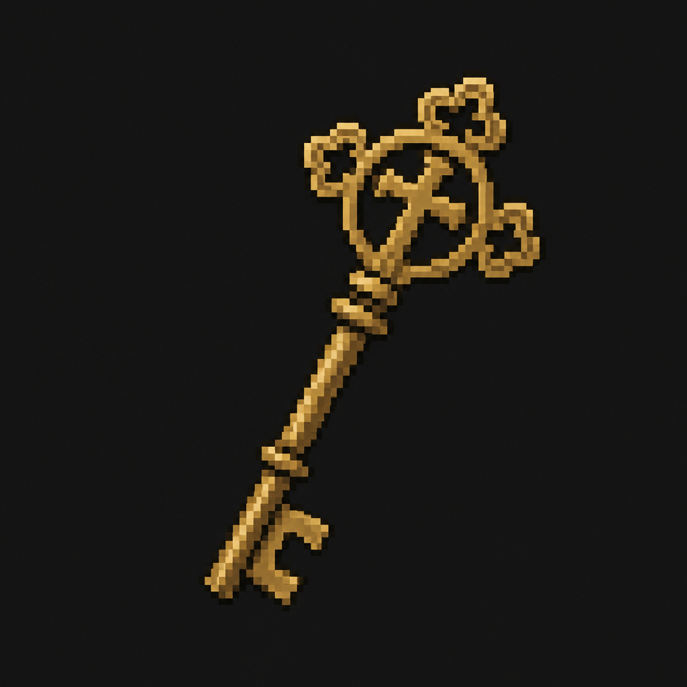

# Chapel Key

*AI-generated inventory-icon concept (2026-08-13) — no real sprite uploaded yet for this item;
style-anchored to the real uploaded weapon/item sprites, given a subtly ornate/religious silhouette
to distinguish it from the district's other, plainer keys.*

## Description

A small, old-fashioned key on its own ring, clipped to a clipboard in the ICU — the district's
final key, found at its deepest, most-gated point, appropriately close to a small hospital chapel
few staff had reason to visit on an ordinary night. Opens St. Dymphna Chapel.

## Story Placement

**St. Dymphna Hospital** (Chapter 2) — found in the ICU, reached only after clearing the Surgical
Wing's boss encounter; opens St. Dymphna Chapel, where the **Medical Crest** is kept. See
[`Locations/Hospital.md`](../../Locations/Hospital.md) → "Key Items," "Puzzles," and "Crest
Progression."
