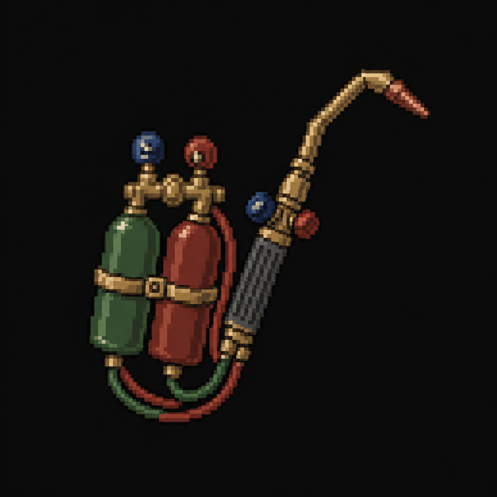

# Cutting Torch

*AI-generated inventory-icon concept (2026-08-13) — no real sprite uploaded yet for this item;
style-anchored to the real uploaded weapon/item sprites.*

## Description

A handheld oxy-acetylene cutting torch, found mid-repair on a workbench at the Machine Shops.
Forces the Security Checkpoint's reinforced door back at the main plant's underground levels — a
deliberate cross-location backtrack, mirroring the Police Station's bolt cutters and the Hospital's
pry bar.

## Story Placement

**Steelgate Refinery** (Chapter 2) — found at the Machine Shops (secondary location); forces the
Security Checkpoint's reinforced door, opening the path toward the Founder's Boardroom. See
[`Locations/Foundry_Refinery.md`](../../Locations/Foundry_Refinery.md) → "Key Items" and
"Puzzles."
