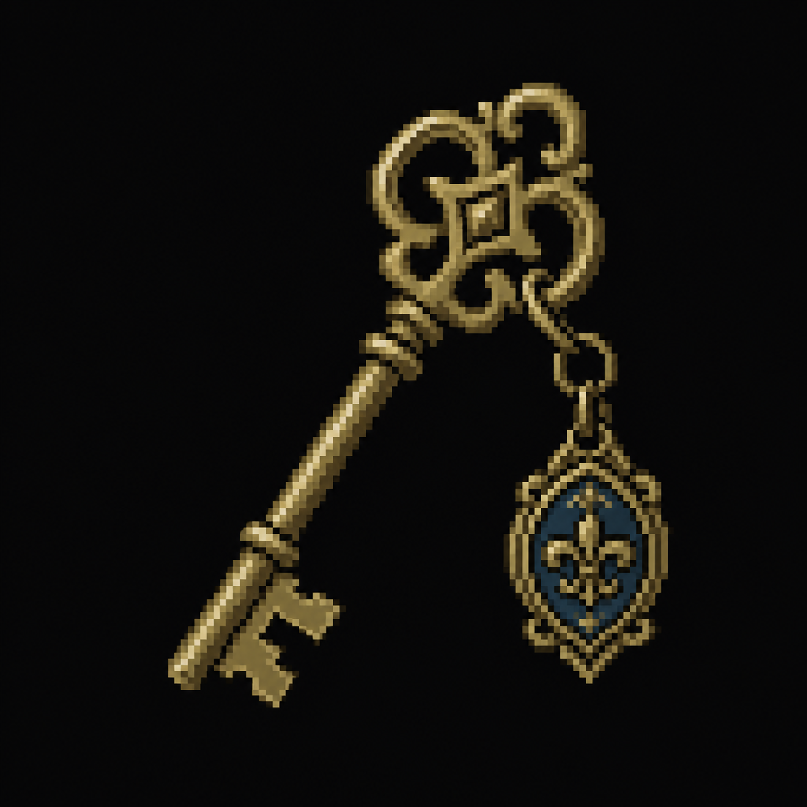

# Founder's Hall Key

*AI-generated inventory-icon concept (2026-08-14) — no real sprite uploaded yet for this item;
style-anchored to the real uploaded weapon/item sprites, given an old, formal-looking fob
distinguishing it from the district's plainer staff keys.*

## Description

An old key, rarely used, found in the Principal's own desk drawer. Opens Founder's Hall.

## Story Placement

**Worthy Academy** (Chapter 2) — found in the PA / Principal's Office; opens Founder's Hall, where
the **Knowledge Crest** is kept. See [`Locations/Academy.md`](../../Locations/Academy.md) → "Key
Items," "Puzzles," and "Crest Progression."
