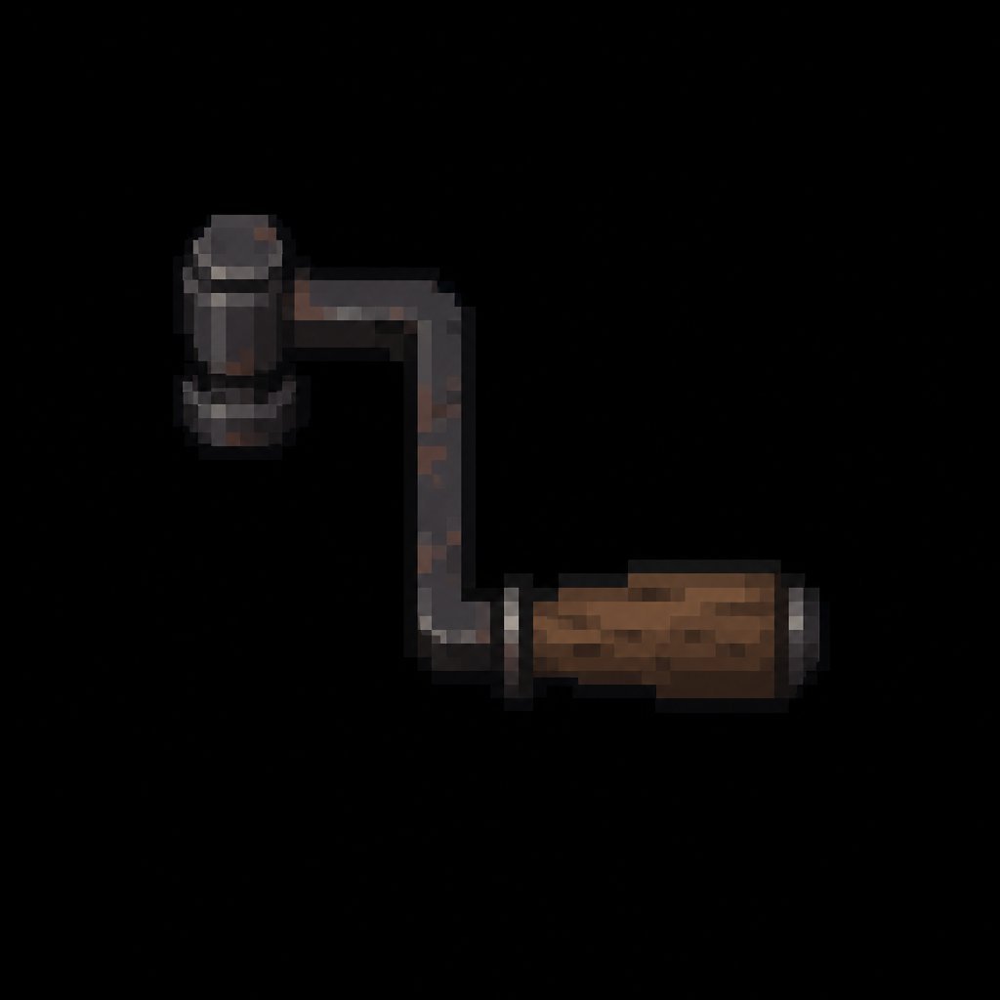

# Gate Crank Handle

*AI-generated inventory-icon concept (2026-08-13) — no real sprite uploaded yet for this item;
style-anchored to the real uploaded weapon/item sprites.*

## Description

A heavy iron hand-crank handle, the manual override for the courtyard's north gate — a heavy
steel-framed double gate retrofitted at some point as the hotel's designated fire-code emergency
exit, electrically motorized but fitted with a manual crank for exactly this kind of power-failure
scenario. Stored in the Housekeeping Closet per hotel protocol (per the gate's own placard).

## Story Placement

**Ravenwood Hotel** (Chapter 1) — found in the Housekeeping Closet (Scene 43); used at the
courtyard's North Gate Manual Release (Scenes 45–46), where working the crank draws out The
Caretaker mid-turn. See [`Locations/Ravenwood_Hotel.md`](../../Locations/Ravenwood_Hotel.md) →
"Key Items."
