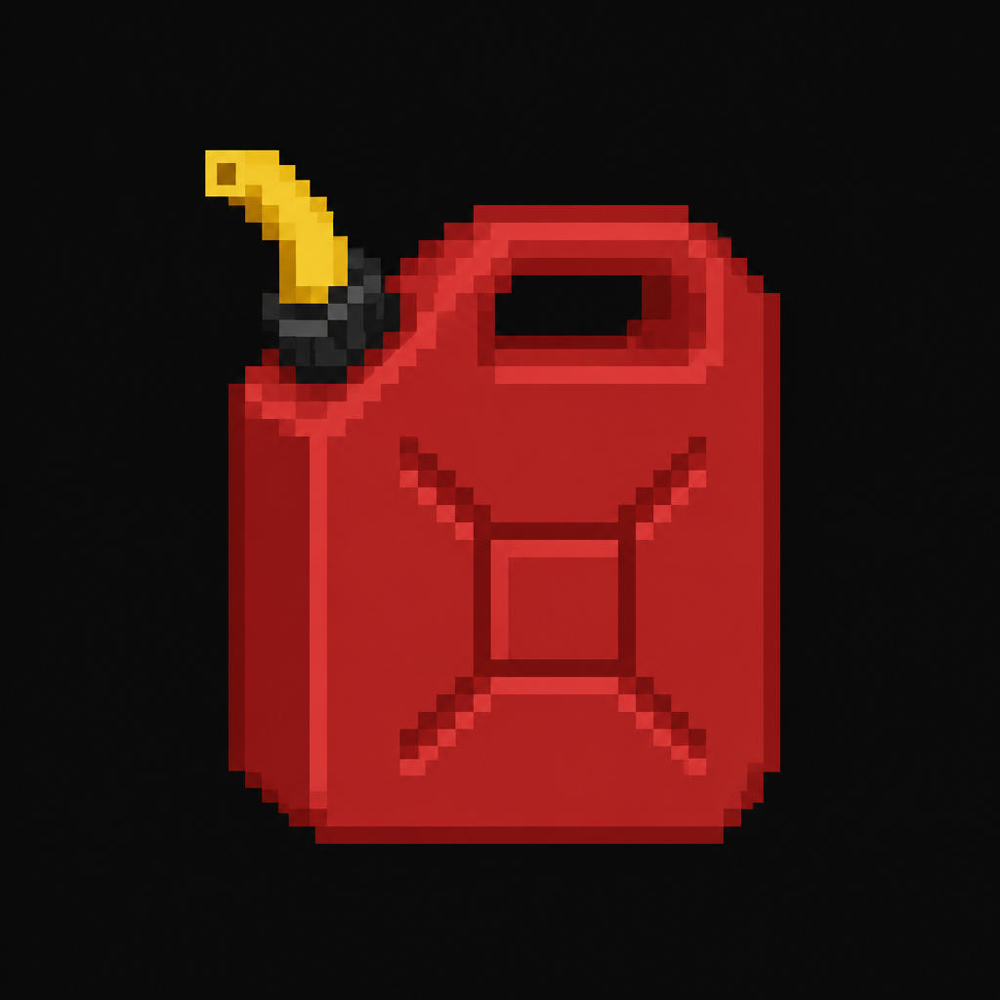

# Generator Fuel

*AI-generated inventory-icon concept (2026-08-14) — no real sprite uploaded yet for this item;
style-anchored to the real uploaded weapon/item sprites.*

## Description

A red fuel canister found tucked behind a rack of practice cones in the Athletic Field's equipment
shed. Primes the stalled backup generator powering the Maintenance Basement's electronic lock — a
deliberate cross-location backtrack.

## Story Placement

**Worthy Academy** (Chapter 2) — found at the Athletic Field (secondary location); opens the
Maintenance Basement back at the main Academy building. See
[`Locations/Academy.md`](../../Locations/Academy.md) → "Key Items" and "Puzzles."
