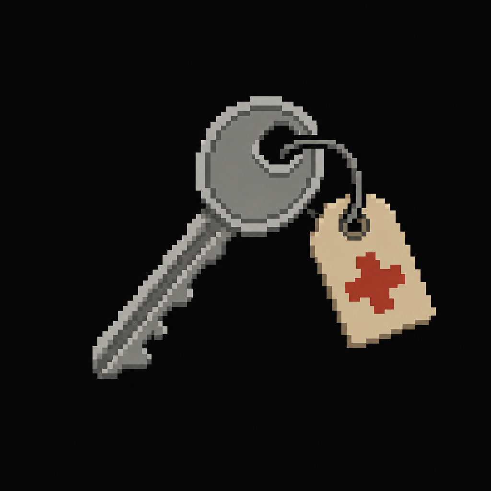

# Isolation Wing Key

*AI-generated inventory-icon concept (2026-08-14) — no real sprite uploaded yet for this item;
style-anchored to the real uploaded weapon/item sprites.*

## Description

A key found in the Administration Office's top drawer, tagged "ISOLATION." Opens the Isolation
Wing (the repurposed nurse's office and adjacent classrooms).

## Story Placement

**Worthy Academy** (Chapter 2) — found in the Administration Office; opens the Isolation Wing. See
[`Locations/Academy.md`](../../Locations/Academy.md) → "Key Items" and "Puzzles."
