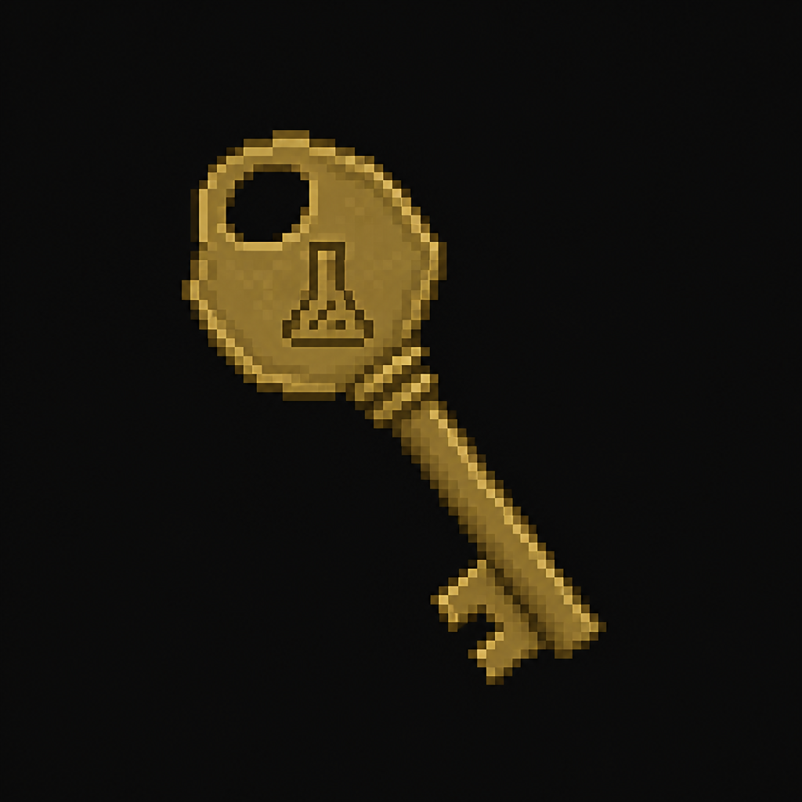

# Laboratory Key

*AI-generated inventory-icon concept (2026-08-13) — no real sprite uploaded yet for this item;
style-anchored to the real uploaded weapon/item sprites. Uses a distinct icon from the Police
Station's generic key templates per [`../README.md`](../README.md) → "Reusable key/keycard icon
templates," since this item hasn't been assigned one of those shared templates.*

## Description

A standard door key, still on a dead orderly's belt ring in Radiology — he never made it back to
lock up after the CT suite's restrained patient tore free (see
[`Locations/Hospital.md`](../../Locations/Hospital.md) → "Outbreak Night," beat 9). Opens the
Laboratory.

## Story Placement

**St. Dymphna Hospital** (Chapter 2) — found on the dead orderly in Radiology, after the signature
transformed-patient encounter; opens the Laboratory. See
[`Locations/Hospital.md`](../../Locations/Hospital.md) → "Key Items" and "Puzzles."
