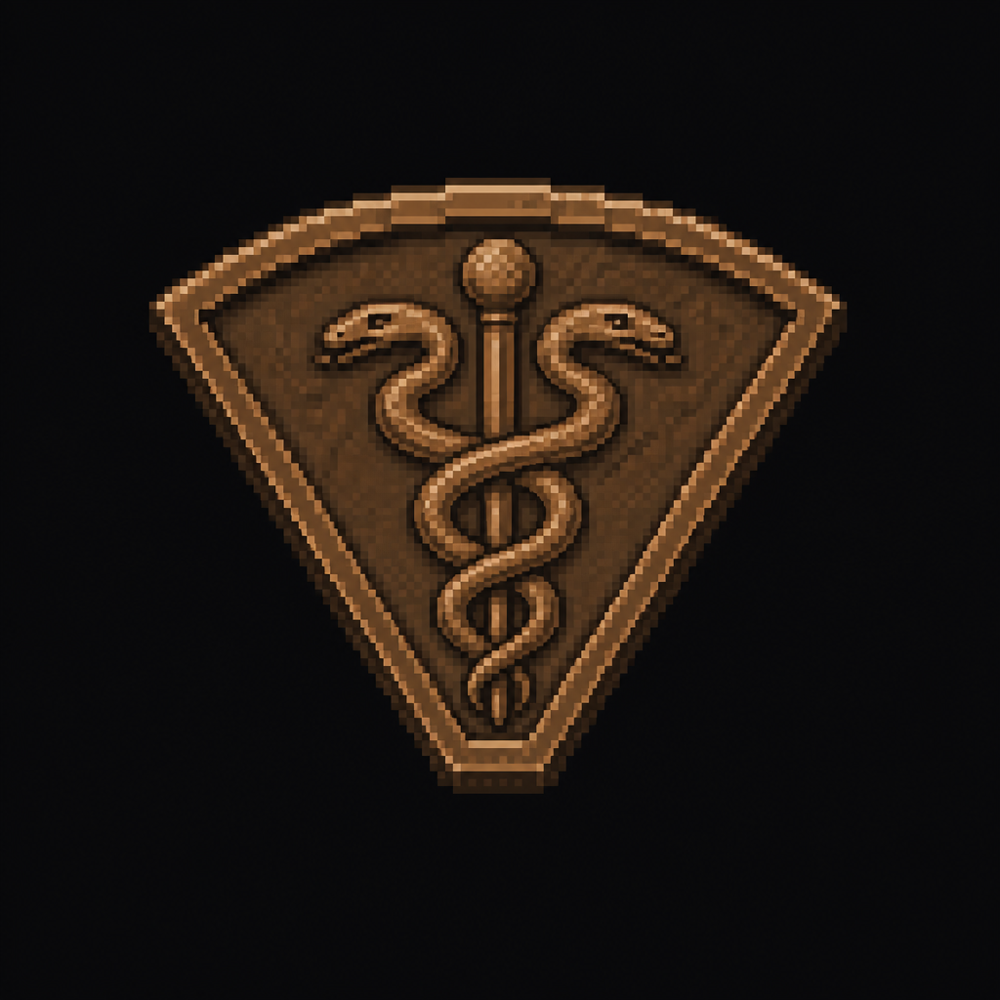

# Medical Crest

*AI-generated inventory-icon concept (2026-08-13) — no real sprite uploaded yet for this item;
style-anchored to the real uploaded weapon/item sprites and the existing
[Founders Memorial plaque concept art](../../Assets/Reference/founders_memorial_plaque_concept.png),
same convention as the [Authority Crest](Authority_Crest.md).*

## Description

A bronze, wedge-shaped medallion bearing a relief portrait of Dr. Nathaniel Voss, his name and
title, and a serpent-and-staff caduceus emblem. Kept in a glass-fronted case in St. Dymphna Chapel,
unlocked once the ICU is passed — no key of its own (revised 2026-08-14, once the Quarantine
Puzzle replaced the district's old key chain; the Chapel Key that used to open this case is
retired).

## Story Placement

**St. Dymphna Hospital** (Chapter 2) — the Northeast District's founder's emblem (MEDICINE wedge,
Serpent-Caduceus symbol — see [`CANON.md`](../../CANON.md) → "The Founders & the Five Crests").
Found in St. Dymphna Chapel's display case, the direct payoff of the district's Quarantine Puzzle.
Can be returned to the Founders Memorial any time Jim backtracks to Memorial Park. See
[`Locations/Hospital.md`](../../Locations/Hospital.md) → "Crest Progression."
