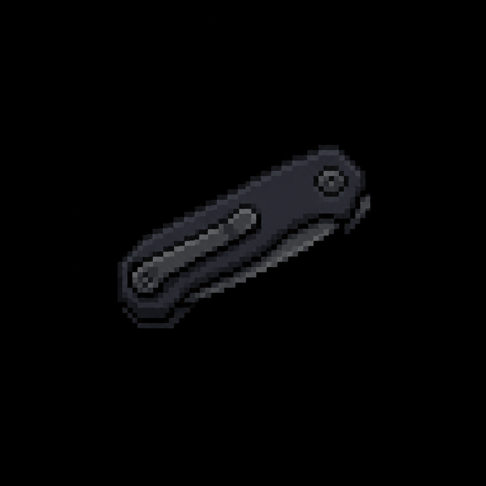

# Pocketknife

*AI-generated inventory-icon concept (2026-08-13) — no real sprite uploaded yet for this item;
style-anchored to the real uploaded weapon/item sprites.*

## Description

An optional pickup from one of Booking & Processing's tagged personal-effects lockers. Utility/
flavor item — no confirmed mechanical use yet.

## Story Placement

**Police Station** (Chapter 2) — optional, from a personal-effects locker in Booking & Processing.
See [`Locations/Police_Station.md`](../../Locations/Police_Station.md) → "Key Items."

## Open Design Gap

No confirmed mechanical use yet (matches the note already in `Police_Station.md`) — flagged there,
not invented here.
