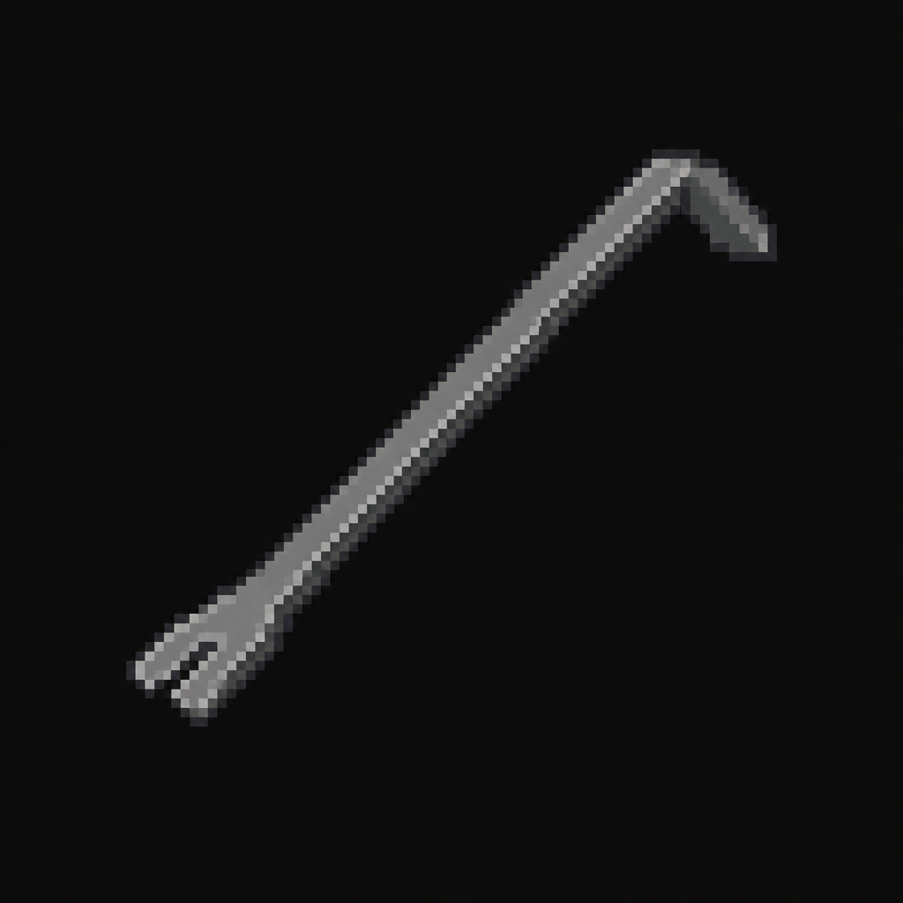

# Pry Bar

*AI-generated inventory-icon concept (2026-08-13) — no real sprite uploaded yet for this item;
style-anchored to the real uploaded weapon/item sprites.*

## Description

A flat steel pry bar, found at the Vanguard Quarantine Checkpoint (secondary location) alongside
checkpoint logs cross-referencing the Police Station's own outbreak-night documents. Forces the
barricaded stairwell up to St. Dymphna Hospital's Psychiatric/Behavioral Health Ward.

## Story Placement

**St. Dymphna Hospital** (Chapter 2, optional) — found at the Vanguard Quarantine Checkpoint;
forces the barricaded stairwell off the Emergency Department, opening the Psychiatric/Behavioral
Health Ward. Does not gate the Medical Crest. See
[`Locations/Hospital.md`](../../Locations/Hospital.md) → "Key Items" and "Puzzles."
