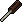

# Screwdriver

*Real in-game sprite, uploaded by the project owner (2026-08-13).*

## Description

A flathead screwdriver with a worn wooden handle, found sitting in a tray in the Utility Room as if
someone set it down mid-task and never came back for it. Its only use is opening the fuse housing
at the breaker panel — both to confirm the blown West Wing fuse and to install the replacement.

## Story Placement

**Ravenwood Hotel** (Chapter 1) — found in the East Wing's Utility Room. See
[`Locations/Ravenwood_Hotel.md`](../../Locations/Ravenwood_Hotel.md) → "Key Items."
