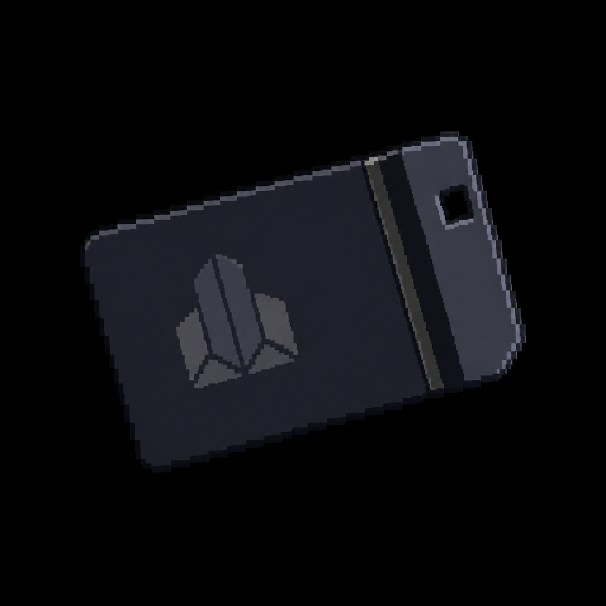

# Vanguard Site Key

*AI-generated inventory-icon concept (2026-08-13) — no real sprite uploaded yet for this item;
style-anchored to the real uploaded weapon/item sprites, given a sleek corporate look distinct from
the plant's own industrial keys — the same "what is this doing here" visual language as the Police
Station's [Vanguard Access Card](Vanguard_Access_Card.md).*

## Description

A dark, corporate-issue keycard found at the Loading Docks, alongside shipment manifests confirming
years of unmarked refrigerated transport trucks. Opens the Vanguard Site Office within the main
plant — a deliberate cross-location backtrack.

## Story Placement

**Steelgate Refinery** (Chapter 2) — found at the Loading Docks (secondary location); opens the
Vanguard Site Office back at the main plant. See
[`Locations/Foundry_Refinery.md`](../../Locations/Foundry_Refinery.md) → "Key Items" and
"Puzzles."
