# Worthy Academy

> The Southeast District's main location — Knowledge Crest. Everything below is new (2026-08-13,
> proposed pending review), written to the same [`CANON.md`](../CANON.md) → "District Main-
> Location Design Standard" bar as [`Locations/Police_Station.md`](Police_Station.md),
> [`Locations/Hospital.md`](Hospital.md), and [`Locations/Foundry_Refinery.md`](Foundry_Refinery.md):
> a dense, multi-key, backtracking-driven exploration space, targeting roughly 2–3 hours of
> gameplay.
>
> **Thematic identity (per the project owner's explicit direction):** where the Foundry, Hospital,
> and Police Station each show a Ravenwood *institution* discovering Vanguard's betrayal, the
> Academy shows **ordinary civilians** who did everything right — went to the designated shelter,
> listened to police, registered their families, waited for evacuation — and were failed anyway,
> because Vanguard had already spent years quietly compromising every institution they trusted.
> *"The Academy represents the final failure of Ravenwood's emergency system."* Its environmental
> storytelling is deliberately **personal** rather than institutional: handwritten rosters, teacher
> notes, children's drawings, family photographs, PA announcements, lost-and-found items — not
> machinery, medical charts, or dispatch logs.
>
> **Structural note:** [`STORY_NOTES.md`](../STORY_NOTES.md)'s earlier city-layout table listed
> "Academy Library" as one of this district's secondary locations, alongside Student Housing,
> Athletic Field, and Playgrounds. Per the source material below (the campus's own library is one
> of its core rooms, and becomes "The Library Group" survivor pocket), the library is treated here
> as **part of the main Academy building**, not a separate off-campus location — a minor
> structural reconciliation, not a contradiction; nothing about its content changes, only where
> it's categorized. Student Housing, Athletic Field, and Playgrounds remain this district's three
> secondary locations.

## Purpose in the Overall Story

The Southeast District's main "mansion/RPD"-style location, following the same structural rules as
the Police Station, Hospital, and Foundry: a central hub (the Gymnasium) visibly gates several
locked doors at once, and reaching the **Knowledge Crest** requires a genuine multi-key
backtracking loop across the main campus building and three secondary locations. Where the other
three institutions each fail because Vanguard corrupted them from within, Worthy Academy fails
because it did exactly what a civilian shelter is supposed to do — and Vanguard used that
cooperation against it, turning the shelter's own registry into a tool for locating exposure
cohorts and their families.

## Outbreak Night — What Actually Happened (proposed 2026-08-13, pending review)

> Per the project owner's explicit framing: *"If the Foundry is where Ravenwood's disaster begins,
> the Academy should be where the town tries to save its children and families... It is about what
> happens when hundreds of terrified civilians gather in one place while nobody actually
> understands what they're hiding from."* This timeline is the master reference behind the
> specific details placed in `Storyline`, below.

1. **Before the outbreak, the Academy is Ravenwood's designated emergency shelter** — storm-tested,
   equipped with backup generators, emergency food and water, cots, first aid, and radios; the
   police have used it for previous weather emergencies. Nobody imagined it would need to shelter
   the town from itself.
2. **The storm warning begins.** An ordinary evening — basketball practice, drama rehearsal,
   custodial staff, tutoring, students waiting for pickup — as the same storm hitting the rest of
   Ravenwood worsens. Police contact the Academy: **PREPARE FOR POSSIBLE EMERGENCY SHELTER
   ACTIVATION.** Staff open the gymnasium, still believing this is weather plus an industrial
   accident.
3. **The first civilians arrive** — not fleeing monsters, fleeing practical problems: car
   accidents, power outages, flooded streets, an apartment fire, families who can't reach
   relatives. Police direct people here because the hospital is already filling. Staff set up
   registration tables, cots, food stations, a children's area, and basic triage. For a short
   time, the Academy may be the safest place in Ravenwood.
4. **The first Vanguard instruction arrives indirectly through police**: anyone showing
   industrial-incident symptoms (fever, confusion, unexplained bleeding, violent behavior, severe
   muscle spasms, unusual wound healing) must be separated from the general population. Untrained
   teachers, secretaries, coaches, and custodians convert the nurse's office and adjacent
   classrooms into an isolation area, not yet understanding what that decision will do.
5. **Police bring the first Foundry families.** Workers who escaped early reach residential areas;
   their families are evacuated here, and some Foundry employees arrive themselves — one covered
   in mineral dust, one with a badly injured arm, one insisting he's fine. Shelter staff separate
   them per Vanguard's instructions; a woman refuses to leave her husband in isolation; someone
   shouts that Vanguard is lying. See [`Locations/Foundry_Refinery.md`](Foundry_Refinery.md), beat
   19.
6. **Police presence is initially reassuring** — familiar Ravenwood officers, not an anonymous
   tactical unit, controlling entrances, calming civilians, and establishing one arrival entrance,
   one emergency-vehicle exit, a temporary missing-person board, secured supply rooms, and campus
   patrols.
7. **Vanguard requests the complete shelter roster** — names, addresses, medical conditions,
   employment, hospitalization history, with Foundry employees specifically flagged. Administration
   assumes it's for evacuation planning. One teacher notices Vanguard's real interest: not
   necessarily the sick, but people connected to Foundry workers or already on Vanguard's lists —
   the shelter's own registry becomes how Vanguard locates its exposure cohorts.
8. **A family is removed.** Vanguard personnel take custody of a Foundry worker, his wife, and
   their teenage son — neither the wife nor son is sick. The guarding officer asks why; Vanguard
   says *"Potential secondary contamination."* He reluctantly allows it. His later note: *"I gave
   them the Harris family." "All three."*
9. **The Academy fills rapidly** — hospital overflow, evacuated residential blocks, stranded
   traffic-accident families; eventually hundreds of people across the gymnasium, cafeteria, and
   classrooms. Large boards go up: **INSIDE / HOSPITAL / POLICE / MISSING / UNKNOWN** — names
   crossed out, moved, annotated, some simply left under MISSING.
10. **The first person turns inside the shelter** — not someone obviously infected, but a Foundry
    employee who passed screening, suffered a minor injury hours earlier, and collapses in the
    cafeteria. Someone performs CPR; his body reacts violently; he attacks the person helping him.
    Panic, overturned tables, a stampede toward exits, police shooting, and now everyone
    understands the danger is already inside.
11. **The police lock the doors** — unable to let hundreds of panicked civilians flood the
    streets, but from the civilians' side, indistinguishable from being imprisoned. *"LET US OUT."*
    One officer, aloud, over the radio: *"Jesus Christ. We're doing exactly what they did."*
    Deliberately mirrors [`Locations/Foundry_Refinery.md`](Foundry_Refinery.md)'s own Vanguard
    lockdown.
12. **The school is divided into zones** — **GREEN** (Gymnasium, asymptomatic), **YELLOW**
    (classrooms, uncertain exposure), **RED** (Nurse's Office/science wing, symptomatic). Initially
    life-saving, then horrific: families separated, children taken from symptomatic parents, people
    lying during screening (a mother hiding a wound, a father dosing a child with fever medicine)
    once rumors spread that Vanguard is taking people away.
13. **The hospital tells them the truth.** A transmission from St. Dymphna warns that traumatic
    injury may accelerate abnormal regeneration and to avoid invasive treatment unless absolutely
    necessary — useless, terrifying advice for people running a shelter. The Academy nurse writes:
    *"Everything I was trained to do may be making them worse."* See
    [`Locations/Hospital.md`](Hospital.md), beat 6.
14. **Police are ordered to reinforce Highway 13.** Half the Academy's security detail is pulled
    away — *"We've got two hundred people here." "I know."* — into the Police Station's own
    highway confrontation (see [`Locations/Police_Station.md`](Police_Station.md), beat 9). Some
    never return. The Academy's defenses immediately weaken.
15. **The PA system becomes the lifeline** — escalating announcements from "please remain calm" to
    "do not enter the east hallway" to "if you hear gunfire, stay inside your room and lock the
    door." Fragments of these can still play from damaged speakers when Jim arrives.
16. **Vanguard demands all RED-zone civilians be surrendered.** The remaining officers, having
    heard what happens to people Vanguard takes, hesitate; one refuses outright. Vanguard: *"You
    are interfering with a federal containment operation."* Asked for legal authority, they can't
    or won't provide it — the first time Ravenwood Police physically blocks Vanguard from a
    civilian shelter.
17. **The standoff outside the Academy** — Vanguard vehicles arrive, police barricade the front
    entrance, civilians watch through windows. Nobody fires initially; some officers and Vanguard
    guards know each other personally from prior emergency drills. This is the Academy's version of
    the Foundry's Loading Yard confrontation and the Hospital's Ambulance Bay firefight.
18. **The chief's broadcast reaches the Academy.** *"All surviving officers disregard Vanguard
    containment orders."* An officer locks the front doors and tells Vanguard, *"You heard him."*
    One of the rare moments the player can feel proud of Ravenwood — and already too late. See
    [`Locations/Police_Station.md`](Police_Station.md), beat 14.
19. **An evacuation is planned** — the shelter can't hold indefinitely (too many people, not
    enough food or medical supplies, possible infected inside). Buses are prepared, passenger lists
    made, children assigned to adults, a police escort planned, potentially routing toward Memorial
    Park.
20. **The roads collapse before the escort arrives.** Police units are killed or trapped at
    Highway 13; a bus sent ahead never reports back; dispatch eventually stops responding entirely.
    The Academy doesn't know RPD headquarters is itself collapsing (see
    [`Locations/Police_Station.md`](Police_Station.md), beats 10–15).
21. **The isolated Yellow Zone deteriorates** — concealed symptoms and indirect exposure catch up;
    someone attacks another person; the infection reaches the hallway; fire doors seal the east
    academic wing with people trapped on the wrong side.
22. **Someone opens the doors.** A father whose daughter is trapped in the quarantined wing begs,
    is refused, punches an officer, steals the access keys, and opens the fire door. Some
    survivors escape; so do infected. A human mistake, not a villainous one — and it helps destroy
    the shelter.
23. **Panic in the gymnasium** — hundreds try to leave at once; the barricaded front entrance
    (because of Vanguard) forces everyone toward packed side exits; children are separated from
    parents; police fire on approaching creatures; the organized shelter disintegrates in minutes.
24. **Vanguard abandons the Academy** once it becomes uncontrollable — not defeated, just no
    longer worth the risk. The remaining police realize: the people Vanguard called too dangerous
    to release weren't dangerous enough for Vanguard to stay and help contain. That tells them
    everything.
25. **The Academy fractures into survivor pockets** rather than falling all at once: the **Gym
    Survivors** (families, remaining officers), the **Library Group** (teachers, younger
    students), the **Auditorium Group** (originally preparing for evacuation), the fully
    compromised **Science Wing**, **Administration** (a handful maintaining communications), and
    the **Maintenance Basement** (custodians keeping backup power running).
26. **The last school bus.** Thirty-two civilians load aboard with an RPD volunteer escort; the
    front gates open; dispatch logs *"Bus One departing with thirty-two,"* then later,
    unanswered, *"Bus One, report." "Bus One?"* Static. Jim may find this bus elsewhere in
    Ravenwood later — a deliberately open side story.
27. **The children left behind.** During the chaos, teachers write student names on classroom
    boards: **PICKED UP / WITH PARENT / SHELTERED / MISSING.** A teacher's notebook: *"Do not tell
    the younger ones the police are gone." "They keep asking when their parents are coming." "I
    don't know what to tell them anymore."*
28. **The final Academy broadcast** — Principal Diane Ashford, on the emergency radio: *"This is
    Ravenwood Academy emergency shelter. We have civilians remaining inside. We have children
    here." "Any Ravenwood unit receiving, please respond."* Nothing. *"Anybody?"* Static. This
    transmission is recorded at the Police Station after most officers are already dead — nobody
    ever answers it.
29. **The last defensive stand.** Remaining officers and adults barricade a major hallway while
    teachers and custodians move children through a maintenance corridor toward an escape route.
    One officer leaves a note with his badge: *"If they make it out, that's enough."* Whether that
    group survives is deliberately left open, discoverable later rather than answered here.

## How the Academy Connects to the Other Locations

> Per the project owner's explicit framing: the Academy gives the civilian perspective on events
> already established at the other three locations — the same night, seen by people with no
> institutional power at all.

| Foundry / Hospital / Police Station | Academy |
|---|---|
| Foundry: "Workers escape into Ravenwood." | Their families arrive at the shelter, and Vanguard begins identifying them. |
| Hospital: "Memorial becomes overwhelmed." | Non-critical civilians are redirected to the school shelter. |
| Police: "Officers establish citywide containment." | Those same officers become shelter security. |
| Foundry: "Vanguard begins forcibly retrieving exposure subjects." | Vanguard uses the shelter roster to locate workers and their families. |
| Hospital: "Doctors warn that traumatic injury may accelerate mutation." | Shelter staff realize normal first aid may be dangerous. |
| Police: "The chief orders officers to disregard Vanguard." | RPD physically refuses Vanguard access to civilians. |
| Police: "Headquarters collapses." | The promised evacuation escort never arrives. |

See "Documents," below, and the corresponding crossover entries added to
[`Locations/Police_Station.md`](Police_Station.md), [`Locations/Hospital.md`](Hospital.md), and
[`Locations/Foundry_Refinery.md`](Foundry_Refinery.md).

## Arrival / Setup

- Worthy Academy should initially look strangely intact from outside — a deliberate contrast with
  the Foundry and Hospital. School banners still hang, emergency lights glow, a basketball
  scoreboard sits frozen mid-game, student artwork lines the outer walls. The barricaded front
  entrance and abandoned Vanguard-standoff positions are the only immediate signs anything is
  wrong.
- That contrast breaks the moment Jim enters the Gymnasium: hundreds of abandoned cots, blankets,
  food trays, children's backpacks, missing-person boards, and police barricades. This was supposed
  to be the safe place.
- Fragments of Principal Ashford's PA announcements can still intermittently play from damaged
  speakers throughout the building, escalating in urgency the deeper Jim goes.

## Storyline

- **Front Entrance / Barricades.** Entry point; the aftermath of the Vanguard standoff (beats
  16–18) — overturned barricades, a burned-out Vanguard vehicle, and the officer's own handwritten
  sign still taped to the doors: *"You heard him."*

  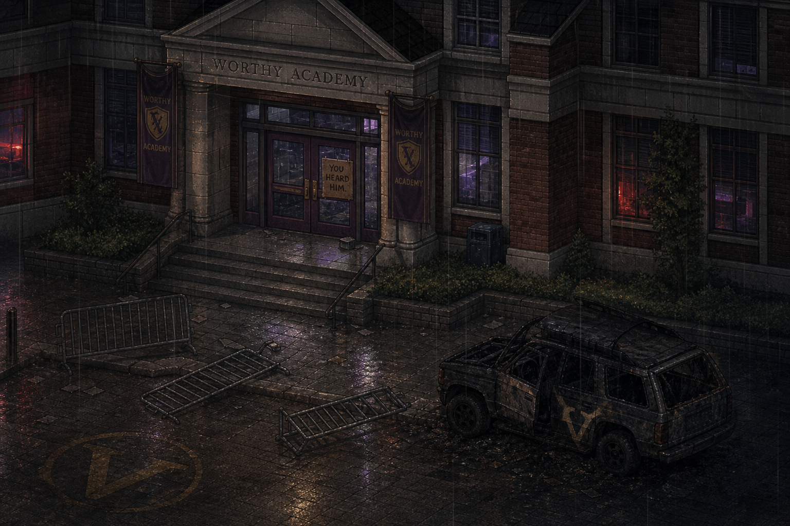

  > AI-generated room concept (2026-08-13).
- **The Gymnasium (hub).** The GREEN ZONE — rows of cots, a registration table, a children's play
  area, and the district's own version of the whiteboard motif: **INSIDE / HOSPITAL / POLICE /
  MISSING / UNKNOWN**, names crossed out and re-annotated throughout the night. From here, Jim can
  see the Cafeteria (open), the Administration Office (locked), the Auditorium (locked), the
  Library (barricaded), and the Maintenance Basement (locked) — several visibly closed-off points
  seen at once, same convention as the other three main locations.

  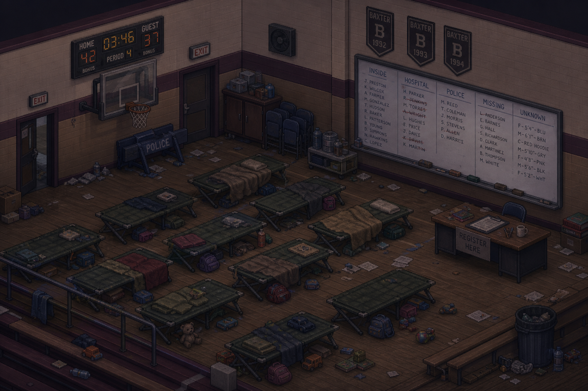

  > AI-generated room concept (2026-08-13).
- **The Cafeteria.** Unlocked from the Gymnasium. Overturned tables and chairs from the panic of
  beat 10 — this district's signature single encounter (a turned Foundry employee, fully
  transformed by the time Jim arrives). The **Administration Office Key** is found here, dropped
  during the chaos.

  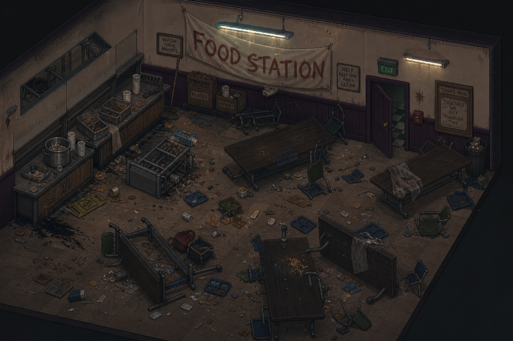

  > AI-generated room concept (2026-08-13).
- **The Administration Office.** Opened with the Administration Office Key. Shelter registration
  rosters, the Vanguard registry demand (beat 7), and the "I gave them the Harris family" note
  (beat 8). The **Isolation Wing Key** is found here.

  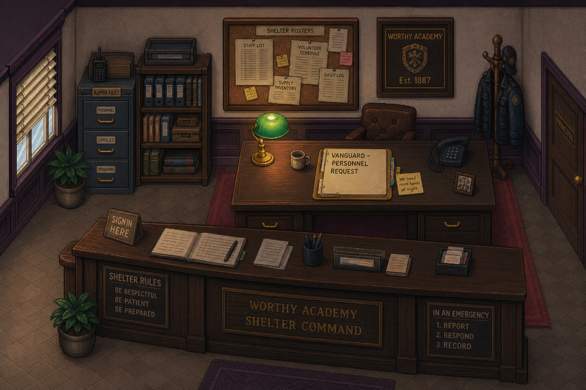

  > AI-generated room concept (2026-08-13).
- **The Isolation Wing (Nurse's Office + adjacent classrooms, RED/YELLOW Zone).** Opened with the
  Isolation Wing Key. Repurposed cots with restraints improvised from bedsheets, Vanguard's own
  symptom checklist pinned to a corkboard, and the Academy nurse's log ending on *"Everything I
  was trained to do may be making them worse."* Optional Medkit.

  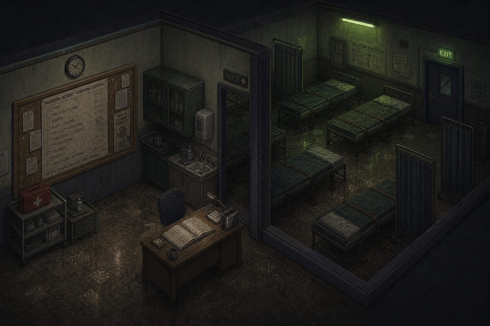

  > AI-generated room concept (2026-08-13).
- **The Auditorium.** Locked; opened with the **Auditorium Key**, found at the secondary Student
  Housing location (see below) — a deliberate district-wide backtrack. The Auditorium Group's
  belongings: rows of chairs pushed aside for cots, a chalkboard covered in evacuation planning
  notes, and the passenger/bus manifest for Bus One (beat 26).

  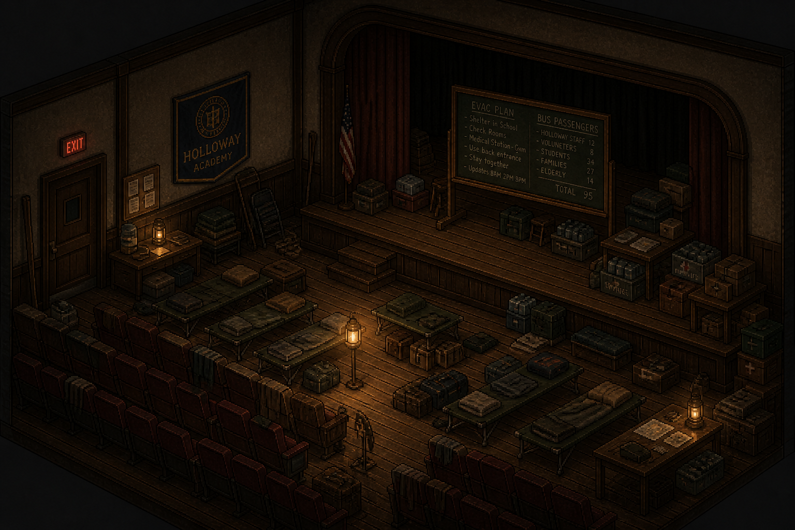

  > AI-generated room concept (2026-08-13). Non-canonical generation error: the wall banner reads
  > "Holloway Academy" — the school is **Worthy Academy**; ignore the banner text.
- **The Library.** Barricaded from the inside; opened using the **Library Key**, found in the
  Auditorium (teachers relocated the youngest children here mid-crisis, per beat 25's "Library
  Group"). Picture books, a makeshift reading-corner shelter, and the teacher's notebook: *"Do not
  tell the younger ones the police are gone."*

  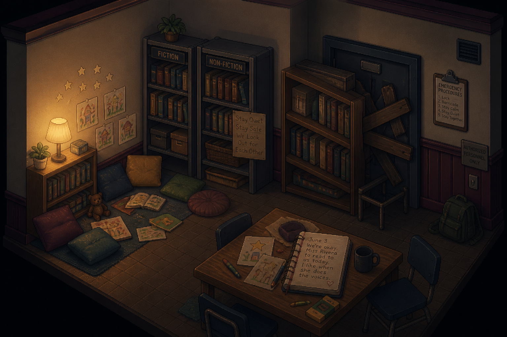

  > AI-generated room concept (2026-08-13).
- **The Maintenance Basement.** Locked; opened with a **Generator Fuel canister/Basement Key**,
  found at the secondary Athletic Field location (see below) — a second deliberate district-wide
  backtrack. Custodians' final stand keeping the backup generators running; yields the **Fire
  Axe**, needed to force the East Wing's jammed fire doors.

  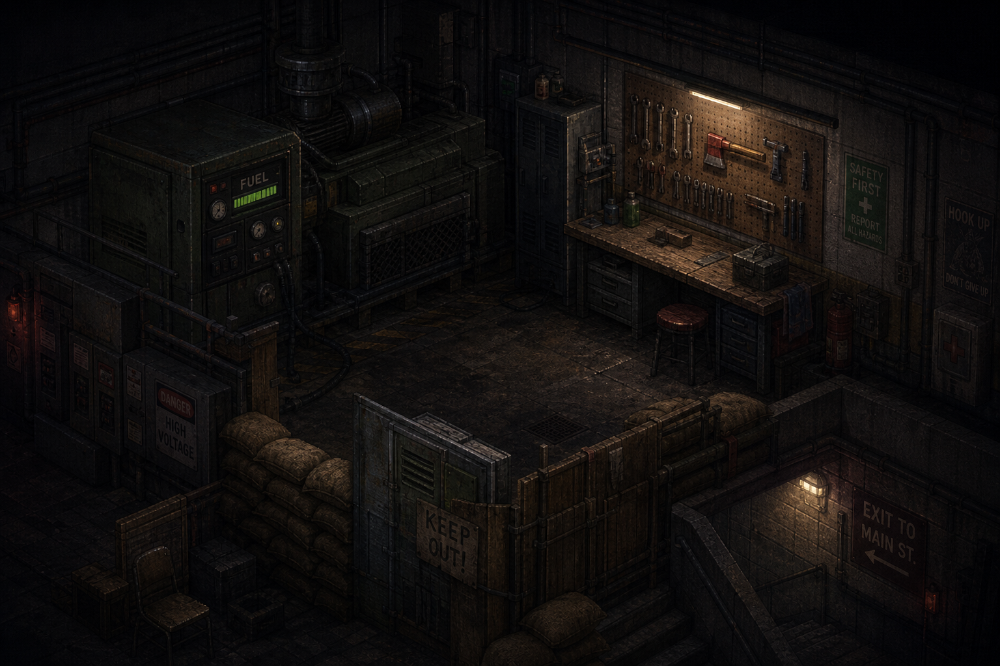

  > AI-generated room concept (2026-08-13).
- **The East Academic Wing / Science Rooms.** Jammed fire doors (beat 21); forced open with the
  Fire Axe from the Maintenance Basement. Beyond them: this district's signature pack encounter —
  several turned Isolation Wing patients and civilians (standard
  [Shamblers](../Creatures/Shambler.md); the Academy deliberately introduces **no new creature
  type** — per the project owner's framing, this location's horror is about people, not a new
  monster). Clearing it yields the **Principal's Office Key**.

  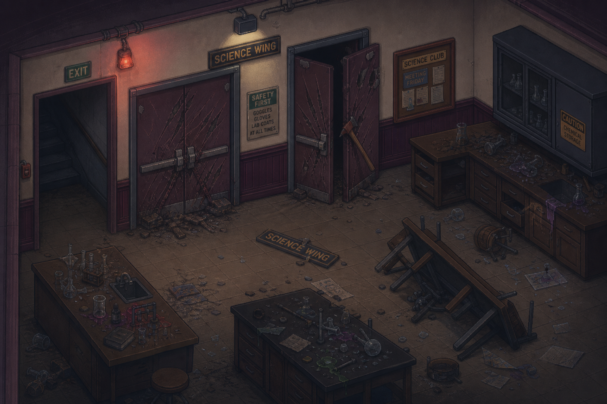

  > AI-generated room concept (2026-08-13).
- **The PA / Principal's Office.** Opened with the Principal's Office Key. Principal Diane
  Ashford's own desk, the PA control panel used for every announcement in "Outbreak Night," and a
  recording of her final, unanswered broadcast (beat 28). The **Founder's Hall Key** is found here.

  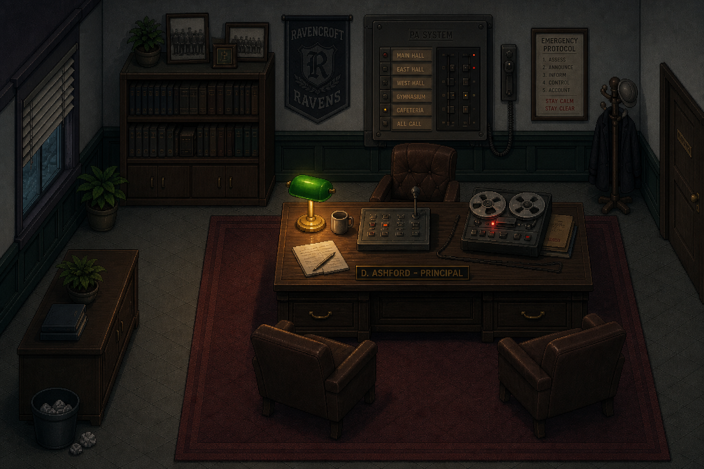

  > AI-generated room concept (2026-08-13). Non-canonical generation error: the wall banner reads
  > "Ravencroft Ravens" — the same recurring AI mis-naming seen elsewhere; the school is **Worthy
  > Academy** and has no established mascot. Ignore the banner text.
- **Founder's Hall.** Opened with the Founder's Hall Key. A small trophy/alumni hall — display
  cases of school history, old photographs, and (per [`CANON.md`](../CANON.md)) the short
  founding-record document explaining the five founders/five emblems system. A glass case holds
  the **Knowledge Crest**: a bronze, wedge-shaped medallion bearing a relief portrait of **Eleanor
  Worthy**, her name and title, and a torch emblem. The direct payoff of this district's entire
  loop, matching the Old Station House, St. Dymphna Chapel, and Founder's Boardroom convention
  exactly.

  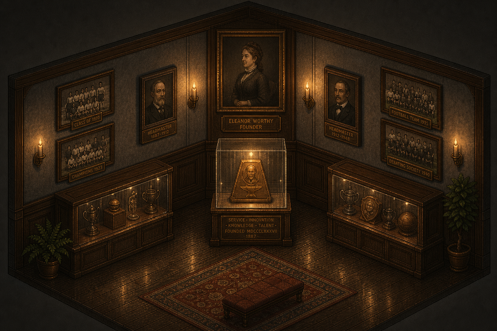

  > AI-generated room concept (2026-08-13).
- **The Maintenance Escape Corridor.** Past Founder's Hall, a service corridor toward a rear exit —
  the route teachers and custodians used to move children out during the final stand (beat 29). A
  mandatory, non-combat story beat reached only after the Knowledge Crest is already in hand,
  deliberately placed after the gameplay reward rather than gating it, same convention as the
  Foundry's Black Vein Cavern. A dropped police badge and its accompanying note — *"If they make it
  out, that's enough"* — mark where the last officer stayed behind. Whether the group made it out
  is deliberately left unresolved here.

  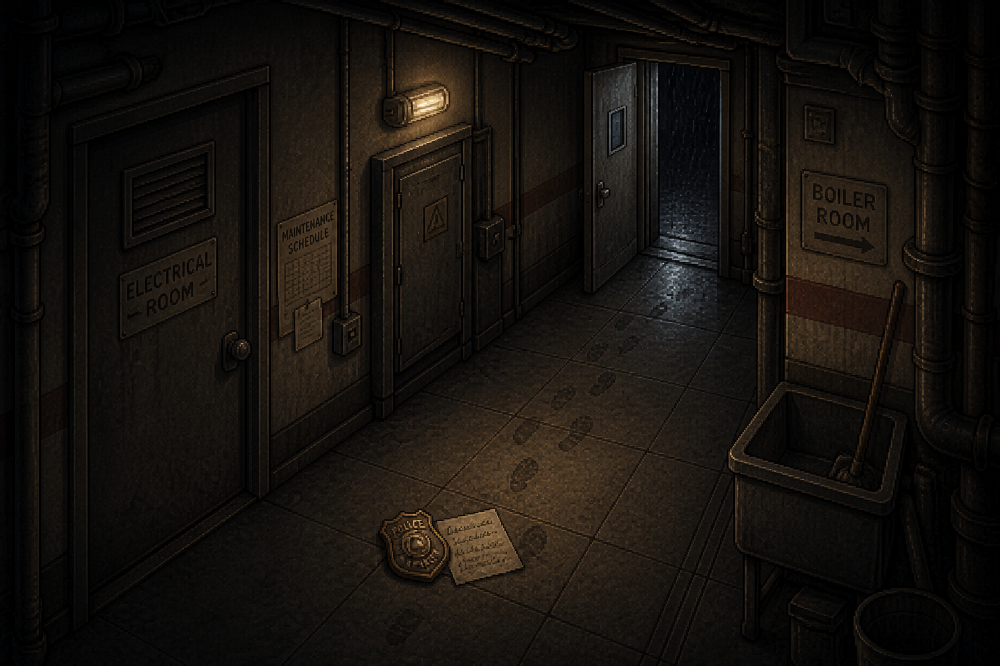

  > AI-generated room concept (2026-08-13).
- **Bus Loading Area / Front Gates.** A separate exterior area near the rear of the campus, not
  gating any of the above — where Bus One departed (beat 26). An abandoned dispatch radio still
  logs the unanswered *"Bus One, report"* call.

  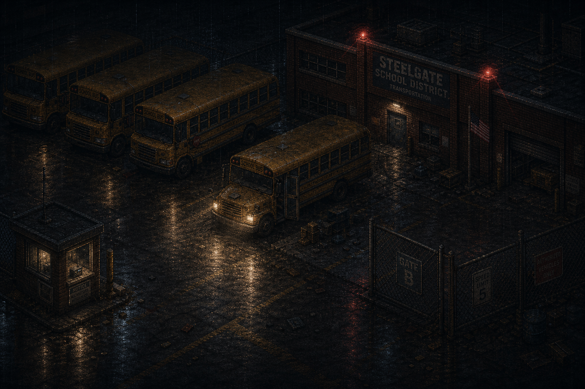

  > AI-generated room concept (2026-08-13). Non-canonical generation error: the building signage
  > reads "Steelgate School District Transportation" — Steelgate is the Foundry's own name (see
  > [`Locations/Foundry_Refinery.md`](Foundry_Refinery.md)), not a school district; ignore the
  > signage text.
- **Student Housing** (secondary, load-bearing). A small on-campus boarding building; the
  **Auditorium Key** is found here, alongside personal effects — letters home, packed bags never
  claimed — that humanize the "Harris family" and other displaced households by name.

  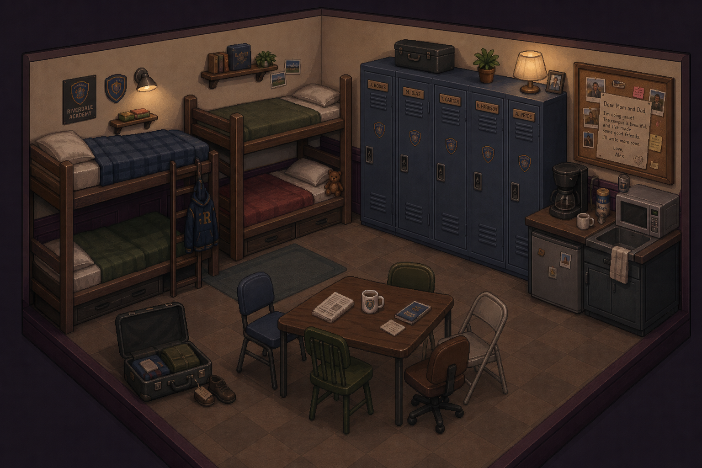

  > AI-generated room concept (2026-08-13). Non-canonical generation error: locker/wall signage
  > reads "Riverdale Academy" — the school is **Worthy Academy**; ignore the signage text.
- **Athletic Field** (secondary, load-bearing). Bleachers and an equipment shed; the **Generator
  Fuel canister** needed for the Maintenance Basement is found here.

  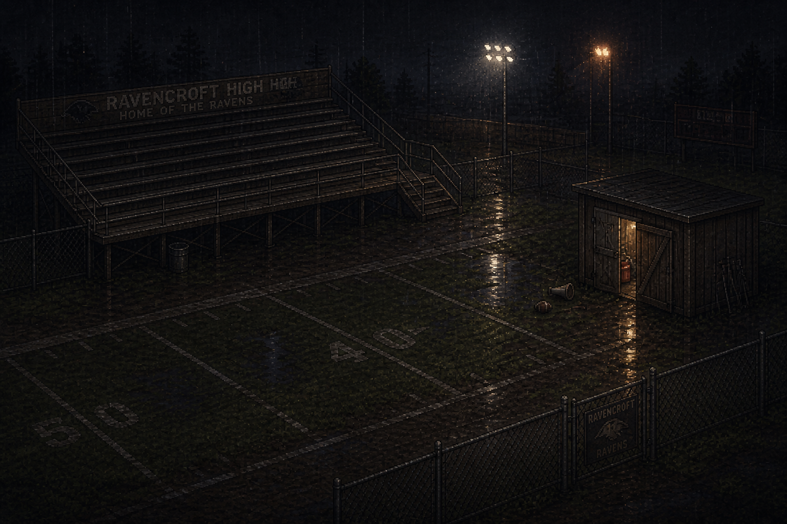

  > AI-generated room concept (2026-08-13). Non-canonical generation error: the bleacher signage
  > reads "Ravencroft High, Home of the Ravens" — the same recurring AI mis-naming seen elsewhere;
  > the school is **Worthy Academy** and has no established mascot. Ignore the signage text.
- **Playgrounds** (secondary, optional). Purely environmental — abandoned toys, a dropped stuffed
  animal, small handprints in drying mud. No key items; the district's quietest, most emotionally
  direct optional beat.

  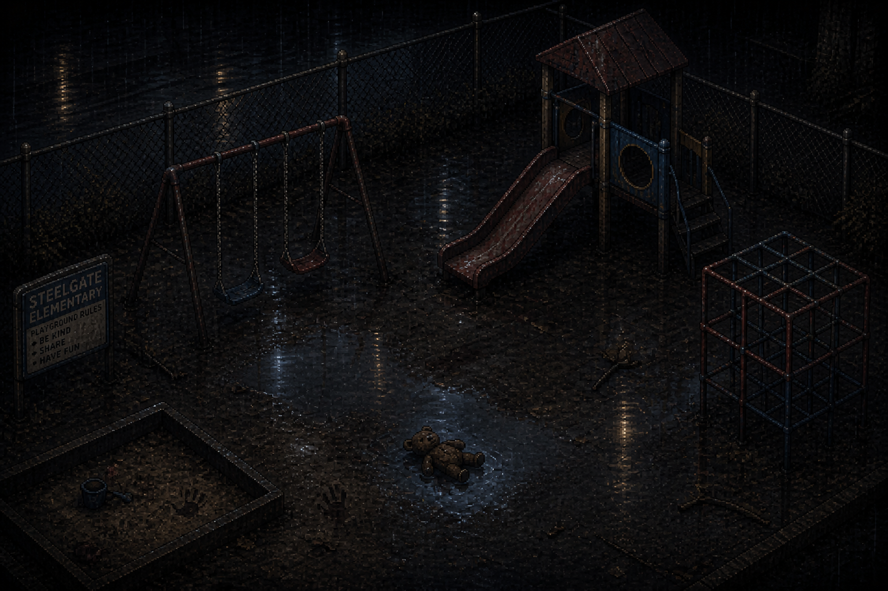

  > AI-generated room concept (2026-08-13). Non-canonical generation error: the entry sign reads
  > "Steelgate Elementary" — Steelgate is the Foundry's own name (see
  > [`Locations/Foundry_Refinery.md`](Foundry_Refinery.md)), and Worthy Academy is a K-12
  > community campus, not a separate elementary school; ignore the sign text.

## Important Rooms / Areas

**Main Building:**
- Front Entrance / Barricades (entry)
- Gymnasium (hub — visibly gates the Administration Office, Auditorium, Library, and Maintenance
  Basement from the start)
- Cafeteria (Administration Office Key; signature single encounter)
- Administration Office (locked; Isolation Wing Key)
- Isolation Wing / Nurse's Office (locked; optional Medkit)
- Auditorium (locked; needs Auditorium Key from Student Housing; Library Key)
- Library (locked; needs Library Key from the Auditorium)
- Maintenance Basement (locked; needs Generator Fuel from the Athletic Field; Fire Axe)
- East Academic Wing / Science Rooms (jammed fire doors; needs Fire Axe; signature pack encounter;
  Principal's Office Key)
- PA / Principal's Office (locked; needs Principal's Office Key; Founder's Hall Key)
- Founder's Hall (locked; needs Founder's Hall Key; KNOWLEDGE CREST)
- Maintenance Escape Corridor (mandatory story beat, reached past Founder's Hall; no lock, no
  combat)
- Bus Loading Area / Front Gates (exterior; non-gating)

**Secondary Locations (district, not the main campus building):**
- Student Housing (load-bearing: Auditorium Key)
- Athletic Field (load-bearing: Generator Fuel)
- Playgrounds (optional: environmental storytelling only)

## Blueprint (Room Connectivity)

> Not a to-scale architectural floor plan — a **relational** diagram of how rooms connect, same
> convention as [`Locations/Ravenwood_Hotel.md`](Ravenwood_Hotel.md),
> [`Locations/Police_Station.md`](Police_Station.md), [`Locations/Hospital.md`](Hospital.md), and
> [`Locations/Foundry_Refinery.md`](Foundry_Refinery.md). Split into one diagram per
> building/branch; read top to bottom. Solid arrows are direct, always-available connections;
> dashed arrows are gated behind a story condition.
>
> Legend: 👤 NPC · ☠️ enemy/infected/boss · 🗝️ key item · 📄 document · 🔧 manual/mechanical
> (non-power) puzzle · 🚪 gate/access control/shortcut.
>
> **Shape/color key** — same as the other three main locations:
>
> - 🟣 **rectangle, purple** — a room with actual content.
> - 🟡 **pill/stadium, amber** — a hallway, corridor, or crossover — a pure connector.
> - 🔴 **rectangle, red** — a boss/signature-encounter room.
> - 🔵 **pill, blue** — exterior space.
> - ⚪ **dashed grey pill** — a pointer back to a node defined in full on another diagram.

### 1. District Entry → Front Entrance → Gymnasium (hub)

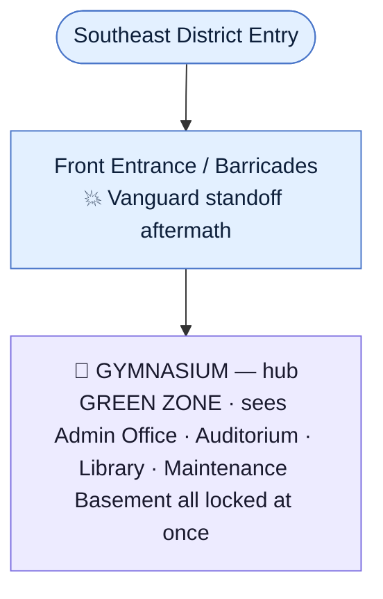
```mermaid
flowchart TD
    ENTRY(["Southeast District Entry"])
    FRONT["Front Entrance / Barricades<br/>💥 Vanguard standoff aftermath"]
    GYM["🏫 GYMNASIUM — hub<br/>GREEN ZONE · sees Admin Office · Auditorium · Library · Maintenance Basement all locked at once"]

    ENTRY --> FRONT --> GYM

    classDef room fill:#EDEBFF,stroke:#7C6EE0,color:#1a1a2e
    classDef exterior fill:#E3F0FF,stroke:#4A76C9,color:#0d1f3a
    class ENTRY,FRONT exterior
    class GYM room
```

### 2. The Administration / Isolation Chain (branches off the Gymnasium)

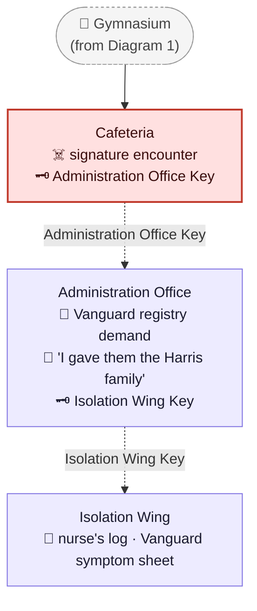
```mermaid
flowchart TD
    GYMREF(["🏫 Gymnasium<br/>(from Diagram 1)"])
    CAFE["Cafeteria<br/>☠️ signature encounter<br/>🗝️ Administration Office Key"]
    ADMIN["Administration Office<br/>📄 Vanguard registry demand<br/>📄 'I gave them the Harris family'<br/>🗝️ Isolation Wing Key"]
    ISO["Isolation Wing<br/>📄 nurse's log · Vanguard symptom sheet"]

    GYMREF --> CAFE
    CAFE -. Administration Office Key .-> ADMIN
    ADMIN -. Isolation Wing Key .-> ISO

    classDef room fill:#EDEBFF,stroke:#7C6EE0,color:#1a1a2e
    classDef boss fill:#FFE0E0,stroke:#C0392B,color:#3a0d0d,stroke-width:2px
    classDef ref fill:#F5F5F5,stroke:#999999,color:#444444,stroke-dasharray:3 3
    class GYMREF ref
    class ADMIN,ISO room
    class CAFE boss
```

### 3. The Auditorium / Library Chain (branches off the Gymnasium)

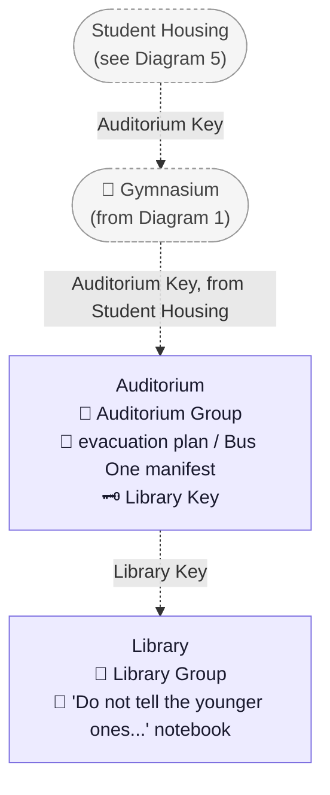
```mermaid
flowchart TD
    GYMREF2(["🏫 Gymnasium<br/>(from Diagram 1)"])
    HOUSINGREF(["Student Housing<br/>(see Diagram 5)"])
    AUD["Auditorium<br/>👤 Auditorium Group<br/>📄 evacuation plan / Bus One manifest<br/>🗝️ Library Key"]
    LIB["Library<br/>👤 Library Group<br/>📄 'Do not tell the younger ones...' notebook"]

    HOUSINGREF -. Auditorium Key .-> GYMREF2
    GYMREF2 -. Auditorium Key, from Student Housing .-> AUD
    AUD -. Library Key .-> LIB

    classDef room fill:#EDEBFF,stroke:#7C6EE0,color:#1a1a2e
    classDef ref fill:#F5F5F5,stroke:#999999,color:#444444,stroke-dasharray:3 3
    class GYMREF2,HOUSINGREF ref
    class AUD,LIB room
```

### 4. The Deep Chain — Maintenance Basement → East Wing → Founder's Hall → the Escape Corridor

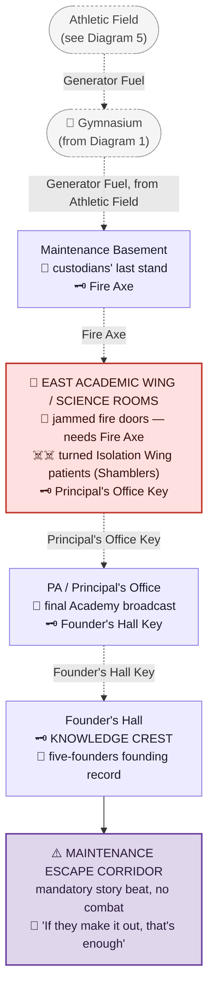
```mermaid
flowchart TD
    GYMREF3(["🏫 Gymnasium<br/>(from Diagram 1)"])
    FIELDREF(["Athletic Field<br/>(see Diagram 5)"])
    BASEMENT["Maintenance Basement<br/>👤 custodians' last stand<br/>🗝️ Fire Axe"]
    EASTWING["🔴 EAST ACADEMIC WING / SCIENCE ROOMS<br/>🔧 jammed fire doors — needs Fire Axe<br/>☠️☠️ turned Isolation Wing patients (Shamblers)<br/>🗝️ Principal's Office Key"]
    PAOFFICE["PA / Principal's Office<br/>📄 final Academy broadcast<br/>🗝️ Founder's Hall Key"]
    HALL["Founder's Hall<br/>🗝️ KNOWLEDGE CREST<br/>📄 five-founders founding record"]
    CORRIDOR["⚠️ MAINTENANCE ESCAPE CORRIDOR<br/>mandatory story beat, no combat<br/>📄 'If they make it out, that's enough'"]

    FIELDREF -. Generator Fuel .-> GYMREF3
    GYMREF3 -. Generator Fuel, from Athletic Field .-> BASEMENT
    BASEMENT -. Fire Axe .-> EASTWING
    EASTWING -. Principal's Office Key .-> PAOFFICE -. Founder's Hall Key .-> HALL --> CORRIDOR

    classDef room fill:#EDEBFF,stroke:#7C6EE0,color:#1a1a2e
    classDef boss fill:#FFE0E0,stroke:#C0392B,color:#3a0d0d,stroke-width:2px
    classDef ref fill:#F5F5F5,stroke:#999999,color:#444444,stroke-dasharray:3 3
    classDef vanguard fill:#E0D6EC,stroke:#6A3FA0,color:#2a1a3a,stroke-width:2px
    class GYMREF3,FIELDREF ref
    class BASEMENT,PAOFFICE,HALL room
    class EASTWING boss
    class CORRIDOR vanguard
```

### 5. Secondary Locations + Bus Loading Area (reached from the District Entry)

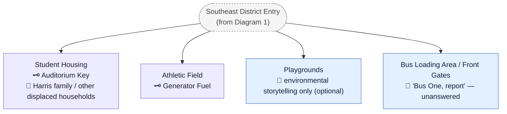
```mermaid
flowchart TD
    ENTRYREF(["Southeast District Entry<br/>(from Diagram 1)"])
    HOUSING["Student Housing<br/>🗝️ Auditorium Key<br/>📄 Harris family / other displaced households"]
    FIELD["Athletic Field<br/>🗝️ Generator Fuel"]
    PLAYGROUND["Playgrounds<br/>📄 environmental storytelling only (optional)"]
    BUS["Bus Loading Area / Front Gates<br/>📄 'Bus One, report' — unanswered"]

    ENTRYREF --> HOUSING
    ENTRYREF --> FIELD
    ENTRYREF --> PLAYGROUND
    ENTRYREF --> BUS

    classDef room fill:#EDEBFF,stroke:#7C6EE0,color:#1a1a2e
    classDef exterior fill:#E3F0FF,stroke:#4A76C9,color:#0d1f3a
    classDef ref fill:#F5F5F5,stroke:#999999,color:#444444,stroke-dasharray:3 3
    class ENTRYREF ref
    class HOUSING,FIELD room
    class PLAYGROUND,BUS exterior
```

## Characters Encountered

- **Principal Diane Ashford** — never seen alive or dead; known entirely through her office, the
  PA recordings, and her final broadcast. Her ultimate fate is deliberately unresolved, same
  convention as Daniel Fitch and the Police Station's Chief.
- The Harris family, the Auditorium Group, the Library Group, and the last defensive stand's
  officer are all referenced through documents/environmental storytelling only — per the project
  owner's explicit direction that this location's horror is told through people rather than a
  single named antagonist or survivor.

## Creatures Encountered

- **[Shamblers](../Creatures/Shambler.md)** only — the Cafeteria's single signature encounter and
  the East Academic Wing's pack encounter. No new creature type is introduced for this district
  (see "The East Academic Wing / Science Rooms," above, and "Unresolved Ideas," below) — a
  deliberate choice consistent with the project owner's framing that the Academy's horror is about
  people, not a new monster.

## Puzzles

- **The Gymnasium hub.** Four visibly locked/barricaded points (Administration Office, Auditorium,
  Library, Maintenance Basement) are all seen at once before any of them can be opened — same "see
  the shape of what's left to solve" convention as the other three main locations.
- **The Cafeteria → Administration → Isolation Wing key chain.** A straightforward single-purpose
  lock-and-key sequence revealing the Vanguard registry/Harris family material.
- **The Student Housing → Auditorium → Library chain.** The Auditorium Key can't be found inside
  the main building at all — a deliberate district-wide backtrack, mirroring the Foundry's Loading
  Docks and the Hospital's Medical Arts Building conventions. The Library Key is then found inside
  the Auditorium itself, a short internal follow-up step.
- **The Athletic Field → Maintenance Basement → East Wing chain.** Generator Fuel is likewise found
  at a separate secondary location, and the Fire Axe recovered in the Basement is needed to force
  the East Wing's jammed doors — the second deliberate district-wide backtrack.
- **The East Wing → Principal's Office → Founder's Hall → Escape Corridor chain.** The Knowledge
  Crest, and the Maintenance Escape Corridor beyond it, are only reachable after clearing the
  district's signature pack encounter, keeping the emblem — and the location's emotional climax —
  behind the deepest, most-gated point, per the design standard.

## Key Items

- **Administration Office Key** (_no `Items/` writeup yet_) — the Cafeteria; opens the
  Administration Office.
- **Isolation Wing Key** (_no `Items/` writeup yet_) — the Administration Office; opens the
  Isolation Wing.
- **Auditorium Key** (_no `Items/` writeup yet_) — Student Housing (secondary location); opens the
  Auditorium.
- **Library Key** (_no `Items/` writeup yet_) — the Auditorium; opens the Library.
- **Generator Fuel** (_no `Items/` writeup yet_) — Athletic Field (secondary location); opens the
  Maintenance Basement.
- **Fire Axe** (_no `Items/` writeup yet_) — the Maintenance Basement; forces the East Academic
  Wing's jammed fire doors.
- **Principal's Office Key** (_no `Items/` writeup yet_) — dropped after clearing the East
  Academic Wing's pack encounter; opens the PA / Principal's Office.
- **Founder's Hall Key** (_no `Items/` writeup yet_) — the PA / Principal's Office; opens
  Founder's Hall.
- **Knowledge Crest** (_no `Items/` writeup yet_) — the district's founder's emblem; Founder's
  Hall display case.

> None of this district's key items have their own `Items/` writeup yet, same status as the
> Hospital's and Foundry's own new key items — see "Unresolved Ideas," below.

### Documents

- **The shelter registration rosters and Vanguard's registry demand** (Administration Office) —
  names, addresses, medical conditions, employment, hospitalization history; Foundry employees
  specifically flagged.
- **"I gave them the Harris family." "All three."** (Administration Office) — the guarding
  officer's own note, written after learning what Vanguard actually does with the people it takes.
- **Vanguard's symptom checklist for shelter staff** (Isolation Wing) — fever, confusion,
  unexplained bleeding, violent behavior, severe muscle spasms, unusual wound healing.
- **The Academy nurse's log** (Isolation Wing) — ending on *"Everything I was trained to do may be
  making them worse."*
- **The evacuation plan and Bus One passenger manifest** (Auditorium).
- **The teacher's notebook** (Library) — *"Do not tell the younger ones the police are gone." "They
  keep asking when their parents are coming." "I don't know what to tell them anymore."*
- **The INSIDE / HOSPITAL / POLICE / MISSING / UNKNOWN boards** (Gymnasium) — names crossed out,
  moved, and annotated throughout the night.
- **Principal Ashford's final broadcast recording** (PA / Principal's Office) — *"This is
  Ravenwood Academy emergency shelter. We have civilians remaining inside. We have children here."
  "Any Ravenwood unit receiving, please respond."* Nothing. *"Anybody?"* Static. Also recorded,
  unanswered, at the Police Station — see "Documents" crossover note in
  [`Locations/Police_Station.md`](Police_Station.md).
- **The five-founders founding-record document** (Founder's Hall) — per
  [`CANON.md`](../CANON.md), the in-world explanation of the emblem system, deliberately housed
  here as the game's clearest single explanation of the mechanic.
- **The dropped police badge and note** (Maintenance Escape Corridor) — *"If they make it out,
  that's enough."*
- **"Bus One departing with thirty-two." / "Bus One, report." / "Bus One?"** (Bus Loading Area) —
  unanswered.
- **Personal effects naming displaced households, including the Harrises** (Student Housing,
  optional) — humanizes the family removed in beat 8.

## Major Scripted Events

- The Vanguard standoff aftermath at the Front Entrance (environmental, on arrival).
- The Cafeteria → Administration → Isolation Wing key chain, revealing the Vanguard registry scheme
  and the Harris family's removal.
- The Student Housing → Auditorium → Library backtrack, revealing the Library Group and evacuation
  planning.
- The Athletic Field → Maintenance Basement → East Wing backtrack, culminating in the pack fight.
- Retrieving the Knowledge Crest from Founder's Hall.
- The mandatory, non-combat Maintenance Escape Corridor beat — the location's true emotional
  climax, occurring after the crest is already collected, with the surviving group's fate left
  open.

## Boss Encounters

- No unique named boss is proposed for this district (matching the Foundry's own status) — the
  East Academic Wing's Shambler pack fills that structural role. Consistent with the project
  owner's framing that this location shouldn't introduce a new monster; flagged as an open design
  gap below rather than invented without support from the source material.

## Crest Progression

Source of the **Knowledge Crest** (Southeast / KNOWLEDGE wedge / Torch symbol — see
[`CANON.md`](../CANON.md) → "The Founders & the Five Crests"). Can be returned to the Founders
Memorial any time Jim backtracks to Memorial Park; not forced immediately after pickup.

## Exit / Progression to Next Area

Once the Knowledge Crest is collected, the East Wing's pack encounter cleared, and the Maintenance
Escape Corridor witnessed, Jim is free to head to the one remaining district (the Monastery,
Faith Crest) or backtrack to Memorial Park.

## Unresolved Ideas

- **This entire district is a first draft, pending review** — same status the Foundry, Hospital,
  and (originally) the Police Station had before their own reviews/restructures were approved.
- None of the nine new key items above have individual `Items/Key_Items/` writeups yet — proposed
  as a future pass alongside the Foundry's and Hospital's own still-pending `Items/` audits.
- Whether Bus One's fate (and the fate of the last defensive stand's escape group through the
  Maintenance Escape Corridor) should ever be resolved elsewhere in the game, or remain permanently
  ambiguous — explicitly left open per the source material's own framing ("whether that escape
  group succeeds doesn't have to be answered immediately... it can become something Jim discovers
  later").
- No unique named boss creature or new creature type is proposed for this district (see "Boss
  Encounters" and "Creatures Encountered," above) — deliberate, per the project owner's framing,
  but flagged in case that's reconsidered later for pacing reasons (every other Chapter 2 main
  location has at least a proposed signature creature beyond standard Shamblers).
- Whether Principal Diane Ashford deserves her own dedicated `Characters/` file (matching Aaron
  Cole's and Daniel Fitch's treatment) rather than being described only within this location file —
  not done here, consistent with how the Police Station's Chief and the Hospital's Vanguard
  Liaison were also left undocumented outside their own location files.
- Full scene-by-scene scripting into a `Scripts/` file — everything above is at the
  location-design/prose level, matching where the Foundry and Hospital stood before their own
  (still-pending) scripting passes.
- The Harris family — introduced here purely as an environmental-storytelling detail (a name on a
  note) — could be expanded into a fuller subplot later if useful, but is not proposed as a named
  `Characters/` entry at this time.
