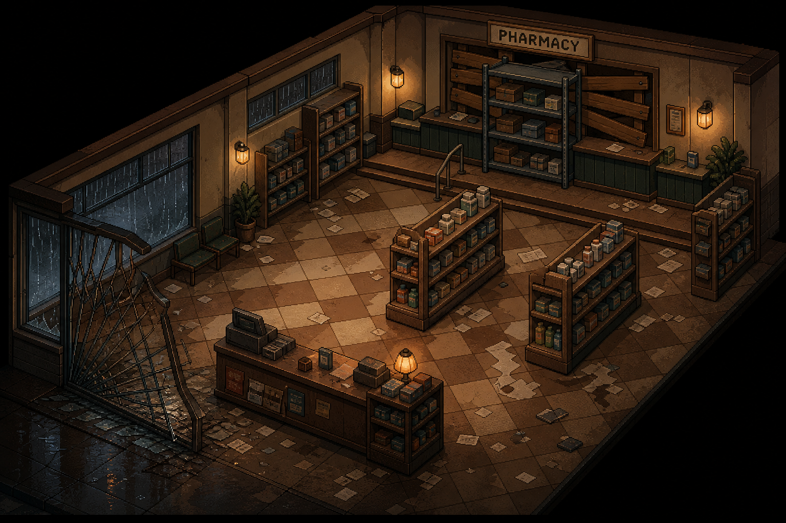
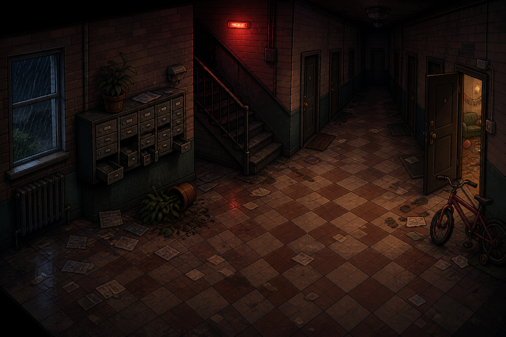

# Downtown Ravenwood

> The Downtown intro stretch of Chapter 2 — Pearl's Diner, the Ravenwood Pharmacy, the Ravenwood
> Public Library, Riverside Apartments, and City Hall. Unlike the five main districts, Downtown is
> a short, **linear** stretch (no keys, no backtracking, no crest) — the story's first look at the
> wider city, between Memorial Park and the open-order district phase. See
> [`Locations/Memorial_Park.md`](Memorial_Park.md) for the park itself, which this file picks up
> immediately after.

## Purpose in the Overall Story

The player's first extended look at Ravenwood beyond the hotel and the park — ordinary civic and
residential buildings (a diner, a pharmacy, a library, an apartment building, a government
building) that establish the city as a real, lived-in place before Jim ever reaches the five
open-order districts. Each stop plants a specific piece of foreshadowing (the library's Black Vein
survey map and North Ridge animal-death clipping; the pharmacy's unmarked bulk-order requisitions;
City Hall's official emergency-response recordings) without yet explaining what any of it means.
Two of the five stops (the Pharmacy and Riverside Apartments) are optional detours off the main
linear path rather than mandatory stops, giving Downtown its first bit of texture beyond a straight
hallway between three fixed points.

## Arrival / Setup

Jim reaches Downtown immediately after lowering Memorial Park's street bollards — see
[`Locations/Memorial_Park.md`](Memorial_Park.md) → "Exit / Progression to Next Area". The scale of
the outbreak becomes visible for the first time: swinging traffic lights (some still cycling,
others dead), a car alarm wailing somewhere deeper in the city, smoke rising from a building two
streets east.

## Storyline

- **Pearl's Diner.** A classic 24-hour roadside diner on the corner of Main Street and Caldwell
  Avenue — neon sign still buzzing unevenly, front windows partially shattered, door hanging open.
  Recently abandoned rather than long-dead: coffee cups still on the counter, a half-eaten plate at
  a booth, a jukebox still quietly cycling through songs. A handwritten note taped to the register
  explains the owner left to check on a specific family on Dellwood Street. Supplies available:
  food items, a Medkit behind the counter, a flashlight in the lost-and-found box.

  

  > AI-generated room concept (2026-08-14). Matches the scripted checkerboard floor, neon "Pearl's
  > Diner" signage, counter stools, and jukebox closely — the diner's name rendered correctly and
  > legibly, unlike several earlier districts' recurring AI naming errors.
- **The Ravenwood Pharmacy** (secondary, optional). A small independent pharmacy half a block off
  Main Street, security gate pried open at one corner. Home to **Marcus Feld**, the pharmacist,
  barricaded behind the pharmacy counter's own pass-through window — Downtown's first live NPC. He
  describes an unnamed "research contractor" (unmistakably Vanguard, though he never confirms the
  name) buying sedatives and anti-inflammatories in bulk, cash, no patient name on file, for months
  before the outbreak. Points Jim toward a walk-in cooler holding a sealed requisition log that
  cross-references a purchase order also seen at Steelgate Refinery — a small, concrete link between
  the Foundry's decades-long exploitation and Downtown's own ordinary commercial life.

  

  > AI-generated room concept (2026-08-14), matching the elevated 3/4 top-down perspective and
  > diamond-tiled floor established by
  > [`Assets/Reference/police_station_bullpen_concept.png`](../Assets/Reference/police_station_bullpen_concept.png).
- **The Ravenwood Public Library.** A 1930s civic building on Jefferson Street, one door hanging
  open. Dark except for red emergency exit lighting; tall shelves cast long shadows over an
  overturned reading room. The reference section at the rear holds the first hint of Black Vein by
  name: a geological survey map of the mountain region with tunnel sections circled in red pen and
  clinical marginal notes, plus a bound newspaper archive whose most recent edition reports the
  Steelgate Refinery's "temporary closure" and unusual animal deaths near North Ridge — both later
  confirmed as real warning signs rather than coincidence (see
  [`Locations/Foundry_Refinery.md`](Foundry_Refinery.md) and
  [`Locations/Police_Station.md`](Police_Station.md) → "The Interview Room").

  

  > AI-generated room concept (2026-08-14). Matches the scripted overturned reading tables,
  > scattered books, librarian's cart, and children's reading corner closely.
- **Riverside Apartments** (secondary, optional). A three-story brick residential building on the
  way to City Hall — the only ordinary residential building in the entire Downtown/Memorial Park
  stretch, and a deliberate reminder that Ravenwood is a real town, not just five institutions and a
  park. No NPC and no crest-relevant item; purely atmosphere. A phone-table notepad in Apartment 2B
  logs a family's last attempts to reach anyone ("Mom — no answer," "911 — busy," repeated) trailing
  into an illegible scrawl. The building superintendent's master keys open Apartment 3F, the
  building's one hostile encounter (1–2 Shamblers) and the clearest sign of what actually happened
  inside an ordinary Ravenwood home that night.

  

  > AI-generated room concept (2026-08-14), matching the elevated 3/4 top-down perspective and
  > diamond-tiled floor established by
  > [`Assets/Reference/police_station_bullpen_concept.png`](../Assets/Reference/police_station_bullpen_concept.png).
- **City Hall.** Dominates the north end of the downtown plaza — stone columns, wide steps, a flag
  still flying from the rooftop in the storm. The main entrance is barricaded from the inside with
  visible furniture; a side maintenance entrance remains accessible. Inside: a locked mayor's office
  (second floor, key required, not yet recovered), a city council chamber, and a basement emergency
  operations room still partially active on backup power — active radio equipment, a hand-drawn
  evacuation-route whiteboard with every route crossed out one by one, and a personal recorder left
  on the desk holding Deputy Administrator Carl Hess's three audio-log entries tracking the official
  government response collapsing in real time.

  

  > AI-generated room concept (2026-08-14). Matches the scripted barricaded main lobby, Council
  > Chambers signage, and the Emergency Operations room's crossed-out evacuation-route whiteboard
  > closely.

## Important Rooms / Areas

- Pearl's Diner (supplies: food, Medkit, flashlight)
- Ravenwood Pharmacy (secondary, optional — Marcus Feld; walk-in cooler stash)
- Ravenwood Public Library (lore: geological survey map, newspaper archive)
- Riverside Apartments (secondary, optional — Apartment 2B, superintendent's office, Apartment 3F)
- City Hall — Main Lobby (barricaded), Council Chambers, Mayor's Office (locked, key not yet
  recovered), Emergency Operations Room (basement, active radio + audio log)

## Characters Encountered

- **Marcus Feld** — the Ravenwood Pharmacy's pharmacist, barricaded behind his own counter.
  Downtown's first live NPC; a one-scene flavor character, not a conditional survivor with an
  alive/dead branch — he stays exactly where Jim finds him.

## Creatures Encountered

- **Standard infected ("Shamblers")**, residential clothing — 1–2 in Riverside Apartments'
  Apartment 3F, the only combat encounter in this stretch.

## Puzzles

None — this is a deliberately linear, non-gated stretch. No keys, no locks, no backtracking; the
one locked door (the Mayor's Office) is left unresolved rather than turned into a puzzle here. The
Pharmacy and Riverside Apartments are optional detours off the linear path, not puzzles.

## Key Items

- **Building Master Keys** (no `Items/` writeup yet) — Riverside Apartments' superintendent's
  office; opens every apartment in the building, including 3F.

### Documents

- Pearl's own handwritten note (register) — she went to check on the Hargrove family on Dellwood
  Street.
- Sealed requisition log (Ravenwood Pharmacy, walk-in cooler) — months of unmarked bulk sedative/
  anti-inflammatory orders against a purchase-order number also seen at Steelgate Refinery.
- Geological survey map (library reference section) — Black Vein circled by name, in a precise,
  clinical hand predating the outbreak.
- Bound *Ravenwood Gazette* newspaper archive (library reference section) — "STEELGATE REFINERY
  ANNOUNCES TEMPORARY CLOSURE" and "UNUSUAL ANIMAL DEATHS REPORTED NEAR NORTH RIDGE," both dated
  three weeks before the outbreak.
- Phone-table notepad (Riverside Apartments, Apartment 2B) — a family's last attempted calls, the
  final line trailing into an illegible scrawl.
- Superintendent's maintenance logbook (Riverside Apartments) — its last entries quietly describe
  what became of Apartment 3F.
- Carl Hess's three-entry audio log (City Hall, Emergency Operations Room) — the official
  government response, ending on Deadlock Protocol's authorization.
- Hand-drawn evacuation-route whiteboard (City Hall, Emergency Operations Room) — every route
  crossed out, one by one.

## Major Scripted Events

- Meeting Marcus Feld at the Ravenwood Pharmacy and finding the requisition log in the walk-in
  cooler — Downtown's own small piece of the Vanguard-purchasing-pattern puzzle.
- Reading the geological survey map and newspaper archive at the library — the game's first
  explicit, in-world mention of "Black Vein" by name.
- Clearing Riverside Apartments' Apartment 3F (1–2 Shamblers) — Downtown's only combat encounter.
- Playing Carl Hess's audio log at City Hall — the last official government account of the night,
  ending mid-collapse.

## Boss Encounters

None.

## Crest Progression

Not applicable — Downtown is not one of the five crest districts.

## Exit / Progression to Next Area

After City Hall, Jim leaves the downtown grid and reaches the Southwest District — see
[`Scripts/Chapter_2_Ravenwood.md`](../Scripts/Chapter_2_Ravenwood.md), Scene 23, continuing into
[`Scripts/Chapter_2_Police_Station.md`](../Scripts/Chapter_2_Police_Station.md).

## Unresolved Ideas

- The Mayor's Office (City Hall, second floor) is locked and its key never recovered anywhere in
  the currently-written material — a deliberate loose end, not yet decided whether it should ever
  be opened.
- Whether Marcus Feld (Pharmacy) should ever get a return visit or conditional alive/dead state
  like the districts' Tier 2/2b survivors — currently a deliberate one-scene flavor NPC, kept
  simple on purpose since Downtown isn't one of the five crest districts.
- Whether the Hendersons of Riverside Apartments 3F, or the family behind Apartment 2B's phone
  notepad, deserve names/a `Characters/` file — currently deliberately anonymous, consistent with
  how the game treats most minor environmental deaths.
