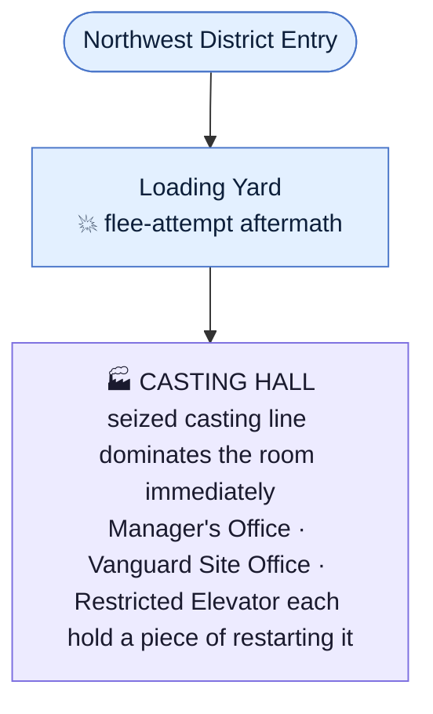
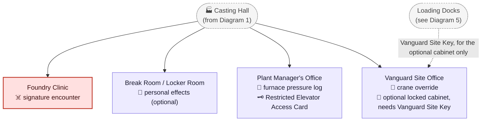
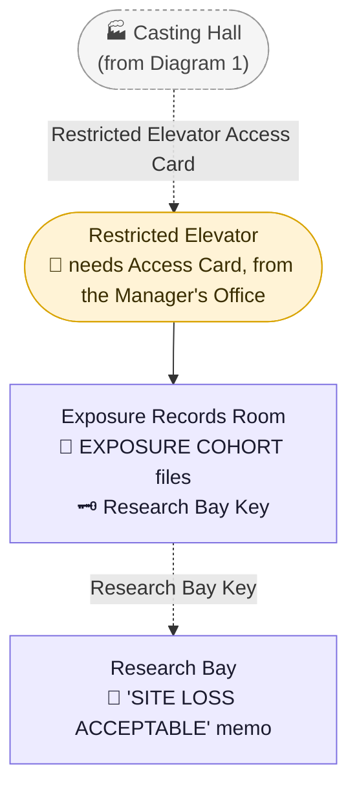
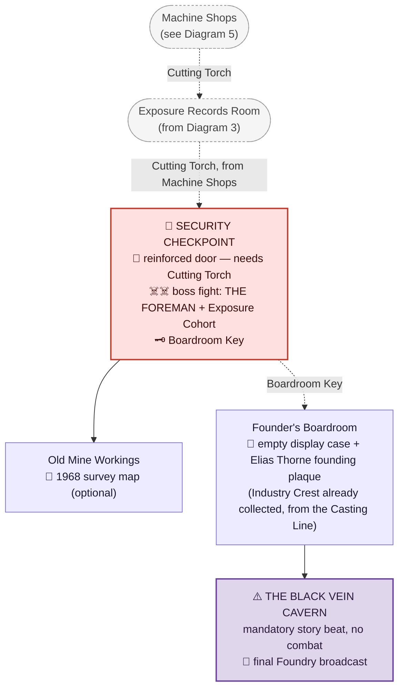

# Steelgate Refinery

> The Northwest District's main location — Industry Crest. Full scene-by-scene script:
> [`Scripts/Chapter_2_Foundry.md`](../Scripts/Chapter_2_Foundry.md). Full revision history is in
> [`STORY_NOTES.md`](../STORY_NOTES.md) rather than duplicated here.
>
> **Thematic pairing with the Police Station and Hospital:** all three Chapter 2 institutions
> experience the same night from different angles, with directly overlapping records — see
> "Outbreak Night," below, and "How the Three Outbreak Stories Connect." *Police Station: Vanguard
> turned the people protecting Ravenwood into an extension of their containment system. Hospital:
> Vanguard turned Ravenwood's injured into research assets. Foundry: Vanguard turned Ravenwood's
> workers into long-term exposure subjects and built an entire industrial operation over the
> source.* The Foundry is also where Jim learns the outbreak isn't a single bad night — Vanguard
> has been exploiting what's under Ravenwood since **1968** (see [`CANON.md`](../CANON.md) →
> "Origin of the Outbreak").
>
> **Puzzle mechanic: the Casting Puzzle.** See "The Casting Line," below, and
> [`CANON.md`](../CANON.md) → "Five Puzzle Philosophies."

## Purpose in the Overall Story

The Northwest District's main "mansion/RPD"-style location: the Casting Hall's own seized machinery
is the district's centerpiece from the moment Jim finds it, and reaching the **Industry Crest**
means physically operating the plant's own casting line to free it from a seized mold, not
assembling a matching set of keys. Where the Police Station and Hospital each discover Vanguard's betrayal over the course of
one night, the Foundry is where Jim learns the betrayal is decades old — Steelgate Refinery is the
closest civilian-industrial site to the natural cave system containing Black Vein itself, and
Vanguard has used it as a controlled access point into those caverns since 1968, studying both the
vein and the workers above it the entire time.

## Outbreak Night — What Actually Happened

> Framing: the Foundry is where the outbreak **physically breaks
> containment** — the Police Station sees the consequences, the Hospital receives the injured,
> but the Foundry is where it starts. Almost everything below is meant to be reconstructed by Jim
> from logs, lockers, records, and the building itself. This timeline is the master reference
> behind the specific documents/details placed in `Storyline`, below.

1. **Before the outbreak, the Foundry is already compromised.** Decades of Vanguard research
   contracts, excavation equipment, funded ventilation systems, and reinforced underground access
   culminated in sections of the oldest mine workings being declared "structurally unsafe" and
   sealed from ordinary employees — they weren't unsafe, they led toward Black Vein. Workers saw
   sealed ore containers, Vanguard medical personnel, armed security, refrigerated transport
   trucks, and colleagues reassigned without explanation, and management always had an answer:
   government contract, hazardous materials, experimental metallurgy, trade secrets. Most learned
   not to ask.
2. **The workers were part of the research.** Every employee's "generous" mandatory annual
   occupational-health exams (bloodwork, lung imaging, neurological/hearing testing, bone-density
   scans, questionnaires about headaches, insomnia, aggression, strange dreams, unexplained
   wounds) were Vanguard measuring chronic, low-level Black Vein exposure. Employees were sorted
   into **EXPOSURE COHORTS** — Vanguard knew who was exposed, how much, for how long, and which
   ones were beginning to change. Nobody was ever warned.
3. **The storm begins.** A reduced overnight shift works through the severe weather. Underground
   crews report equipment behaving strangely; restricted-level sensors give conflicting readings.
   Then an unfamiliar alarm sounds below ground — not the normal evacuation siren, a Vanguard one —
   followed by a deep underground impact workers feel through the floor. Machinery shuts down; the
   lights flicker red; the restricted elevator begins ascending on its own.
4. **The first men come up from below.** Several workers and two Vanguard personnel emerge,
   several badly injured (a compound fracture, severe burns, one nearly unresponsive). One keeps
   repeating *"Close the shaft."* Everyone assumes a cave-in. Management calls emergency services —
   one of the first major industrial-casualty calls Ravenwood dispatch receives that night.
5. **Vanguard issues the first containment order: DO NOT EVACUATE.** Framed as protecting
   Ravenwood from a chemical release. Exterior gates lock, vehicle access is restricted,
   ventilation switches to emergency circulation. Management complies — at first.
6. **Ambulances arrive before Vanguard does.** Injured workers are loaded for St. Dymphna Hospital;
   police arrive to help. Foundry security logs *"Ambulance Three departed with four
   casualties"*; hospital intake logs *"Ambulance Three arrived with two."* The missing patients
   were removed at a Vanguard checkpoint en route; paramedics were ordered not to interfere. See
   "How the Three Outbreak Stories Connect," below.
7. **Something is wrong with the injured.** A fractured leg changes shape; a burn heals far too
   fast; a lost pulse returns. The onsite nurse calls the hospital, then Vanguard — who tells her
   *"Do not administer further treatment."* Her first real suspicion: these people are dying, and
   Vanguard doesn't want them treated.
8. **The restricted lower levels go silent.** Workers assigned there stop responding; cameras fail
   one by one; the lower elevator stops answering. A trapped worker reaches the surface by phone,
   terrified — something moving through the tunnels, people attacking each other, someone
   screaming behind a sealed door, Vanguard security shooting workers — before the line cuts out.
   Vanguard's next order: **NO PERSONNEL ARE TO ENTER THE LOWER SHAFTS.** No explanation given.
9. **Workers attempt to leave.** Rumors spread; people hear gunfire underground and notice the
   front gates locked. A muster-area order holds for about five minutes before workers start
   forcing doors open. A group heading for the Loading Yard is stopped by Vanguard security —
   first with warnings, then weapons. These are factory workers trying to go home, and Vanguard is
   pointing rifles at them.
10. **The plant manager begins questioning Vanguard.** [Daniel Fitch](../CANON.md) has cooperated
    with Vanguard for years, believing it was legitimate research. He asks the Vanguard liaison
    what happened underground — no answer — then why they aren't evacuating. *"Evacuation poses an
    unacceptable contamination risk."* He looks out at hundreds of workers and asks *"Contamination
    risk to who?"* No answer. This is the moment he understands Vanguard is willing to sacrifice
    everyone inside the Foundry.
11. **The first full mutation occurs** in first aid: an already-injured worker's body tries to
    regenerate, incorrectly — bone thickening, muscle developing unpredictably, old wounds
    reopening. Still conscious and recognizing the people around him, he lashes out once the pain
    overwhelms him; security shoots him, which only accelerates the process further. Workers
    realize, in real time, that hurting these people may be making it worse — information that
    reaches Ravenwood Memorial through a frantic call and helps the hospital's own independent
    discovery of Ashen regeneration (see [`Locations/Hospital.md`](Hospital.md), beat 7).
12. **Vanguard arrives in force — not to rescue.** Containment teams secure restricted elevators,
    research samples, data servers, Black Vein shipments, Ashen personnel, and specific
    high-priority exposed workers pulled from groups by name and restrained. A supervisor
    recognizes the names: employees who'd received repeated "follow-up" exams. The health program
    was never about worker safety.
13. **The police grow suspicious.** Officers see Vanguard removing people with no explanation and
    are told not to let more injured workers leave. RPD is still cooperating with Vanguard at this
    point, reluctantly — *"Foundry requesting additional ambulances." "Negative. Vanguard
    containment directive now active." "I've got thirty injured people here." "I know."* See "How
    the Three Outbreak Stories Connect," below.
14. **Workers discover the underground Vanguard facility.** A group breaking into a restricted
    service corridor finds decontamination chambers, biological sampling and restraint equipment,
    tissue-storage containers, employee exposure profiles, Black Vein photographs, and Ashen
    documentation — including one worker's own twelve-year blood-test history, behavioral-change
    notes, bone abnormalities, and exposure estimates. Vanguard has known for years and simply kept
    measuring.
15. **The manager orders an evacuation.** The plant-wide intercom: *"All employees evacuate
    immediately. Ignore Vanguard instructions. Use any available exit."* Vanguard security tries
    to regain control; some Foundry security side with Vanguard, others with the workers. The
    plant fractures internally.
16. **The lower containment seal fails.** Whatever Vanguard was containing in the caverns reaches
    the industrial levels — not one giant monster, but multiple exposed personnel, Ashen test
    organisms, and severely mutated workers. Emergency blast doors begin closing; one fails, one is
    deliberately opened by trapped workers trying to escape. The outbreak moves upward — the
    moment Ravenwood's disaster stops being containable at all.
17. **The Foundry sends a warning Ravenwood never fully receives.** Someone in the restricted area
    gets access to Vanguard's own communications and learns Vanguard knew the containment system
    was failing before the first public emergency call. The manager transmits to police: *"This is
    not a chemical spill." "Vanguard knew." "The mine is the source."* The transmission cuts out;
    only fragments are recorded at the station — a piece of the puzzle the police never had time
    to understand.
18. **The highway lockdown begins.** As Foundry personnel flee, Vanguard escalates containment
    citywide — the order police receive to raise roadblocks and prevent civilians from leaving
    town (see [`Locations/Police_Station.md`](Police_Station.md), beats 3 and 9). From Vanguard's
    perspective, Foundry workers may already be moving into Ravenwood, so the town itself becomes
    the containment perimeter — meaning police are unknowingly sealing the exits at the same
    moment Foundry workers are fighting to reach them.
19. **A group of workers makes it into town.** Some escape — running, driving, stealing trucks —
    reaching the hospital, reaching neighborhoods, or simply disappearing. These become some of the
    earliest heavily-exposed individuals encountered elsewhere in Ravenwood; per the project
    owner, certain creatures Jim meets later could plausibly trace back to specific Foundry
    employees (see "Unresolved Ideas," below — flagged as a strong, evocative idea, not locked to
    any specific existing creature without further review).
20. **The Foundry's final division.** By late night, the complex has split into three groups: the
    workers (trying to escape or rescue trapped coworkers), Vanguard (preserving research and
    containing exposure), and the exposed (no longer predictable — some still partially human,
    others fully mutated). The upper plant becomes a war zone while the real horror stays below.
21. **Vanguard abandons the surface facility**, withdrawing personnel and research and sealing or
    deliberately collapsing certain access tunnels, leaving workers behind. The official record:
    **"SITE LOSS ACCEPTABLE"** — not *casualties unavoidable*, not *evacuation impossible*. Jim can
    find this exact phrase later (see "Documents," below).
22. **The last Foundry broadcast**, from the manager or a surviving foreman, not knowing if
    anyone's listening: *"Anyone receiving this, stay away from the Foundry. Whatever Vanguard
    tells you, don't come down here."* A long pause. *"They didn't find this thing tonight. They've
    been digging at it for years."* Static.

## How the Three Outbreak Stories Connect

> Per the project owner's explicit request: all three Chapter 2 institutions should feel like one
> continuous catastrophe experienced from different angles, discovering different pieces of the
> same truth at roughly the same time, none of them with enough information to stop it. Roughly
> chronological pairing across all three "Outbreak Night" timelines:

| Foundry | Hospital | Police Station |
|---|---|---|
| "We've had an underground accident. Multiple casualties." | "We are receiving Foundry workers with unexplained trauma." | "Vanguard has requested containment of industrial casualties." |
| "Vanguard is preventing evacuation." | "Vanguard is removing patients without destination records." | "All units enforce Vanguard containment procedures." |
| "Vanguard knew." | "These injuries are regenerating." | "Disregard Vanguard orders." |

See "Documents," below, and [`Locations/Hospital.md`](Hospital.md) /
[`Locations/Police_Station.md`](Police_Station.md) for the specific found documents that realize
this table in-game.

## Arrival / Setup

- Steelgate Refinery is visible from a distance: smokestacks, most dark now, one still faintly
  glowing from residual heat; warning lights still rotating through smoke-hazed rooms; some
  machinery audibly still running on old industrial backup power. A looping automated announcement
  echoes across the yard: *"Attention. Evacuate via nearest marked exit. This is not a drill."* —
  looping long after anyone was left to hear it the first time.
- The **Loading Yard** approach shows the aftermath of Outbreak Night beat 9: scattered tools and
  personal effects dropped mid-flight, a chain-link gate forced open, spent shell casings, and at
  least one body in Vanguard-marked tactical gear alongside several in Foundry work uniforms —
  neither side "won" this particular confrontation cleanly.
- Signs throughout the plant point downward — **LOWER PROCESSING**, **AUTHORIZED PERSONNEL ONLY**,
  **GEOLOGICAL ACCESS**, **VANGUARD RESTRICTED AREA** — deliberately building curiosity about what's
  underneath the plant well before Jim can act on it.

## The Casting Line

The Industry Crest is mounted in the plant's ceremonial first-casting mold, sealed inside a seized
mold carriage since Vanguard shut off the underground level. Jim doesn't manufacture the crest — he
operates the abandoned casting line well enough to free it.

The line runs Ore Hopper → Furnace → Casting Ladle → Mold/Cooling Line, in four physical stages
rather than a fetch quest, and **the three rooms this district used to gate with separate keys are
now the source of what each stage needs**, so operating the line and exploring the plant are the
same activity rather than a key-chain bolted onto a puzzle:

1. **Restore furnace fuel flow** through manual gas valves, watching pressure — too much trips a
   safety relief, too little won't sustain the burner. The safe operating range comes from the
   **Plant Manager's Office**, where Daniel Fitch's own furnace inspection log (filed alongside the
   Vanguard confrontation transcript) records it.
2. **Operate the overhead crane** by hand (left/right, forward/back, lower/raise, its shadow
   visibly sweeping the floor) to position the casting ladle over the seized mold's receptacle. The
   crane's manual override — normally locked out for safety — is in the **Vanguard Site Office**,
   alongside the 1968 contracts that explain why a corporate office needed its own crane control in
   the first place.
3. **Heat the mold** just enough to expand the collar holding the crest assembly, not enough to
   melt anything important.
4. **Engage the cooling line** — water blasts the casting bed, thermal contraction snaps the
   collar, and the ancient mold separates. The **Restricted Elevator** shaft is where the cooling
   main was deliberately shut off when Vanguard sealed the underground level; riding it down far
   enough to reopen the valve is what makes this stage possible at all.

Beneath the machinery, once it's done: a descending geological access shaft — Steelgate wasn't
built here because Ravenwood needed a foundry. The foundry exists here because of what was
underneath it.

## Storyline

> All room concepts below use the elevated 3/4 top-down perspective with diamond-rotated floor
> tiles established by
> [`Assets/Reference/police_station_bullpen_concept.png`](../Assets/Reference/police_station_bullpen_concept.png)
> and consistently read "Steelgate Refinery." Per-image notes below are limited to non-canonical
> generation errors worth flagging.

- **The Loading Yard.** Entry point; the aftermath described above. Idle forklifts block parts of
  the yard, forcing a slightly indirect path toward the plant's main entrance.

  
- **The Casting Hall.** The seized casting line dominates the room from the moment Jim steps in —
  cold conveyor lines, a dead overhead crane frozen mid-swing, and the ceremonial mold carriage
  itself, locked solid, radiating leftover heat from whatever last happened here. It's obviously
  the point of the room before Jim understands anything else about it. The Plant Manager's Office,
  the Vanguard Site Office, and the Restricted Elevator all lead off from here, each holding a
  piece of what it'll take to get the line running again; unlocked doorways lead to the Foundry
  Clinic and the Break Room.

  
- **The Foundry Clinic.** Small on-site first aid room; a restraint gurney with a single tough
  Shambler-tier encounter (Outbreak Night beat 11's worker, fully turned by the time Jim arrives),
  a wall phone still connected, and the nurse's own log of her calls to the hospital and to
  Vanguard.

  
- **The Break Room / Locker Room.** Rows of employee lockers, several forced open, personal
  effects scattered — family photos, half-eaten lunches, a birthday card. One locker, tagged with
  a name matching the exposure-records reveal below, holds a personal note about worsening
  headaches and joint pain the employee never reported to a real doctor. Optional Medkit and
  supplies.

  
- **The Plant Manager's Office.** Unlocked, off the Casting Hall. Daniel Fitch's own desk: the
  confrontation transcript with the Vanguard liaison (*"Contamination risk to who?"*), the intercom
  control he used to order the evacuation, and the **Restricted Elevator Access Card** — left here
  deliberately once he decided to stop protecting Vanguard's access. A furnace inspection log
  clipped to a maintenance clipboard, easy to overlook next to the transcript, records the casting
  line's safe operating pressure — the number the Casting Hall's own gauges don't explain on their
  own.

  
- **The Vanguard Site Office.** Unlocked, off the Casting Hall — a separate, out-of-place corporate
  office within the industrial plant, same "incongruous" visual language as the Police Station's
  Vanguard Liaison Office. Contains decades of research contracts, funding records for the
  "structurally unsafe" mine seals, and the earliest dated correspondence establishing 1968 as when
  this operation began, plus a locked-out manual override for the Casting Hall's overhead crane,
  installed so Vanguard could move equipment through the plant without going through the foreman. A
  separate locked filing cabinet in the corner (optional; **Vanguard Site Key**, found at the
  secondary Loading Docks location) holds nothing the casting puzzle needs — just deeper Vanguard
  paperwork, a bonus-lore backtrack rather than a critical-path gate.

  
- **The Restricted Elevator.** Card-reader lock; opened with the Access Card from the Manager's
  Office. Descends into the Vanguard-controlled underground levels — the architectural transition
  is immediate and deliberate: industrial brick and steel giving way to sterile reinforced
  concrete within a few dozen feet. A manual valve beside the shaft, tagged and chained shut, is
  where Vanguard cut the casting line's cooling water when it sealed this level — reopening it is
  what lets the line run at all.

  
- **The Exposure Records Room.** Unlocked once underground. Rows of employee files organized by
  **EXPOSURE COHORT** rather than name or department — blood tests spanning up to twelve years,
  behavioral-change notes, bone-density scans, exposure-duration estimates. This is where Jim (and
  the player) can find a specific worker's full file, the same reveal described in Outbreak Night
  beat 14. The **Research Bay Key** is found in an unlocked drawer here.

  
- **The Research Bay.** Opened with the Research Bay Key. Decontamination equipment, biological
  sampling stations, restraint equipment, and tissue-storage containers — the underground
  counterpart to the Hospital's Laboratory. Also holds the **"SITE LOSS ACCEPTABLE"** internal
  memo (Outbreak Night beat 21).

  
- **The Security Checkpoint.** A reinforced door blocks the passage toward the Lower Processing
  corridor; forcing it requires the **Cutting Torch**, found at the secondary Machine Shops
  location (see below) — a second deliberate district-wide backtrack. Beyond it: this district's
  signature pack encounter, **[the Exposure Cohort](../Creatures/Exposure_Cohort.md)** — several
  chronically-exposed workers who finished transforming together on Outbreak Night. Clearing it
  yields the **Boardroom Key**.

  
- **The Old Mine Workings** (optional detour off the Lower Processing corridor). Older, rougher
  tunnels than the rest of the underground level — the "structurally unsafe" sections from
  Outbreak Night beat 1. Optional supplies and a faded 1968-dated survey map showing the earliest
  Vanguard excavation routes.

  
- **The Founder's Boardroom.** Opened with the Boardroom Key. A small, incongruously formal room
  this deep underground — a long table, portraits of past Refinery leadership, and a glass display
  case, empty, its felt backing showing the wedge-shaped outline of what used to sit there. A small
  founding plaque beside it names **Elias Thorne**, his title, and an anvil emblem — the Industry
  Crest itself isn't here anymore; per "The Casting Line," above, it's already in Jim's hands by
  the time he reaches this room, freed from the seized mold back at the Casting Hall rather than
  found behind glass down here. Reaching this room is still worthwhile — Thorne's own history, and
  the direct route to the Black Vein Cavern beyond it.

  

  > Non-canonical generation error: the wall logo reads "STEELGATE REFINERY — EST. 1897" — per
  > [`CANON.md`](../CANON.md), Elias Thorne founded the Refinery in **1887**; ignore the render's
  > date.
- **The Black Vein Cavern.** Past the Boardroom, a short passage where all human construction
  gradually stops — reinforced concrete gives way to older mine tunnel, then bare rock, then a
  natural cave threshold. Beyond it: Black Vein itself, not contained in any lab or vessel, running
  through the cavern walls in massive, ancient-looking branching formations. A mandatory, non-
  combat story beat reached only after the Industry Crest is already in hand — the location's true
  emotional climax, deliberately placed *after* the gameplay reward rather than gating it. The
  manager's/foreman's final broadcast (Outbreak Night beat 22) can be found/heard here.

  

  > Per [`CANON.md`](../CANON.md) → "Origin of the Outbreak," this cave system is **not** physically
  > connected to Chapter 3's facility beneath Memorial Park — Vanguard deliberately compartmentalized
  > the two access points. This room is a foreshadowing gut-punch, not a shortcut past Chapter 3.
- **The Machine Shops** (secondary, load-bearing). A separate workshop building; the **Cutting
  Torch** needed to force the Security Checkpoint is found here, mid-repair on a workbench.

  
- **The Loading Docks** (secondary, load-bearing). A separate cargo/shipping building; the
  **Vanguard Site Key** needed to open the Vanguard Site Office is found here, alongside shipment
  manifests confirming the "refrigerated transport trucks" workers noticed for years.

  
- **The Rail Yard** (secondary, optional). Tracks leading directly into the mountainside — the
  primary modern industrial access point into the Black Vein cave network, established in 1968 (not
  where Black Vein itself "entered" Ravenwood, since it's a natural formation predating any human
  contact with it — see [`CANON.md`](../CANON.md) → "Origin of the Outbreak"). Optional lore/loot; a
  rusted 1968-dated rail car still sits at the tunnel mouth, sealed.

  

## Important Rooms / Areas

**Surface Plant:**
- Loading Yard (entry; flee-attempt aftermath)
- Casting Hall (the seized casting line itself, visible and central from the moment Jim enters —
  the Manager's Office, Vanguard Site Office, and Restricted Elevator each feed one stage of it)
- Foundry Clinic (unlocked; signature single encounter)
- Break Room / Locker Room (optional; personal effects; Medkit)
- Plant Manager's Office (unlocked; furnace log; Restricted Elevator Access Card)
- Vanguard Site Office (unlocked; crane override; optional locked cabinet needs Vanguard Site Key
  from the Loading Docks)

**Underground Restricted Levels:**
- Restricted Elevator (card-reader lock; needs Access Card from the Manager's Office)
- Exposure Records Room (unlocked once underground; Research Bay Key)
- Research Bay (locked; needs Research Bay Key)
- Security Checkpoint (reinforced door; needs Cutting Torch from the Machine Shops; Exposure
  Cohort pack encounter; Boardroom Key)
- Old Mine Workings (optional; off the Lower Processing corridor)
- Founder's Boardroom (locked; needs Boardroom Key; empty display case — the Industry Crest is
  already collected by this point, from the Casting Line puzzle)
- The Black Vein Cavern (mandatory story beat, reached past the Boardroom; no lock, no combat)

**Secondary Locations (district, not the main plant):**
- Machine Shops (load-bearing: Cutting Torch)
- Loading Docks (load-bearing: Vanguard Site Key)
- Rail Yard (optional: lore/loot)

## Blueprint (Room Connectivity)

> Not a to-scale architectural floor plan — a **relational** diagram of how rooms connect, same
> convention as [`Locations/Ravenwood_Hotel.md`](Ravenwood_Hotel.md),
> [`Locations/Police_Station.md`](Police_Station.md), and [`Locations/Hospital.md`](Hospital.md).
> Split into one diagram per building/branch; read top to bottom. Solid arrows are direct,
> always-available connections; dashed arrows are gated behind a story condition.
>
> Legend: 👤 NPC · ☠️ enemy/infected/boss · 🗝️ key item · 📄 document · 🔧 manual/mechanical
> (non-power) puzzle · 🚪 gate/access control/shortcut.
>
> **Shape/color key** — same as the other two main locations:
>
> - 🟣 **rectangle, purple** — a room with actual content.
> - 🟡 **pill/stadium, amber** — a hallway, corridor, or crossover — a pure connector.
> - 🔴 **rectangle, red** — a boss/signature-encounter room.
> - 🔵 **pill, blue** — exterior space.
> - ⚪ **dashed grey pill** — a pointer back to a node defined in full on another diagram.

### 1. District Entry → Loading Yard → Casting Hall (hub)

### 2. The Surface Plant (branches off the Casting Hall)

### 3. The Restricted Underground Levels (via the Restricted Elevator)

### 4. The Deep Chain — Security Checkpoint → Boardroom → the Black Vein Cavern

### 5. Secondary Locations (reached from the District Entry, not the plant directly)

## Characters Encountered

- **Plant Manager Daniel Fitch** — never seen alive or dead; known entirely through his office,
  the intercom evacuation order, and the final broadcast. His ultimate fate is deliberately
  unresolved, same convention as the Police Station's Chief.

## Creatures Encountered

- **[Shamblers](../Creatures/Shambler.md)**, themed to the plant (work coveralls) — Foundry Clinic
  (one tougher signature encounter).
- **[The Exposure Cohort](../Creatures/Exposure_Cohort.md)** — the Security Checkpoint's signature
  pack encounter; several chronically-exposed workers whose mutation is more advanced/adapted than
  a standard Shambler's, led by **The Foreman** (boss-tier — see "Boss Encounters," below).

## Puzzles

- **The Casting Puzzle (main, target design — see "The Casting Line," above).** Free the Industry
  Crest by operating the plant's furnace, crane, and cooling stages in sequence, rather than
  collecting keys — the emblem stays behind the deepest, most-gated point in the district either
  way.
- **The Loading Docks → Vanguard Site Office chain (optional).** The Vanguard Site Key opens a
  filing cabinet inside the Vanguard Site Office, not the room itself — bonus lore, not a
  critical-path requirement, matching the Police Station's own bolt-cutter chain treatment.
- **The Machine Shops → Security Checkpoint chain.** Kept as-is: the Cutting Torch needed to force
  the Security Checkpoint's reinforced door is found at a separate secondary building, independent
  of the main casting-line puzzle.
- **Per the hard rule this district now follows:** the Casting Line puzzle alone carries the
  mandatory path from the Casting Hall to the Industry Crest. The Manager's Office and Vanguard
  Site Office are unlocked rooms that feed the puzzle's stages directly; the Restricted Elevator's
  card-reader lock is the one remaining "real" gate on the critical path, and it opens with an item
  found in an already-unlocked room rather than requiring its own backtrack.

## Key Items

- **Restricted Elevator Access Card** ([full item writeup](../Items/Key_Items/Restricted_Elevator_Access_Card.md))
  — the (unlocked) Manager's Office; opens the Restricted Elevator, the district's one remaining
  "real" gate on the critical path.
- **Vanguard Site Key** ([full item writeup](../Items/Key_Items/Vanguard_Site_Key.md), optional) —
  Loading Docks (secondary location); opens a locked filing cabinet inside the (unlocked) Vanguard
  Site Office — bonus lore only.
- **Research Bay Key** ([full item writeup](../Items/Key_Items/Research_Bay_Key.md)) — the
  Exposure Records Room; opens the Research Bay.
- **Cutting Torch** ([full item writeup](../Items/Key_Items/Cutting_Torch.md)) — Machine Shops
  (secondary location); forces the Security Checkpoint's reinforced door.
- **Boardroom Key** ([full item writeup](../Items/Key_Items/Boardroom_Key.md)) — dropped after
  clearing the Exposure Cohort at the Security Checkpoint; opens the Founder's Boardroom.
- **Industry Crest** ([full item writeup](../Items/Key_Items/Industry_Crest.md)) — the district's
  founder's emblem; freed from the seized mold carriage by the Casting Line puzzle, at the Casting
  Hall — not the Founder's Boardroom, whose display case is now empty.

### Documents

- **A clipped copy of the *Ravenwood Gazette*'s "STEELGATE REFINERY ANNOUNCES TEMPORARY CLOSURE"**
  (Plant Manager's Office, optional) — the cover story Fitch's office fed the local paper three
  weeks before the outbreak; the original clipping, alongside a matching animal-death report, is
  what Jim reads first at Downtown's public library — see
  [`Locations/Downtown_Ravenwood.md`](Downtown_Ravenwood.md).
- **"EXPOSURE COHORTS" employee files** (Exposure Records Room) — years of chronic-exposure
  monitoring disguised as an occupational-health program.
- **The Fitch/Vanguard confrontation transcript** (Manager's Office) — *"Contamination risk to
  who?"*
- **The nurse's call log** (Foundry Clinic) — her calls to the hospital and to Vanguard, ending
  with *"Do not administer further treatment."*
- **1968 contracts/funding records** (Vanguard Site Office) — establishes the operation's actual
  start date; see [`CANON.md`](../CANON.md) → "Origin of the Outbreak."
- **Foundry security vs. hospital intake mismatch** ("Ambulance Three departed with four
  casualties" / "arrived with two") — a direct crossover document, the Foundry-side half of a
  discrepancy also discoverable at [`Locations/Hospital.md`](Hospital.md).
- **Dispatch radio log** ("Foundry requesting additional ambulances" / "Negative. Vanguard
  containment directive now active." / "I've got thirty injured people here." / "I know.") — the
  Foundry-side half of a crossover document also discoverable at
  [`Locations/Police_Station.md`](Police_Station.md).
- **The manager's fragmentary transmission to police** ("This is not a chemical spill." / "Vanguard
  knew." / "The mine is the source.") — cross-referenced at the Police Station as an unexplained
  fragment officers never had time to understand.
- **"SITE LOSS ACCEPTABLE" internal memo** (Research Bay) — Vanguard's own clinical framing of
  abandoning the surface facility.
- **1968 survey map** (Old Mine Workings, optional) — the earliest excavation routes toward Black
  Vein.
- **Shipment manifests** (Loading Docks, optional) — confirms the "refrigerated transport trucks"
  workers noticed for years.
- **The final Foundry broadcast** (the Black Vein Cavern) — *"They didn't find this thing tonight.
  They've been digging at it for years."*
- **A hand-drawn cave map fragment matching a tunnel junction and Vanguard access designation**
  (Old Mine Workings, optional) — the same junction an injured worker recognizes on an old
  monastery map after reaching the ridge; see [`Locations/Monastery.md`](Monastery.md), beat 13, for
  the moment the Foundry and Monastery cave systems are confirmed to be physically connected.
- **A torn evacuation slip listing a Foundry worker, his wife, and their teenage son** (Exposure
  Records Room, optional) — the Foundry-side paper trail behind the Harris family, later removed
  from Worthy Academy's shelter roster by Vanguard under "potential secondary contamination"; see
  [`Locations/Academy.md`](Academy.md), beat 8, for the guarding officer's own note: *"I gave them
  the Harris family." "All three."*

## Major Scripted Events

- The flee-attempt aftermath at the Loading Yard (environmental, on arrival).
- Gathering the furnace pressure log, the crane override, and the cooling valve across the Manager's
  Office, Vanguard Site Office, and Restricted Elevator, then running the Casting Line puzzle to
  free the Industry Crest's mold and open the way underground.
- Finding the EXPOSURE COHORTS records and realizing the "health program" was surveillance.
- The Machine Shops → Security Checkpoint backtrack, culminating in the boss fight against The
  Foreman and the rest of the Exposure Cohort.
- Reaching the Founder's Boardroom and finding Elias Thorne's history — and the empty case where
  the crest used to sit.
- The mandatory, non-combat Black Vein Cavern reveal — the location's true climax, occurring after
  the crest is already collected.

## Boss Encounters

- **The Foreman** (see [`Creatures/Exposure_Cohort.md`](../Creatures/Exposure_Cohort.md) → "The
  Foreman") — the district's boss, the longest-exposed member of the Exposure Cohort, fighting
  alongside two or three standard-tier cohort members at the Security Checkpoint rather than in a
  separate boss room.

## Crest Progression

Source of the **Industry Crest** (Northwest / INDUSTRY wedge / Anvil symbol — see
[`CANON.md`](../CANON.md) → "The Founders & the Five Crests"). Can be returned to the Founders
Memorial any time Jim backtracks to Memorial Park; not forced immediately after pickup.

## Exit / Progression to Next Area

Once the Industry Crest is collected, The Foreman and the Exposure Cohort defeated, and the Black
Vein Cavern witnessed, Jim is free to head to any of the remaining districts in any order.

## Unresolved Ideas

- Whether specific creatures Jim has already encountered elsewhere in Ravenwood should be
  explicitly traced back to named Foundry employees (per Outbreak Night beat 19's suggestion) —
  a compelling idea, explicitly **not locked to any specific existing creature** without further
  review; retrofitting an established creature's origin is a bigger canon change than adding new
  material and shouldn't happen by default.
- Whether the Zombie Conglomerate (see [`Creatures/Zombie_Conglomerate.md`](../Creatures/Zombie_Conglomerate.md))
  should be explicitly tied to the Foundry's own containment failure thematically — both involve
  Vanguard's contained research escaping catastrophically — flagged as a strong thematic fit, not
  proposed as locked canon here.
- The exact relationship between the Foundry's cave system and Chapter 3's facility beneath
  Memorial Park (both connect to Black Vein, deliberately not to each other — see "The Black Vein
  Cavern," above, and [`CANON.md`](../CANON.md)) should be kept consistent once Chapter 3 is
  actually written.
- Whether Daniel Fitch deserves his own dedicated `Characters/` file (matching Aaron Cole's
  treatment) rather than being described only within this location file — not done here, consistent
  with how the Police Station's Chief and the Hospital's Vanguard Liaison were also left
  undocumented outside their own location files.
