# Steelgate Refinery

> The Northwest District's main location — Industry Crest. Everything below is new (2026-08-13,
> proposed pending review), written to the same [`CANON.md`](../CANON.md) → "District Main-
> Location Design Standard" bar as [`Locations/Police_Station.md`](Police_Station.md) and
> [`Locations/Hospital.md`](Hospital.md): a dense, multi-key, backtracking-driven exploration
> space, targeting roughly 2–3 hours of gameplay.
>
> **Thematic pairing with the Police Station and Hospital (per the project owner's explicit
> direction):** all three Chapter 2 institutions experience the same night from different angles,
> with directly overlapping records. See "Outbreak Night," below, and "How the Three Outbreak
> Stories Connect" for the specific crossover documents. Distinguished thematically as: *"Police
> Station: Vanguard turned the people protecting Ravenwood into an extension of their containment
> system. Hospital: Vanguard turned Ravenwood's injured into research assets. Foundry: Vanguard
> turned Ravenwood's workers into long-term exposure subjects and built an entire industrial
> operation over the source."* The Foundry is also where Jim learns the outbreak isn't a single
> bad night — Vanguard has been exploiting what's under Ravenwood since **1968** (see
> [`CANON.md`](../CANON.md) → "Origin of the Outbreak").
>
> **Revision note (2026-08-13, same day):** the district received its full scene-by-scene
> scripting pass — see the new [`Scripts/Chapter_2_Foundry.md`](../Scripts/Chapter_2_Foundry.md)
> (17 scenes), plus new individual [`Items/Key_Items/`](../Items/Key_Items/README.md) writeups
> (and AI-generated icon concept art) for all seven of this district's key items. This is the third
> of Chapter 2's five districts to be fully scripted, after the Police Station and Hospital.
> Nothing already locked about this district's rooms, puzzles, or documents changed.

## Purpose in the Overall Story

The Northwest District's main "mansion/RPD"-style location, following the same structural rules as
the Police Station and Hospital: a central hub (the Casting Hall) visibly gates several locked
doors at once, and reaching the **Industry Crest** requires a genuine multi-key backtracking loop
across the main plant, its restricted underground levels, and three secondary locations. Where the
Police Station and Hospital each discover Vanguard's betrayal over the course of one night, the
Foundry is where Jim learns the betrayal is decades old — Steelgate Refinery is the closest
civilian-industrial site to the natural cave system containing Black Vein itself, and Vanguard has
used it as a controlled access point into those caverns since 1968, studying both the vein and the
workers above it the entire time.

## Outbreak Night — What Actually Happened (proposed 2026-08-13, pending review)

> Per the project owner's explicit framing: the Foundry is where the outbreak **physically breaks
> containment** — the Police Station sees the consequences, the Hospital receives the injured,
> but the Foundry is where it starts. Almost everything below is meant to be reconstructed by Jim
> from logs, lockers, records, and the building itself. This timeline is the master reference
> behind the specific documents/details placed in `Storyline`, below.

1. **Before the outbreak, the Foundry is already compromised.** Decades of Vanguard research
   contracts, excavation equipment, funded ventilation systems, and reinforced underground access
   culminated in sections of the oldest mine workings being declared "structurally unsafe" and
   sealed from ordinary employees — they weren't unsafe, they led toward Black Vein. Workers saw
   sealed ore containers, Vanguard medical personnel, armed security, refrigerated transport
   trucks, and colleagues reassigned without explanation, and management always had an answer:
   government contract, hazardous materials, experimental metallurgy, trade secrets. Most learned
   not to ask.
2. **The workers were part of the research.** Every employee's "generous" mandatory annual
   occupational-health exams (bloodwork, lung imaging, neurological/hearing testing, bone-density
   scans, questionnaires about headaches, insomnia, aggression, strange dreams, unexplained
   wounds) were Vanguard measuring chronic, low-level Black Vein exposure. Employees were sorted
   into **EXPOSURE COHORTS** — Vanguard knew who was exposed, how much, for how long, and which
   ones were beginning to change. Nobody was ever warned.
3. **The storm begins.** A reduced overnight shift works through the severe weather. Underground
   crews report equipment behaving strangely; restricted-level sensors give conflicting readings.
   Then an unfamiliar alarm sounds below ground — not the normal evacuation siren, a Vanguard one —
   followed by a deep underground impact workers feel through the floor. Machinery shuts down; the
   lights flicker red; the restricted elevator begins ascending on its own.
4. **The first men come up from below.** Several workers and two Vanguard personnel emerge,
   several badly injured (a compound fracture, severe burns, one nearly unresponsive). One keeps
   repeating *"Close the shaft."* Everyone assumes a cave-in. Management calls emergency services —
   one of the first major industrial-casualty calls Ravenwood dispatch receives that night.
5. **Vanguard issues the first containment order: DO NOT EVACUATE.** Framed as protecting
   Ravenwood from a chemical release. Exterior gates lock, vehicle access is restricted,
   ventilation switches to emergency circulation. Management complies — at first.
6. **Ambulances arrive before Vanguard does.** Injured workers are loaded for St. Dymphna Hospital;
   police arrive to help. Foundry security logs *"Ambulance Three departed with four
   casualties"*; hospital intake logs *"Ambulance Three arrived with two."* The missing patients
   were removed at a Vanguard checkpoint en route; paramedics were ordered not to interfere. See
   "How the Three Outbreak Stories Connect," below.
7. **Something is wrong with the injured.** A fractured leg changes shape; a burn heals far too
   fast; a lost pulse returns. The onsite nurse calls the hospital, then Vanguard — who tells her
   *"Do not administer further treatment."* Her first real suspicion: these people are dying, and
   Vanguard doesn't want them treated.
8. **The restricted lower levels go silent.** Workers assigned there stop responding; cameras fail
   one by one; the lower elevator stops answering. A trapped worker reaches the surface by phone,
   terrified — something moving through the tunnels, people attacking each other, someone
   screaming behind a sealed door, Vanguard security shooting workers — before the line cuts out.
   Vanguard's next order: **NO PERSONNEL ARE TO ENTER THE LOWER SHAFTS.** No explanation given.
9. **Workers attempt to leave.** Rumors spread; people hear gunfire underground and notice the
   front gates locked. A muster-area order holds for about five minutes before workers start
   forcing doors open. A group heading for the Loading Yard is stopped by Vanguard security —
   first with warnings, then weapons. These are factory workers trying to go home, and Vanguard is
   pointing rifles at them.
10. **The plant manager begins questioning Vanguard.** [Daniel Fitch](../CANON.md) has cooperated
    with Vanguard for years, believing it was legitimate research. He asks the Vanguard liaison
    what happened underground — no answer — then why they aren't evacuating. *"Evacuation poses an
    unacceptable contamination risk."* He looks out at hundreds of workers and asks *"Contamination
    risk to who?"* No answer. This is the moment he understands Vanguard is willing to sacrifice
    everyone inside the Foundry.
11. **The first full mutation occurs** in first aid: an already-injured worker's body tries to
    regenerate, incorrectly — bone thickening, muscle developing unpredictably, old wounds
    reopening. Still conscious and recognizing the people around him, he lashes out once the pain
    overwhelms him; security shoots him, which only accelerates the process further. Workers
    realize, in real time, that hurting these people may be making it worse — information that
    reaches Ravenwood Memorial through a frantic call and helps the hospital's own independent
    discovery of Ashen regeneration (see [`Locations/Hospital.md`](Hospital.md), beat 7).
12. **Vanguard arrives in force — not to rescue.** Containment teams secure restricted elevators,
    research samples, data servers, Black Vein shipments, Ashen personnel, and specific
    high-priority exposed workers pulled from groups by name and restrained. A supervisor
    recognizes the names: employees who'd received repeated "follow-up" exams. The health program
    was never about worker safety.
13. **The police grow suspicious.** Officers see Vanguard removing people with no explanation and
    are told not to let more injured workers leave. RPD is still cooperating with Vanguard at this
    point, reluctantly — *"Foundry requesting additional ambulances." "Negative. Vanguard
    containment directive now active." "I've got thirty injured people here." "I know."* See "How
    the Three Outbreak Stories Connect," below.
14. **Workers discover the underground Vanguard facility.** A group breaking into a restricted
    service corridor finds decontamination chambers, biological sampling and restraint equipment,
    tissue-storage containers, employee exposure profiles, Black Vein photographs, and Ashen
    documentation — including one worker's own twelve-year blood-test history, behavioral-change
    notes, bone abnormalities, and exposure estimates. Vanguard has known for years and simply kept
    measuring.
15. **The manager orders an evacuation.** The plant-wide intercom: *"All employees evacuate
    immediately. Ignore Vanguard instructions. Use any available exit."* Vanguard security tries
    to regain control; some Foundry security side with Vanguard, others with the workers. The
    plant fractures internally.
16. **The lower containment seal fails.** Whatever Vanguard was containing in the caverns reaches
    the industrial levels — not one giant monster, but multiple exposed personnel, Ashen test
    organisms, and severely mutated workers. Emergency blast doors begin closing; one fails, one is
    deliberately opened by trapped workers trying to escape. The outbreak moves upward — the
    moment Ravenwood's disaster stops being containable at all.
17. **The Foundry sends a warning Ravenwood never fully receives.** Someone in the restricted area
    gets access to Vanguard's own communications and learns Vanguard knew the containment system
    was failing before the first public emergency call. The manager transmits to police: *"This is
    not a chemical spill." "Vanguard knew." "The mine is the source."* The transmission cuts out;
    only fragments are recorded at the station — a piece of the puzzle the police never had time
    to understand.
18. **The highway lockdown begins.** As Foundry personnel flee, Vanguard escalates containment
    citywide — the order police receive to raise roadblocks and prevent civilians from leaving
    town (see [`Locations/Police_Station.md`](Police_Station.md), beats 3 and 9). From Vanguard's
    perspective, Foundry workers may already be moving into Ravenwood, so the town itself becomes
    the containment perimeter — meaning police are unknowingly sealing the exits at the same
    moment Foundry workers are fighting to reach them.
19. **A group of workers makes it into town.** Some escape — running, driving, stealing trucks —
    reaching the hospital, reaching neighborhoods, or simply disappearing. These become some of the
    earliest heavily-exposed individuals encountered elsewhere in Ravenwood; per the project
    owner, certain creatures Jim meets later could plausibly trace back to specific Foundry
    employees (see "Unresolved Ideas," below — flagged as a strong, evocative idea, not locked to
    any specific existing creature without further review).
20. **The Foundry's final division.** By late night, the complex has split into three groups: the
    workers (trying to escape or rescue trapped coworkers), Vanguard (preserving research and
    containing exposure), and the exposed (no longer predictable — some still partially human,
    others fully mutated). The upper plant becomes a war zone while the real horror stays below.
21. **Vanguard abandons the surface facility**, withdrawing personnel and research and sealing or
    deliberately collapsing certain access tunnels, leaving workers behind. The official record:
    **"SITE LOSS ACCEPTABLE"** — not *casualties unavoidable*, not *evacuation impossible*. Jim can
    find this exact phrase later (see "Documents," below).
22. **The last Foundry broadcast**, from the manager or a surviving foreman, not knowing if
    anyone's listening: *"Anyone receiving this, stay away from the Foundry. Whatever Vanguard
    tells you, don't come down here."* A long pause. *"They didn't find this thing tonight. They've
    been digging at it for years."* Static.

## How the Three Outbreak Stories Connect

> Per the project owner's explicit request: all three Chapter 2 institutions should feel like one
> continuous catastrophe experienced from different angles, discovering different pieces of the
> same truth at roughly the same time, none of them with enough information to stop it. Roughly
> chronological pairing across all three "Outbreak Night" timelines:

| Foundry | Hospital | Police Station |
|---|---|---|
| "We've had an underground accident. Multiple casualties." | "We are receiving Foundry workers with unexplained trauma." | "Vanguard has requested containment of industrial casualties." |
| "Vanguard is preventing evacuation." | "Vanguard is removing patients without destination records." | "All units enforce Vanguard containment procedures." |
| "Vanguard knew." | "These injuries are regenerating." | "Disregard Vanguard orders." |

See "Documents," below, and [`Locations/Hospital.md`](Hospital.md) /
[`Locations/Police_Station.md`](Police_Station.md) for the specific found documents that realize
this table in-game.

## Arrival / Setup

- Steelgate Refinery is visible from a distance: smokestacks, most dark now, one still faintly
  glowing from residual heat; warning lights still rotating through smoke-hazed rooms; some
  machinery audibly still running on old industrial backup power. A looping automated announcement
  echoes across the yard: *"Attention. Evacuate via nearest marked exit. This is not a drill."* —
  looping long after anyone was left to hear it the first time.
- The **Loading Yard** approach shows the aftermath of Outbreak Night beat 9: scattered tools and
  personal effects dropped mid-flight, a chain-link gate forced open, spent shell casings, and at
  least one body in Vanguard-marked tactical gear alongside several in Foundry work uniforms —
  neither side "won" this particular confrontation cleanly.
- Signs throughout the plant point downward — **LOWER PROCESSING**, **AUTHORIZED PERSONNEL ONLY**,
  **GEOLOGICAL ACCESS**, **VANGUARD RESTRICTED AREA** — deliberately building curiosity about what's
  underneath the plant well before Jim can act on it.

## Storyline

- **The Loading Yard.** Entry point; the aftermath described above. Idle forklifts block parts of
  the yard, forcing a slightly indirect path toward the plant's main entrance.

  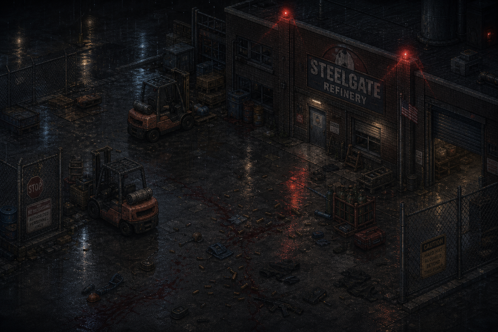

  > AI-generated room concept, regenerated 2026-08-14 (twice — first to fix a full-isometric
  > style drift, then again the same day when the second pass itself drifted too flat/eye-level;
  > this final version matches the elevated 3/4 top-down camera and diamond-tiled floor set by
  > [`Assets/Reference/police_station_bullpen_concept.png`](../Assets/Reference/police_station_bullpen_concept.png))
  > and correctly reads "Steelgate Refinery" throughout the whole regenerated set below.
- **The Casting Hall (hub).** A vast industrial floor — active conveyor lines, an idle overhead
  crane, and at least one still-molten holding vat, radiating heat and orange light across the
  room. From here, Jim can see several locked/sealed points at once: the **Plant Manager's
  Office** (keyed lock), the **Vanguard Site Office** (a separate, corporate-style lock), and the
  **Restricted Elevator** (card-reader lock). Unlocked doorways lead to the Foundry Clinic and the
  Break Room.

  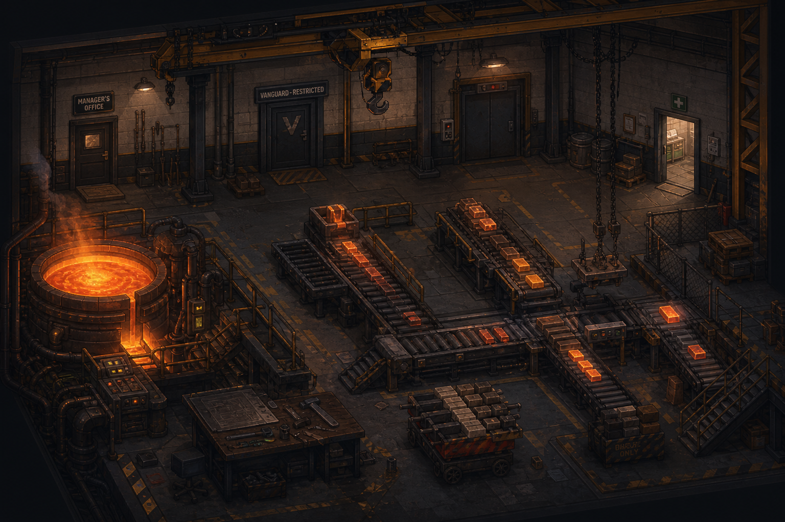

  > AI-generated room concept, regenerated 2026-08-14 (twice, same reason as the Loading Yard
  > above) — this render became the district's anchor reference for the rest of the regeneration
  > pass, now correctly showing the elevated 3/4 top-down camera and diamond floor pattern.
- **The Foundry Clinic.** Small on-site first aid room; a restraint gurney with a single tough
  Shambler-tier encounter (Outbreak Night beat 11's worker, fully turned by the time Jim arrives),
  a wall phone still connected, and the nurse's own log of her calls to the hospital and to
  Vanguard. The **Manager's Office Key** is found here, left behind mid-crisis.

  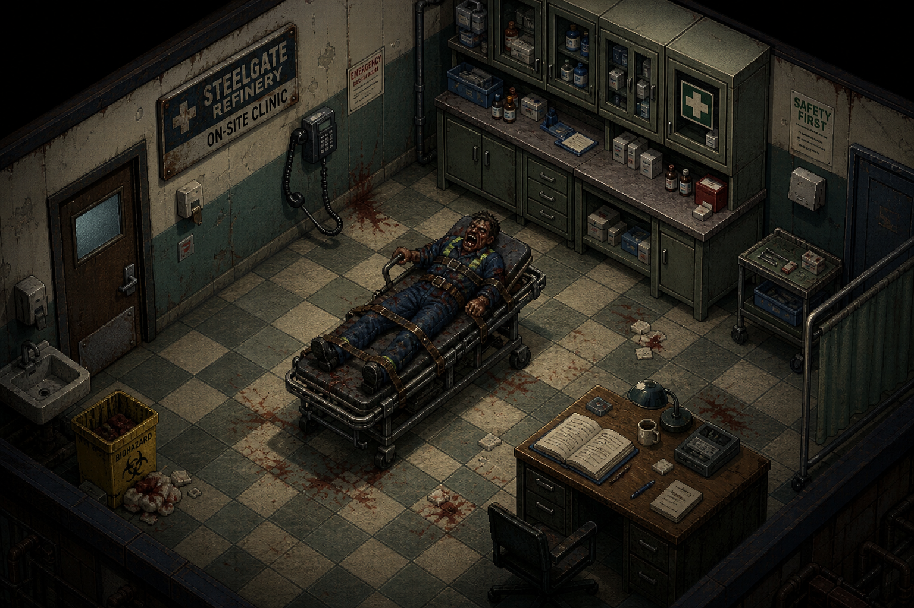

  > AI-generated room concept, regenerated 2026-08-14 (twice, same flat-camera correction as
  > above) — floor now shows a diagonal diamond-tile pattern matching the reference style.
- **The Break Room / Locker Room.** Rows of employee lockers, several forced open, personal
  effects scattered — family photos, half-eaten lunches, a birthday card. One locker, tagged with
  a name matching the exposure-records reveal below, holds a personal note about worsening
  headaches and joint pain the employee never reported to a real doctor. Optional Medkit and
  supplies.

  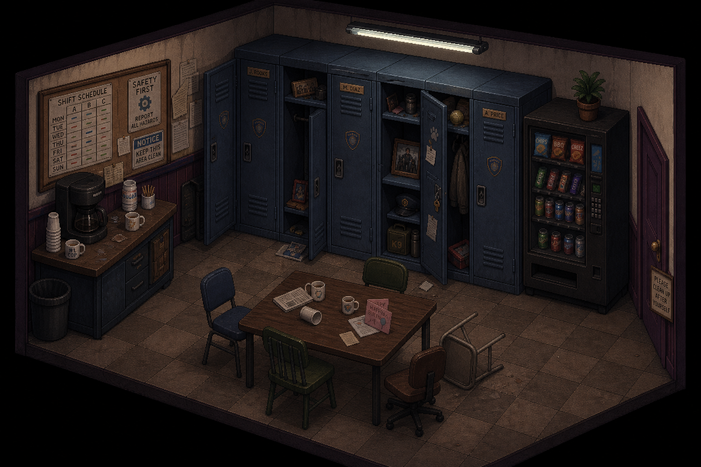

  > AI-generated room concept, regenerated 2026-08-14 (twice, same flat-camera correction as
  > above) — this pass also incidentally fixed the earlier version's non-canonical police-specific
  > set dressing (badge stickers, a "K9" locker tag); the render correctly shows industrial worker
  > effects (hard hats, work gloves, safety vests) instead.
- **The Plant Manager's Office.** Opened with the Manager's Office Key. Daniel Fitch's own desk:
  the confrontation transcript with the Vanguard liaison (*"Contamination risk to who?"*), the
  intercom control he used to order the evacuation, and the **Restricted Elevator Access Card** —
  left here deliberately once he decided to stop protecting Vanguard's access.

  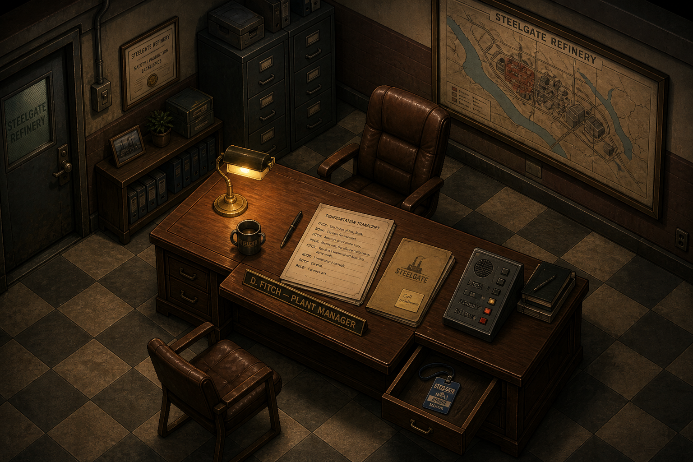

  > AI-generated room concept, regenerated 2026-08-14 (twice, same flat-camera correction as
  > above) — this pass also incidentally fixed the earlier version's wrong "Ravencroft"/wrong-date
  > wall map; the desk nameplate again correctly reads "D. FITCH — PLANT MANAGER" and the wall map
  > reads "Steelgate Refinery" with no invented date.
- **The Vanguard Site Office.** A separate, out-of-place corporate office within the industrial
  plant — same "incongruous" visual language as the Police Station's Vanguard Liaison Office.
  Opened with the **Vanguard Site Key**, found at the secondary Loading Docks location (see below)
  — a deliberate district-wide backtrack. Contains decades of research contracts, funding records
  for the "structurally unsafe" mine seals, and the earliest dated correspondence establishing
  1968 as when this operation began.

  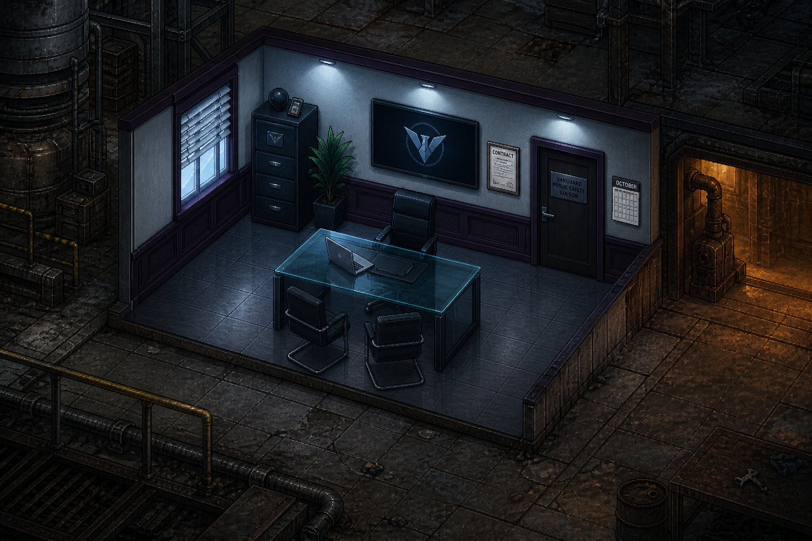

  > AI-generated room concept, regenerated 2026-08-14 (twice, same flat-camera correction as
  > above) — the sleek modern tile floor now recedes in the correct diamond pattern.
- **The Restricted Elevator.** Card-reader lock; opened with the Access Card from the Manager's
  Office. Descends into the Vanguard-controlled underground levels — the architectural transition
  is immediate and deliberate: industrial brick and steel giving way to sterile reinforced
  concrete within a few dozen feet.

  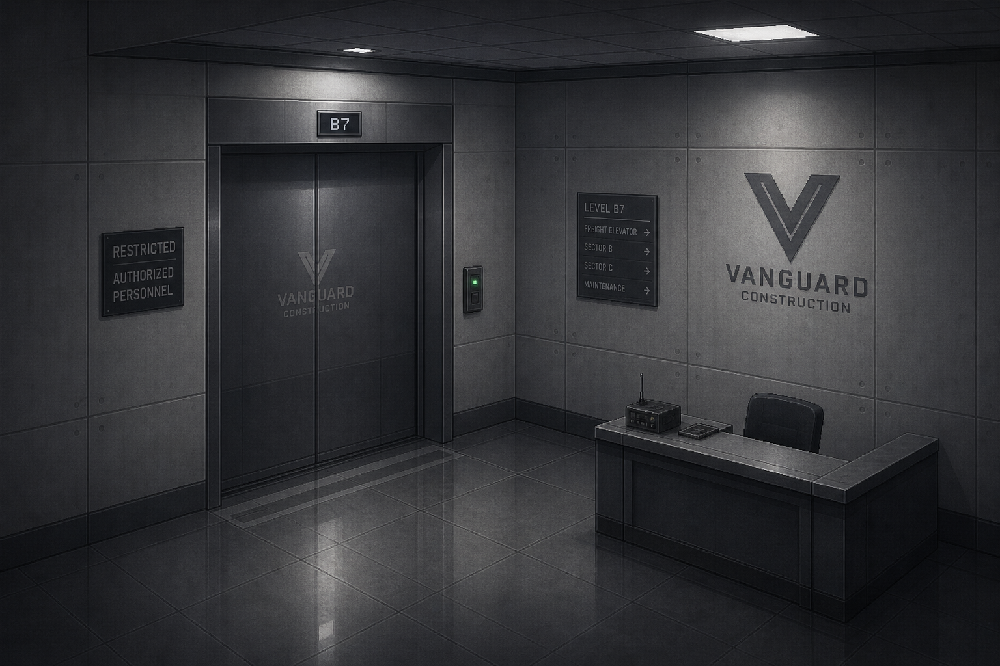

  > AI-generated room concept, regenerated 2026-08-14 (twice, same flat-camera correction as
  > above).
- **The Exposure Records Room.** Unlocked once underground. Rows of employee files organized by
  **EXPOSURE COHORT** rather than name or department — blood tests spanning up to twelve years,
  behavioral-change notes, bone-density scans, exposure-duration estimates. This is where Jim (and
  the player) can find a specific worker's full file, the same reveal described in Outbreak Night
  beat 14. The **Research Bay Key** is found in an unlocked drawer here.

  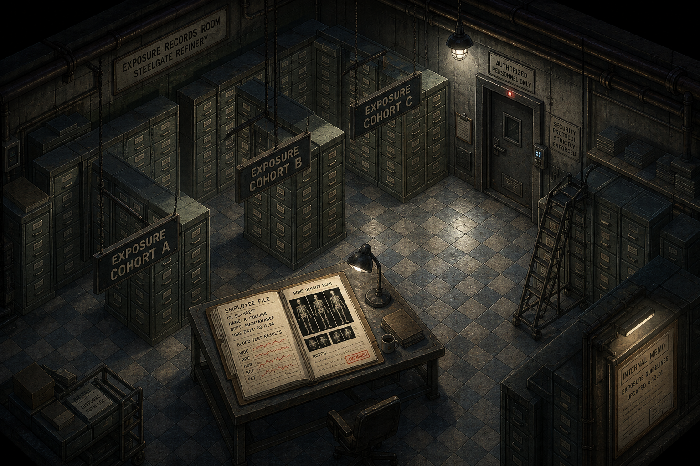

  > AI-generated room concept, regenerated 2026-08-14 (twice, same flat-camera correction as
  > above); the employee file shown uses a generic placeholder name, not a canonical character.
- **The Research Bay.** Opened with the Research Bay Key. Decontamination equipment, biological
  sampling stations, restraint equipment, and tissue-storage containers — the underground
  counterpart to the Hospital's Laboratory. Also holds the **"SITE LOSS ACCEPTABLE"** internal
  memo (Outbreak Night beat 21).

  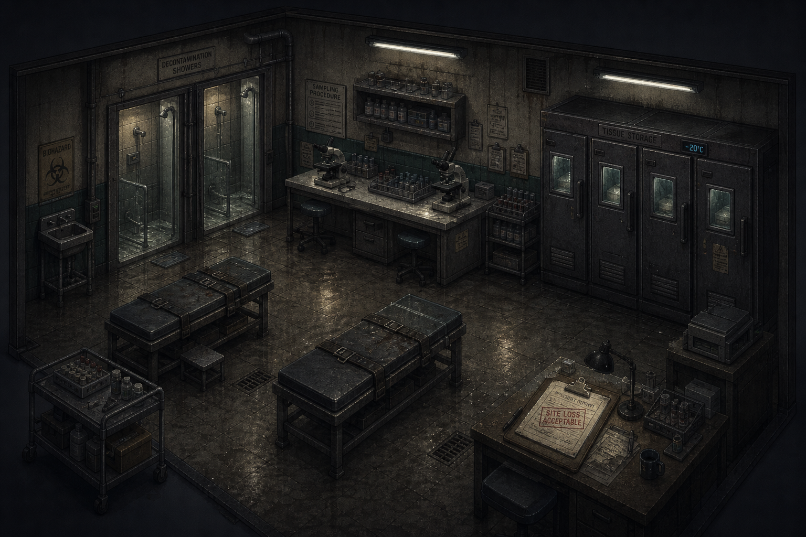

  > AI-generated room concept (2026-08-14) — already matched the elevated 3/4 top-down reference
  > style on the perspective re-audit and was not regenerated a second time.
- **The Security Checkpoint.** A reinforced door blocks the passage toward the Lower Processing
  corridor; forcing it requires the **Cutting Torch**, found at the secondary Machine Shops
  location (see below) — a second deliberate district-wide backtrack. Beyond it: this district's
  signature pack encounter, **[the Exposure Cohort](../Creatures/Exposure_Cohort.md)** — several
  chronically-exposed workers who finished transforming together on Outbreak Night. Clearing it
  yields the **Boardroom Key**.

  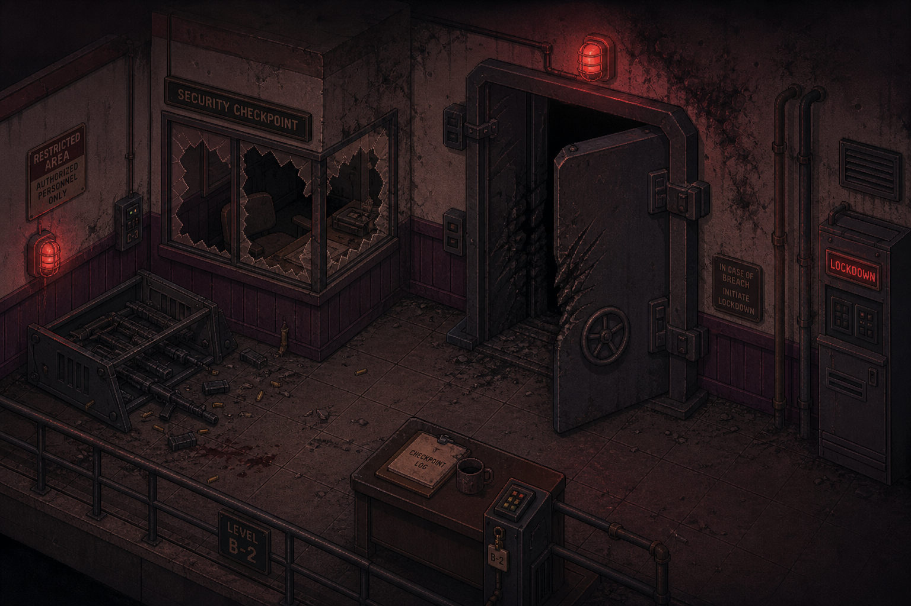

  > AI-generated room concept, regenerated 2026-08-14 (twice, same flat-camera correction as
  > above).
- **The Old Mine Workings** (optional detour off the Lower Processing corridor). Older, rougher
  tunnels than the rest of the underground level — the "structurally unsafe" sections from
  Outbreak Night beat 1. Optional supplies and a faded 1968-dated survey map showing the earliest
  Vanguard excavation routes.

  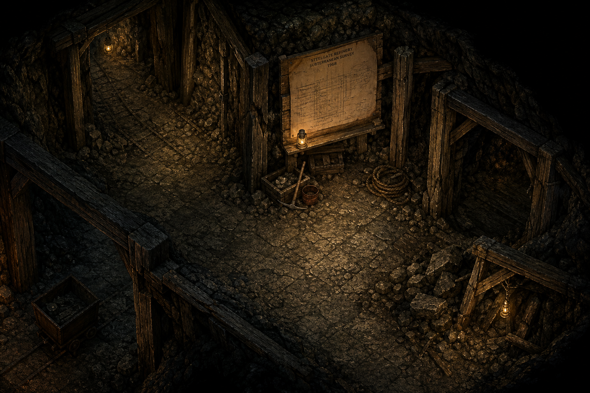

  > AI-generated room concept, regenerated 2026-08-14 (twice, same flat-camera correction as
  > above); the survey map shown is dated 1968, matching canon, with no invented names.
- **The Founder's Boardroom.** Opened with the Boardroom Key. A small, incongruously formal room
  this deep underground — a long table, portraits of past Refinery leadership, and a display case
  holding the **Industry Crest**: a bronze, wedge-shaped medallion bearing a relief portrait of
  **Elias Thorne**, his name and title, and an anvil emblem. The direct payoff of this district's
  entire loop, matching the Old Station House and St. Dymphna Chapel convention exactly.

  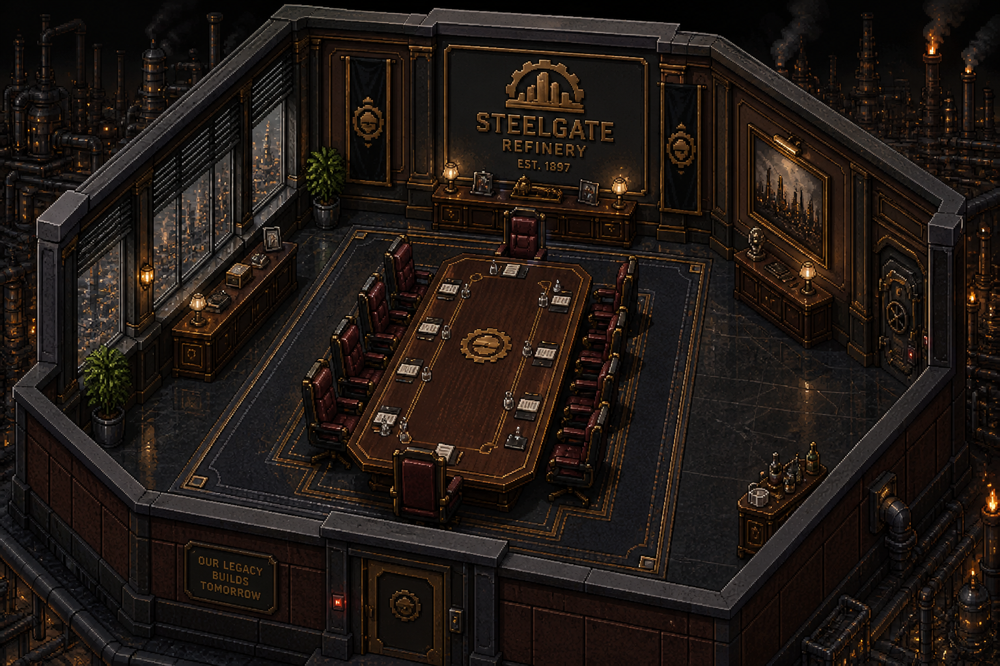

  > AI-generated room concept, regenerated 2026-08-14 (twice — first to fix a full-isometric style
  > drift, then again to fix the second pass's own flat/eye-level drift; this version matches the
  > elevated 3/4 top-down camera and diamond floor pattern). No display case or Industry Crest
  > visible in this establishing shot, and no invented founder names appear. **Flag:** the wall
  > logo reads "STEELGATE REFINERY — EST. 1897," a non-canonical date — per
  > [`CANON.md`](../CANON.md), Elias Thorne founded the Refinery in **1887**.
- **The Black Vein Cavern.** Past the Boardroom, a short passage where all human construction
  gradually stops — reinforced concrete gives way to older mine tunnel, then bare rock, then a
  natural cave threshold. Beyond it: Black Vein itself, not contained in any lab or vessel, running
  through the cavern walls in massive, ancient-looking branching formations. A mandatory, non-
  combat story beat reached only after the Industry Crest is already in hand — the location's true
  emotional climax, deliberately placed *after* the gameplay reward rather than gating it. The
  manager's/foreman's final broadcast (Outbreak Night beat 22) can be found/heard here.

  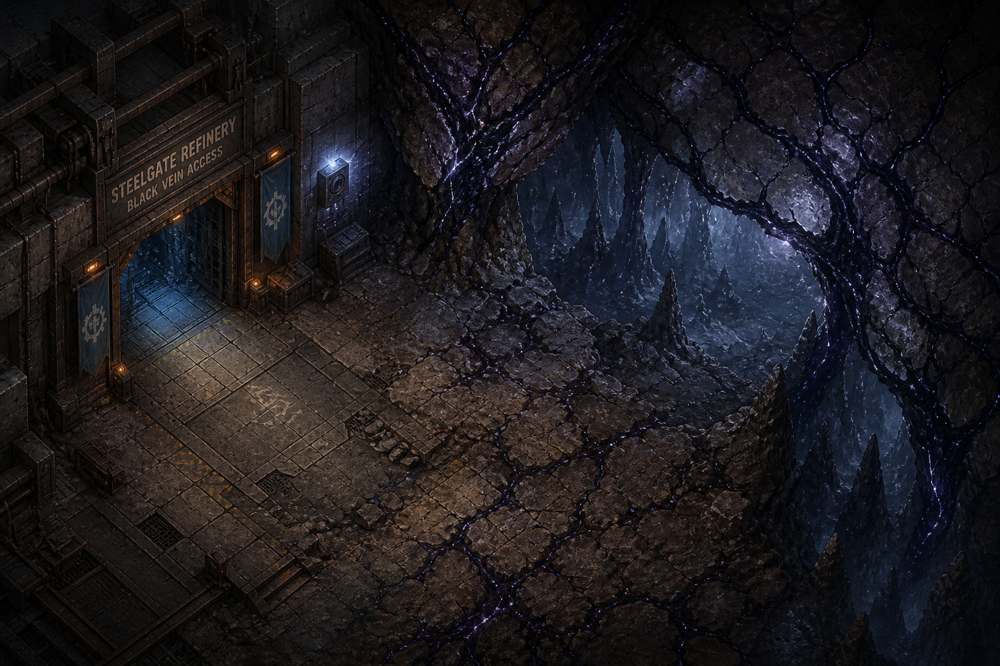

  > AI-generated room concept, regenerated 2026-08-14 (twice, same flat-camera correction as
  > above — the ground now shows a receding diamond crack pattern transitioning from concrete to
  > bare rock). Note: per [`CANON.md`](../CANON.md) → "Origin of the Outbreak," this cave system
  > is **not**
  > physically connected to Chapter 3's facility beneath Memorial Park — Vanguard deliberately
  > compartmentalized the two access points. This room is a foreshadowing gut-punch, not a
  > shortcut past Chapter 3.
- **The Machine Shops** (secondary, load-bearing). A separate workshop building; the **Cutting
  Torch** needed to force the Security Checkpoint is found here, mid-repair on a workbench.

  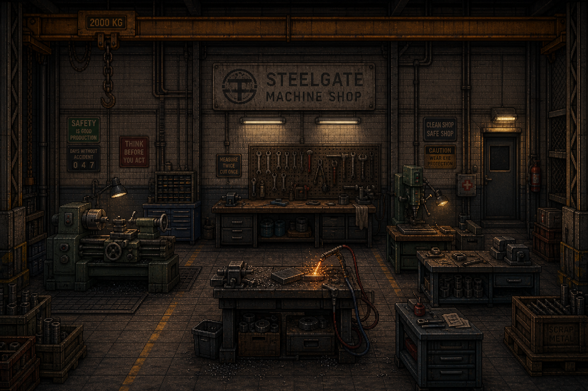

  > AI-generated room concept (2026-08-14) — already matched the elevated 3/4 top-down reference
  > style on the perspective re-audit; the sign correctly reads "Steelgate Machine Shop" (an
  > earlier version's "Ravencroft" naming error is no longer present).
- **The Loading Docks** (secondary, load-bearing). A separate cargo/shipping building; the
  **Vanguard Site Key** needed to open the Vanguard Site Office is found here, alongside shipment
  manifests confirming the "refrigerated transport trucks" workers noticed for years.

  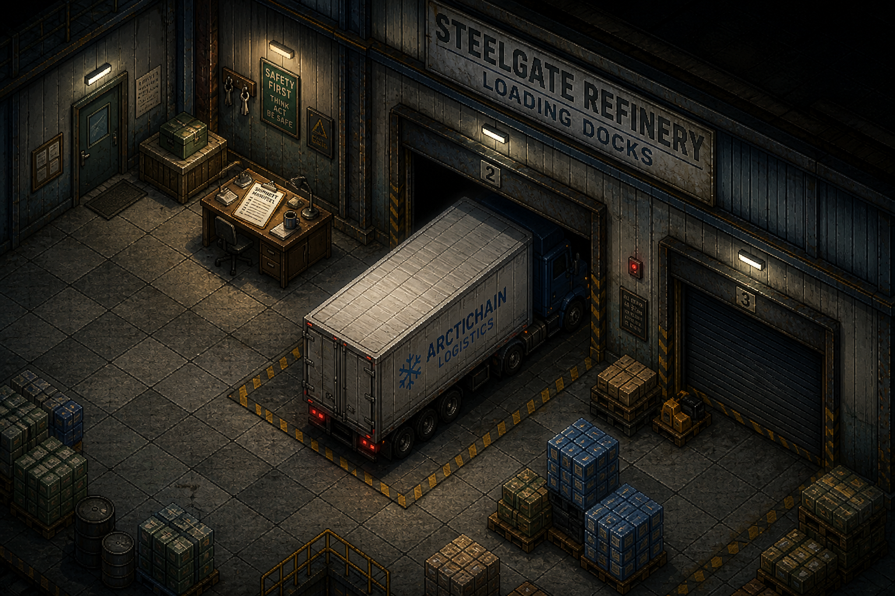

  > AI-generated room concept, regenerated 2026-08-14 (twice — first to fix a full-isometric style
  > drift, then again for the second pass's own flat/eye-level drift). The sign correctly reads
  > "Steelgate Refinery — Loading Docks," and a refrigerated transport truck is backed into the bay
  > instead of an ambulance.
- **The Rail Yard** (secondary, optional). Tracks leading directly into the mountainside — per the
  district's own established city-map detail, Black Vein's original entry point, predating even
  the Foundry's 1968 excavation. Optional lore/loot; a rusted 1968-dated rail car still sits at the
  tunnel mouth, sealed.

  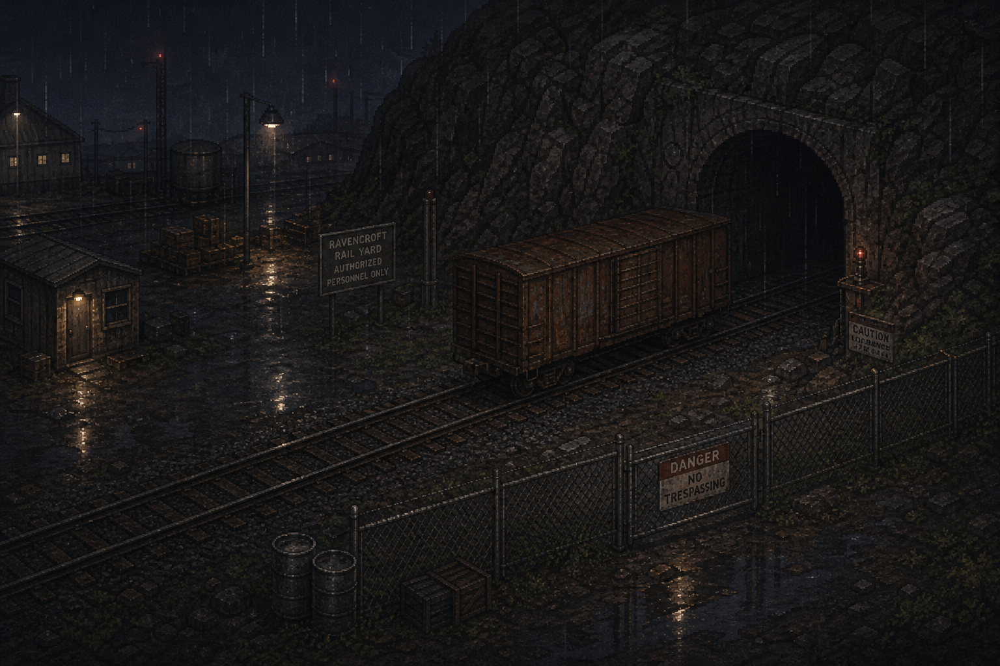

  > AI-generated room concept, regenerated 2026-08-14 (twice — first to fix a full-isometric style
  > drift, then again for the second pass's own flat/eye-level drift). The sign correctly reads
  > "Steelgate Rail Yard," and the sealed rail car is dated 1968, matching canon.

## Important Rooms / Areas

**Surface Plant:**
- Loading Yard (entry; flee-attempt aftermath)
- Casting Hall (hub — visibly gates the Manager's Office, Vanguard Site Office, and Restricted
  Elevator from the start)
- Foundry Clinic (Manager's Office Key; signature single encounter)
- Break Room / Locker Room (optional; personal effects; Medkit)
- Plant Manager's Office (locked; Restricted Elevator Access Card)
- Vanguard Site Office (locked; needs Vanguard Site Key from the Loading Docks)

**Underground Restricted Levels:**
- Restricted Elevator (card-reader lock; needs Access Card from the Manager's Office)
- Exposure Records Room (unlocked once underground; Research Bay Key)
- Research Bay (locked; needs Research Bay Key)
- Security Checkpoint (reinforced door; needs Cutting Torch from the Machine Shops; Exposure
  Cohort pack encounter; Boardroom Key)
- Old Mine Workings (optional; off the Lower Processing corridor)
- Founder's Boardroom (locked; needs Boardroom Key; INDUSTRY CREST)
- The Black Vein Cavern (mandatory story beat, reached past the Boardroom; no lock, no combat)

**Secondary Locations (district, not the main plant):**
- Machine Shops (load-bearing: Cutting Torch)
- Loading Docks (load-bearing: Vanguard Site Key)
- Rail Yard (optional: lore/loot)

## Blueprint (Room Connectivity)

> Not a to-scale architectural floor plan — a **relational** diagram of how rooms connect, same
> convention as [`Locations/Ravenwood_Hotel.md`](Ravenwood_Hotel.md),
> [`Locations/Police_Station.md`](Police_Station.md), and [`Locations/Hospital.md`](Hospital.md).
> Split into one diagram per building/branch; read top to bottom. Solid arrows are direct,
> always-available connections; dashed arrows are gated behind a story condition.
>
> Legend: 👤 NPC · ☠️ enemy/infected/boss · 🗝️ key item · 📄 document · 🔧 manual/mechanical
> (non-power) puzzle · 🚪 gate/access control/shortcut.
>
> **Shape/color key** — same as the other two main locations:
>
> - 🟣 **rectangle, purple** — a room with actual content.
> - 🟡 **pill/stadium, amber** — a hallway, corridor, or crossover — a pure connector.
> - 🔴 **rectangle, red** — a boss/signature-encounter room.
> - 🔵 **pill, blue** — exterior space.
> - ⚪ **dashed grey pill** — a pointer back to a node defined in full on another diagram.

### 1. District Entry → Loading Yard → Casting Hall (hub)

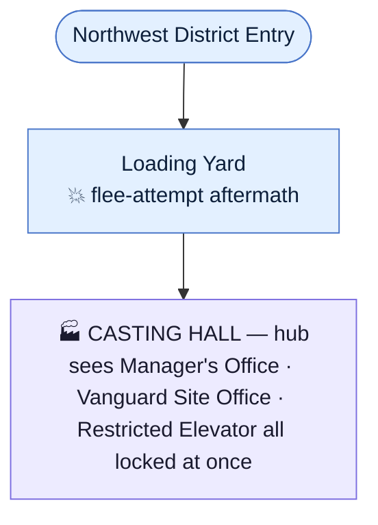
```mermaid
flowchart TD
    ENTRY(["Northwest District Entry"])
    YARD["Loading Yard<br/>💥 flee-attempt aftermath"]
    HALL["🏭 CASTING HALL — hub<br/>sees Manager's Office · Vanguard Site Office · Restricted Elevator all locked at once"]

    ENTRY --> YARD --> HALL

    classDef room fill:#EDEBFF,stroke:#7C6EE0,color:#1a1a2e
    classDef exterior fill:#E3F0FF,stroke:#4A76C9,color:#0d1f3a
    class ENTRY,YARD exterior
    class HALL room
```

### 2. The Surface Plant (branches off the Casting Hall)

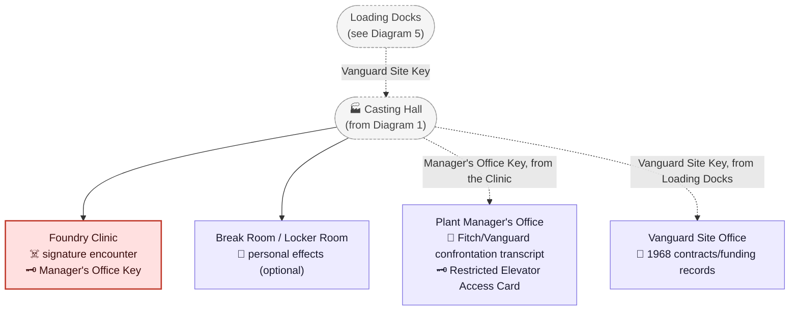
```mermaid
flowchart TD
    HALLREF(["🏭 Casting Hall<br/>(from Diagram 1)"])
    DOCKSREF(["Loading Docks<br/>(see Diagram 5)"])
    CLINIC["Foundry Clinic<br/>☠️ signature encounter<br/>🗝️ Manager's Office Key"]
    BREAK["Break Room / Locker Room<br/>📄 personal effects (optional)"]
    OFFICE["Plant Manager's Office<br/>📄 Fitch/Vanguard confrontation transcript<br/>🗝️ Restricted Elevator Access Card"]
    VSITE["Vanguard Site Office<br/>📄 1968 contracts/funding records"]

    HALLREF --> CLINIC
    HALLREF --> BREAK
    HALLREF -. Manager's Office Key, from the Clinic .-> OFFICE
    DOCKSREF -. Vanguard Site Key .-> HALLREF
    HALLREF -. Vanguard Site Key, from Loading Docks .-> VSITE

    classDef room fill:#EDEBFF,stroke:#7C6EE0,color:#1a1a2e
    classDef boss fill:#FFE0E0,stroke:#C0392B,color:#3a0d0d,stroke-width:2px
    classDef ref fill:#F5F5F5,stroke:#999999,color:#444444,stroke-dasharray:3 3
    class HALLREF,DOCKSREF ref
    class BREAK,OFFICE,VSITE room
    class CLINIC boss
```

### 3. The Restricted Underground Levels (via the Restricted Elevator)

```mermaid
flowchart TD
    HALLREF2(["🏭 Casting Hall<br/>(from Diagram 1)"])
    ELEVATOR(["Restricted Elevator<br/>🔧 needs Access Card, from the Manager's Office"])
    RECORDS["Exposure Records Room<br/>📄 EXPOSURE COHORT files<br/>🗝️ Research Bay Key"]
    RESEARCH["Research Bay<br/>📄 'SITE LOSS ACCEPTABLE' memo"]

    HALLREF2 -. Restricted Elevator Access Card .-> ELEVATOR --> RECORDS
    RECORDS -. Research Bay Key .-> RESEARCH

    classDef room fill:#EDEBFF,stroke:#7C6EE0,color:#1a1a2e
    classDef hallway fill:#FFF3D6,stroke:#D9A404,color:#3a2e00
    classDef ref fill:#F5F5F5,stroke:#999999,color:#444444,stroke-dasharray:3 3
    class HALLREF2 ref
    class ELEVATOR hallway
    class RECORDS,RESEARCH room
```

### 4. The Deep Chain — Security Checkpoint → Boardroom → the Black Vein Cavern

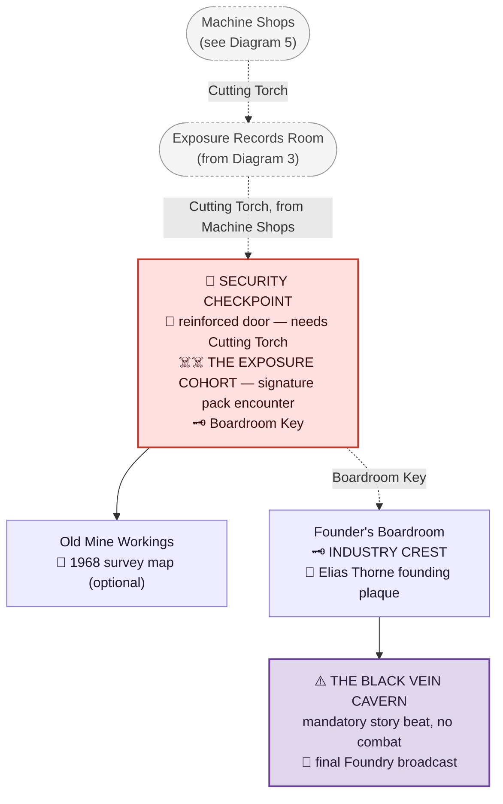
```mermaid
flowchart TD
    RECORDSREF(["Exposure Records Room<br/>(from Diagram 3)"])
    SHOPSREF(["Machine Shops<br/>(see Diagram 5)"])
    CHECKPOINT["🔴 SECURITY CHECKPOINT<br/>🔧 reinforced door — needs Cutting Torch<br/>☠️☠️ THE EXPOSURE COHORT — signature pack encounter<br/>🗝️ Boardroom Key"]
    MINE["Old Mine Workings<br/>📄 1968 survey map (optional)"]
    BOARDROOM["Founder's Boardroom<br/>🗝️ INDUSTRY CREST<br/>📄 Elias Thorne founding plaque"]
    CAVERN["⚠️ THE BLACK VEIN CAVERN<br/>mandatory story beat, no combat<br/>📄 final Foundry broadcast"]

    SHOPSREF -. Cutting Torch .-> RECORDSREF
    RECORDSREF -. Cutting Torch, from Machine Shops .-> CHECKPOINT --> MINE
    CHECKPOINT -. Boardroom Key .-> BOARDROOM --> CAVERN

    classDef room fill:#EDEBFF,stroke:#7C6EE0,color:#1a1a2e
    classDef boss fill:#FFE0E0,stroke:#C0392B,color:#3a0d0d,stroke-width:2px
    classDef ref fill:#F5F5F5,stroke:#999999,color:#444444,stroke-dasharray:3 3
    classDef vanguard fill:#E0D6EC,stroke:#6A3FA0,color:#2a1a3a,stroke-width:2px
    class RECORDSREF,SHOPSREF ref
    class MINE,BOARDROOM room
    class CHECKPOINT boss
    class CAVERN vanguard
```

### 5. Secondary Locations (reached from the District Entry, not the plant directly)

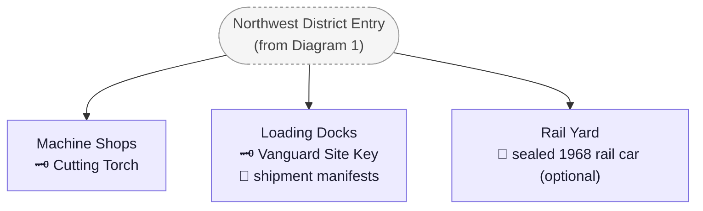
```mermaid
flowchart TD
    ENTRYREF(["Northwest District Entry<br/>(from Diagram 1)"])
    SHOPS["Machine Shops<br/>🗝️ Cutting Torch"]
    DOCKS["Loading Docks<br/>🗝️ Vanguard Site Key<br/>📄 shipment manifests"]
    RAIL["Rail Yard<br/>📄 sealed 1968 rail car (optional)"]

    ENTRYREF --> SHOPS
    ENTRYREF --> DOCKS
    ENTRYREF --> RAIL

    classDef room fill:#EDEBFF,stroke:#7C6EE0,color:#1a1a2e
    classDef exterior fill:#E3F0FF,stroke:#4A76C9,color:#0d1f3a
    classDef ref fill:#F5F5F5,stroke:#999999,color:#444444,stroke-dasharray:3 3
    class ENTRYREF ref
    class SHOPS,DOCKS,RAIL room
```

## Characters Encountered

- **Plant Manager Daniel Fitch** — never seen alive or dead; known entirely through his office,
  the intercom evacuation order, and the final broadcast. His ultimate fate is deliberately
  unresolved, same convention as the Police Station's Chief.

## Creatures Encountered

- **[Shamblers](../Creatures/Shambler.md)** — Foundry Clinic (one tougher signature encounter).
- **[The Exposure Cohort](../Creatures/Exposure_Cohort.md)** — the Security Checkpoint's signature
  pack encounter; several chronically-exposed workers whose mutation is more advanced/adapted than
  a standard Shambler's.

## Puzzles

- **The Casting Hall hub.** Three visibly locked/sealed points (Manager's Office, Vanguard Site
  Office, Restricted Elevator) are all seen at once before any of them can be opened — same "see
  the shape of what's left to solve" convention as the other two main locations.
- **The Clinic → Manager's Office → Elevator key chain.** A straightforward single-purpose
  lock-and-key sequence gating access underground.
- **The Loading Docks → Vanguard Site Office chain.** The Vanguard Site Key can't be found inside
  the main plant at all — a deliberate district-wide backtrack, mirroring the Police Station's
  Fire Station and the Hospital's Medical Arts Building conventions.
- **The Machine Shops → Security Checkpoint chain.** The Cutting Torch needed to force the
  Security Checkpoint's reinforced door is likewise found at a separate secondary building.
- **The Security Checkpoint → Boardroom → Cavern chain.** The Industry Crest, and the Black Vein
  Cavern beyond it, are only reachable after clearing the district's signature pack encounter,
  keeping the emblem — and the location's emotional climax — behind the deepest, most-gated point,
  per the design standard.

## Key Items

- **Manager's Office Key** ([full item writeup](../Items/Key_Items/Managers_Office_Key.md)) —
  Foundry Clinic; opens the Plant Manager's Office.
- **Restricted Elevator Access Card** ([full item writeup](../Items/Key_Items/Restricted_Elevator_Access_Card.md))
  — the Manager's Office; opens the Restricted Elevator.
- **Vanguard Site Key** ([full item writeup](../Items/Key_Items/Vanguard_Site_Key.md)) — Loading
  Docks (secondary location); opens the Vanguard Site Office.
- **Research Bay Key** ([full item writeup](../Items/Key_Items/Research_Bay_Key.md)) — the
  Exposure Records Room; opens the Research Bay.
- **Cutting Torch** ([full item writeup](../Items/Key_Items/Cutting_Torch.md)) — Machine Shops
  (secondary location); forces the Security Checkpoint's reinforced door.
- **Boardroom Key** ([full item writeup](../Items/Key_Items/Boardroom_Key.md)) — dropped after
  clearing the Exposure Cohort at the Security Checkpoint; opens the Founder's Boardroom.
- **Industry Crest** ([full item writeup](../Items/Key_Items/Industry_Crest.md)) — the district's
  founder's emblem; Founder's Boardroom display case.

> All seven of this district's key items now have individual `Items/Key_Items/` writeups, complete
> with AI-generated icon concept art — see [`Items/Key_Items/README.md`](../Items/Key_Items/README.md).

### Documents

- **"EXPOSURE COHORTS" employee files** (Exposure Records Room) — years of chronic-exposure
  monitoring disguised as an occupational-health program.
- **The Fitch/Vanguard confrontation transcript** (Manager's Office) — *"Contamination risk to
  who?"*
- **The nurse's call log** (Foundry Clinic) — her calls to the hospital and to Vanguard, ending
  with *"Do not administer further treatment."*
- **1968 contracts/funding records** (Vanguard Site Office) — establishes the operation's actual
  start date; see [`CANON.md`](../CANON.md) → "Origin of the Outbreak."
- **Foundry security vs. hospital intake mismatch** ("Ambulance Three departed with four
  casualties" / "arrived with two") — a direct crossover document, the Foundry-side half of a
  discrepancy also discoverable at [`Locations/Hospital.md`](Hospital.md).
- **Dispatch radio log** ("Foundry requesting additional ambulances" / "Negative. Vanguard
  containment directive now active." / "I've got thirty injured people here." / "I know.") — the
  Foundry-side half of a crossover document also discoverable at
  [`Locations/Police_Station.md`](Police_Station.md).
- **The manager's fragmentary transmission to police** ("This is not a chemical spill." / "Vanguard
  knew." / "The mine is the source.") — cross-referenced at the Police Station as an unexplained
  fragment officers never had time to understand.
- **"SITE LOSS ACCEPTABLE" internal memo** (Research Bay) — Vanguard's own clinical framing of
  abandoning the surface facility.
- **1968 survey map** (Old Mine Workings, optional) — the earliest excavation routes toward Black
  Vein.
- **Shipment manifests** (Loading Docks, optional) — confirms the "refrigerated transport trucks"
  workers noticed for years.
- **The final Foundry broadcast** (the Black Vein Cavern) — *"They didn't find this thing tonight.
  They've been digging at it for years."*
- **A hand-drawn cave map fragment matching a tunnel junction and Vanguard access designation**
  (Old Mine Workings, optional, added 2026-08-13) — the same junction an injured worker recognizes
  on an old monastery map after reaching the ridge; see
  [`Locations/Monastery.md`](Monastery.md), beat 13, for the moment the Foundry and Monastery cave
  systems are confirmed to be physically connected.
- **A torn evacuation slip listing a Foundry worker, his wife, and their teenage son** (Exposure
  Records Room, optional, added 2026-08-13) — the Foundry-side paper trail behind the Harris
  family, later removed from Worthy Academy's shelter roster by Vanguard under "potential secondary
  contamination"; see [`Locations/Academy.md`](Academy.md), beat 8, for the guarding officer's own
  note: *"I gave them the Harris family." "All three."*

## Major Scripted Events

- The flee-attempt aftermath at the Loading Yard (environmental, on arrival).
- The Clinic → Manager's Office → Restricted Elevator key chain, taking Jim underground.
- Finding the EXPOSURE COHORTS records and realizing the "health program" was surveillance.
- The Machine Shops → Security Checkpoint backtrack, culminating in the Exposure Cohort fight.
- Retrieving the Industry Crest from the Founder's Boardroom.
- The mandatory, non-combat Black Vein Cavern reveal — the location's true climax, occurring after
  the crest is already collected.

## Boss Encounters

- **[The Exposure Cohort](../Creatures/Exposure_Cohort.md)** — the district's signature pack
  encounter, fought at the Security Checkpoint. No single unique named boss is proposed for this
  district (unlike the Caretaker, Ashen Hounds, or "The Surgeon") — flagged as an open design gap
  below rather than invented without support from the source material.

## Crest Progression

Source of the **Industry Crest** (Northwest / INDUSTRY wedge / Anvil symbol — see
[`CANON.md`](../CANON.md) → "The Founders & the Five Crests"). Can be returned to the Founders
Memorial any time Jim backtracks to Memorial Park; not forced immediately after pickup.

## Exit / Progression to Next Area

Once the Industry Crest is collected, the Exposure Cohort defeated, and the Black Vein Cavern
witnessed, Jim is free to head to any of the remaining districts (Academy, Monastery — Police
Station and Hospital already covered) in any order.

## Unresolved Ideas

- **This entire district is a first draft, pending review** — same status the Hospital had before
  further review, and the Police Station had before its own restructure was approved.
- ~~None of the seven new key items above have individual `Items/Key_Items/` writeups yet.~~
  **Resolved/scripted (2026-08-13):** see [`Items/Key_Items/README.md`](../Items/Key_Items/README.md)
  → "Steelgate Refinery" for all seven, each with AI-generated icon concept art.
- Whether specific creatures Jim has already encountered elsewhere in Ravenwood should be
  explicitly traced back to named Foundry employees (per Outbreak Night beat 19's suggestion) —
  a compelling idea, explicitly **not locked to any specific existing creature** without further
  review; retrofitting an established creature's origin is a bigger canon change than adding new
  material and shouldn't happen by default.
- Whether the Zombie Conglomerate (see [`Creatures/Zombie_Conglomerate.md`](../Creatures/Zombie_Conglomerate.md))
  should be explicitly tied to the Foundry's own containment failure thematically — both involve
  Vanguard's contained research escaping catastrophically — flagged as a strong thematic fit, not
  proposed as locked canon here.
- No unique named boss creature is proposed for this district (see "Boss Encounters," above) — the
  Exposure Cohort pack fight currently fills that structural role; whether the district needs a
  separate unique boss on top of that is undecided.
- The exact relationship between the Foundry's cave system and Chapter 3's facility beneath
  Memorial Park (both connect to Black Vein, deliberately not to each other — see "The Black Vein
  Cavern," above, and [`CANON.md`](../CANON.md)) should be kept consistent once Chapter 3 is
  actually written.
- ~~Full scene-by-scene scripting into a `Scripts/` file.~~ **Resolved (2026-08-13):** see
  [`Scripts/Chapter_2_Foundry.md`](../Scripts/Chapter_2_Foundry.md), 17 scenes covering the full
  district critical path and all three secondary locations.
- Whether Daniel Fitch deserves his own dedicated `Characters/` file (matching Aaron Cole's
  treatment) rather than being described only within this location file — not done here, consistent
  with how the Police Station's Chief and the Hospital's Vanguard Liaison were also left
  undocumented outside their own location files.
