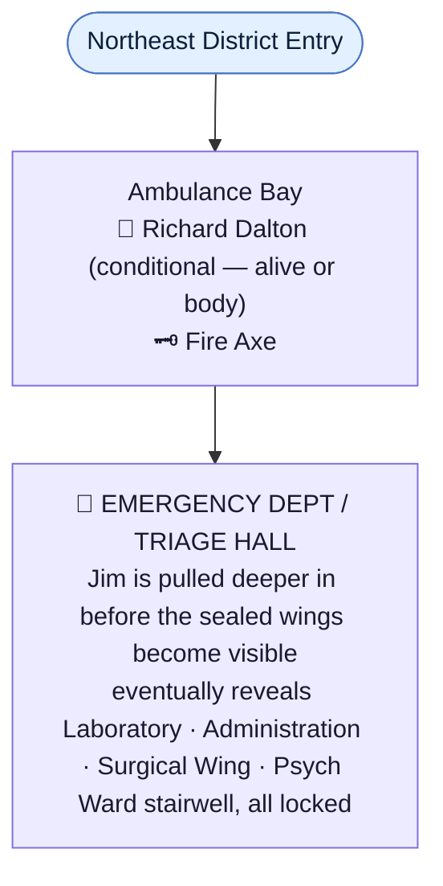
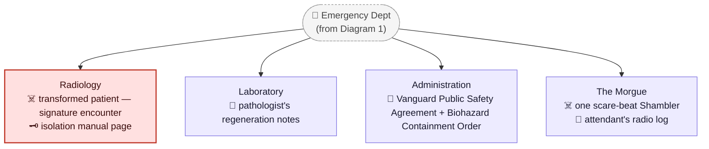
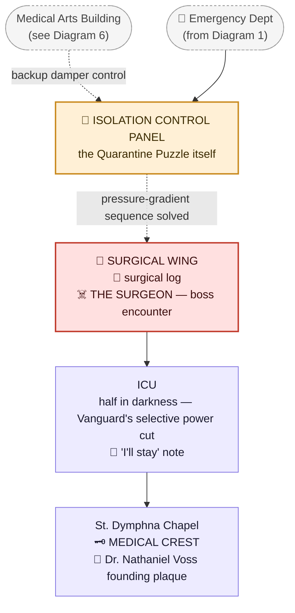
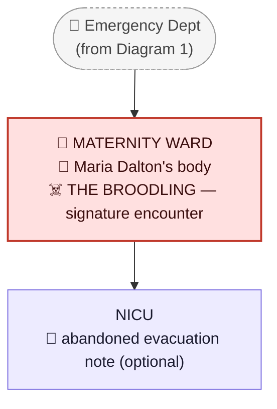
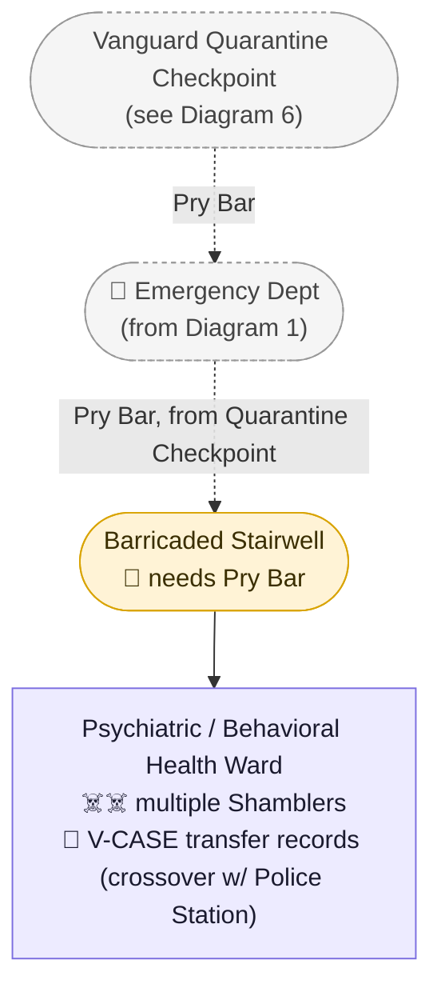
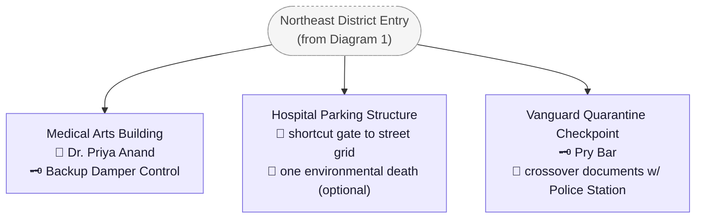

# St. Dymphna Hospital

> The Northeast District's main location — Medical Crest. Full scene-by-scene script:
> [`Scripts/Chapter_2_Hospital.md`](../Scripts/Chapter_2_Hospital.md). Full revision history is in
> [`STORY_NOTES.md`](../STORY_NOTES.md) rather than duplicated here.
>
> **Thematic pairing with the Police Station:** both institutions experience the same night from
> different angles, and their records overlap directly — the same radio calls, the same missing
> ambulances, the same Highway 13 shutdown, even some of the same named officers. See "Outbreak
> Night," below, and [`Locations/Police_Station.md`](Police_Station.md) for the crossover documents
> on both sides. *Police Station — "We followed Vanguard's orders until we realized those orders
> were killing the town." Hospital — "We tried to save everyone until we realized Vanguard never
> wanted everyone saved."*
>
> **Puzzle mechanic: the Quarantine Puzzle.** See "The Quarantine System," below, and
> [`CANON.md`](../CANON.md) → "Five Puzzle Philosophies."

## Purpose in the Overall Story

The Northeast District's main "mansion/RPD"-style location: rather than a central hub visibly
gating several sealed points at once, Jim is pulled progressively deeper into the building — the
same shape the Quarantine Puzzle itself uses. Reaching the **Medical Crest** means mastering the
hospital's own emergency isolation system, not assembling a matching set of keys. Where the Police
Station is about a town institution discovering it had been lied to, the Hospital is about a town
institution discovering it was being actively prevented from doing the one thing it exists to do —
treat the sick and injured — because Vanguard's actual priority was never public health.

## Outbreak Night — What Actually Happened

> Framing: the hospital's outbreak night should read as **doctors and nurses trying to save people
> while Vanguard actively worked against them**, discovering the truth from the opposite direction
> the Police Station does. Almost everything below is meant to be reconstructed by Jim from charts,
> recordings, a whiteboard, and the building itself — not
> delivered as exposition. This timeline is the master reference behind the specific
> documents/details placed in `Storyline`, below.

1. **Early evening — an ordinary bad storm night.** Power flickers, road accidents, falls, a couple
   of assaults — normal ER chaos, nothing that reads as unusual yet.
2. **The first cases.** Patients start arriving with symptoms nobody can explain: extreme fever,
   severe agitation, bleeding beneath the skin, spontaneous fractures, uncontrollable spasms,
   abnormally rapid clotting, wounds closing wrong, abnormal bone growth, a sensation of pressure
   under the skin. A workplace-accident patient's deep arm laceration closes almost completely in
   ten minutes — but wrong: thick, dark, knotted tissue. The attending physician assumes a bizarre
   coagulation disorder; the lab results that come back make no sense.
3. **Vanguard calls administration — not the ER.** A "limited industrial chemical exposure" is
   reported, and hospital staff are told to notify Vanguard of specific symptom patterns — the same
   **V-CASE PROTOCOL** given to police, but with different instructions. Police are told *detain
   and transfer*; doctors are told *stabilize and isolate pending specialist transfer*, and
   explicitly barred from invasive diagnostics: no biopsies, no advanced imaging without
   authorization, no tissue samples sent outside Ravenwood. Several doctors are immediately
   furious — Vanguard is dictating clinical practice with no medical justification given.
4. **Vanguard begins taking patients.** A Vanguard medical team — hazmat gear, credentials,
   transport van — removes several unusual patients, ostensibly to a specialized toxicology
   center. Nurses notice the transfer forms list no receiving hospital, only "VANGUARD MEDICAL
   AUTHORITY." One nurse refuses to sign; Vanguard signs for her.
5. **Police and hospital events start overlapping.** Dispatch sends injured civilians to St.
   Dymphna; officers, under V-CASE protocol, try to stop an ambulance carrying a patient who
   matches Vanguard's symptom criteria. *Paramedic: "He's dying." Officer: "I've got orders."
   Doctor: "Then get out of my emergency room."* The hospital takes the patient anyway. Neither
   side is malicious — they're following contradictory orders from the same source. (See
   [`Locations/Police_Station.md`](Police_Station.md) for this same incident from the police
   radio's side.)
6. **The ER overflows.** Car crashes, violence, industrial injuries, home invasions — police,
   firefighters, and Vanguard workers among the injured. Triage moves into hallways; the cafeteria
   becomes overflow treatment; security holds back family members from restricted areas. Some
   patients are already changing, and no one yet understands what that means.
7. **The lab discovers the truth Vanguard wants hidden.** A pathologist, ignoring Vanguard's ban on
   unauthorized tests, examines tissue from a changing patient: cells aren't dying normally, they're
   *reorganizing* — damage triggers accelerated, uncontrolled growth, the body rebuilding itself
   with the wrong blueprint. Written up as *"Necrosis appears to provoke rather than suppress
   cellular activity"* — meaning injury accelerates mutation, and Vanguard already knows it. This
   is the hospital's version of the Police Station's central realization: not disease, but
   corrupted regeneration.
8. **Vanguard orders the lab shut down** and demands every sample, image, and chart. Administration
   initially cooperates — until the pathologist asks *"How did they know what we found?"* This is
   the moment hospital staff start realizing Vanguard isn't responding to an accident; it's
   managing an experiment that got loose.
9. **The first hospital transformation** happens somewhere vulnerable, not the ER floor: a
   convulsing, restrained patient in Radiology, left alone briefly for a CT scan, tears free and
   kills an orderly before security responds. The resulting police radio call —
   *"Unit Twelve, respond Ravenwood Memorial, violent patient, radiology"* — sounds like just
   another bizarre disturbance at the station; Jim can find it from either side (see "Documents,"
   below, and [`Locations/Police_Station.md`](Police_Station.md)).
10. **Staff begin hiding patients from Vanguard.** A doctor notices every unusual patient Vanguard
    removes simply disappears — no further contact, ever. When the next symptomatic patient
    arrives, a small group of doctors and nurses stop reporting them and start running an
    unofficial hidden ward inside the hospital, believing they're protecting people from Vanguard.
    Some of those patients go on to transform anyway — their compassion becomes a second outbreak
    point inside the building.
11. **The maternity ward problem.** [Maria Dalton](../Characters/Maria_Dalton.md), already admitted
    for a pregnancy complication, is among the patients exposed sometime during the chaos above —
    the exact moment is deliberately unspecified (see her character file). Vanguard's broader
    interest in whether Ashen effects cross the placental barrier (evidenced elsewhere in the
    building, not specifically about Maria) is one of the details that finally convinces several
    doctors to reject Vanguard's authority outright.
12. **Police officers start arriving with the rebellion already underway.** Injured officers from
    the highway confrontation and street fighting (see
    [`Locations/Police_Station.md`](Police_Station.md) → "Outbreak Night," beats 7–9) tell hospital
    staff *"Don't give Vanguard anybody,"* and *"Chief pulled us off their protocol."* For roughly
    twenty minutes, police and hospital staff actually coordinate — officers bringing civilians in,
    doctors treating them, officers securing entrances, staff prepping an evacuation. Ravenwood's
    closest thing to an organized resistance that night.
13. **Vanguard locks the hospital down.** Using infrastructure Vanguard itself funded — generators,
    security systems, electronic doors, medical comms, basement renovations — Vanguard remotely
    triggers a **BIOHAZARD CONTAINMENT ORDER**: certain doors lock, elevators disable, outside
    communication is cut. Official justification: preventing contamination beyond Ravenwood. Actual
    reason: the hospital holds too much evidence — patients, samples, doctors who know too much,
    police witnesses.
14. **The Ambulance Bay becomes a battlefield.** Ambulances keep arriving despite lockdown — some
    carrying wounded, some empty, one crashing into another. Vanguard security refuses to open the
    bay; hospital staff force it open anyway. Gunfire between police and Vanguard breaks out around
    the bay while doctors pull civilians inside — overturned gurneys, bullet holes, police shields,
    Vanguard casings, abandoned equipment, blood trails running in opposing directions. The
    hospital stops feeling like a medical facility here.
15. **Surgery becomes horrifying.** With traumatic damage accelerating Ashen mutation and the
    building now full of injured, stressed people undergoing exactly the interventions (surgery,
    transfusion, CPR, restraint, defibrillation, amputation) that provoke it, an abdominal-trauma
    patient's organs begin regenerating — malformed — faster than the surgical team can work. The
    surgeon's own note: *"We stopped the procedure because every incision produced additional
    growth."* He doesn't die on the table. See
    [`Creatures/Unnamed_Hospital_Boss.md`](../Creatures/Unnamed_Hospital_Boss.md) for what he
    becomes.
16. **The hospital divides into zones** as survivors barricade sections rather than try to hold the
    whole building: the Emergency Department (total chaos, the first outbreak zone), the Surgical
    Wing (locked down after beat 15), the ICU (staff trying to preserve remaining stable patients),
    Maternity (protected by staff refusing Vanguard access), Psychiatric/Behavioral Health
    (initially holding aggressive V-CASE patients, later completely lost), the Laboratory (the
    evidence proving Vanguard knew), the Morgue, Administration, and the Ambulance Bay. See
    "Storyline," below, for how each maps to an explorable room.
17. **The morgue revelation.** Early victims are taken downstairs. A morgue attendant radios
    upstairs — *"I need somebody down here... one of these people isn't dead"* — and gets no
    response; the same call can be found, unanswered, on a police recording (*"Ravenwood Memorial
    requesting immediate assistance, lower level"*), because the station was already collapsing
    and had no one left to send. This is also the game's clearest confirmation that Ashen
    regeneration isn't conventional reanimation — some bodies' cellular systems simply never fully
    stopped after catastrophic injury.
18. **The hospital's final outgoing transmission**, timed to overlap with the Police Station's own
    (see [`Locations/Police_Station.md`](Police_Station.md), beat 16): *"Ravenwood Memorial to all
    emergency services. We are no longer accepting Vanguard medical authority. Do not surrender
    patients to Vanguard personnel."* A recorded exchange with the station follows —
    *Hospital: "RPD, are you receiving?" Police: "Memorial, go ahead." Hospital: "We have forty-
    plus civilians and can't move them." Police: "We're trying to open Highway 13."* — then,
    later: *Hospital: "RPD?"* Static. *"Ravenwood Police, please respond."* Nothing. A gut-punch
    for a player who has already been through the Police Station and knows exactly why no one
    answered.
19. **The evacuation attempt.** Staff try to move patients through a service entrance; the police
    escort that was supposed to meet them never arrives (see
    [`Locations/Police_Station.md`](Police_Station.md), beat 15 — those officers didn't survive
    the final stand). Doctors, nurses, maintenance staff, and hospital security attempt it alone.
    Some patients can't be moved. A nurse's note: *"Mr. Palmer is ventilator dependent. We cannot
    move him without power."* Underneath, in a different hand: *"I'll stay."* Jim finds both of
    them.
20. **Vanguard's final action.** Once Vanguard concludes the hospital is lost, it remotely cuts
    external emergency power — knowing ICU patients, operating rooms, ventilators, and incubators
    are still occupied — because losing the hospital's power stops further transmissions, destroys
    evidence, ends unauthorized research, limits escape, and simplifies containment. The backup
    generators (also Vanguard-funded/maintained) only restore power to certain sections —
    specifically, Vanguard-controlled areas. Jim finds an ICU sitting in total darkness while an
    empty Vanguard-adjacent room elsewhere in the building still has full power. The image is the
    entire point; nothing more needs to be said about it on-screen.

## Arrival / Setup

- St. Dymphna Hospital is visible from a distance before Jim reaches it — a large, multi-story
  building, most windows dark, a few floors showing weak, inconsistent emergency lighting. As Jim
  approaches, a hospital PA system crackles on intermittently, a doctor's recorded/looping voice
  audible from outside: *"If anyone can hear this, do not enter Emergency."* Later, closer:
  *"Avoid the lower level."* And finally, right before the entrance: *"...if you're police, we're
  still here."* Jim isn't police, and the player already knows, if the Police Station has been
  visited, exactly how few police are left to hear it.
- The **Ambulance Bay** approach is the hospital's version of the Police Station's wrecked patrol
  lot: overturned gurneys, bullet holes, mismatched RPD and Vanguard shell casings, a crashed
  ambulance nosed into a parked one, abandoned medical equipment, and blood trails running in
  opposing directions — the physical aftermath of Outbreak Night beat 14.
- **Richard Dalton** (see [`Characters/Richard_Dalton.md`](../Characters/Richard_Dalton.md) and
  [`CANON.md`](../CANON.md) → "Survivor System" → "Tier 2b") is encountered here, conditional on
  how many emblems Jim is carrying:
  - **0–1 emblems (Hospital is Jim's first or second district):** Richard is alive, running out of
    the Ambulance Bay entrance in a panic, trying to find anyone who can help Maria — hospital
    staff are unreachable by this point in the night. He doesn't know what's happened to her, only
    that she's been alone too long. Once reassured (not yet scripted scene-by-scene), he asks Jim
    to find her and come back and tell him what happened.
  - **2+ emblems:** Richard already ran and was killed before Jim arrived. Jim finds his body near
    the Ambulance Bay instead of meeting him alive.

## The Quarantine System

The Medical Crest sits in the hospital's historic chapel/founder's exhibit, on the far side of the
treatment wing the outbreak forced staff to convert into emergency negative-pressure quarantine —
and which the automated system sealed for good once things went wrong.

An emergency isolation panel controls five zones: **Air Intake, Isolation Ward, Surgical Wing,
Decontamination Corridor, Exhaust.** Large analog pressure gauges read green/yellow/red. Two
incompatible zones can't be open at once — doing so trips `PRESSURE FAILURE — SAFETY INTERLOCK` and
locks every door on the panel. A dead doctor's own instructions, found near the panel, teach the
rule the player needs rather than stating it as a puzzle hint: *"Never create a positive-pressure
path from Isolation into General Care."*

The player creates safe pressure gradients rather than simply opening doors: close General Intake,
vent Isolation, watch the gauge drop, cross once the door releases, then seal Isolation behind
Jim and pressurize Surgical to open the next door — each step trapping Jim briefly on the far side
before the next transition. The mechanic doubles as a horror delivery system: opening a vent can
reveal something moving in the ductwork; depressurizing a ward can suck plastic isolation curtains
inward around Jim; sealed observation glass can show something on the other side before that
section is ever opened. The system itself tells part of the story once solved — the hospital wasn't
trying to keep something out. It was trying to keep something in.

## Storyline

- **The Ambulance Bay.** Entry point; the battlefield described above, plus Richard's
  alive/dead beat. A dropped **Fire Axe** lies near an overturned gurney — this district's
  general-purpose forcing tool, echoing Sergeant Calloway's own fire axe at the Police Station,
  though here it's simply abandoned equipment rather than tied to a specific survivor.

  

  > AI-generated room concept (2026-08-13). Note: the wall signage reads "RAVENCROFT COUNTY
  > HOSPITAL" — flagged as a generation error, not a new hospital name; this district's hospital
  > is locked as **St. Dymphna Hospital** per [`CANON.md`](../CANON.md).
- **The Emergency Department / Triage Hall.** Gurneys line the walls; hallway triage stations sit
  abandoned mid-use, PA fragments still looping overhead. This isn't a room Jim sizes up all at
  once — he's pulled into it the way the hospital itself was: Radiology's still-open doors first,
  the Maternity Ward corridor next, a dim stairwell down to the Morgue he almost misses. Only after
  he's already deep into the wing does the shape of the actual problem become visible — the
  Laboratory and Administration sealed behind ordinary locks, the Surgical Wing behind a
  card-reader with no card in sight, and a barricaded stairwell up to the Psychiatric/Behavioral
  Health Ward — by which point it reads less like a hub with four doors and more like a building
  that slowly reveals how badly it failed.

  

  > AI-generated room concept (2026-08-13).
- **Radiology.** Unlocked, off the E.D. A CT suite with a restraint gurney still buckled open —
  the site of Outbreak Night beat 9. One tough Shambler-tier encounter (the transformed patient,
  now fully turned) and a dead orderly holding a torn page from the isolation system's own
  operating manual — one of the pieces Jim needs to safely work the pressure panel later. A
  wall-mounted radio, left on, is tuned to the same frequency as the police dispatch call
  referencing this room (see "Documents," below).

  

  > AI-generated room concept (2026-08-13).
- **The Laboratory.** Unlocked, off the E.D. Microscopes, sample racks, a pathologist's
  workstation with the *"Necrosis appears to provoke rather than suppress cellular activity"* note
  still on-screen, and the pathologist's own notes on Vanguard's sample-seizure order.

  

  > AI-generated room concept (2026-08-13).
- **Administration.** Unlocked, off the E.D. Vanguard's Public Safety Agreement paperwork (the
  hospital's counterpart to the Police Station's own Public Safety Agreement material), the
  Biohazard Containment Order printout, and the administrator's own increasingly panicked
  correspondence with Vanguard as the lockdown takes hold — a lore stop, not a puzzle-gating room.

  

  > AI-generated room concept (2026-08-13). Note: the wall seal/org-chart reads "GREENVIEW
  > HOSPITAL" — flagged as a generation error, same as the Ambulance Bay's "RAVENCROFT COUNTY
  > HOSPITAL" signage; this district's hospital is locked as **St. Dymphna Hospital**.
- **The Morgue** (optional detour, via a dim stairwell off the E.D., no lock). Drawers, a
  gurney with a sheet pulled back over nothing, and the attendant's own radio call log ending
  mid-sentence — Outbreak Night beat 17. One optional Shambler encounter (a drawer that wasn't as
  empty as it looked), staged as a scare beat rather than a real fight.

  

  > AI-generated room concept (2026-08-13).
- **The Isolation Control Panel.** Where the E.D. corridor narrows toward the Surgical Wing — the
  physical location of "The Quarantine System," above. A dead doctor slumped beside it left the
  conceptual rule taped to the wall (*"Never create a positive-pressure path from Isolation into
  General Care"*); the torn manual page from Radiology and the backup damper control from the
  Medical Arts Building (see below) are what let Jim actually operate it. This is the district's
  real gate — not a card reader, a sequence of pressure changes Jim has to get right.
- **The Surgical Wing.** Reached once the pressure-gradient sequence opens its door — no card, no
  key. A ruined operating room holds the surgical log describing Outbreak Night beat 15 in the
  surgeon's own words. Deeper in: the district's boss encounter, **"The Surgeon"** (see
  [`Creatures/Unnamed_Hospital_Boss.md`](../Creatures/Unnamed_Hospital_Boss.md)).

  

  > AI-generated room concept (2026-08-13).
- **The ICU.** Reached through the Surgical Wing once the boss is cleared — the pressure system
  Jim already solved keeps this section's own gauge in the green, no further gating needed. Half
  the ward sits in total darkness — Outbreak Night beat 20's selective power cut — while a lone
  still-humming monitor marks the one bed with a working backup line. A nurse's note (*"Mr. Palmer
  is ventilator dependent... I'll stay."*) is found at a ventilator that never lost power, next to
  two bodies.

  

  > AI-generated room concept (2026-08-13).
- **St. Dymphna Chapel.** Unlocked, past the ICU — no separate key. A small, hushed hospital
  chapel — pews, a modest stained-glass window, a portrait and founding plaque for **Dr. Nathaniel
  Voss**, the hospital's founding physician and one of Ravenwood/Vanguard's five founders. A
  glass-fronted case holds the **Medical Crest** — a bronze, wedge-shaped medallion bearing Voss's
  relief portrait, his name and title, and a serpent-and-staff (caduceus) emblem — the direct
  payoff of this district's entire loop, matching the Old Station House's Authority Crest
  convention exactly.

  

  > AI-generated room concept (2026-08-13). Note: the portrait/plaque reads "Dr. Edward Halloway"
  > and "Holloway Memorial Hospital" — both generation errors, unprompted; this district's founder
  > is named **Dr. Nathaniel Voss** (see "Storyline," above) and the hospital is **St. Dymphna
  > Hospital**. Not a proposal to rename either — flagged as inaccurate, not adopted.
- **The Maternity Ward** (off the E.D., deliberately unlocked — no lock or key gates this room,
  making the discovery hit harder rather than feeling "earned"). [Maria Dalton's](../Characters/Maria_Dalton.md)
  body is found here, on a hospital bed, having just given birth — staged as morbid by
  implication (blood trailing from her, the scene clearly finished rather than in progress) rather
  than graphically depicted, per the project owner's explicit direction. **[The
  Broodling](../Creatures/Broodling.md)** — the mutated result — is fought at the same bed.

  

  > AI-generated room concept (2026-08-13). Note: an "It's a Girl" balloon is visible — read as
  > generic pre-existing ward decor rather than specific to this patient, since the project owner
  > referred to Maria's child as "him"/"his" when describing the Broodling; flagged rather than
  > treated as confirming the child's sex, which hasn't actually been established as a locked fact.
- **The NICU** (small optional room adjacent to Maternity). Empty incubators, one still running on
  backup power with nothing inside it, and a staff note describing an abandoned attempt to
  evacuate the ward's infants before the ward was cut off — a smaller, quieter echo of the ICU's
  "I'll stay" beat.

  

  > AI-generated room concept (2026-08-13).
- **The Psychiatric / Behavioral Health Ward** (optional; the barricaded stairwell off the E.D.
  needs a **Pry Bar**, found at the secondary Vanguard Quarantine Checkpoint location). Per
  Outbreak Night beat 16, this ward held aggressive V-CASE patients early in the night and was
  "completely lost" later — several Shamblers in a nurses'-station-and-cells layout, the
  district's most dangerous optional encounter. Documents here connect specific patients directly
  to the Police Station's own V-CASE transfer paperwork — the strongest direct crossover between
  the two locations (see "Documents," below).

  

  > AI-generated room concept (2026-08-13).
- **The Medical Arts Building** (secondary, load-bearing). A separate small building of private
  doctors' offices and an outpatient clinic. A specific physician's abandoned office holds a
  **backup damper control**, left behind mid-shift-change — the required backtrack that lets Jim
  finish operating the isolation panel back at the main hospital. Two doors down, **Dr. Priya
  Anand**, a dentist, is barricaded in her own reception area — this district's live secondary-
  location NPC. She describes Vanguard quietly subpoenaing her patient referral records and
  directs Jim to a hidden supply-closet folder cross-referencing the Police Station's own
  confidential watchlist.

  

  > AI-generated room concept (2026-08-13). Note: the desk nameplate reads "Dr. J. Coldwell" —
  > generated unprompted; not adopted as this doctor's confirmed name, consistent with how similar
  > invented nameplates elsewhere (e.g. the Police Station's Chief's Office) have been flagged
  > rather than locked in.
- **The Hospital Parking Structure** (secondary, optional). Supplies, a navigation shortcut gate
  back to the street grid (mirroring the Police Station's Municipal Garage convention), and a
  small tragic beat: a civilian who barricaded themselves inside a car, found dead — they held out,
  but not long enough. Not a Tier 2 survivor (no player choice affects this one); a purely
  environmental beat.

  

  > AI-generated room concept (2026-08-13). Note: the directory sign reads "GENERAL HOSPITAL" —
  > flagged as a generation error, same as elsewhere in this district's concept art.
- **The Vanguard Quarantine Checkpoint** (secondary, optional). A small guard checkpoint building
  at the district's edge, "blocking the road out of town" per the city map. The **Pry Bar** used
  to force the Psychiatric Ward's barricade is found here, alongside checkpoint logs that
  cross-reference the Police Station's "Emergency Public Safety Directive 7" and the Highway 13
  confrontation directly — the clearest single piece of evidence tying the two locations' nights
  together.

  

  > AI-generated room concept (2026-08-13).

## Important Rooms / Areas

**Main Hospital Building:**
- Ambulance Bay (entry; Richard Dalton conditional beat; Fire Axe)
- Emergency Department / Triage Hall (pulls Jim deeper in before the sealed wings become visible)
- Radiology (unlocked; signature encounter; isolation manual page)
- Laboratory (unlocked; lore only)
- Administration (unlocked; lore only, deliberately not gating anything further)
- The Morgue (optional; unlocked; one scare-beat Shambler)
- The Isolation Control Panel (the Quarantine Puzzle's physical location; needs the torn manual
  page from Radiology and the backup damper control from the Medical Arts Building)
- Surgical Wing (opens once the pressure-gradient sequence is solved; boss encounter)
- ICU (reached via the Surgical Wing, unlocked)
- St. Dymphna Chapel (unlocked, past the ICU; MEDICAL CREST)
- Maternity Ward (unlocked by design; Maria Dalton's body; the Broodling)
- NICU (optional; adjacent to Maternity)
- Psychiatric / Behavioral Health Ward (optional; barricaded, needs Pry Bar from the Vanguard
  Quarantine Checkpoint; dangerous multi-Shambler encounter)

**Secondary Locations (district, not the main building):**
- Medical Arts Building (load-bearing: backup damper control for the isolation panel)
- Hospital Parking Structure (optional: supplies, shortcut gate, one environmental death beat)
- Vanguard Quarantine Checkpoint (optional: Pry Bar, Police/Hospital crossover documents)

## Blueprint (Room Connectivity)

> Not a to-scale architectural floor plan — a **relational** diagram of how rooms connect, and
> what's in each one, derived directly from `Storyline` above, same convention as
> [`Locations/Ravenwood_Hotel.md`](Ravenwood_Hotel.md) and
> [`Locations/Police_Station.md`](Police_Station.md). Split into one diagram per building/branch;
> read them top to bottom. Solid arrows are direct, always-available connections; dashed arrows
> are gated behind a story condition — the label on the arrow says what unlocks it.
>
> Legend: 👤 NPC · ☠️ enemy/infected/boss · 🗝️ key item · 📄 document · 🔧 manual/mechanical
> (non-power) puzzle · 🚪 gate/access control/shortcut.
>
> **Shape/color key** — same as the Hotel's and Police Station's blueprints:
>
> - 🟣 **rectangle, purple** — a room with actual content (NPCs, items, enemies, events).
> - 🟡 **pill/stadium, amber** — a hallway, corridor, or crossover — a pure connector.
> - 🔴 **rectangle, red** — a boss or signature-encounter room.
> - 🔵 **pill, blue** — exterior space (street, district entry, parking lot).
> - ⚪ **dashed grey pill** — a pointer back to a node defined in full on another diagram.

### 1. District Entry → Ambulance Bay → Emergency Department (hub)

### 2. The Diagnostic Wing (branches off the E.D.)

### 3. The Surgical Wing → ICU → Chapel (the critical-path chain)

### 4. The Maternity Wing (branches off the E.D.)

### 5. The Psychiatric / Behavioral Health Ward (optional, branches off the E.D.)

### 6. Secondary Locations (reached from the District Entry, not the hospital directly)

## Characters Encountered

- **[Richard Dalton](../Characters/Richard_Dalton.md)** — Tier 2b threshold conditional survivor;
  alive if Jim arrives with 0–1 emblems, already dead if 2+. See "Arrival / Setup," above.
- **[Maria Dalton](../Characters/Maria_Dalton.md)** — never seen alive at the hospital (her last
  living scene is Chapter 1's hotel lobby); found dead in the Maternity Ward regardless of visit
  order. Not conditional — only Richard's presence changes with sequencing.
- **Dr. Priya Anand** — the Medical Arts Building's dentist, alive, barricaded in her own reception
  area. A one-scene flavor NPC, not a Tier 2/2b conditional survivor — no alive/dead branch, no
  return visit.

## Creatures Encountered

- **[Shamblers](../Creatures/Shambler.md)**, themed to the hospital (gowns/scrubs) — Radiology
  (the transformed patient, a tougher single encounter), the Morgue (one scare-beat encounter), and
  the Psychiatric Ward (multiple, optional).
- **[The Broodling](../Creatures/Broodling.md)** — the Maternity Ward's signature one-off
  encounter, mutated from Maria Dalton's unborn child.
- **["The Surgeon"](../Creatures/Unnamed_Hospital_Boss.md)** — the district's boss encounter,
  fought in the Surgical Wing's deepest operating room.

## Puzzles

- **The Quarantine Puzzle (main)** — see "The Quarantine System," above. Reach the Surgical Wing
  and, beyond it, the Chapel and Medical Crest by managing pressure gradients across five isolation
  zones rather than collecting keys — sealing one zone to safely open the next, with the Medical
  Crest reserved for the deepest, most-gated point in the district.
- **The Medical Arts Building → Surgical Wing chain.** A physical component needed at the isolation
  panel (a backup damper control) is found at a separate secondary building, forcing the player to
  leave the hospital and come back — same "backtracking across the whole district is the point"
  principle as the Police Station's Fire Station → Property Room chain.
- **The Vanguard Quarantine Checkpoint → Psychiatric Ward chain (optional).** The Pry Bar needed to
  force the barricaded stairwell is found at a different secondary building, independent of the
  main pressure-gradient puzzle.

## Key Items

- **Fire Axe** ([full item writeup](../Items/Key_Items/Fire_Axe.md)) — Ambulance Bay;
  general-purpose forcing tool, flavor/utility item.
- **Isolation manual page** (no lock/door of its own) — Radiology, off the dead orderly; one of two
  components needed to operate the Isolation Control Panel.
- **Backup damper control** ([full item writeup](../Items/Key_Items/Backup_Damper_Control.md)) —
  Medical Arts Building (secondary location); the other component needed at the panel.
- **Pry Bar** ([full item writeup](../Items/Key_Items/Pry_Bar.md), optional) — Vanguard Quarantine
  Checkpoint (secondary location); forces the barricaded Psychiatric Ward stairwell.
- **Medical Crest** ([full item writeup](../Items/Key_Items/Medical_Crest.md)) — the district's
  founder's emblem; St. Dymphna Chapel display case, unlocked once the ICU is passed.

### Documents

- **A patched-through recording of Deputy Administrator Carl Hess's emergency broadcast** (Records
  desk, optional) — the same audio log Jim can find whole at Downtown's City Hall, cut off here
  mid-sentence by a dead phone line; see
  [`Locations/Downtown_Ravenwood.md`](Downtown_Ravenwood.md).
- **Dr. Anand's referral file** (Medical Arts Building, supply closet, optional) — a subpoenaed
  patient-referral list, cross-referenced against the Police Station's own confidential watchlist,
  the same handwriting on both sets of transfer stamps. Given to Jim by Dr. Anand rather than found
  cold.
- **Vanguard's V-CASE protocol for hospital staff** (Administration) — *stabilize and isolate
  pending specialist transfer*, with the same underlying classification system as the Police
  Station's V-CASE procedure, given to a different profession with different, medically
  nonsensical restrictions.
- **Vanguard patient transfer forms** (Administration/Laboratory) — list no receiving hospital,
  only "VANGUARD MEDICAL AUTHORITY"; one bears a nurse's crossed-out refusal, signed over by
  Vanguard anyway.
- **Pathologist's regeneration notes** (Laboratory) — *"Necrosis appears to provoke rather than
  suppress cellular activity"* — the hospital's version of the Police Station's central discovery,
  arrived at independently and from a different angle.
- **The Biohazard Containment Order** (Administration) — Vanguard's remote lockdown order, framed
  as preventing contamination beyond Ravenwood.
- **Police radio call: "Unit Twelve, respond Ravenwood Memorial, violent patient, radiology"**
  (Radiology's wall radio, and cross-referenced at the Police Station) — Outbreak Night beat 9.
- **The surgical log** (Surgical Wing) — *"We stopped the procedure because every incision produced
  additional growth."* Directly ties to ["The Surgeon"](../Creatures/Unnamed_Hospital_Boss.md)'s
  proposed origin.
- **The ICU nurse's note** (ICU) — *"Mr. Palmer is ventilator dependent. We cannot move him without
  power."* / *"I'll stay."*
- **NICU evacuation note** (NICU, optional) — a smaller, quieter echo of the ICU note above.
- **The morgue attendant's radio log** (the Morgue) — ends mid-call; the other half of the
  "requesting immediate assistance, lower level" call the Police Station never answers.
- **V-CASE transfer records** (Psychiatric Ward, optional) — names specific patients transferred
  from police custody under the Police Station's own confidential-watchlist system; the strongest
  direct crossover document between the two locations.
- **The hospital's final outgoing transmission / RPD exchange transcript** (found near the E.D. or
  Administration — exact room not yet decided) — Outbreak Night beat 18; the paired half of the
  Police Station's own final-broadcast material.
- **Vanguard Quarantine Checkpoint logs** (secondary location) — cross-references the Police
  Station's "Emergency Public Safety Directive 7" and the Highway 13 confrontation directly.
- **Hospital intake mismatch note, "Ambulance Three arrived with two"** (Ambulance Bay) — the
  hospital-side half of a discrepancy also logged at
  [`Locations/Foundry_Refinery.md`](Foundry_Refinery.md) ("Ambulance Three departed with four
  casualties"), beat 6; the two missing patients were pulled off at a Vanguard checkpoint before
  ever reaching St. Dymphna.
- **A one-line transmission relayed to Worthy Academy: "Do not perform invasive treatment unless
  absolutely necessary."** (Administration) — the hospital's own regeneration findings, passed on
  as emergency guidance to an untrained shelter staff with no ability to act on it; see
  [`Locations/Academy.md`](Academy.md), beat 13, where the Academy nurse's log answers back:
  *"Everything I was trained to do may be making them worse."*
- **Early triage chart noting an unexplained industrial-trauma cluster** (Emergency Department) —
  the hospital's first, uncontextualized cases from Steelgate Refinery, before anyone realized what
  was happening underground there; see [`Locations/Foundry_Refinery.md`](Foundry_Refinery.md) →
  "Outbreak Night," beats 4–7.
- **A physician's own confused transcript of an incoming call: "Who is this?" / "We have records." /
  "Cellular activity increases after tissue damage." / "Yes." / "How the hell do you know that?" /
  "Because you're not the first people to see it."** (Administration) — the hospital-side half of
  the Monastery's independent, centuries-earlier confirmation of the same regeneration findings; see
  [`Locations/Monastery.md`](Monastery.md), beats 16–17.

## Major Scripted Events

- Meeting Richard Dalton (alive) or finding his body (dead) at the Ambulance Bay, conditional on
  emblem count.
- Discovering Maria Dalton's body and fighting the Broodling in the Maternity Ward.
- Gathering the isolation manual page (Radiology) and the backup damper control (Medical Arts
  Building), then solving the Quarantine Puzzle's pressure-gradient sequence to reach the Surgical
  Wing and fight "The Surgeon."
- Retrieving the Medical Crest from St. Dymphna Chapel, unlocked once the ICU is passed.
- (Optional) The Vanguard Quarantine Checkpoint → Pry Bar → Psychiatric Ward chain.

## Boss Encounters

- **["The Surgeon"](../Creatures/Unnamed_Hospital_Boss.md)** — the district's boss-tier encounter,
  fought in the Surgical Wing's deepest operating room. See that file for the full proposed design
  (a giant clawed hand used for both locomotion and a ground-slam attack, plus a tranquilizer-gun-
  style ranged weapon on its other arm).

## Crest Progression

Source of the **Medical Crest** (Northeast / MEDICINE wedge / Serpent-Caduceus symbol — see
[`CANON.md`](../CANON.md) → "The Founders & the Five Crests"). Can be returned to the Founders
Memorial any time Jim backtracks to Memorial Park; not forced immediately after pickup.

## Exit / Progression to Next Area

Once the Medical Crest is collected, "The Surgeon" defeated, and (optionally) the Maternity Ward,
Psychiatric Ward, and all three secondary locations explored, Jim is free to head to any of the
remaining districts in any order.

## Unresolved Ideas

- Whether "The Surgeon" needs a different/better working nickname than a direct echo of "The
  Caretaker" naming pattern — flagged, not blocking.
- Whether Richard Dalton (alive version) ever learns exactly what happened to Maria — deliberately
  **not** resolved in the script, per
  [`Characters/Richard_Dalton.md`](../Characters/Richard_Dalton.md) → "Unresolved Ideas," which
  explicitly asks for this to stay open until a future, separate decision.
- The Hospital Parking Structure's barricaded-civilian death beat has no name/character file —
  deliberately anonymous, consistent with how the game treats most minor environmental deaths.
- Exact combat design (health, damage, phase structure) for both the Broodling and "The Surgeon" —
  flagged in their own creature files, not solved here; the script (Scenes 10 and 13) describes
  their move sets narratively without locking specific numbers.
