# Our Lady of Solace Monastery

> The North District's main location — Faith Crest, and the **last surface location before Jim
> descends beneath Memorial Park**. Everything below is new (2026-08-13, proposed pending review),
> written to the same [`CANON.md`](../CANON.md) → "District Main-Location Design Standard" bar as
> [`Locations/Police_Station.md`](Police_Station.md), [`Locations/Hospital.md`](Hospital.md),
> [`Locations/Foundry_Refinery.md`](Foundry_Refinery.md), and [`Locations/Academy.md`](Academy.md):
> a dense, multi-key, backtracking-driven exploration space, targeting roughly 2–3 hours of
> gameplay.
>
> **Thematic identity (per the project owner's explicit direction):** where the Police Station,
> Hospital, Foundry, and Academy each reveal what Vanguard did to Ravenwood in the modern era, the
> Monastery reveals something older — **Ravenwood encountered the effects of the Black Vein
> generations before Vanguard ever arrived.** The monks didn't understand it scientifically; they
> described it in the religious language available to them ("Corruption," "The Black Root," "The
> Wound Beneath the Mountain," "The Stone That Mends Wrongly"), and at some point deliberately
> sealed something beneath the monastery. *"The Monastery isn't about religion defeating science.
> It's about memory versus arrogance... Vanguard found those warnings. Studied them. Catalogued
> them. Then decided the people who wrote them simply weren't sophisticated enough to succeed
> where Vanguard would."*

## Purpose in the Overall Story

The North District's main "mansion/RPD"-style location, following the same structural rules as the
Police Station, Hospital, Foundry, and Academy: a central hub (the Chapel) visibly gates several
locked doors at once, and reaching the **Faith Crest** requires a genuine multi-key backtracking
loop across the main monastery building and three secondary locations. Unlike the other four
districts, the Monastery's revelation isn't institutional betrayal — it's that Vanguard's entire
"discovery" of Black Vein was never a discovery at all. People had already found it, suffered its
consequences, and made the simple decision to seal it away. This is also the direct narrative
bridge into Chapter 3: the Monastery is explicitly the last surface-world location, and its final
broadcast is the last clue pointing Jim underground.

## Outbreak Night — What Actually Happened (proposed 2026-08-13, pending review)

> Per the project owner's explicit framing: *"The Monastery should be the last major surface
> location before Jim descends underground, and it should feel completely different from the
> police station, hospital, Foundry, and Academy... The monks did not understand it
> scientifically. They described it in the language available to them."* This timeline is the
> master reference behind the specific details placed in `Storyline`, below.

1. **Before Vanguard, the Monastery already knew.** Built on the northern ridge around a natural
   spring and cave system, predating much of the modern town. Over generations, the monks noticed
   sick/malformed animals near certain underground pools, miners with unusually fast-healing
   wounds, aggression, hardened growths beneath the skin, and injuries that should have killed
   people but didn't — recorded as **"The Mercy That Should Not Be Asked For."** They believed
   something beneath the mountain could preserve life, but never correctly.
2. **The first sealing.** Decades or centuries earlier, the monks deliberately close one of the
   deepest passages — not because a demon lives there, but because people who enter keep coming
   back changed. Stone barriers, reinforced gates, drainage channels, warning inscriptions, sealed
   burial chambers. Later generations forget the practical reason; the warnings become a forbidden
   crypt, a sacred boundary, a place novices are told never to enter. By the twentieth century,
   even many monks assume the stories are symbolic. They aren't.
3. **1968 — Vanguard enters the story.** After Black Vein is officially institutionalized as a
   corporate research subject (see [`CANON.md`](../CANON.md) → "Origin of the Outbreak"), Vanguard
   learns the Monastery holds historical records describing similar phenomena and politely
   requests archive access — cave maps, burial records, historical illnesses, mining incidents,
   unexplained deaths. The monks cooperate, hoping science might finally explain what their order
   has documented for generations. That cooperation doesn't last.
4. **Vanguard realizes the monks knew where the deeper caves were.** The historical documents
   include hand-drawn tunnels, collapsed shafts, water channels, and stone markers — including one
   map appearing to show a route connecting the ridge caverns with deeper formations beneath what
   later becomes the Foundry. Vanguard's interest turns aggressive; they request access to sealed
   sections beneath the monastery. The monks refuse.
5. **Vanguard begins pressuring the Monastery** — not by storming it, but through bureaucracy:
   safety inspections, land surveys, historical-preservation permits, structural assessments,
   environmental testing, restoration funding, donated generators, replaced electrical systems,
   roof repairs, modern communications equipment. Some monks appreciate the help; others distrust
   it. Eventually Vanguard contractors are on the property regularly — and some aren't there to
   repair anything. They're surveying underground.
6. **The modern monks divide over Vanguard.** One senior monk — **[Brother Cormac](../CANON.md)**
   — has spent years studying the earliest records and notices the old accounts describe small,
   localized events while Vanguard's own records describe increasingly severe ones. Whatever
   Vanguard is doing, it's making the phenomenon worse. He begins collecting evidence.
7. **The hidden archive.** Brother Cormac secretly removes certain records from Vanguard-accessible
   archives and hides them in an older part of the monastery: original cave maps, burial records,
   reports of changed miners, drawings of abnormal bone growth, rapid-healing accounts, livestock
   deformity records, sealed-tunnel accounts, correspondence between earlier abbots, and early
   Vanguard access requests. One document reads: *"The stone does not restore what is lost. It
   replaces according to its own design."*
8. **Outbreak Night begins quietly.** Unlike the Foundry, the Monastery starts the evening calm —
   storm intensifying, power flickering, a handful of monks and a few storm-stranded civilians
   inside, backup power thanks to Vanguard-funded upgrades. Then the spring water stops flowing
   normally, carrying dark mineral sediment. The older monks recognize it immediately from the
   archives. *"The lower water has turned."* Long before the police understand the outbreak, the
   Monastery knows the danger is coming from underground.
9. **The monks try contacting Vanguard**, reporting spring changes, ridge vibrations, mineral
   deposits, and movement inside sealed caverns. Vanguard's response: **"DO NOT ENTER THE LOWER
   MONASTERY."** Asked *"What happened?"* and *"Is this coming from the Foundry?"*, Vanguard goes
   silent, then repeats: *"Remain inside and await containment personnel."* The monks realize
   Vanguard knows exactly what's happening.
10. **The first Foundry tremor reaches the ridge.** When containment fails beneath the Foundry, the
    shock travels through the cave system — stone cracks, dust falls, undisturbed bells shift, the
    crypt shifts, and a generations-sealed wall develops a fracture. Behind it: human sounds,
    metal, movement, possibly distant gunfire through connected tunnels. For the first time, the
    monks realize Vanguard has physically reached cave systems they believed still sealed.
11. **The Monastery discovers Vanguard broke the old seal.** Brother Cormac enters a restricted
    lower chamber and finds modern equipment — cables, sensors, drilling marks — hidden behind
    ancient masonry. Vanguard had secretly opened or bypassed part of the old sealed cave network
    years earlier, excavating beneath the monastery without permission. Trust is completely
    destroyed — this district's version of the Hospital's unauthorized-experiments discovery or
    the Foundry workers' exposure records.
12. **Police contact the Monastery**, asking whether it can temporarily shelter civilians stranded
    by the storm on the north side of town — still believing the crisis is industrial contamination
    plus weather. The monks agree; a patrol officer arrives with a family, an injured driver, an
    elderly resident. The Monastery gains its direct connection to the city's emergency response.
13. **One survivor came from the Foundry** — injured, dust-covered, terrified. He tells the monks
    *"They locked us in,"* that Vanguard was underground, that people were changing, that there
    were tunnels beneath the plant. He recognizes part of one of the monastery's own cave maps — a
    tunnel junction, a Vanguard access designation. The monks realize the Foundry and Monastery
    cave systems are physically connected. See
    [`Locations/Foundry_Refinery.md`](Foundry_Refinery.md), beat 19.
14. **Vanguard orders the Foundry worker surrendered** — they already know he's there, though
    nobody told them (an employee ID tag or exposure-cohort tracking system is implied). Vanguard
    requests he be isolated and surrendered on containment personnel's arrival. The monks refuse —
    the Monastery's first direct act of resistance.
15. **The worker begins changing.** He has internal injuries and begins regenerating incorrectly;
    the monks have no modern medical equipment. One recognizes the symptoms from the oldest
    records — the same symptoms described generations earlier. *"We've seen this before."* Not
    personally. As an institution.
16. **The monks understand something Vanguard still won't admit publicly** — that the Black Vein's
    effects worsen with trauma (serious wounds, surgery, growth removal attempts, repeated injury,
    prolonged exposure), independently confirmed by the hospital the same night. A monastery
    transmission reaches Ravenwood Memorial: *"Do not cut into them."* Physician: *"Who is
    this?"* Monk: *"We have records."*
17. **The hospital and monastery exchange information.** Hospital: *"Cellular activity increases
    after tissue damage."* Monk: *"Yes."* Doctor: *"How the hell do you know that?"* Monk: *"Because
    you're not the first people to see it."* Vanguard didn't discover Black Vein's effects — they
    rediscovered them. See [`Locations/Hospital.md`](Hospital.md), beat 13.
18. **Vanguard containment teams arrive**, prioritized: recover the Foundry worker, secure the
    underground access, retrieve historical records, prevent information from leaving the site —
    not rescue anyone. They demand entry, citing an emergency containment zone; the senior monk
    responds they have no authority over monastery property. Vanguard doesn't care.
19. **Police arrive during the standoff**, sent because the monastery reports armed Vanguard
    personnel attempting forced entry. Vanguard claims *"Biohazard containment."* The monks claim
    *"Illegal entry."* Dispatch initially tells the responding officer to cooperate with Vanguard;
    he reluctantly does — until the monk hands him an old Vanguard memorandum proving Vanguard has
    known about Black Vein exposure beneath Ravenwood for decades. He begins questioning
    everything.
20. **The police receive the chief's reversal.** *"Disregard Vanguard containment orders."* The
    officer turns to the Vanguard team: *"You're done here."* The monks and police stand together —
    a small victory, and one of the last times any organized Ravenwood authority successfully
    pushes Vanguard back. See [`Locations/Police_Station.md`](Police_Station.md), beat 14.
21. **Something comes through the lower caverns.** The old seal, already compromised by Vanguard's
    secret tunnel, opens the lower chambers to the wider cave network — an injured Vanguard
    researcher, a mutated Foundry worker, or another creature that traveled through the connected
    underground system reaches the monastery basement. Vanguard's own excavation created the route
    that lets the outbreak reach the Monastery; the monks protected that boundary for generations,
    and Vanguard broke it.
22. **The crypt is sealed again.** Brother Cormac orders the lower crypt closed and the monks
    attempt to recreate their predecessors' seal — heavy doors, stone barricades, furniture,
    chains — with some people still below. A younger monk wants to reopen the door; Cormac refuses,
    echoing an old warning: *"Do not open the gate for the voice of a friend"* — because earlier
    generations learned infected people could remain recognizably human for a time.
23. **The monastery divides into zones**, same convention as the Academy and Hospital: the
    **Chapel** (civilians and injured), the **Library/Archive** (monks protecting records), the
    **Cloister** (police defensive position), the compromised **Crypt**, the **Bell Tower**
    (radio/observation), and the **Old Caves** (supposedly still sealed). The monks aren't
    fighters, so the few present police officers become critical.
24. **Vanguard tries to destroy the archive** once retrieving every document proves unrealistic —
    starting a fire in part of the archive, or removing specific boxes while leaving the rest to
    burn. The monks scramble to save what they can. This is why Jim later finds fragmented
    records rather than one complete account: some burned, some hidden, some taken by Vanguard,
    some carried elsewhere by fleeing monks.
25. **The monastery learns about Highway 13** via police radio traffic — Vanguard has ordered
    Ravenwood sealed, not just the Foundry contained. *"How many people are still down there?"*
    *"Everybody."* The Monastery's perspective shifts from protecting their own building to
    witnessing Ravenwood being deliberately isolated.
26. **The bells are used as a warning** once communications begin failing — not ceremonially, a
    specific emergency pattern historically used for fire or disaster. Heard across the northern
    side of Ravenwood through the storm; one of the last human sounds heard citywide before the
    town goes mostly silent. *("Monastery's ringing emergency."* — an officer at the Police
    Station; children at the Academy hear it through the storm; someone hears it outside the
    hospital.)
27. **Brother Cormac discovers the oldest record** in the hidden archive — barely understood even
    by the monastery itself — describing the first known discovery of Black Vein beneath the
    ridge: someone cut a section of the mineral from the rock, noticed wounded animals recovering
    unusually fast near it, then abnormalities began, ending in the decision to seal the area
    permanently. A disturbing addendum: the writers believed the formation continued far deeper
    underground — **"A vein without end."** The first clue that the visible Black Vein deposit may
    only be part of something much larger.
28. **Vanguard knew about these records before Project Ashen reached its modern form** — Jim later
    finds correspondence proving Vanguard obtained copies of monastery documents years earlier,
    meaning they already knew severe injury worsens mutation, chronic exposure affects behavior,
    the formations extend beneath Ravenwood, and previous exploitation attempts ended badly. They
    continued anyway. Project Ashen wasn't undone by an unforeseeable discovery — Vanguard ignored
    documented warnings.
29. **The last police officers prepare to leave**, receiving fragmentary reports that headquarters
    is failing and the Academy and hospital both need help. They decide to escort whoever can walk
    down toward Memorial Park or another rendezvous point.
30. **Brother Cormac refuses to leave** — not because the building is sacred, but because the lower
    gate must stay closed and the archive can't be allowed into Vanguard's hands. He sends the
    civilians away, keeping one younger monk with him. Officer: *"If that door doesn't hold, you're
    dead."* Cormac: *"If it doesn't hold, that won't matter."*
31. **The evacuation fails** on the chaotic ridge road — Vanguard checkpoints, abandoned vehicles,
    mutated civilians, a partially blocked route toward Memorial Park. Some survivors scatter,
    others return to the monastery; the outcome is deliberately left open for later survivor
    encounters.
32. **The crypt seal breaks**, weakened years earlier by Vanguard's drilling. The remaining monks
    retreat upward; the lower monastery is lost. Brother Cormac hides the most important historical
    records not in a safe, but somewhere only careful exploration would find — behind an old
    shrine, inside a false burial compartment, within the bell tower.
33. **The final monastery broadcast.** Brother Cormac reaches the emergency radio, tries the police
    station (nothing), the hospital (nothing), anyone. Then: *"To whoever remains in Ravenwood."*
    *"The source is beneath us."* *"It was here before Vanguard."* *"Do not believe they
    discovered it."* *"They opened what others had already learned to close."* Static. **The final
    surface-world clue pointing Jim underground.**

## How the Monastery Connects to the Other Locations

> Per the project owner's explicit framing: the Monastery completes the surface outbreak timeline
> — the same catastrophe seen from the one institution old enough to have already lived through a
> smaller version of it.

| Foundry / Hospital / Police / Academy | Monastery |
|---|---|
| Foundry: "The Black Vein containment failure begins underground." | Vibrations and contaminated groundwater reveal the same event from the other end of the cave system. |
| Foundry: "Injured workers escape." | One reaches the ridge and confirms the underground tunnels connect. |
| Hospital: "Doctors discover traumatic damage accelerates abnormal regeneration." | Historical records describe exactly the same phenomenon, generations earlier. |
| Police: "RPD initially enforces Vanguard containment orders." | Police briefly assist Vanguard before learning enough to question those orders. |
| Police: "The chief orders officers to disregard Vanguard." | Officers protecting the monastery turn Vanguard away. |
| Academy: "Civilians gather in the designated shelter." | Smaller groups of stranded civilians seek refuge on the northern ridge. |
| Police / Hospital / Academy: "Their emergency systems collapse during the night." | The bells become one of Ravenwood's final citywide warnings after modern communications fail. |

See "Documents," below, and the corresponding crossover entries added to
[`Locations/Police_Station.md`](Police_Station.md), [`Locations/Hospital.md`](Hospital.md),
[`Locations/Foundry_Refinery.md`](Foundry_Refinery.md), and [`Locations/Academy.md`](Academy.md).

## What the Five Surface Locations Now Reveal

Per the project owner's explicit summary, once Jim completes all five crest locations he
understands nearly the entire surface-level history of Ravenwood's catastrophe:

- **Police Station** — Vanguard compromised Ravenwood's authority; the police became part of the
  containment system without realizing what they were helping contain.
- **Hospital** — Vanguard compromised Ravenwood's medicine; patients became research material, and
  doctors discovered the truth too late.
- **Foundry** — Vanguard compromised Ravenwood's workers; employees were unknowingly monitored for
  chronic exposure while Vanguard excavated directly into the source.
- **Academy** — Vanguard compromised Ravenwood's emergency planning; civilians followed the system
  exactly as instructed and were still trapped inside the containment zone.
- **Monastery** — Vanguard ignored Ravenwood's history; people had encountered Black Vein effects
  long before Project Ashen and had already learned the most important lesson: *leave it buried.*

## Arrival / Setup

- The Monastery should initially feel almost peaceful compared to every other Chapter 2 location —
  storm damage, dark corridors, burned-down candles, old stone architecture. No machinery roaring
  like the Foundry, no hospital alarms, no school PA system.
- Then the contradictions surface: modern Vanguard cables running through ancient walls, bullet
  impacts near the chapel, police barricades inside the cloisters, burned archive shelves, a
  Vanguard decontamination station hidden beneath a centuries-old staircase, and — deep below —
  modern drilling equipment embedded inside ancient sealed tunnels. Two completely different
  generations tried to deal with the same thing: the monks tried to close it, Vanguard tried to
  open it.
- The monastery's own records should initially read as supernatural (corrupted flesh, false
  healing, black stone, changed men, forbidden water, voices from sealed chambers) before Jim
  reinterprets them against everything he's already seen elsewhere in Ravenwood: "false healing" is
  regenerative mutation, "changed men" are exposed humans, "black stone" is Black Vein, "forbidden
  water" is contaminated groundwater. The Monastery isn't revealing that the game has become
  supernatural — it's revealing people observed the same biological phenomenon long before they had
  the language to describe it scientifically.

## Storyline

- **Monastery Gate / Approach.** Entry point on the north ridge road; storm damage, a
  Vanguard-funded but now-dark exterior floodlight, and the first faint sound of bells rung
  earlier in the night still echoing (a scripted audio cue, not a live event).

  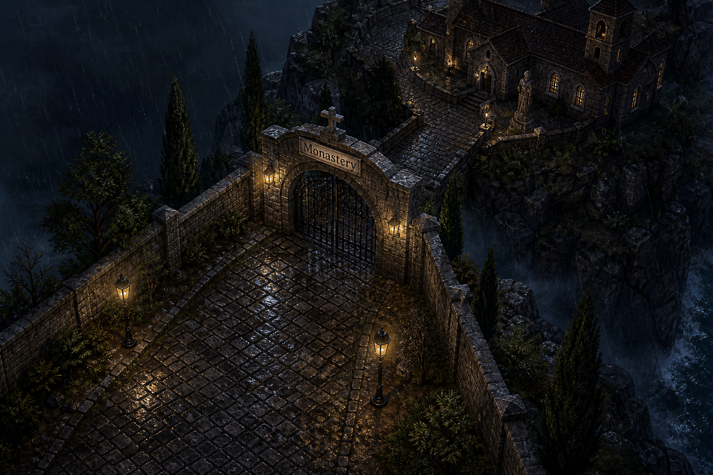

  > AI-generated room concept (2026-08-13).
- **The Chapel (hub).** Civilians and injured; pews pushed aside for makeshift cots, candles burned
  down to stubs, and a Vanguard decontamination station incongruously installed beneath a
  centuries-old side staircase. From here, Jim can see the Library/Archive (locked), the Cloister
  (locked), the Bell Tower stairwell (locked), and the heavy sealed door toward the Crypt
  Antechamber (locked) — several visibly closed-off points seen at once, same convention as the
  other four main locations.

  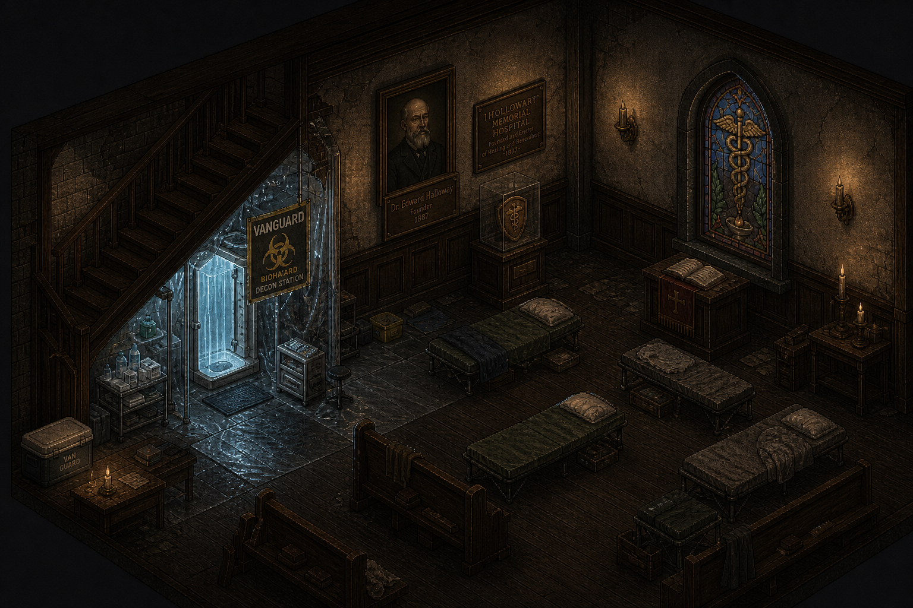

  > AI-generated room concept (2026-08-13). Non-canonical generation error: the render carried over
  > a "Dr. Edward Halloway" portrait/plaque and a caduceus stained-glass window from its Hospital
  > style-reference image — both belong to [`Locations/Hospital.md`](Hospital.md), not this
  > location; ignore that portrait, plaque, and window design.
- **Guest Quarters / Infirmary Cell.** Open from the Chapel. Where the injured Foundry worker was
  sheltered — this district's signature single encounter (fully turned by the time Jim arrives).
  Torn bedsheets used as improvised restraints, a scattered cave map with a circled tunnel
  junction and Vanguard access designation. The **Library Key** is found here.

  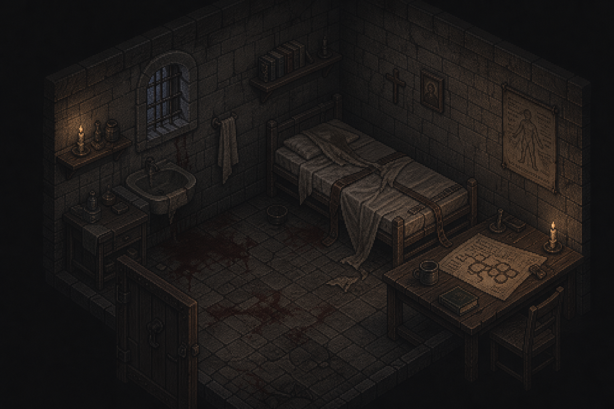

  > AI-generated room concept (2026-08-13).
- **The Spring / Well Chamber.** Open from the Chapel, optional. The monastery's original natural
  spring, now running dark with mineral sediment — the literal "the lower water has turned"
  moment. No key items; pure environmental storytelling.

  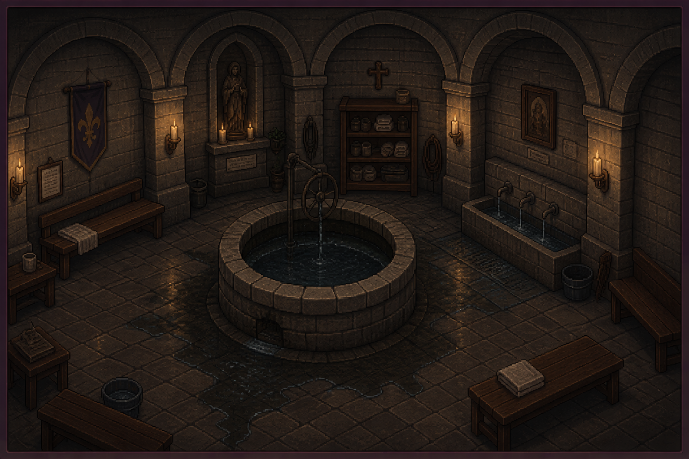

  > AI-generated room concept (2026-08-13).
- **Library / Archive.** Opened with the Library Key. The monastery's Vanguard-accessible archive —
  cave maps, burial records, and correspondence between earlier abbots — plus a clue toward a
  hidden entrance whose actual key is not here, but at the secondary Overlook Trail location (see
  below), a deliberate district-wide backtrack.

  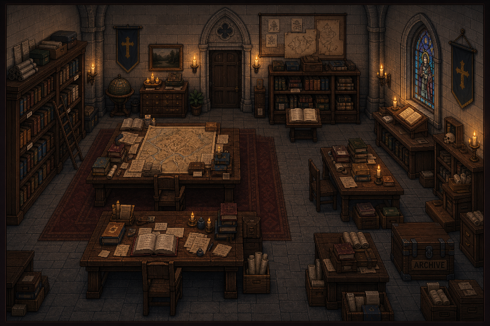

  > AI-generated room concept (2026-08-13).
- **The Hidden Archive.** Opened with the **Archive Key**, found at Overlook Trail. Brother
  Cormac's secret collection: original cave maps, drawings of abnormal bone growth, livestock
  deformity records, and the "the stone does not restore what is lost" document. The **Cloister
  Key** is found here.

  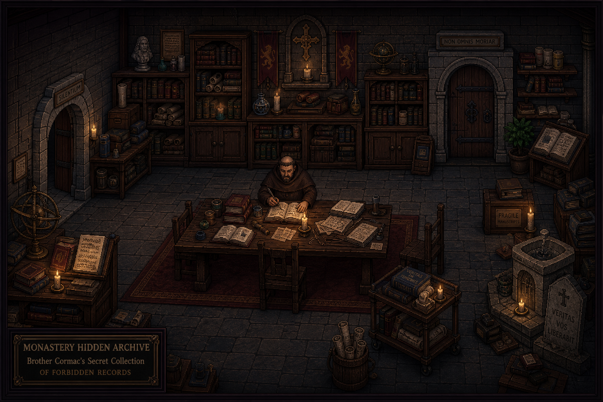

  > AI-generated room concept (2026-08-13).
- **The Cloister.** Opened with the Cloister Key. The police's defensive position during the
  Vanguard standoff (beats 18–20) — sandbags, a barricaded colonnade, spent shell casings, and the
  old Vanguard memorandum the monk handed the responding officer. The **Bell Tower Key** is found
  here.

  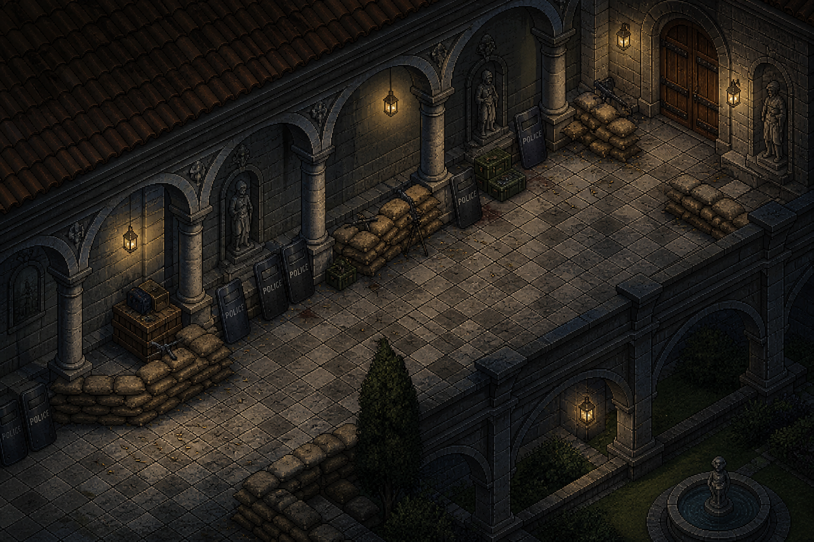

  > AI-generated room concept (2026-08-13).
- **The Bell Tower.** Opened with the Bell Tower Key. The radio/observation room and the bells
  themselves — rope-pull mechanism, a view across the whole ridge and burning town below, and a
  logbook entry describing the emergency ringing pattern used in beat 26.

  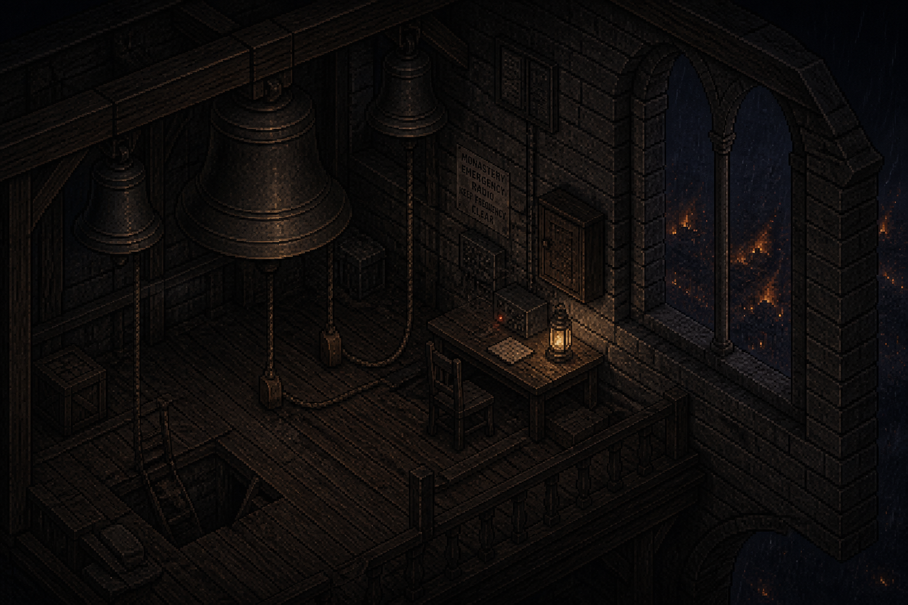

  > AI-generated room concept (2026-08-13).
- **Crypt Antechamber.** Locked; opened with the **Crypt Antechamber Key**, found at the secondary
  Hillside Cemetery location (see below) — a second deliberate district-wide backtrack. Modern
  Vanguard equipment hidden behind ancient masonry: cables, sensors, drilling marks — the
  monastery's version of the Hospital's unauthorized-experiments discovery. Yields a **Breaching
  Tool** needed to force the ancient gate beyond.

  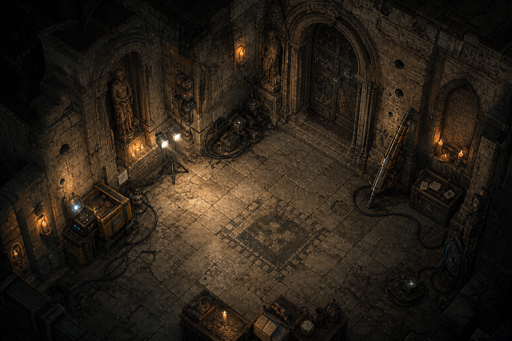

  > AI-generated room concept (2026-08-13).
- **The Old Seal / Crypt Depths.** Forced open with the Breaching Tool. This district's signature
  pack encounter — infected that reached the monastery through Vanguard's own illicit tunnel
  connection to the wider cave network (see "Creatures Encountered," below, for the deliberately
  open question of exactly which). Beyond the cracked ancient gate: generations-old warning
  inscriptions, sealed burial niches, and the **Reliquary Key**, dropped after the encounter.

  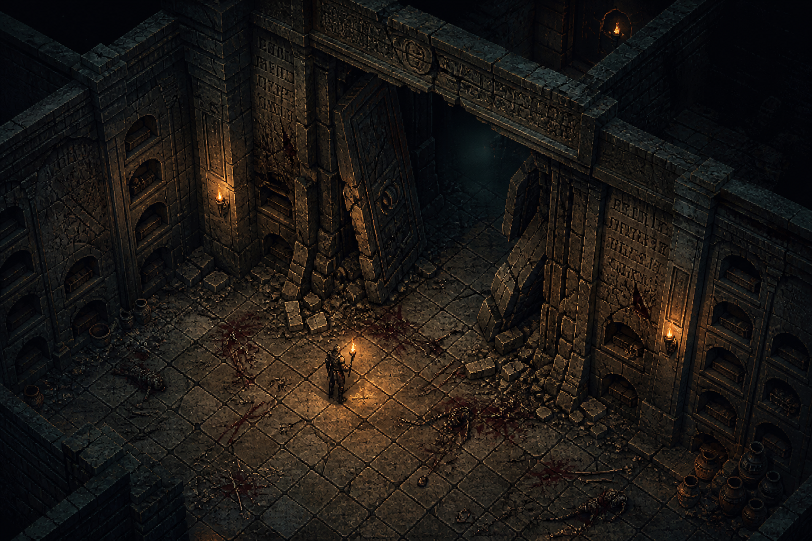

  > AI-generated room concept (2026-08-13).
- **The Reliquary.** Opened with the Reliquary Key. A small, dignified sacred chamber housing
  relics and the monastery's own founding record. A reliquary case holds the **Faith Crest**: a
  bronze, wedge-shaped medallion bearing a relief portrait of **Abbot Matthias Kane**, his name
  and title, and a cross emblem. The direct payoff of this district's entire loop, matching the Old
  Station House, St. Dymphna Chapel, Founder's Boardroom, and Founder's Hall convention exactly.

  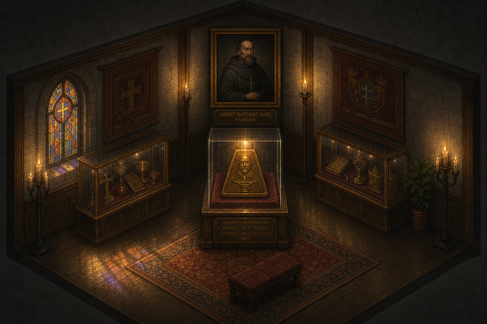

  > AI-generated room concept (2026-08-13).
- **The Sealed Passage / Old Caves.** Past the Reliquary, a further descent into the oldest sealed
  section — the mandatory, non-combat climax, reached only after the Faith Crest is already in
  hand, deliberately placed after the gameplay reward rather than gating it, same convention as the
  Foundry's Black Vein Cavern and the Academy's Maintenance Escape Corridor. Ancient warning
  inscriptions, the oldest record ("A vein without end"), and the location for Brother Cormac's
  final broadcast (beat 33) — **the last surface-world scene in the game before Chapter 3.**

  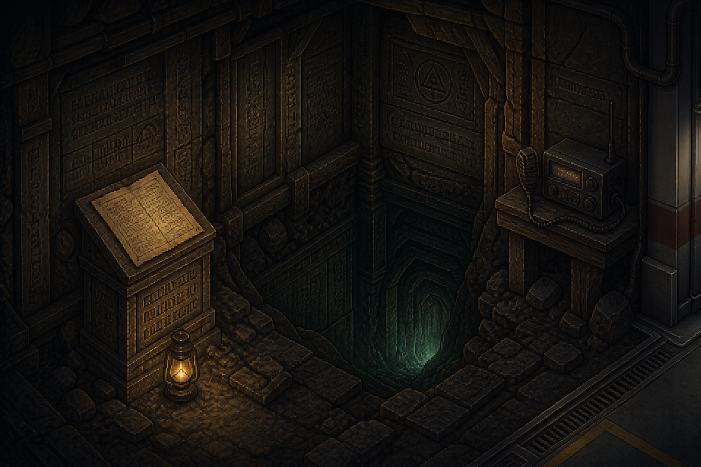

  > AI-generated room concept (2026-08-13).
- **Hillside Residential Street** (secondary, optional). Per
  [`STORY_NOTES.md`](../STORY_NOTES.md)'s earlier city-layout notes: an unsent letter warning the
  monastery about Black Vein, and a deliberate quiet emotional beat — a calm, living dog on a
  porch. No key items; pure environmental storytelling, same role as the Academy's Playgrounds.

  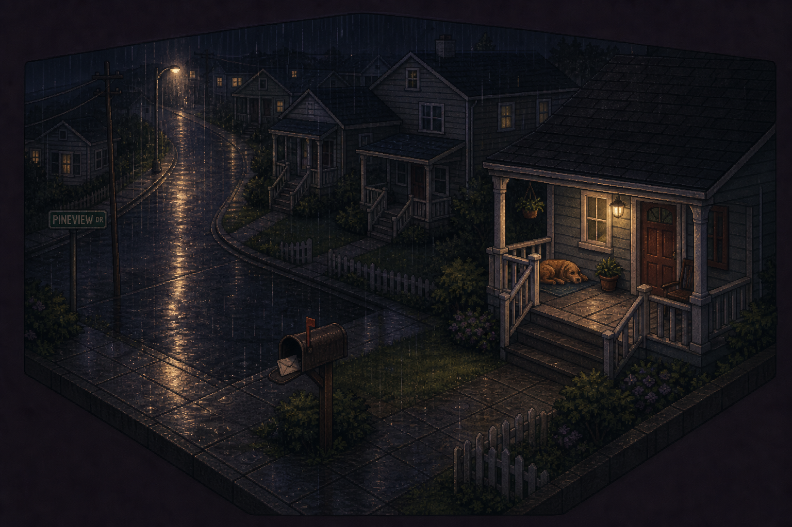

  > AI-generated room concept (2026-08-13).
- **Hillside Cemetery** (secondary, load-bearing). Per
  [`STORY_NOTES.md`](../STORY_NOTES.md)'s earlier city-layout notes: disturbed graves and one very
  recent unmarked grave — dug specifically to hide something. The **Crypt Antechamber Key** is
  found here.

  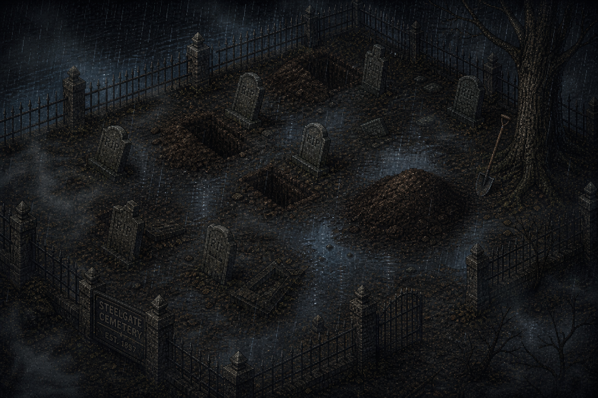

  > AI-generated room concept (2026-08-13). Non-canonical generation error: the entry sign reads
  > "Steelgate Cemetery, Est. 1887" — Steelgate is the Foundry's own name (see
  > [`Locations/Foundry_Refinery.md`](Foundry_Refinery.md)), unrelated to this hillside cemetery;
  > ignore the sign text.
- **Overlook Trail** (secondary, load-bearing). Per [`STORY_NOTES.md`](../STORY_NOTES.md)'s earlier
  city-layout notes: a quiet vista of the whole burning city, reframing the disaster's scale for
  the player. A monk who died fleeing with documents lies along the trail; the **Archive Key** is
  found on his body.

  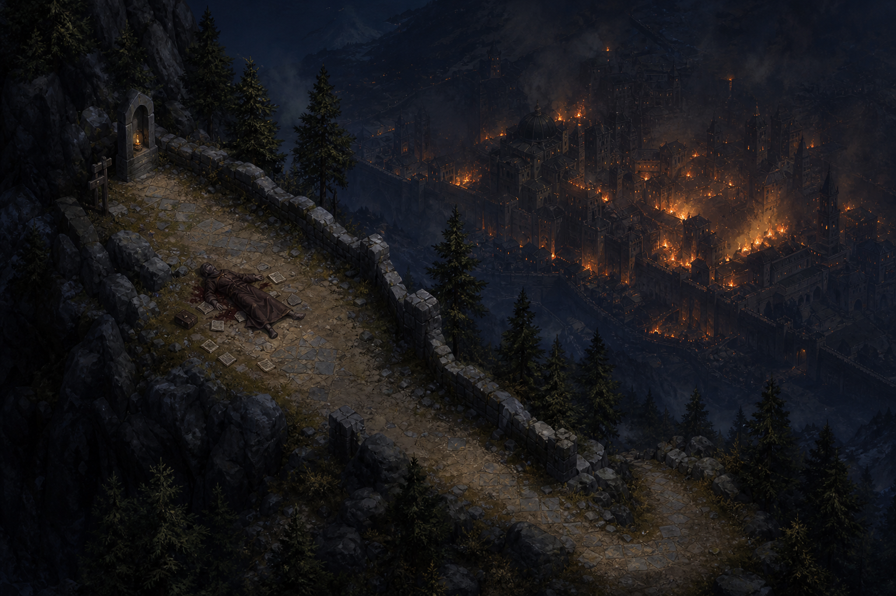

  > AI-generated room concept (2026-08-13).

## Important Rooms / Areas

**Main Building:**
- Monastery Gate / Approach (entry)
- Chapel (hub — visibly gates the Library/Archive, the Cloister, the Bell Tower, and the Crypt
  Antechamber from the start)
- Guest Quarters / Infirmary Cell (signature single encounter; Library Key)
- The Spring / Well Chamber (optional, non-gating flavor room)
- Library / Archive (locked; needs Library Key; clue toward Overlook Trail)
- The Hidden Archive (locked; needs Archive Key from Overlook Trail; Cloister Key)
- The Cloister (locked; needs Cloister Key; Bell Tower Key)
- The Bell Tower (locked; needs Bell Tower Key)
- Crypt Antechamber (locked; needs Crypt Antechamber Key from Hillside Cemetery; Breaching Tool)
- The Old Seal / Crypt Depths (needs Breaching Tool; signature pack encounter; Reliquary Key)
- The Reliquary (locked; needs Reliquary Key; FAITH CREST)
- The Sealed Passage / Old Caves (mandatory story beat, reached past the Reliquary; no lock, no
  combat; final surface-world scene before Chapter 3)

**Secondary Locations (district, not the main monastery building):**
- Hillside Residential Street (optional: environmental storytelling only)
- Hillside Cemetery (load-bearing: Crypt Antechamber Key)
- Overlook Trail (load-bearing: Archive Key)

## Blueprint (Room Connectivity)

> Not a to-scale architectural floor plan — a **relational** diagram of how rooms connect, same
> convention as [`Locations/Ravenwood_Hotel.md`](Ravenwood_Hotel.md),
> [`Locations/Police_Station.md`](Police_Station.md), [`Locations/Hospital.md`](Hospital.md),
> [`Locations/Foundry_Refinery.md`](Foundry_Refinery.md), and [`Locations/Academy.md`](Academy.md).
> Split into one diagram per building/branch; read top to bottom. Solid arrows are direct,
> always-available connections; dashed arrows are gated behind a story condition.
>
> Legend: 👤 NPC · ☠️ enemy/infected/boss · 🗝️ key item · 📄 document · 🔧 manual/mechanical
> (non-power) puzzle · 🚪 gate/access control/shortcut.
>
> **Shape/color key** — same as the other four main locations:
>
> - 🟣 **rectangle, purple** — a room with actual content.
> - 🟡 **pill/stadium, amber** — a hallway, corridor, or crossover — a pure connector.
> - 🔴 **rectangle, red** — a boss/signature-encounter room.
> - 🔵 **pill, blue** — exterior space.
> - ⚪ **dashed grey pill** — a pointer back to a node defined in full on another diagram.

### 1. District Entry → Monastery Gate → Chapel (hub)

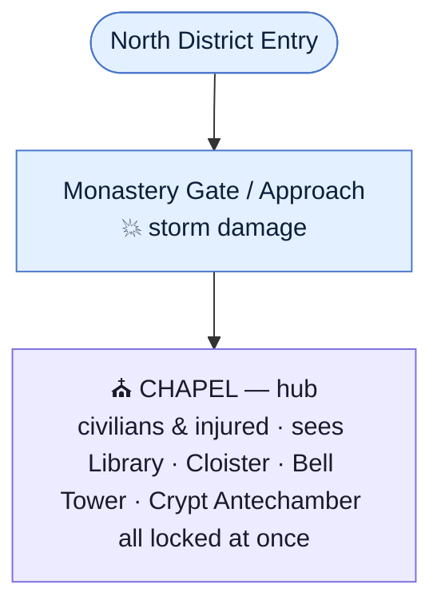
```mermaid
flowchart TD
    ENTRY(["North District Entry"])
    GATE["Monastery Gate / Approach<br/>💥 storm damage"]
    CHAPEL["⛪ CHAPEL — hub<br/>civilians &amp; injured · sees Library · Cloister · Bell Tower · Crypt Antechamber all locked at once"]

    ENTRY --> GATE --> CHAPEL

    classDef room fill:#EDEBFF,stroke:#7C6EE0,color:#1a1a2e
    classDef exterior fill:#E3F0FF,stroke:#4A76C9,color:#0d1f3a
    class ENTRY,GATE exterior
    class CHAPEL room
```

### 2. The Guest Quarters / Spring Chamber (branches off the Chapel)

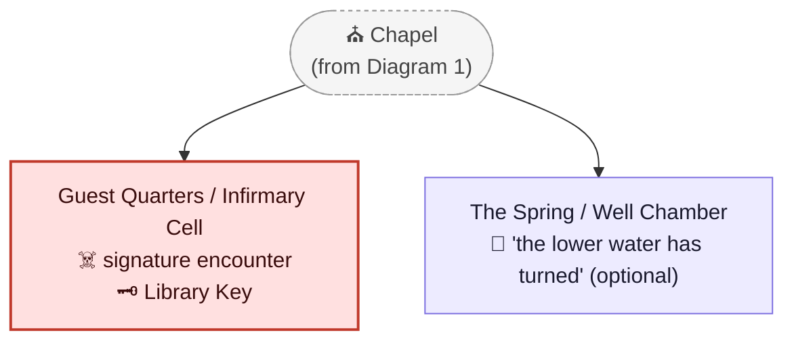
```mermaid
flowchart TD
    CHAPELREF(["⛪ Chapel<br/>(from Diagram 1)"])
    GUEST["Guest Quarters / Infirmary Cell<br/>☠️ signature encounter<br/>🗝️ Library Key"]
    SPRING["The Spring / Well Chamber<br/>📄 'the lower water has turned' (optional)"]

    CHAPELREF --> GUEST
    CHAPELREF --> SPRING

    classDef room fill:#EDEBFF,stroke:#7C6EE0,color:#1a1a2e
    classDef boss fill:#FFE0E0,stroke:#C0392B,color:#3a0d0d,stroke-width:2px
    classDef ref fill:#F5F5F5,stroke:#999999,color:#444444,stroke-dasharray:3 3
    class CHAPELREF ref
    class SPRING room
    class GUEST boss
```

### 3. The Archive / Cloister / Bell Tower Chain

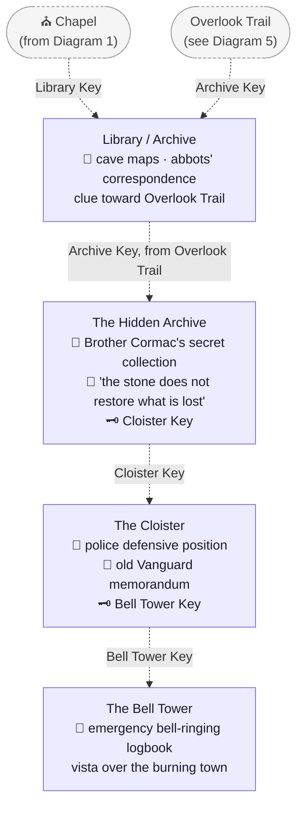
```mermaid
flowchart TD
    CHAPELREF2(["⛪ Chapel<br/>(from Diagram 1)"])
    TRAILREF(["Overlook Trail<br/>(see Diagram 5)"])
    LIBRARY["Library / Archive<br/>📄 cave maps · abbots' correspondence<br/>clue toward Overlook Trail"]
    HIDDEN["The Hidden Archive<br/>👤 Brother Cormac's secret collection<br/>📄 'the stone does not restore what is lost'<br/>🗝️ Cloister Key"]
    CLOISTER["The Cloister<br/>👤 police defensive position<br/>📄 old Vanguard memorandum<br/>🗝️ Bell Tower Key"]
    BELL["The Bell Tower<br/>📄 emergency bell-ringing logbook<br/>vista over the burning town"]

    CHAPELREF2 -. Library Key .-> LIBRARY
    TRAILREF -. Archive Key .-> LIBRARY
    LIBRARY -. Archive Key, from Overlook Trail .-> HIDDEN
    HIDDEN -. Cloister Key .-> CLOISTER
    CLOISTER -. Bell Tower Key .-> BELL

    classDef room fill:#EDEBFF,stroke:#7C6EE0,color:#1a1a2e
    classDef ref fill:#F5F5F5,stroke:#999999,color:#444444,stroke-dasharray:3 3
    class CHAPELREF2,TRAILREF ref
    class LIBRARY,HIDDEN,CLOISTER,BELL room
```

### 4. The Deep Chain — Crypt Antechamber → the Old Seal → the Reliquary → the Sealed Passage

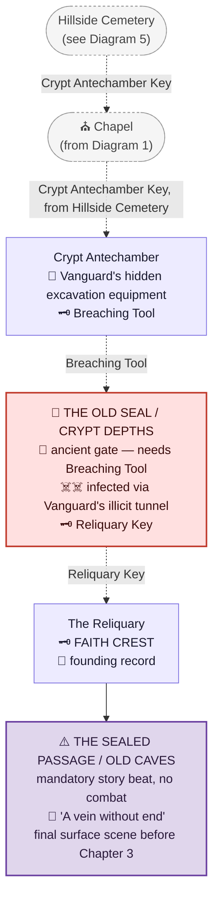
```mermaid
flowchart TD
    CHAPELREF3(["⛪ Chapel<br/>(from Diagram 1)"])
    CEMETERYREF(["Hillside Cemetery<br/>(see Diagram 5)"])
    ANTECHAMBER["Crypt Antechamber<br/>👤 Vanguard's hidden excavation equipment<br/>🗝️ Breaching Tool"]
    OLDSEAL["🔴 THE OLD SEAL / CRYPT DEPTHS<br/>🔧 ancient gate — needs Breaching Tool<br/>☠️☠️ infected via Vanguard's illicit tunnel<br/>🗝️ Reliquary Key"]
    RELIQUARY["The Reliquary<br/>🗝️ FAITH CREST<br/>📄 founding record"]
    SEALEDPASSAGE["⚠️ THE SEALED PASSAGE / OLD CAVES<br/>mandatory story beat, no combat<br/>📄 'A vein without end'<br/>final surface scene before Chapter 3"]

    CEMETERYREF -. Crypt Antechamber Key .-> CHAPELREF3
    CHAPELREF3 -. Crypt Antechamber Key, from Hillside Cemetery .-> ANTECHAMBER
    ANTECHAMBER -. Breaching Tool .-> OLDSEAL
    OLDSEAL -. Reliquary Key .-> RELIQUARY --> SEALEDPASSAGE

    classDef room fill:#EDEBFF,stroke:#7C6EE0,color:#1a1a2e
    classDef boss fill:#FFE0E0,stroke:#C0392B,color:#3a0d0d,stroke-width:2px
    classDef ref fill:#F5F5F5,stroke:#999999,color:#444444,stroke-dasharray:3 3
    classDef vanguard fill:#E0D6EC,stroke:#6A3FA0,color:#2a1a3a,stroke-width:2px
    class CHAPELREF3,CEMETERYREF ref
    class ANTECHAMBER,RELIQUARY room
    class OLDSEAL boss
    class SEALEDPASSAGE vanguard
```

### 5. Secondary Locations (reached from the District Entry)

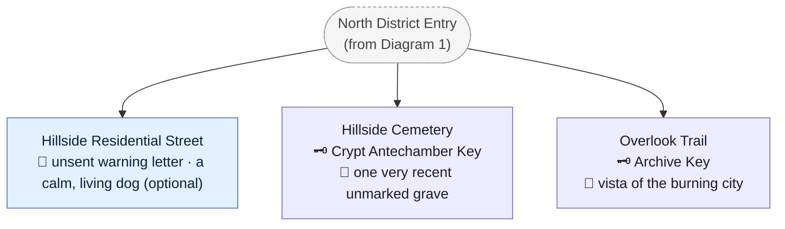
```mermaid
flowchart TD
    ENTRYREF(["North District Entry<br/>(from Diagram 1)"])
    STREET["Hillside Residential Street<br/>📄 unsent warning letter · a calm, living dog (optional)"]
    CEMETERY["Hillside Cemetery<br/>🗝️ Crypt Antechamber Key<br/>📄 one very recent unmarked grave"]
    TRAIL["Overlook Trail<br/>🗝️ Archive Key<br/>📄 vista of the burning city"]

    ENTRYREF --> STREET
    ENTRYREF --> CEMETERY
    ENTRYREF --> TRAIL

    classDef room fill:#EDEBFF,stroke:#7C6EE0,color:#1a1a2e
    classDef exterior fill:#E3F0FF,stroke:#4A76C9,color:#0d1f3a
    classDef ref fill:#F5F5F5,stroke:#999999,color:#444444,stroke-dasharray:3 3
    class ENTRYREF ref
    class CEMETERY,TRAIL room
    class STREET exterior
```

## Characters Encountered

- **Brother Cormac** — never seen alive or dead; known entirely through the Hidden Archive, the
  Cloister standoff, and his final broadcast. His ultimate fate is deliberately unresolved, same
  convention as Fitch, Ashford, the Police Station's Chief, and the Hospital's Liaison.
- The injured Foundry worker, the responding police officer, and the fleeing monk on Overlook
  Trail are all referenced through documents/environmental storytelling only — per the established
  convention across all five main locations of telling this story through found material rather
  than an on-screen cast.

## Creatures Encountered

- **Deliberately left open (per the source material's own framing: "The exact creature can depend
  on what enemy roster eventually fits the location").** The Old Seal / Crypt Depths' signature
  pack encounter is written here as standard **[Shamblers](../Creatures/Shambler.md)** — infected
  that reached the monastery via Vanguard's illicit tunnel from the Foundry side — but unlike the
  Police Station (Ashen Hound), Hospital (Broodling + Boss), and Foundry (Exposure Cohort), no new
  creature type is locked for this district. See "Unresolved Ideas," below.

## Puzzles

- **The Chapel hub.** Four visibly locked points (Library/Archive, Cloister, Bell Tower, Crypt
  Antechamber) are all seen at once before any of them can be opened — same "see the shape of
  what's left to solve" convention as the other four main locations.
- **The Guest Quarters → Library chain.** A straightforward single-purpose lock-and-key sequence
  introducing the archive and the cave-map clue toward Overlook Trail.
- **The Overlook Trail → Hidden Archive → Cloister → Bell Tower chain.** The Archive Key can't be
  found inside the main building at all — a deliberate district-wide backtrack, mirroring the
  Foundry's Loading Docks, the Hospital's Medical Arts Building, and the Academy's Student Housing
  conventions. The Cloister Key and Bell Tower Key are then found in sequence inside the building
  itself, short internal follow-up steps.
- **The Hillside Cemetery → Crypt Antechamber → the Old Seal chain.** The Crypt Antechamber Key is
  likewise found at a separate secondary location, and the Breaching Tool recovered in the
  Antechamber is needed to force the ancient gate beyond — the second deliberate district-wide
  backtrack.
- **The Old Seal → Reliquary → Sealed Passage chain.** The Faith Crest, and the mandatory Sealed
  Passage climax beyond it, are only reachable after clearing the district's signature pack
  encounter, keeping the emblem — and the game's final surface-world scene — behind the deepest,
  most-gated point, per the design standard.

## Key Items

- **Library Key** (_no `Items/` writeup yet_) — Guest Quarters / Infirmary Cell; opens the
  Library/Archive.
- **Archive Key** (_no `Items/` writeup yet_) — Overlook Trail (secondary location); opens the
  Hidden Archive.
- **Cloister Key** (_no `Items/` writeup yet_) — the Hidden Archive; opens the Cloister.
- **Bell Tower Key** (_no `Items/` writeup yet_) — the Cloister; opens the Bell Tower.
- **Crypt Antechamber Key** (_no `Items/` writeup yet_) — Hillside Cemetery (secondary location);
  opens the Crypt Antechamber.
- **Breaching Tool** (_no `Items/` writeup yet_) — the Crypt Antechamber; forces the ancient gate
  into the Old Seal / Crypt Depths.
- **Reliquary Key** (_no `Items/` writeup yet_) — dropped after clearing the Old Seal / Crypt
  Depths' pack encounter; opens the Reliquary.
- **Faith Crest** (_no `Items/` writeup yet_) — the district's founder's emblem; the Reliquary's
  display case.

> None of this district's key items have their own `Items/` writeup yet, same status as the
> Hospital's, Foundry's, and Academy's own new key items — see "Unresolved Ideas," below.

### Documents

- **"The Mercy That Should Not Be Asked For"** (general archive) — the earliest generations'
  religious-language description of Black Vein's regenerative effects.
- **"The stone does not restore what is lost. It replaces according to its own design."** (Hidden
  Archive) — a pre-scientific description of malformed regeneration, centuries before Ravenwood
  Memorial independently discovers the same phenomenon.
- **The old Vanguard memorandum** (the Cloister) — proof Vanguard has known about Black Vein
  exposure beneath Ravenwood for decades; the document that turns the responding police officer.
- **The emergency bell-ringing logbook** (the Bell Tower) — the historical fire/disaster pattern
  used to warn the town in beat 26.
- **Ancient warning inscriptions** (the Old Seal / Crypt Depths) — generations-old carved
  warnings, including the practical (not superstitious) origin of "do not open the gate for the
  voice of a friend."
- **The founding record** (the Reliquary) — Abbot Matthias Kane's 1887 chartering of the modern
  monastic order, per [`CANON.md`](../CANON.md)'s reconciliation note.
- **The oldest record — "A vein without end"** (the Sealed Passage / Old Caves) — the monastery's
  own account of Black Vein's first discovery beneath the ridge, and its warning that the
  formation continues far deeper than anyone has ever mapped.
- **Correspondence proving Vanguard obtained monastery records years before Project Ashen's modern
  form** (the Sealed Passage / Old Caves, alongside the oldest record) — the single clearest proof
  of Vanguard's culpability across all five main locations: not an unforeseeable discovery, but
  documented warnings ignored.
- **The unsent letter warning the monastery about Black Vein** (Hillside Residential Street,
  optional) — per [`STORY_NOTES.md`](../STORY_NOTES.md)'s original concept for this secondary
  location.
- **Brother Cormac's final broadcast** (the Sealed Passage / Old Caves) — *"To whoever remains in
  Ravenwood." "The source is beneath us." "It was here before Vanguard." "Do not believe they
  discovered it." "They opened what others had already learned to close."* Static.

## Major Scripted Events

- The signature encounter at the Guest Quarters / Infirmary Cell (the turned Foundry worker).
- The Overlook Trail → Hidden Archive → Cloister → Bell Tower backtrack, revealing Brother
  Cormac's secret collection and the police/Vanguard standoff aftermath.
- The Hillside Cemetery → Crypt Antechamber backtrack, revealing Vanguard's illicit excavation
  equipment.
- The Old Seal / Crypt Depths pack encounter, cracking the ancient gate.
- Retrieving the Faith Crest from the Reliquary.
- The mandatory, non-combat Sealed Passage / Old Caves finale — **the last surface-world scene in
  the game**, delivering Brother Cormac's final broadcast and the direct narrative handoff into
  Chapter 3.

## Boss Encounters

- No unique named boss is proposed for this district (matching the Academy's own status) — the Old
  Seal / Crypt Depths' pack fight fills that structural role. Deliberately left open per the source
  material's own framing that the exact creature roster here "can depend on what enemy roster
  eventually fits the location" — flagged as an open design gap below rather than invented without
  support.

## Crest Progression

Source of the **Faith Crest** (North / FAITH wedge / Cross symbol — see [`CANON.md`](../CANON.md)
→ "The Founders & the Five Crests"). Can be returned to the Founders Memorial any time Jim
backtracks to Memorial Park; not forced immediately after pickup. **Completing this district
completes all five crests** — the Founders Memorial's water basin can now be drained, revealing the
staircase down to Chapter 3.

## Exit / Progression to Next Area

Once the Faith Crest is collected and the Sealed Passage / Old Caves finale witnessed, all five
districts are complete. Jim returns to Memorial Park, places the fifth emblem, drains the basin,
and descends the revealed staircase — beginning Chapter 3.

## Unresolved Ideas

- **This entire district is a first draft, pending review** — same status the Foundry, Hospital,
  Academy, and (originally) the Police Station had before their own reviews/restructures were
  approved.
- None of the eight new key items above have individual `Items/Key_Items/` writeups yet — proposed
  as a future pass alongside the still-pending `Items/` audits for the Hospital, Foundry, and
  Academy.
- **No unique named boss creature or new creature type is proposed for this district** — the
  source material explicitly leaves this open ("the exact creature can depend on what enemy roster
  eventually fits the location"). Given the Police Station, Hospital, and Foundry each have a
  unique signature creature and the Academy deliberately doesn't, this is worth a final decision
  pass once the full Chapter 2 enemy roster is reviewed together — reusing Shamblers here keeps
  the option open without forcing a rushed design.
- Whether Brother Cormac deserves his own dedicated `Characters/` file (matching Aaron Cole's
  treatment) rather than being described only within this location file — not done here, consistent
  with how Fitch, Ashford, the Police Station's Chief, and the Hospital's Liaison were also left
  undocumented outside their own location files.
- Full scene-by-scene scripting into a `Scripts/` file — everything above is at the
  location-design/prose level, matching where the Foundry, Hospital, and Academy stood before
  their own (still-pending) scripting passes.
- The reconciliation between Abbot Matthias Kane's 1887 founder credit and the monastery/cave
  system's much older, unspecified original age is flagged in [`CANON.md`](../CANON.md) — the
  exact "how old is the pre-1887 monastery" question is left deliberately vague rather than
  assigned a specific century.
- Whether the survivors from the failed evacuation (beat 31) or the group left behind with Brother
  Cormac (beat 30) should ever be resolved elsewhere in the game — explicitly left open per the
  source material's own framing, same convention as the Academy's Bus One and escape-corridor
  threads.
