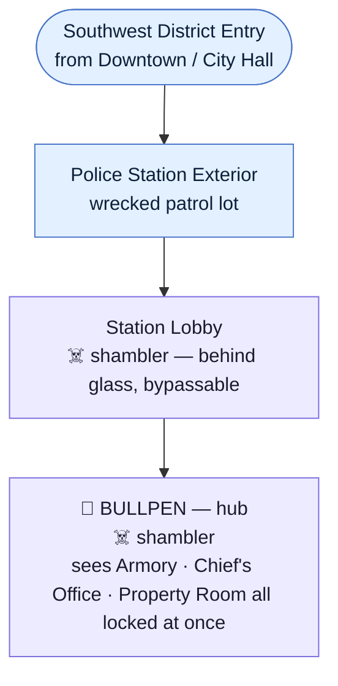
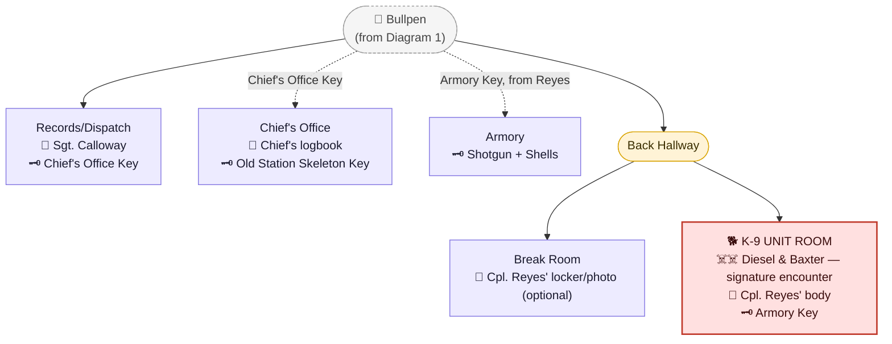
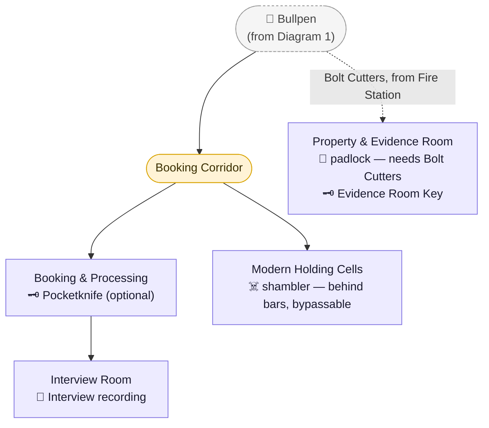
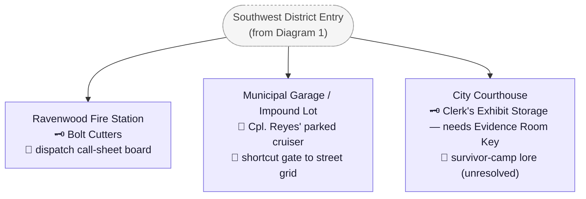

# Ravenwood Police Station

> The Southwest District's main location — Authority Crest. Full scene-by-scene script:
> [`Scripts/Chapter_2_Ravenwood.md`](../Scripts/Chapter_2_Ravenwood.md), Scenes 22–40 (district
> entry through the three secondary locations). [`AI.json`](../AI.json) only reached outline-level
> detail for this district — the interior of the station itself, its survivor, and the emblem's
> appearance/location were all open questions it never answered. Everything below beyond the
> district's overall shape (closest to the park, natural first stop, three named secondary
> locations) is new (2026-08-13) and should be treated as a proposal pending review.
>
> **Revision note:** this location was restructured (2026-08-13, approved) to match the new
> [`CANON.md`](../CANON.md) → "District Main-Location Design Standard" — a Resident Evil
> mansion/RPD-style key-and-lock exploration space, not a short linear pass. An earlier draft
> placed the Ashen Hound encounter at the Municipal Garage and an "evidence room" at the
> Courthouse; both were corrected (K-9 unit moved into the station itself; the Courthouse's room
> renamed and re-purposed) after review — see [`STORY_NOTES.md`](../STORY_NOTES.md) for the full
> before/after rationale.

## Purpose in the Overall Story

The natural first of the five open-order districts — closest to Memorial Park, and the explicit
destination the guardhouse groundskeeper's note points toward ("look at the police station... the
old building... not the annex"). Built as the first of the five districts' main "mansion/RPD"-style
locations: a single hub room (the Bullpen) visibly gates several locked doors at once, and reaching
the **Authority Crest** requires a genuine multi-key backtracking loop across the main station and
its three secondary locations, targeting roughly 2–3 hours of exploration — comparable in density
to the Ravenwood Hotel.

## Arrival / Setup

- Jim leaves Downtown Ravenwood (after City Hall) and crosses into the Southwest civic complex —
  visually distinct from downtown: institutional architecture, wider streets, chain-link, the
  department's own failed emergency response (crashed/abandoned cruisers, a scattered barricade)
  visible before Jim ever reaches the building itself.
- The station is two connected structures: a **modern annex** (the working police department —
  lobby, bullpen, records/dispatch, Chief's office, K-9 unit room, armory, property & evidence
  room) and, separated by a breezeway, the **original 1887 station house** — a small stone
  building, now boarded up and used only for historical display, that the modern department has
  stopped thinking about. The groundskeeper's note's distinction ("not the annex — the original
  1890s structure") is the reason this split exists.

## Storyline

- **The Lobby.** A bulletproof-glass reception window (intact) traps a lone shambler behind it — a
  deliberate non-threat, meant to be seen and bypassed rather than fought.

  

  > AI-generated room concept (2026-08-13). Matches the scripted beat closely (glass-shielded
  > shambler, waiting-room seating, directory sign).
- **The Bullpen (hub).** One shambler encounter. From here, Jim can see three locked/sealed
  points at once: the **Armory** (keyed lock), the **Chief's Office** (keyed lock), and the
  **Property & Evidence Room** (padlocked shut). Sergeant Calloway's voice is heard from the
  barricaded Records/Dispatch room at the back.

  

  > AI-generated room concept (2026-08-13), styled to match the uploaded Hotel screenshots — a
  > general approximation of layout/mood, not a locked floor plan. Matches the scripted room
  > closely (all four labeled doors, the tactical map, the coffee station, the overturned-desk
  > barricade).
- **Sergeant Calloway.** If the station is visited first, she's alive, barricaded in
  Records/Dispatch. She confirms Deadlock Protocol's scope (sealed at the county line, not just
  Ravenwood), gives Jim the **Chief's Office Key**, explains that **Corporal Eli Reyes** — who has
  the armory key —   went to check on the K-9 unit around midnight and never came back, and mentions
  the Property Room's padlock needs bolt cutters, available at the Fire Station. She stays behind.
  If a different district is visited first, she doesn't survive; see her character file for the
  (not yet scripted) alternate version of this beat.

  

  > AI-generated room concept (2026-08-13). Note: the image invented a second, unrelated desk
  > nameplate reading "DET. HARRIS" — flagged as non-canonical filler, not a new character; this
  > district has no detective named Harris in any script or character file.
- **The Chief's Office.** Calloway's key opens it. The Chief's own logbook confirms Reyes went to
  check on the K-9 unit and never returned — and that the Chief went after him in turn (his own
  fate is left unresolved, a deliberate loose thread). The desk holds the **Old Station Skeleton
  Key** — kept here specifically because the old building has historically been the Chief's
  responsibility, not the desk sergeant's.

  

  > AI-generated room concept (2026-08-13). Note: the image invented a desk nameplate reading
  > "CHIEF E. WHITAKER" — unprompted, and **not confirmed anywhere in the script**. This is
  > flagged rather than treated as a hint: it's plausibly the generator echoing the "E. Whitaker"
  > nameplate already seen in the Hotel's Manager's Office reference screenshot (used as a style
  > reference here), not an intentional connection between the Chief and Earl Whitaker. Do not
  > treat this as confirming the Chief's name/identity without an explicit decision.
- **The K-9 Unit Room.** Down a back hallway: Corporal Reyes' body, one kennel gate already bent
  open, the **Armory Key** still on his belt. Investigating triggers the district's signature
  encounter — two Ashen Hounds (Diesel and Baxter, Reyes' own K-9 partners) — in a tight concrete
  room with nowhere to retreat to.

  

  > AI-generated room concept (2026-08-13).
- **The Armory.** Reyes' key opens a room of mostly-emptied gun racks; one still holds a clamped-
  down shotgun and two boxes of shells, freed with a tool from Jim's own kit. The district's key
  equipment reward, deliberately recovered only after the Ashen Hound fight rather than before it.

  

  > AI-generated room concept (2026-08-13, regenerated twice same day — the first two attempts both
  > drifted into a flat vector-cartoon look (thick black outlines, no pixel-art grain) instead of the
  > project's painterly 2.5D pixel-art style; see [`STORY_NOTES.md`](../STORY_NOTES.md) "Room concept
  > art style correction, take three" for the final fix, anchored directly to a real Hotel screenshot
  > and a known-good room concept). Matches the
  > scripted "mostly-emptied racks, one clamped-down shotgun" beat closely.
- **The Break Room.** A small, deliberately quiet optional stop off the same back hallway as the
  K-9 Unit Room — Corporal Reyes' employee locker holds an old photo of him with Diesel and Baxter
  at their K-9 graduation, a small emotional beat added after his death is already known, plus a
  Medkit and ammunition.

  

  > AI-generated room concept (2026-08-13). Note: the image labeled Reyes' locker "K. HARRISON"
  > instead of "E. REYES" — flagged as a generation error, not canon; the K-9 graduation photo
  > and dog paw-print detailing inside the open locker are otherwise exactly the scripted beat.
- **Booking & Processing.** A fingerprint station, mugshot backdrop, and personal-effects lockers —
  two still tagged and closed, one yielding an optional pocketknife.

  

  > AI-generated room concept (2026-08-13).
- **The Interview Room.** A recorder left running holds an old interview about unsettling animal
  behavior near North Ridge before the outbreak — cross-referencing the newspaper clipping already
  found at Downtown's library — filed and forgotten rather than acted on.

  

  > AI-generated room concept (2026-08-13, regenerated twice same day — the first two attempts both
  > drifted into a flat vector-cartoon look (thick black outlines, no pixel-art grain) instead of the
  > project's painterly 2.5D pixel-art style; see [`STORY_NOTES.md`](../STORY_NOTES.md) "Room concept
  > art style correction, take three" for the final fix, anchored directly to a real Hotel screenshot
  > and a known-good room concept).
- **Modern Holding Cells.** Two working cells, in contrast with the old station house's disused
  ones — one empty with a torn, discarded uniform shirt; one holding a shambler safely behind bars,
  the same "visible but harmless" convention as the lobby's glass-shielded shambler.

  

  > AI-generated room concept (2026-08-13). Matches the scripted "one empty, one caged shambler"
  > beat closely.
- **The Fire Station** (secondary, load-bearing). Supplies, timeline lore via a dispatch call-sheet
  board that cuts off mid-sentence — and a pair of **bolt cutters**, needed back at the station.

  

  > AI-generated room concept (2026-08-13). Matches the scripted dispatch call-sheet board and
  > bolt cutters closely.
- **The Property & Evidence Room.** Bolt cutters open the padlock. A proper long-term evidence
  storage room (not just a wall locker) containing the **Evidence Room Key** (itself tagged as
  evidence, "release pending" to the municipal court) plus optional loot.

  

  > AI-generated room concept (2026-08-13).
- **The Municipal Garage** (secondary, now optional). Supplies, a mechanic's office note, a
  navigation shortcut gate, and Corporal Reyes' own parked patrol cruiser — a light connective
  detail (he walked the rest of the way in on foot) rather than a combat encounter.

  

  > AI-generated room concept (2026-08-13). Note: the wall sign reads "CITY OF RAVENCROFT" instead
  > of Ravenwood — flagged as a generation error, not a new city name; the game's city is locked
  > as **Ravenwood** in [`CANON.md`](../CANON.md).
- **The Breezeway / Navigation Puzzle.** The direct connecting door into the old station house is
  locked with an antique deadbolt. The Old Station Skeleton Key (from the Chief's Office) opens it
  directly — no workaround needed.
- **The Old Station House.** A single hushed room, stone walls, a wall of every chief/marshal's
  photograph going back to 1887. A dusty glass display case holds the **Authority Crest** — a
  bronze, wedge-shaped medallion bearing a relief portrait of Marshal Josiah Hale, his name and
  title, and a small relief of a skeleton key. Breaking the case (old, brittle glass) retrieves it —
  the direct payoff of the Memorial Park guardhouse note.

  

  > AI-generated room concept (2026-08-13) — regenerated once after a first attempt rendered the
  > emblem as a triangular/pyramid shape and invented several unrelated chief names, both of which
  > contradict the locked wedge-shaped medallion and Marshal Josiah Hale specifically. This version
  > corrects the shape and keeps the photo wall generic/illegible rather than inventing names.
- **The Old Holding Cells.** A small optional area behind the main hall — disused cells repurposed
  for records storage. A damaged 1887 town-charter document lists Hale among five "Incorporators of
  Ravenwood," the other four names illegible from water damage — a deliberate, honest way to defer
  naming the remaining four founders until their districts are written.

  

  > AI-generated room concept (2026-08-13), style-anchored to the Old Station House main hall
  > render to keep the antique-stone-building look consistent.
- **The City Courthouse** (secondary, optional). An unresolved survivor-camp environmental beat,
  plus a **Clerk's Exhibit Storage** room (renamed and re-purposed from an earlier draft's
  "evidence room" — a courthouse holds active trial exhibits, not long-term evidence, which is the
  station's job) openable with the Evidence Room Key.

  

  > AI-generated room concept (2026-08-13). Depicts the courtroom itself plus the abandoned
  > survivor-camp alcove and the Clerk's Exhibit Storage door together for one combined reference.

## Important Rooms / Areas

**Modern Annex:**
- Lobby (reception window, a bypassable shambler)
- Bullpen (hub — visibly gates the Armory, Chief's Office, and Property Room from the start)
- Records / Dispatch (Sergeant Calloway)
- Chief's Office (Old Station Skeleton Key; Reyes/Chief logbook)
- Break Room (optional; Reyes' locker/photo; Medkit + ammo)
- K-9 Unit Room (Corporal Reyes' body; Armory Key; Ashen Hound fight)
- Armory (locked; shotgun + shells)
- Booking & Processing (optional pocketknife; personal-effects lockers)
- Interview Room (optional lore: pre-outbreak animal-behavior report, filed and forgotten)
- Modern Holding Cells (optional; one empty, one holding a safely-caged shambler)
- Property & Evidence Room (padlocked; Evidence Room Key)
- Breezeway (connects annex to the old station house; opened with the Skeleton Key)

**Original 1887 Station House:**
- Main Hall (photograph wall; the Authority Crest display case)
- Old Holding Cells (optional; records storage; damaged founding document; optional Medkit)

**Secondary Locations (district, not the main building):**
- Ravenwood Fire Station (load-bearing: bolt cutters)
- Municipal Garage / Impound Lot (optional: supplies, shortcut gate, Reyes' parked cruiser)
- City Courthouse (optional: Clerk's Exhibit Storage, survivor-camp lore)

## Blueprint (Room Connectivity)

> Not a to-scale architectural floor plan — a **relational** diagram of how rooms connect, and
> what's in each one, derived directly from `Storyline` and
> [`Scripts/Chapter_2_Ravenwood.md`](../Scripts/Chapter_2_Ravenwood.md) above, Scenes 22–40. Split
> into one diagram per building/area, same convention as
> [`Ravenwood_Hotel.md`](Ravenwood_Hotel.md)'s blueprint — read them top to bottom; each one notes
> where it picks up from another. Solid arrows are direct, always-available connections; dashed
> arrows are connections gated behind a story condition (a key, a tool, etc.) — the label on the
> arrow says what unlocks it.
>
> Legend: 👤 NPC · ☠️ enemy/infected/boss · 🗝️ key item · 📄 document · 🔧 manual/mechanical
> (non-power) puzzle · 🚪 gate/access control/shortcut.
>
> **Shape/color key** — same as the Hotel's blueprint:
>
> - 🟣 **rectangle, purple** — a room with actual content (NPCs, items, enemies, events).
> - 🟡 **pill/stadium, amber** — a hallway, corridor, or crossover — a pure connector.
> - 🔴 **rectangle, red** — a boss or signature-encounter room.
> - 🔵 **pill, blue** — exterior space (street, district entry, parking lot).
> - ⚪ **dashed grey pill** — a pointer back to a node defined in full on another diagram.

### 1. District Entry → Station Exterior → Lobby → Bullpen (hub)

### 2. The Annex Core (branches off the Bullpen)

### 3. The Booking Wing (branches off the Bullpen)

### 4. Breezeway → Old Station House

### 5. Secondary Locations (reached from the District Entry, not the station directly)

## Characters Encountered

- **[Sergeant Ruth Calloway](../Characters/Ruth_Calloway.md)** — Tier 2 conditional survivor; alive
  only if this is the first district visited.
- **[Corporal Eli Reyes](../Characters/Eli_Reyes.md)** — never seen alive; found dead in the K-9
  Unit Room, still holding one of his dogs' leashes.

## Creatures Encountered

- **[Shamblers](../Creatures/Shambler.md)** — lobby (behind glass, bypassable), bullpen (one
  fought), and the modern holding cells (behind bars, bypassable — same convention as the lobby).
- **[Ashen Hounds](../Creatures/Ashen_Hound.md)** — Diesel and Baxter, Corporal Reyes' K-9
  partners; the district's signature/major encounter, fought in their own kennel room inside the
  main station building.

## Puzzles

- **The Bullpen hub.** Three visibly locked/sealed points (Armory, Chief's Office, Property Room)
  are all seen at once before any of them can be opened — the player can see the shape of what's
  left to solve from the start, per the district design standard.
- **The Reyes/Armory Key chain.** Calloway can't give Jim the armory key directly — it's on
  Corporal Reyes, who has to be found first (K-9 Unit Room), which is also how the district's
  signature fight gets triggered.
- **The Fire Station → Property Room chain.** The Property Room's padlock can't be opened without
  bolt cutters, found two blocks away at the Fire Station — a deliberate backtrack, though this
  entire chain is optional bonus content (ammo/loot + the Courthouse cross-location key) rather
  than something gating the Authority Crest.
- **The Skeleton Key / Breezeway.** The connecting door into the old station house requires the Old
  Station Skeleton Key from the Chief's Office — a specific, single-purpose key rather than a
  generic workaround.

## Key Items

- **Chief's Office Key** — from Sergeant Calloway (or her body); opens the Chief's Office.
- **Old Station Skeleton Key** — Chief's Office desk; opens the breezeway door into the old station
  house.
- **Armory Key** — from Corporal Reyes' body (K-9 Unit Room); opens the armory.
- **Shotgun** + **Shotgun Shells x12** — armory.
- **Pocketknife** (optional) — Booking & Processing; utility/flavor item, no confirmed mechanical
  use yet.
- **Bolt Cutters** — Fire Station; opens the Property & Evidence Room's padlock.
- **Evidence Room Key** — Property & Evidence Room; opens the Courthouse's Clerk's Exhibit Storage.
- **Authority Crest** — the district's founder's emblem; old station house display case.

### Documents

- Chief's logbook (Chief's Office) — confirms the Reyes/K-9 timeline; his own fate left open.
- Commendation wall (Chief's Office) — background references to Marshal Hale's founding-era name.
- Interview recording (Interview Room) — a pre-outbreak report of unsettling animal behavior near
  North Ridge, filed and forgotten; cross-references the newspaper clipping at Downtown's library.
- Marshal Josiah Hale's display-case nameplate (old station house).
- Damaged 1887 town-charter page listing five "Incorporators of Ravenwood" (old holding cells;
  only Hale's name is legible).
- Evidence tag on the Evidence Room Key itself (Property Room) — flavor only.
- Fire Station dispatch call-sheet board (cuts off mid-call, night of the outbreak).
- Municipal Garage mechanic's maintenance log / personal note (birthday cake reminder, never used).
- Courthouse judge's-bench case file (an ordinary pre-outbreak property dispute).

## Major Scripted Events

- Sergeant Calloway's rescue-or-discovery beat (conditional on visit order).
- Discovering Corporal Reyes' body and the two-Ashen-Hound fight in the K-9 Unit Room.
- Retrieving the shotgun from the armory, immediately after surviving that fight.
- The Fire Station → Property Room bolt-cutter chain (optional).
- Unlocking the breezeway with the Old Station Skeleton Key and breaking the display case to
  retrieve the Authority Crest — direct payoff of the Memorial Park guardhouse note.

## Boss Encounters

No full boss fight in this district (contrast with Chapter 1's Caretaker). The Ashen Hound pair in
the K-9 Unit Room functions as the district's "major encounter" per [`AI.json`](../AI.json)'s
per-district design rule, without escalating to boss-fight scale.

## Crest Progression

Source of the **Authority Crest** (Southwest / ORDER wedge / Key symbol — see
[`CANON.md`](../CANON.md) → "The Founders & the Five Crests"). Can be returned to the Founders
Memorial any time Jim backtracks to Memorial Park; not forced immediately after pickup.

## Exit / Progression to Next Area

Once the Authority Crest and shotgun are collected and the three secondary locations explored, Jim
is free to head to any of the remaining four districts (Hospital, Academy, Refinery, Monastery, in
any order) — not yet scripted, but now expected to follow this same main-location design standard.

## Unresolved Ideas

- The alternate ("Calloway already turned") version of Scene 26 is described in her character file
  but not yet scripted scene-by-scene.
- The Chief's own fate (mentioned in his logbook as having gone looking for Reyes) is deliberately
  left open — not resolved anywhere in this district.
- The other four founders' names (deferred via the damaged charter document) — to be decided when
  their respective districts are written, ideally with a consistent period-appropriate naming feel
  to Marshal Josiah Hale.
- Whether the Courthouse's abandoned survivor camp connects to anyone/anything later in the game,
  or stays a purely atmospheric dead end.
- Who was in the modern holding cells' empty cell, and where they ended up — deliberately unstated.
- Who reported the North Ridge animal-behavior sighting on the Interview Room's recorder — left
  anonymous, consistent with how the game generally treats early-warning-sign witnesses.
