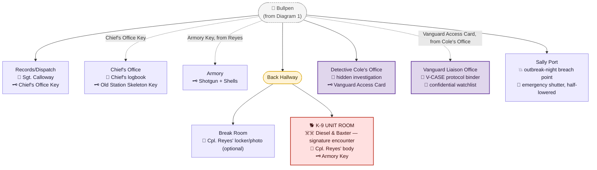
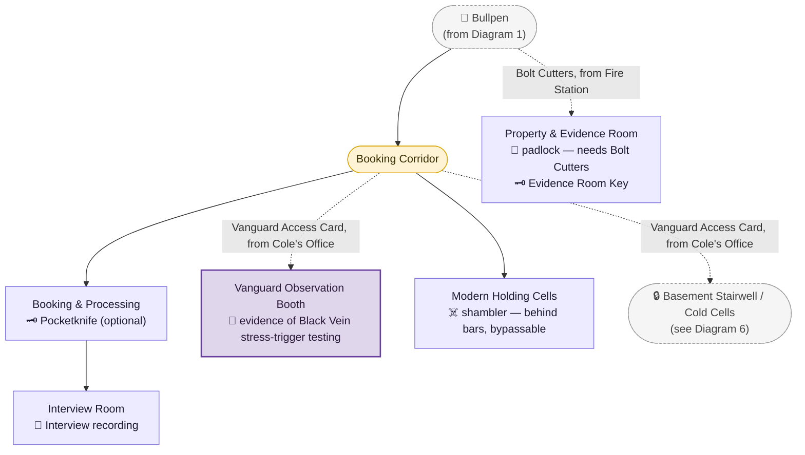
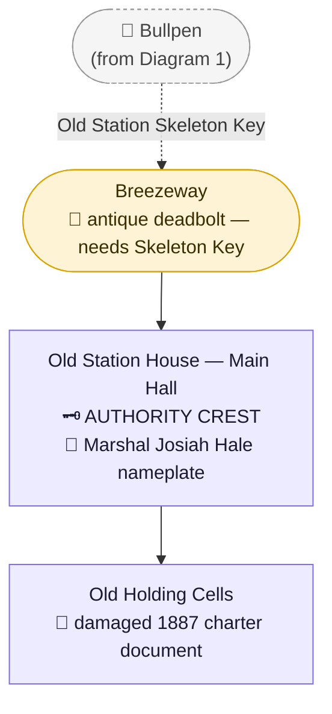
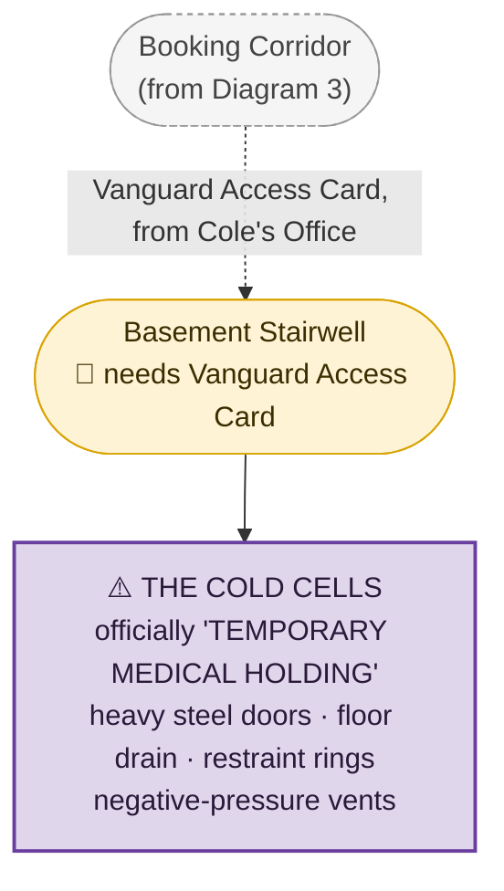

# Ravenwood Police Station

> The Southwest District's main location — Authority Crest. Full scene-by-scene script:
> [`Scripts/Chapter_2_Ravenwood.md`](../Scripts/Chapter_2_Ravenwood.md), Scenes 22–40 (district
> entry through the three secondary locations). [`AI.json`](../AI.json) only reached outline-level
> detail for this district — the interior of the station itself, its survivor, and the emblem's
> appearance/location were all open questions it never answered. Everything below beyond the
> district's overall shape (closest to the park, natural first stop, three named secondary
> locations) is new (2026-08-13) and should be treated as a proposal pending review.
>
> **Revision note:** this location was restructured (2026-08-13, approved) to match the new
> [`CANON.md`](../CANON.md) → "District Main-Location Design Standard" — a Resident Evil
> mansion/RPD-style key-and-lock exploration space, not a short linear pass. An earlier draft
> placed the Ashen Hound encounter at the Municipal Garage and an "evidence room" at the
> Courthouse; both were corrected (K-9 unit moved into the station itself; the Courthouse's room
> renamed and re-purposed) after review — see [`STORY_NOTES.md`](../STORY_NOTES.md) for the full
> before/after rationale.
>
> **Second revision note (2026-08-13, same day):** the project owner supplied a much deeper
> reframe of the department's relationship with Vanguard — see [`CANON.md`](../CANON.md) →
> "Vanguard's Grip on Ravenwood PD." Four new optional rooms and a new never-seen character
> ([Detective Aaron Cole](../Characters/Aaron_Cole.md)) were added as a parallel discovery track;
> see "The Vanguard Sub-Plot," below. Nothing already locked about this district (Calloway, the
> shotgun, the Authority Crest, Diesel/Baxter, or the four existing buildings) changed.
>
> **Third revision note (2026-08-13, same day):** the project owner supplied a full outbreak-night
> timeline for the department — see "Outbreak Night — What Actually Happened," below. This adds
> one new room (the Sally Port — the actual breach point) plus several documents/environmental
> beats (the SURVIVORS/MISSING/DECEASED whiteboard, "Emergency Public Safety Directive 7," the
> Chief's final broadcast recording, the Cold Cells' destroyed door and handwritten note) woven
> into existing rooms. Nothing already locked changed; this only adds texture to how/why the
> station fell.
>
> **Fourth revision note (2026-08-13, same day):** two small crossover documents were added to the
> "Documents" list, below, linking this district's shared outbreak night directly to
> [St. Dymphna Hospital](Hospital.md), the Northeast district's own newly-written main location —
> per the project owner's explicit request that the two locations' records overlap (the same
> radio calls, the same missing ambulances, the same Highway 13 shutdown). Nothing else in this
> file changed.

## Purpose in the Overall Story

The natural first of the five open-order districts — closest to Memorial Park, and the explicit
destination the guardhouse groundskeeper's note points toward ("look at the police station... the
old building... not the annex"). Built as the first of the five districts' main "mansion/RPD"-style
locations: a single hub room (the Bullpen) visibly gates several locked doors at once, and reaching
the **Authority Crest** requires a genuine multi-key backtracking loop across the main station and
its three secondary locations, targeting roughly 2–3 hours of exploration — comparable in density
to the Ravenwood Hotel.

## Outbreak Night — What Actually Happened (proposed 2026-08-13, pending review)

> The station's outbreak night is a **slow institutional collapse, not a monster attack** — cops
> spending the first half of the night genuinely trying to do their jobs while Vanguard fed them
> bad orders, suppressed information, and actively prevented them from responding correctly. By
> the time Jim arrives, almost the entire downfall can be reconstructed from radios, bodies,
> barricades, paperwork, and the environment itself — not delivered through exposition. This
> timeline is the master reference behind the specific documents/details placed in `Storyline`,
> below; it does not change anything already locked (Calloway, Reyes, the shotgun, the Authority
> Crest are all still exactly as established).

1. **Early evening.** The storm is already hammering Ravenwood when dispatch starts getting an
   unusual volume of calls — domestic fights, people wandering into traffic, motiveless assaults,
   residents screaming about "sick people," industrial workers convulsing, aggressive animals,
   missing-person reports, alarms from Vanguard-controlled properties. Officers assume it's the
   storm. Then Vanguard calls the Chief directly: *a minor industrial containment incident* —
   nothing more — and specifically requests unusual medical cases not be taken to Ravenwood
   Memorial Hospital, but processed under the existing **V-CASE procedure** instead. The first
   catastrophic decision, made in good faith.
2. **The Cold Cells fill up.** Officers bring in detainees over the following hours — some
   violent, some terrified, some barely symptomatic at all. Normally Vanguard removes V-CASEs
   almost immediately; tonight, nobody comes. The cells keep filling. Dispatch calls the Liaison
   repeatedly. No response.
3. **Vanguard takes control of police communications.** An emergency directive — **"EMERGENCY
   PUBLIC SAFETY DIRECTIVE 7"** — arrives through the Liaison system: establish roadblocks, prevent
   residents from leaving Ravenwood, restrict access to Vanguard facilities, detain anyone showing
   contamination symptoms, keep civilians away from Highway 13, maintain radio silence about "the
   industrial incident." Framed as preventing chemical exposure from spreading. The department
   complies — and, per [`CANON.md`](../CANON.md), this becomes one of the cruelest facts Jim can
   later reconstruct: **the police helped trap everyone inside Ravenwood**, believing they were
   protecting people outside it.
4. **Officers start suspecting Vanguard knows more than it's saying.** Radio traffic gets
   disturbing — someone hit by a car gets back up; a restrained suspect breaks his own arm and
   doesn't react; a patrol unit near a Vanguard installation reports "there are bodies out here...
   a lot" and is ordered away instead of given backup. Friction starts inside the department —
   some officers want to keep following Vanguard procedure, others want ambulances and fire crews
   sent in for real.
5. **The first rupture.** Basement detainees start deteriorating — one stops responding, one won't
   stop screaming, something starts smashing against a cell door. Once a detainee transforms far
   enough to become genuinely dangerous, two officers go down to check; shots are fired, then
   silence; a third finds one badly injured and the other dead — and the detainee still moving.
   This is the moment the department stops believing it's a chemical spill.
6. **The Chief calls Vanguard directly**, breaking protocol, demanding answers as officers start
   dying. Vanguard's reply: *"Maintain containment."* He says officers are dying; Vanguard calls
   the department **"an essential containment asset"** — not emergency responders, not law
   enforcement. *Asset.* Likely the moment he understands the relationship was never what he
   thought.
7. **Officers start disobeying Vanguard.** Not everyone stays loyal to the directive — several
   redirect patrol cars toward neighborhoods, escort civilians to safer buildings, push toward the
   hospital, try to open the southern Highway 13 evacuation route. **One cruiser is dispatched
   toward the Ravenwood Hotel** — a plausible, unconfirmed connective thread to
   [Officer Dale Pruitt's](../Characters/Dale_Pruitt.md) cruiser crashing through the hotel's front
   doors in Chapter 1; see that character's file for the caveat on treating this as locked.
8. **Vanguard shuts them down.** Vanguard security teams start appearing around Ravenwood — not to
   help civilians, but to secure labs, research sites, contaminated materials, data, and Ashen
   personnel. Police get turned away at certain checkpoints; eventually Vanguard sends **"ALL RPD
   UNITS RETURN TO STATION"** over the network — an order the Chief never issued. Some officers
   obey it. Some don't.
9. **The Highway 13 confrontation.** Officers start dismantling the roadblock for backed-up
   civilian traffic. Vanguard vehicles arrive; their commander orders the checkpoint restored;
   the police refuse. A standoff — nobody wants to fire on people they've worked alongside for
   years — breaks when a mutated civilian attacks nearby. Chaos. Shots fired; nobody knows who
   fired first. Police and Vanguard are functionally enemies from this point on — the source of
   the mixed RPD/Vanguard wreckage and bullet damage visible in the station's own wrecked patrol
   lot (see "Arrival / Setup," below).
10. **The station becomes a shelter.** Surviving officers return with civilians. The Property &
    Evidence Room becomes an improvised armory; interview rooms become treatment rooms; Dispatch
    coordinates survivors; someone starts a whiteboard: **SURVIVORS / MISSING / DECEASED.** The
    names slowly stop being updated.
11. **The Cold Cells become the disaster.** Detainees start mutating with officers unable to bring
    themselves to act while some are still clearly, recognizably human — including, for at least
    one officer, someone he's known his whole life, begging not to be let become "one of those
    things." Jim finds at least one cell destroyed from the inside.
12. **The station is breached — through the vehicle bay, not the front door.** Officers rush an
    injured, contaminated colleague in through the **Sally Port** (the station's own attached
    vehicle bay, not the separate Municipal Garage secondary location); creatures follow the
    vehicle in unnoticed while everyone's distracted. Emergency shutters close, isolating part of
    the building; power fails; Dispatch loses contact with officers downstairs.
13. **Internal breakdown.** Exhausted survivors split over whether to hold the station or
    evacuate, whether to release the Cold Cells' detainees or put them all down, and — once
    someone finds Cole's hidden investigation and the Vanguard files — over the realization that
    Vanguard had flagged some of the people downstairs on its watchlist *months* before the
    outbreak.
14. **The Chief's final broadcast.** Not knowing if anyone's listening, the Chief gets on the
    emergency network and publicly overrides Vanguard: *"All surviving officers disregard Vanguard
    containment orders. Help civilians evacuate by any route available. Do not surrender injured
    persons to Vanguard personnel... Whatever they told us this was — they lied."* Static.
    Gunfire. Transmission ends. This marks the effective death of the department as an
    institution — found by Jim as a recording in Records/Dispatch (see "Storyline," below); the
    Chief's own ultimate fate stays deliberately unresolved, same as before this addition.
15. **The final stand.** A last group of officers and civilians tries to reach Memorial Park while
    others stay behind to draw creatures away and buy time; a few barricade the main hallway until
    ammo runs out. The station goes dark. The radio goes silent — except for the one intermittent
    transmission Jim hears on arrival (see "Arrival / Setup," below).

## Arrival / Setup

- As Jim approaches, a police radio somewhere inside is still transmitting, faint and
  intermittent: *"...any officer... please respond..."* then static — a deliberate hint that
  someone, or something automated, might still be active inside, before Jim ever opens a door.
  The station should read as **very recent**, not decades-abandoned: emergency lights still
  flashing, a cruiser idling outside, phones ringing unanswered, a half-written incident report, a
  dropped shotgun in a hallway, a barricade that failed twenty minutes ago rather than twenty
  years ago.
- Jim leaves Downtown Ravenwood (after City Hall) and crosses into the Southwest civic complex —
  visually distinct from downtown: institutional architecture, wider streets, chain-link, the
  department's own failed emergency response (crashed/abandoned cruisers, a scattered barricade —
  some of the damage bearing mixed RPD and Vanguard markings, the physical trace of the Highway 13
  confrontation) visible before Jim ever reaches the building itself.
- The station is two connected structures: a **modern annex** (the working police department —
  lobby, bullpen, records/dispatch, Chief's office, K-9 unit room, armory, property & evidence
  room) and, separated by a breezeway, the **original 1887 station house** — a small stone
  building, now boarded up and used only for historical display, that the modern department has
  stopped thinking about. The groundskeeper's note's distinction ("not the annex — the original
  1890s structure") is the reason this split exists.

## Storyline

- **The Lobby.** A bulletproof-glass reception window (intact) traps a lone shambler behind it — a
  deliberate non-threat, meant to be seen and bypassed rather than fought.

  

  > AI-generated room concept (2026-08-13). Matches the scripted beat closely (glass-shielded
  > shambler, waiting-room seating, directory sign).
- **The Bullpen (hub).** One shambler encounter. From here, Jim can see three locked/sealed
  points at once: the **Armory** (keyed lock), the **Chief's Office** (keyed lock), and the
  **Property & Evidence Room** (padlocked shut). Sergeant Calloway's voice is heard from the
  barricaded Records/Dispatch room at the back. A whiteboard nearby still reads **SURVIVORS /
  MISSING / DECEASED** in three columns, the handwriting getting less careful toward the bottom of
  each list before it simply stops. A printed copy of **"EMERGENCY PUBLIC SAFETY DIRECTIVE 7"** —
  the Vanguard-issued order to seal the town rather than evacuate it — is pinned to the same board,
  found alongside the reports it contradicts.

  

  > AI-generated room concept (2026-08-13), styled to match the uploaded Hotel screenshots — a
  > general approximation of layout/mood, not a locked floor plan. Matches the scripted room
  > closely (all four labeled doors, the tactical map, the coffee station, the overturned-desk
  > barricade).
- **The Sally Port.** A short connector off the Bullpen into the station's own attached vehicle
  bay — not the separate Municipal Garage secondary location down the street, but the annex's own
  secure entry for prisoner transport. This is where the station was actually breached: officers
  rushed an injured, contaminated colleague in through here late in the outbreak, and something
  followed the vehicle in unnoticed while everyone was distracted. A halfway-lowered emergency
  shutter, dead vehicle-bay lighting, and a dropped shotgun in the doorway mark where the breach
  happened; per "Outbreak Night — What Actually Happened," above, this is also why part of the
  building reads as isolated/without power rather than simply abandoned.

  

  > AI-generated room concept (2026-08-13).
- **Sergeant Calloway.** If the station is visited first, she's alive, barricaded in
  Records/Dispatch. She confirms Deadlock Protocol's scope (sealed at the county line, not just
  Ravenwood), gives Jim the **Chief's Office Key**, explains that **Corporal Eli Reyes** — who has
  the armory key —   went to check on the K-9 unit around midnight and never came back, and mentions
  the Property Room's padlock needs bolt cutters, available at the Fire Station. She stays behind.
  If a different district is visited first, she doesn't survive; see her character file for the
  (not yet scripted) alternate version of this beat. Either way, a recording of the **Chief's
  final broadcast** — publicly overriding Vanguard's containment order over the emergency network,
  ending mid-transmission on gunfire — is found/playable in this room. See "Outbreak Night — What
  Actually Happened," above, for the full timeline this recording is the emotional capstone of.

  

  > AI-generated room concept (2026-08-13). Note: the image invented a second, unrelated desk
  > nameplate reading "DET. HARRIS" — flagged as non-canonical filler, not a new character; this
  > district has no detective named Harris in any script or character file.
- **The Chief's Office.** Calloway's key opens it. The Chief's own logbook confirms Reyes went to
  check on the K-9 unit and never returned — and that the Chief went after him in turn (his own
  fate is left unresolved, a deliberate loose thread). The desk holds the **Old Station Skeleton
  Key** — kept here specifically because the old building has historically been the Chief's
  responsibility, not the desk sergeant's.

  

  > AI-generated room concept (2026-08-13). Note: the image invented a desk nameplate reading
  > "CHIEF E. WHITAKER" — unprompted, and **not confirmed anywhere in the script**. This is
  > flagged rather than treated as a hint: it's plausibly the generator echoing the "E. Whitaker"
  > nameplate already seen in the Hotel's Manager's Office reference screenshot (used as a style
  > reference here), not an intentional connection between the Chief and Earl Whitaker. Do not
  > treat this as confirming the Chief's name/identity without an explicit decision.
- **The Back Hallway.** A short, quiet corridor off the Bullpen leading to the Break Room and the
  K-9 Unit Room.

  

  > AI-generated room concept (2026-08-13).
- **The K-9 Unit Room.** Down the back hallway: Corporal Reyes' body, one kennel gate already bent
  open, the **Armory Key** still on his belt. Investigating triggers the district's signature
  encounter — two Ashen Hounds (Diesel and Baxter, Reyes' own K-9 partners) — in a tight concrete
  room with nowhere to retreat to.

  

  > AI-generated room concept (2026-08-13).
- **The Armory.** Reyes' key opens a room of mostly-emptied gun racks; one still holds a clamped-
  down shotgun and two boxes of shells, freed with a tool from Jim's own kit. The district's key
  equipment reward, deliberately recovered only after the Ashen Hound fight rather than before it.

  

  > AI-generated room concept (2026-08-13, regenerated twice same day — the first two attempts both
  > drifted into a flat vector-cartoon look (thick black outlines, no pixel-art grain) instead of the
  > project's painterly 2.5D pixel-art style; see [`STORY_NOTES.md`](../STORY_NOTES.md) "Room concept
  > art style correction, take three" for the final fix, anchored directly to a real Hotel screenshot
  > and a known-good room concept). Matches the
  > scripted "mostly-emptied racks, one clamped-down shotgun" beat closely.
- **The Break Room.** A small, deliberately quiet optional stop off the same back hallway as the
  K-9 Unit Room — Corporal Reyes' employee locker holds an old photo of him with Diesel and Baxter
  at their K-9 graduation, a small emotional beat added after his death is already known, plus a
  Medkit and ammunition.

  

  > AI-generated room concept (2026-08-13). Note: the image labeled Reyes' locker "K. HARRISON"
  > instead of "E. REYES" — flagged as a generation error, not canon; the K-9 graduation photo
  > and dog paw-print detailing inside the open locker are otherwise exactly the scripted beat.
- **The Booking Corridor.** A wider hallway off the Bullpen with a directory sign pointing toward
  Booking, the Interview Room, and the Modern Holding Cells.

  

  > AI-generated room concept (2026-08-13, regenerated once — the first attempt drifted into a flat
  > vector-cartoon look instead of the project's painterly 2.5D pixel-art style; this version
  > corrects it, style-anchored directly to the Booking & Processing and Bullpen renders).
- **Booking & Processing.** A fingerprint station, mugshot backdrop, and personal-effects lockers —
  two still tagged and closed, one yielding an optional pocketknife.

  

  > AI-generated room concept (2026-08-13).
- **The Interview Room.** A recorder left running holds an old interview about unsettling animal
  behavior near North Ridge before the outbreak — cross-referencing the newspaper clipping already
  found at Downtown's library — filed and forgotten rather than acted on.

  

  > AI-generated room concept (2026-08-13, regenerated twice same day — the first two attempts both
  > drifted into a flat vector-cartoon look (thick black outlines, no pixel-art grain) instead of the
  > project's painterly 2.5D pixel-art style; see [`STORY_NOTES.md`](../STORY_NOTES.md) "Room concept
  > art style correction, take three" for the final fix, anchored directly to a real Hotel screenshot
  > and a known-good room concept).
- **Modern Holding Cells.** Two working cells, in contrast with the old station house's disused
  ones — one empty with a torn, discarded uniform shirt; one holding a shambler safely behind bars,
  the same "visible but harmless" convention as the lobby's glass-shielded shambler.

  

  > AI-generated room concept (2026-08-13). Matches the scripted "one empty, one caged shambler"
  > beat closely.
- **The Fire Station** (secondary, load-bearing). Supplies, timeline lore via a dispatch call-sheet
  board that cuts off mid-sentence — and a pair of **bolt cutters**, needed back at the station.

  

  > AI-generated room concept (2026-08-13). Matches the scripted dispatch call-sheet board and
  > bolt cutters closely.
- **The Property & Evidence Room.** Bolt cutters open the padlock. A proper long-term evidence
  storage room (not just a wall locker) containing the **Evidence Room Key** (itself tagged as
  evidence, "release pending" to the municipal court) plus optional loot.

  

  > AI-generated room concept (2026-08-13).
- **The Municipal Garage** (secondary, now optional). Supplies, a mechanic's office note, a
  navigation shortcut gate, and Corporal Reyes' own parked patrol cruiser — a light connective
  detail (he walked the rest of the way in on foot) rather than a combat encounter.

  

  > AI-generated room concept (2026-08-13). Note: the wall sign reads "CITY OF RAVENCROFT" instead
  > of Ravenwood — flagged as a generation error, not a new city name; the game's city is locked
  > as **Ravenwood** in [`CANON.md`](../CANON.md).
- **The Breezeway / Navigation Puzzle.** The direct connecting door into the old station house is
  locked with an antique deadbolt. The Old Station Skeleton Key (from the Chief's Office) opens it
  directly — no workaround needed.

  

  > AI-generated room concept (2026-08-13). Deliberately shows the architectural transition from the
  > modern annex's cinderblock/steel door to the old station house's stone and antique deadbolt door
  > — the visual cue for the split the groundskeeper's note refers to ("not the annex... the original
  > 1890s structure").
- **The Old Station House.** A single hushed room, stone walls, a wall of every chief/marshal's
  photograph going back to 1887. A dusty glass display case holds the **Authority Crest** — a
  bronze, wedge-shaped medallion bearing a relief portrait of Marshal Josiah Hale, his name and
  title, and a small relief of a skeleton key. Breaking the case (old, brittle glass) retrieves it —
  the direct payoff of the Memorial Park guardhouse note.

  

  > AI-generated room concept (2026-08-13) — regenerated once after a first attempt rendered the
  > emblem as a triangular/pyramid shape and invented several unrelated chief names, both of which
  > contradict the locked wedge-shaped medallion and Marshal Josiah Hale specifically. This version
  > corrects the shape and keeps the photo wall generic/illegible rather than inventing names.
- **The Old Holding Cells.** A small optional area behind the main hall — disused cells repurposed
  for records storage. A damaged 1887 town-charter document lists Hale among five "Incorporators of
  Ravenwood," the other four names illegible from water damage — a deliberate, honest way to defer
  naming the remaining four founders until their districts are written.

  

  > AI-generated room concept (2026-08-13), style-anchored to the Old Station House main hall
  > render to keep the antique-stone-building look consistent.
- **The City Courthouse** (secondary, optional). An unresolved survivor-camp environmental beat,
  plus a **Clerk's Exhibit Storage** room (renamed and re-purposed from an earlier draft's
  "evidence room" — a courthouse holds active trial exhibits, not long-term evidence, which is the
  station's job) openable with the Evidence Room Key.

  

  > AI-generated room concept (2026-08-13). Depicts the courtroom itself plus the abandoned
  > survivor-camp alcove and the Clerk's Exhibit Storage door together for one combined reference.

### The Vanguard Sub-Plot (optional, proposed 2026-08-13)

> Per [`CANON.md`](../CANON.md) → "Vanguard's Grip on Ravenwood PD": the officers here aren't
> secretly Vanguard villains — they're real cops who believed they were protecting Ravenwood while
> Vanguard quietly turned the department into an unofficial containment arm around them. This
> entire sub-plot is **optional and does not gate the Authority Crest** or any part of the
> mandatory critical path — it's a parallel discovery track for players who dig, built to reward
> the district's already-established "backtracking is the point" design standard with a second,
> darker layer once the Vanguard Access Card is found. Delivered primarily through environmental
> discovery (found documents, an abandoned office, a hidden room), per the game's established
> storytelling convention — not through NPC dialogue dumps.

- **Detective Cole's Office.** A small, undisturbed detective's office off the Bullpen — a coffee
  cup left on the desk, a family photograph, a coat still hanging on a hook, and a corkboard case-
  map connecting a string of local disappearances. Unlocked; anyone can walk in. Searching the
  desk (or the ceiling tiles above it) turns up **Aaron Cole's hidden investigation** — the
  documents that connect every disappearance to a shared "V-CASE TRANSFERRED" marking — and a
  duplicate **Vanguard Access Card** he used to get as far as he did before Vanguard had him
  discredited and removed. See [`Characters/Aaron_Cole.md`](../Characters/Aaron_Cole.md).

  

  > AI-generated room concept (2026-08-13).
- **The Vanguard Public Safety Liaison Office.** One of the doors the Bullpen visibly gates from
  the start, alongside the Armory, Chief's Office, and Property Room — but this one bears a
  corporate placard instead of a police one, a deliberate "what is this doing here" hook. Opens
  with the Vanguard Access Card. Inside: sleek, cold, out-of-place corporate furniture; a
  glass-topped desk; a laptop; a filing cabinet holding the **V-CASE classification protocol
  binder** and the department's **confidential watchlist**. The Liaison himself is absent — his
  fate on the night of the outbreak is deliberately unresolved. At least one name on the
  watchlist matches a name from the Bullpen's SURVIVORS/MISSING/DECEASED board — flagged by the
  handwriting as someone the officers knew personally — silent, damning proof Vanguard had
  identified specific Ravenwood residents as future subjects *months* before the outbreak, not
  discovered them that night.

  

  > AI-generated room concept (2026-08-13). The wall display's "V" emblem is a deliberate echo of
  > the same weathered "V" at the center of the Founders Memorial's medallion (see
  > [`CANON.md`](../CANON.md)) — reinforcing the Vanguard connection visually, not a new detail
  > introduced by the render.
- **The Basement Stairwell → the Cold Cells.** A door off the Booking Corridor, easy to walk past —
  it just looks like basement storage access. Opens with the Vanguard Access Card, revealing a
  stairwell down into the station's old drunk-tank/evidence-storage basement, quietly renovated by
  Vanguard: heavy riveted steel doors, a floor drain, restraint rings bolted into the walls,
  negative-pressure ventilation, and a small sign reading "TEMPORARY MEDICAL HOLDING" — officially
  documented that way, nicknamed "the Cold Cells" by the cops who used them. This is where V-CASEs
  were held until Vanguard arrived at night and the prisoner disappeared, with no transfer
  paperwork, no court appearance, no hospital record. **On the night of the outbreak, nobody came.**
  One cell door is found bent outward from the inside; a second, still intact, has a handwritten
  note taped beside its slot — an officer's own words, addressed to someone he'd known his whole
  life, ending: *"Please don't let me turn into one of those things."* No body, no occupant — the
  cell is empty either way, a deliberate choice (see "Unresolved Ideas," below) to leave what
  happened to that person unresolved rather than staged as a combat encounter.

  

  > AI-generated room concept (2026-08-13).
- **The Vanguard Observation Booth.** A hidden space behind the Interview Room's one-way glass —
  reachable via a separate door off the Booking Corridor, also opened with the Vanguard Access
  Card. What looks from the interview-room side like an ordinary observation room is revealed from
  behind the glass to be a small Vanguard control booth: injectors, blood-collection supplies, a
  monitor bank on the interview room feed, and a chair with restraints hidden underneath it.
  Vanguard requested certain suspects be questioned in that room, ostensibly gathering information
  about "industrial accidents" — in fact testing whether extreme stress can trigger Black Vein
  exposure symptoms. Some of the "interrogations" were experiments.

  

  > AI-generated room concept (2026-08-13), deliberately framed as the reverse angle of the
  > existing Interview Room render — the same one-way glass, seen from the other side.

## Important Rooms / Areas

**Modern Annex:**
- Lobby (reception window, a bypassable shambler)
- Bullpen (hub — visibly gates the Armory, Chief's Office, and Property Room from the start;
  SURVIVORS/MISSING/DECEASED whiteboard; Emergency Public Safety Directive 7)
- Sally Port (the station's own vehicle bay — the actual outbreak-night breach point, distinct
  from the separate Municipal Garage secondary location)
- Records / Dispatch (Sergeant Calloway; the Chief's final broadcast recording)
- Chief's Office (Old Station Skeleton Key; Reyes/Chief logbook)
- Back Hallway (connector — Bullpen to Break Room and K-9 Unit Room)
- Break Room (optional; Reyes' locker/photo; Medkit + ammo)
- K-9 Unit Room (Corporal Reyes' body; Armory Key; Ashen Hound fight)
- Armory (locked; shotgun + shells)
- Booking Corridor (connector — Bullpen to Booking, Interview Room, and Modern Holding Cells)
- Booking & Processing (optional pocketknife; personal-effects lockers)
- Interview Room (optional lore: pre-outbreak animal-behavior report, filed and forgotten)
- Modern Holding Cells (optional; one empty, one holding a safely-caged shambler)
- Property & Evidence Room (padlocked; Evidence Room Key)
- Breezeway (connects annex to the old station house; opened with the Skeleton Key)
- Detective Cole's Office (optional; unlocked; hidden investigation + Vanguard Access Card)
- Vanguard Public Safety Liaison Office (optional; needs Vanguard Access Card; V-CASE protocol
  binder, confidential watchlist)
- Basement Stairwell → the Cold Cells (optional; needs Vanguard Access Card; Vanguard's hidden
  holding area)
- Vanguard Observation Booth (optional; needs Vanguard Access Card; hidden behind the Interview
  Room's one-way glass)

**Original 1887 Station House:**
- Main Hall (photograph wall; the Authority Crest display case)
- Old Holding Cells (optional; records storage; damaged founding document; optional Medkit)

**Secondary Locations (district, not the main building):**
- Ravenwood Fire Station (load-bearing: bolt cutters)
- Municipal Garage / Impound Lot (optional: supplies, shortcut gate, Reyes' parked cruiser)
- City Courthouse (optional: Clerk's Exhibit Storage, survivor-camp lore)

## Blueprint (Room Connectivity)

> Not a to-scale architectural floor plan — a **relational** diagram of how rooms connect, and
> what's in each one, derived directly from `Storyline` and
> [`Scripts/Chapter_2_Ravenwood.md`](../Scripts/Chapter_2_Ravenwood.md) above, Scenes 22–40. Split
> into one diagram per building/area, same convention as
> [`Ravenwood_Hotel.md`](Ravenwood_Hotel.md)'s blueprint — read them top to bottom; each one notes
> where it picks up from another. Solid arrows are direct, always-available connections; dashed
> arrows are connections gated behind a story condition (a key, a tool, etc.) — the label on the
> arrow says what unlocks it.
>
> Legend: 👤 NPC · ☠️ enemy/infected/boss · 🗝️ key item · 📄 document · 🔧 manual/mechanical
> (non-power) puzzle · 🚪 gate/access control/shortcut.
>
> **Shape/color key** — same as the Hotel's blueprint:
>
> - 🟣 **rectangle, purple** — a room with actual content (NPCs, items, enemies, events).
> - 🟡 **pill/stadium, amber** — a hallway, corridor, or crossover — a pure connector.
> - 🔴 **rectangle, red** — a boss or signature-encounter room.
> - 🔵 **pill, blue** — exterior space (street, district entry, parking lot).
> - ⚪ **dashed grey pill** — a pointer back to a node defined in full on another diagram.
> - 🟪 **rectangle, purple** — part of the optional Vanguard sub-plot (see "The Vanguard Sub-Plot,"
>   above) — visually distinct on purpose, the same way the room concepts themselves read as
>   incongruous with the rest of the station.

### 1. District Entry → Station Exterior → Lobby → Bullpen (hub)

### 2. The Annex Core (branches off the Bullpen)

### 3. The Booking Wing (branches off the Bullpen)

### 4. Breezeway → Old Station House

### 5. The Basement / Cold Cells (branches off the Booking Corridor)

> Kept in the Vanguard-purple color, not boss-encounter red, since this isn't a combat encounter —
> it's the sub-plot's thematic capstone, the physical proof of everything Cole's investigation and
> the Liaison Office's documents describe. No unique enemy is placed here by design; an ordinary
> Shambler encounter here is optional, not required — see "Unresolved Ideas," below, for whether it
> should stay empty for atmosphere or hold one.

### 6. Secondary Locations (reached from the District Entry, not the station directly)

## Characters Encountered

- **[Sergeant Ruth Calloway](../Characters/Ruth_Calloway.md)** — Tier 2 conditional survivor; alive
  only if this is the first district visited.
- **[Corporal Eli Reyes](../Characters/Eli_Reyes.md)** — never seen alive; found dead in the K-9
  Unit Room, still holding one of his dogs' leashes.
- **[Detective Aaron Cole](../Characters/Aaron_Cole.md)** — never seen alive or dead; disappeared
  before the outbreak (a deliberately older wound than the rest of the district's losses), known
  entirely through his abandoned office and hidden investigation.

## Creatures Encountered

- **[Shamblers](../Creatures/Shambler.md)** — lobby (behind glass, bypassable), bullpen (one
  fought), and the modern holding cells (behind bars, bypassable — same convention as the lobby).
- **[Ashen Hounds](../Creatures/Ashen_Hound.md)** — Diesel and Baxter, Corporal Reyes' K-9
  partners; the district's signature/major encounter, fought in their own kennel room inside the
  main station building.

## Puzzles

- **The Bullpen hub.** Three visibly locked/sealed points (Armory, Chief's Office, Property Room)
  are all seen at once before any of them can be opened — the player can see the shape of what's
  left to solve from the start, per the district design standard.
- **The Reyes/Armory Key chain.** Calloway can't give Jim the armory key directly — it's on
  Corporal Reyes, who has to be found first (K-9 Unit Room), which is also how the district's
  signature fight gets triggered.
- **The Fire Station → Property Room chain.** The Property Room's padlock can't be opened without
  bolt cutters, found two blocks away at the Fire Station — a deliberate backtrack, though this
  entire chain is optional bonus content (ammo/loot + the Courthouse cross-location key) rather
  than something gating the Authority Crest.
- **The Skeleton Key / Breezeway.** The connecting door into the old station house requires the Old
  Station Skeleton Key from the Chief's Office — a specific, single-purpose key rather than a
  generic workaround.
- **The Vanguard Access Card chain (optional).** Searching Detective Cole's desk/ceiling tiles
  yields a single card that opens three separate doors across the station (the Liaison Office, the
  Basement Stairwell, and the Observation Booth) — a deliberate "one key, whole hidden layer"
  reveal, distinct from the main critical path's one-key-per-door convention, meant to land as a
  gut-punch once the player realizes how much of the station Vanguard could already move through
  freely.

## Key Items

- **Chief's Office Key** ([full item writeup](../Items/Key_Items/Chiefs_Office_Key.md)) — from
  Sergeant Calloway (or her body); opens the Chief's Office.
- **Old Station Skeleton Key** ([full item writeup](../Items/Key_Items/Old_Station_Skeleton_Key.md))
  — Chief's Office desk; opens the breezeway door into the old station house.
- **Armory Key** ([full item writeup](../Items/Key_Items/Armory_Key.md)) — from Corporal Reyes'
  body (K-9 Unit Room); opens the armory.
- **Shotgun** + **Shotgun Shells x12** ([full item writeup](../Items/Consumables/Shotgun_Shells.md))
  — armory. Confirmed (2026-08-13) as the
  **["Ranger 870" Pump Shotgun](../Weapons/Ranger_870_Pump_Shotgun.md)**.
- **Pocketknife** (optional, [full item writeup](../Items/Key_Items/Pocketknife.md)) — Booking &
  Processing; utility/flavor item, no confirmed mechanical use yet.
- **Bolt Cutters** ([full item writeup](../Items/Key_Items/Bolt_Cutters.md)) — Fire Station; opens
  the Property & Evidence Room's padlock.
- **Evidence Room Key** ([full item writeup](../Items/Key_Items/Evidence_Room_Key.md)) — Property
  & Evidence Room; opens the Courthouse's Clerk's Exhibit Storage.
- **Authority Crest** ([full item writeup](../Items/Key_Items/Authority_Crest.md)) — the
  district's founder's emblem; old station house display case.
- **Vanguard Access Card** ([full item writeup](../Items/Key_Items/Vanguard_Access_Card.md),
  optional) — found searching Detective Cole's desk/ceiling tiles; opens the Vanguard Liaison
  Office, the Basement Stairwell/Cold Cells, and the Vanguard Observation Booth. Does not gate the
  Authority Crest.

### Documents

- **SURVIVORS / MISSING / DECEASED whiteboard** (Bullpen) — three running lists that get less
  careful toward the bottom before simply stopping; see "Outbreak Night — What Actually Happened,"
  above.
- **"Emergency Public Safety Directive 7"** (Bullpen) — the Vanguard-issued order to seal Ravenwood
  rather than evacuate it, framed as preventing chemical exposure from spreading.
- **Dispatch radio log, "Unit Twelve, respond Ravenwood Memorial, violent patient, radiology"**
  (Bullpen/Records-Dispatch, added 2026-08-13) — sounds like just another bizarre disturbance from
  this side of the radio; the other half of the same event — the CT-suite patient who tore free
  and killed an orderly — is what Jim actually finds at
  [`Locations/Hospital.md`](Hospital.md) → "Radiology." One of several direct crossover documents
  between the two locations' shared night.
- **The Chief's final broadcast** (Records/Dispatch, audio recording) — publicly overriding
  Vanguard's containment order over the emergency network; ends on gunfire and static. Immediately
  preceded (added 2026-08-13) by a recorded exchange with St. Dymphna Hospital — *"RPD, are you
  receiving?" / "Memorial, go ahead." / "We have forty-plus civilians and can't move them." /
  "We're trying to open Highway 13."* — and, later, unanswered: *"RPD?"* Static. *"Ravenwood
  Police, please respond."* Nothing. See
  [`Locations/Hospital.md`](Hospital.md) → "Outbreak Night," beat 18, for the same exchange from
  the hospital's side.
- Chief's logbook (Chief's Office) — confirms the Reyes/K-9 timeline; his own fate left open.
- Commendation wall (Chief's Office) — background references to Marshal Hale's founding-era name.
- Interview recording (Interview Room) — a pre-outbreak report of unsettling animal behavior near
  North Ridge, filed and forgotten; cross-references the newspaper clipping at Downtown's library.
- Marshal Josiah Hale's display-case nameplate (old station house).
- Damaged 1887 town-charter page listing five "Incorporators of Ravenwood" (old holding cells;
  only Hale's name is legible).
- Evidence tag on the Evidence Room Key itself (Property Room) — flavor only.
- Fire Station dispatch call-sheet board (cuts off mid-call, night of the outbreak).
- Municipal Garage mechanic's maintenance log / personal note (birthday cake reminder, never used).
- Courthouse judge's-bench case file (an ordinary pre-outbreak property dispute).
- **Detective Cole's case board and hidden investigation** (his office, optional) — connects a
  string of local disappearances via the shared "V-CASE TRANSFERRED" marking; includes a Vanguard
  security image proving at least one "transferred" person was still alive months later but
  monstrously mutated, and an internal email exchange (a mother calling repeatedly about her
  missing son; an officer named Daniels pushing back on the department's Vanguard-referral policy;
  the Chief shutting the exchange down — "Refer all inquiries to Vanguard" / "That's enough,
  Daniels."; Daniels is later "transferred," with no record he ever joined another department).
  Ends with Cole's own note: *"We thought Vanguard was helping us protect Ravenwood. I think
  Ravenwood is what they've been studying."* See
  [`Characters/Aaron_Cole.md`](../Characters/Aaron_Cole.md).
- **V-CASE classification protocol binder** (Vanguard Liaison Office, optional) — the "acute
  industrial neurochemical exposure resulting in violent psychosis" cover story given to officers,
  and the isolate/restrain/avoid-hospitals/surrender-to-Vanguard/seal-footage procedure for anyone
  classified a V-CASE.
- **Confidential watchlist** (Vanguard Liaison Office, optional) — people flagged for repeated
  hospital visits, unusual injuries, neurological symptoms, mine/refinery employment,
  homelessness, or reporting strange things near Vanguard property; includes the traffic-stop radio
  code convention (e.g. "confirm a 13-Black") officers used to flag a match. At least one flagged
  name matches a name on the Bullpen's SURVIVORS/MISSING/DECEASED board.
- **Evidence of Black Vein stress-trigger testing** (Vanguard Observation Booth, optional) — ties
  the "industrial accident interviews" cover story to actual experimentation on interview subjects.
- **A handwritten note taped beside a Cold Cells door** (optional) — an officer's own words to
  someone he'd known his whole life: *"Please don't let me turn into one of those things."*

## Major Scripted Events

- Sergeant Calloway's rescue-or-discovery beat (conditional on visit order).
- Discovering Corporal Reyes' body and the two-Ashen-Hound fight in the K-9 Unit Room.
- Retrieving the shotgun from the armory, immediately after surviving that fight.
- The Fire Station → Property Room bolt-cutter chain (optional).
- Unlocking the breezeway with the Old Station Skeleton Key and breaking the display case to
  retrieve the Authority Crest — direct payoff of the Memorial Park guardhouse note.
- (Optional) Discovering Detective Cole's hidden investigation and the Vanguard Access Card, then
  using it to uncover the Liaison Office, the Cold Cells, and the Vanguard Observation Booth — see
  "The Vanguard Sub-Plot," above.
- (Optional) Finding and playing the Chief's final broadcast recording in Records/Dispatch — the
  emotional capstone of "Outbreak Night — What Actually Happened," above.

## Boss Encounters

No full boss fight in this district (contrast with Chapter 1's Caretaker). The Ashen Hound pair in
the K-9 Unit Room functions as the district's "major encounter" per [`AI.json`](../AI.json)'s
per-district design rule, without escalating to boss-fight scale.

## Crest Progression

Source of the **Authority Crest** (Southwest / ORDER wedge / Key symbol — see
[`CANON.md`](../CANON.md) → "The Founders & the Five Crests"). Can be returned to the Founders
Memorial any time Jim backtracks to Memorial Park; not forced immediately after pickup.

## Exit / Progression to Next Area

Once the Authority Crest and shotgun are collected and the three secondary locations explored, Jim
is free to head to any of the remaining four districts (Hospital, Academy, Refinery, Monastery, in
any order) — not yet scripted, but now expected to follow this same main-location design standard.

## Unresolved Ideas

- The alternate ("Calloway already turned") version of Scene 26 is described in her character file
  but not yet scripted scene-by-scene.
- The Chief's own fate (mentioned in his logbook as having gone looking for Reyes) is deliberately
  left open — not resolved anywhere in this district.
- The other four founders' names (deferred via the damaged charter document) — to be decided when
  their respective districts are written, ideally with a consistent period-appropriate naming feel
  to Marshal Josiah Hale.
- Whether the Courthouse's abandoned survivor camp connects to anyone/anything later in the game,
  or stays a purely atmospheric dead end.
- Who was in the modern holding cells' empty cell, and where they ended up — deliberately unstated.
- Who reported the North Ridge animal-behavior sighting on the Interview Room's recorder — left
  anonymous, consistent with how the game generally treats early-warning-sign witnesses.
- **The Vanguard sub-plot (all new 2026-08-13, proposal pending full review):**
  - Whether Sergeant Calloway (first-visit version) gets a small, deliberately restrained
    dialogue hook acknowledging Cole/the Cold Cells if asked — not yet scripted; per the game's
    "environmental discovery, not exposition" convention, the bulk of this story should stay
    document-driven even if she gets one line.
  - The Vanguard Liaison's name and what happened to him the night of the outbreak — deliberately
    unresolved, matching the Chief's own unresolved fate elsewhere in this district.
  - Detective Cole's own fate (alive elsewhere, dead, or himself a V-CASE) — deliberately left
    open, same convention as Fennimore and the Chief.
  - ~~Whether the Cold Cells should hold an optional Shambler encounter or stay an empty, purely
    atmospheric reveal.~~ **Resolved (2026-08-13):** stays empty and atmospheric — the bent cell
    door and the handwritten note are the payoff, not a fight; per the project owner's outbreak-
    night timeline, this room is meant to land as tragedy, not combat.
  - Whether Officer Daniels' disappearance (referenced in Cole's email trail) ever gets more than
    a background-document mention, or stays a deliberate parallel data point implying this has
    happened more than once.
  - Full scene-by-scene scripting of the whole sub-plot into
    [`Scripts/Chapter_2_Ravenwood.md`](../Scripts/Chapter_2_Ravenwood.md) — currently written at
    the location-design/prose level only, same status as several other not-yet-fully-scripted
    beats in this file.
  - Whether this sub-plot's "town as a field study" thread should eventually connect explicitly to
    Chapter 3's reveal of how containment failed — see [`CANON.md`](../CANON.md) → "Vanguard's Grip
    on Ravenwood PD," which frames it as a strong contributing thread, not a full answer.
- **The "Outbreak Night — What Actually Happened" timeline (all new 2026-08-13, proposal pending
  full review):**
  - Whether the Sally Port breach point needs its own creature encounter (the same design question
    already open for the Cold Cells) or stays a pure environmental beat — leaning toward
    environmental-only, consistent with the Cold Cells resolution above, but not locked.
  - The Highway 13 confrontation is currently represented only as environmental evidence (mixed
    RPD/Vanguard wreckage in the station's own patrol lot) rather than a playable scene or
    location — Highway 13 itself is a fixed, non-interactive shot per Chapter 1's convention, so
    this is deliberate, not an oversight.
  - Whether Officer Dale Pruitt's cruiser being the one "dispatched toward the hotel" (per this
    timeline's step 7) should ever become more than a suggested, unconfirmed connective thread —
    see [`Characters/Dale_Pruitt.md`](../Characters/Dale_Pruitt.md) for the caveat.
  - The Chief's exact name (needed for his final-broadcast recording's self-identification —
    *"This is Chief [NAME]..."*) is not yet decided; the recording as currently described doesn't
    require it to be filled in immediately.
  - Full scene-by-scene scripting of this timeline's specific beats (the whiteboard, Directive 7,
    the final broadcast, the Sally Port breach) into
    [`Scripts/Chapter_2_Ravenwood.md`](../Scripts/Chapter_2_Ravenwood.md) — not done in this pass;
    everything above is at the location-design/prose level.
