# Ravenwood Police Station

> The Southwest District's main location — Authority Crest. Full scene-by-scene script:
> [`Scripts/Chapter_2_Police_Station.md`](../Scripts/Chapter_2_Police_Station.md). Built as the
> first of the five districts' main "mansion/RPD"-style locations, targeting roughly 2–3 hours of
> exploration, comparable in density to the Ravenwood Hotel. Full revision history is in
> [`STORY_NOTES.md`](../STORY_NOTES.md) rather than duplicated here.
>
> **Puzzle mechanic: the Lockdown Puzzle.** This location's puzzle is not a key hunt. It's an
> emergency security system the department's own officers triggered against themselves as the
> station fell — Jim has to reconstruct what happened and undo it in sequence. See "The Lockdown
> System," below, and [`CANON.md`](../CANON.md) → "Five Puzzle Philosophies."

## Purpose in the Overall Story

The natural first of the five open-order districts — closest to Memorial Park, and the destination
the guardhouse groundskeeper's note points toward ("look at the police station... the old
building... not the annex"). A single hub room (the Bullpen) visibly shows the shape of what's left
to solve from the start; reaching the **Authority Crest** means understanding and reversing the
department's own final act — locking itself down — rather than assembling a matching set of keys.

## Outbreak Night — What Actually Happened

The station's fall is a slow institutional collapse, not a monster attack — cops spending the first
half of the night genuinely trying to do their jobs while Vanguard fed them bad orders, suppressed
information, and prevented them from responding correctly. By the time Jim arrives, almost the
entire downfall can be reconstructed from radios, bodies, barricades, paperwork, and the
environment itself.

1. **Early evening.** Dispatch starts getting an unusual volume of calls — domestic fights, people
   wandering into traffic, motiveless assaults, industrial workers convulsing, aggressive animals,
   missing-person reports. Officers assume it's the storm. Vanguard calls the Chief directly: a
   minor industrial containment incident, nothing more — and asks that unusual medical cases be
   processed under the existing **V-CASE procedure** rather than taken to the hospital. The first
   catastrophic decision, made in good faith.
2. **The Cold Cells fill up.** Detainees come in over the following hours — some violent, some
   terrified, some barely symptomatic. Vanguard normally removes V-CASEs almost immediately;
   tonight, nobody comes.
3. **Vanguard takes control of police communications.** "**Emergency Public Safety Directive 7**"
   arrives through the Liaison system: roadblocks, prevent residents from leaving Ravenwood,
   restrict access to Vanguard facilities, detain anyone showing symptoms, radio silence about "the
   industrial incident." The department complies — and, per [`CANON.md`](../CANON.md), this becomes
   one of the cruelest facts Jim can reconstruct: the police helped trap everyone inside Ravenwood
   while believing they were protecting people outside it.
4. **Officers start suspecting Vanguard knows more than it's saying.** Radio traffic turns
   disturbing — someone hit by a car gets back up; a restrained suspect breaks his own arm and
   doesn't react; a patrol unit near a Vanguard site reports bodies and is ordered away instead of
   given backup.
5. **The first rupture.** A detainee being booked deteriorates past the point of restraint. This is
   the **Holding-Cell Lockdown** — the first of four security zones sealed that night, and the
   moment the department stops believing it's a chemical spill.
6. **The Chief calls Vanguard directly**, demanding answers as officers start dying. The reply:
   "maintain containment," and the department is called "an essential containment asset" — not
   emergency responders. Likely the moment he understands the relationship was never what he
   thought.
7. **Officers start disobeying Vanguard** — redirecting patrols toward neighborhoods, escorting
   civilians to safer buildings, pushing to open the Highway 13 evacuation route. One cruiser is
   dispatched toward the Ravenwood Hotel — a plausible, unconfirmed link to
   [Officer Dale Pruitt's](../Characters/Dale_Pruitt.md) cruiser crashing through the hotel's front
   doors in Chapter 1.
8. **Vanguard shuts them down**, moving security teams to secure labs, research sites, and Ashen
   personnel instead of helping civilians, then sends "**ALL RPD UNITS RETURN TO STATION**" over the
   network — an order the Chief never issued. Some officers obey it. Some don't.
9. **The Highway 13 confrontation.** Officers dismantle the roadblock for backed-up civilian
   traffic; Vanguard vehicles arrive and order it restored; the police refuse. A mutated civilian
   attacks nearby and the standoff breaks into chaos — nobody knows who fired first. Police and
   Vanguard are functionally enemies from this point on, the source of the mixed RPD/Vanguard
   wreckage visible in the station's own patrol lot.
10. **The station becomes a shelter.** Surviving officers return with civilians. The Property &
    Evidence Room becomes an improvised armory; interview rooms become treatment rooms; someone
    starts a whiteboard: **SURVIVORS / MISSING / DECEASED.** The names slowly stop being updated.
11. **The second lockdown.** An officer moves recovered case files and biological samples into the
    Property & Evidence Room and manually seals it once he realizes what's actually happening — the
    **Evidence Lockdown**, triggered specifically to keep Vanguard from simply walking in and taking
    what the department had started gathering on them.
12. **Corporal Eli Reyes secures the Armory** — the **Armory Lockdown** — then, per the Chief's
    direct order, is sent to isolate the old 1887 station house last, the final and most sensitive
    zone. On the way, he stops at the K-9 Unit Room to check on his own dogs, Diesel and Baxter.
    He never leaves that room alive.
13. **The station is breached — through the vehicle bay, not the front door.** Officers rush an
    injured, contaminated colleague in through the Sally Port; something follows the vehicle in
    unnoticed while everyone's distracted. Emergency shutters close, power fails in sections, and
    Dispatch loses contact with officers downstairs.
14. **The fourth lockdown, triggered by someone else.** When Reyes stops responding, the Chief
    seals the **Old Station Isolation** himself, remotely, from Records/Dispatch — completing the
    assignment Reyes never got to finish. This is why the old station house ends up sealed at all:
    not a deliberate act by the man sent to do it, but a decision made in his silence.
15. **Internal breakdown**, once the Cold Cells' detainees start mutating and, later, once Cole's
    hidden investigation surfaces the extent of Vanguard's watchlist.
16. **The Chief's final broadcast.** *"All surviving officers disregard Vanguard containment
    orders. Help civilians evacuate by any route available. Do not surrender injured persons to
    Vanguard personnel... Whatever they told us this was — they lied."* Static. Gunfire.
    Transmission ends. Found by Jim as a recording in Records/Dispatch. The Chief's own fate stays
    unresolved.
17. **The final stand.** A last group tries to reach Memorial Park while others stay behind to draw
    creatures away. The station goes dark, except for the one intermittent transmission Jim hears
    on arrival.

## Arrival / Setup

As Jim approaches, a police radio somewhere inside is still transmitting, faint and intermittent:
*"...any officer... please respond..."* then static. The station reads as very recent, not
decades-abandoned — emergency lights still flashing, a cruiser idling outside, a half-written
incident report, a barricade that failed twenty minutes ago rather than twenty years ago.

The station is two connected structures: a **modern annex** (lobby, bullpen, records/dispatch,
Chief's office, K-9 unit room, armory, property & evidence room) and, separated by a breezeway, the
**original 1887 station house** — a small stone building, boarded up and used only for historical
display, that the modern department stopped thinking about. The groundskeeper's note's distinction
("not the annex — the original 1887 structure") is why this split exists.

## The Lockdown System

When Jim reaches the Bullpen, the central security console still reads:

```
EMERGENCY LOCKDOWN ACTIVE
COMMAND AUTHORIZATION INCOMPLETE
SECURE AREAS: 4
```

Four zones were sealed manually, from four different control points around the building, as the
department collapsed: the **Holding Cells** (Booking & Processing), the **Property & Evidence
Room**, the **Armory**, and the **Breezeway** into the old station house. The console can't simply
switch them off — each has to be reset at its own control point, and the system was built to
prevent a prisoner from ever having a continuous path to the outside, so resetting one zone can
automatically re-secure another. Jim has to physically route himself through the building, closing
doors behind him as he goes.

He reconstructs the sequence from what he finds, not from a countdown or a hint marker:

- **Records/Dispatch** (Calloway, or her body) establishes roughly when the first lockdown began.
- **The Chief's Office** logbook lists which officer was sent to secure which zone, and in what
  order.
- **Booking & Processing** shows the Holding-Cell Lockdown was triggered first — a detainee turned
  mid-processing.
- **The Property & Evidence Room**, once reached, holds its own internal log showing it was sealed
  second, deliberately, to keep evidence out of Vanguard's hands.
- **The K-9 Unit Room** — Corporal Reyes' body — reveals he secured the Armory third, then was
  ordered to isolate the old station house last, and never made it.

Once Jim understands the order — Holding Cells, then Evidence, then Armory, then the old station
house — the console's logic makes sense: each zone's control point can only be reached by passing
through the one before it, and reaching it re-secures the one behind. The path in is also, briefly,
the only way through.

## Storyline

- **The Lobby.** A bulletproof-glass reception window traps a lone shambler behind it — visible,
  bypassable, not a fight.

  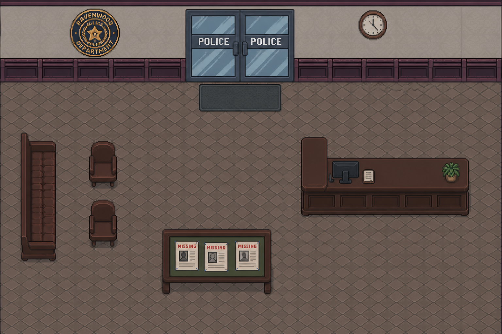

- **The Bullpen (hub).** One shambler encounter. The central security console dominates the room,
  its four-zone readout visible from almost anywhere in it. A whiteboard nearby still reads
  **SURVIVORS / MISSING / DECEASED** in three columns, the handwriting getting less careful toward
  the bottom before it simply stops. A printed copy of **Emergency Public Safety Directive 7** is
  pinned beside the reports it contradicts.

  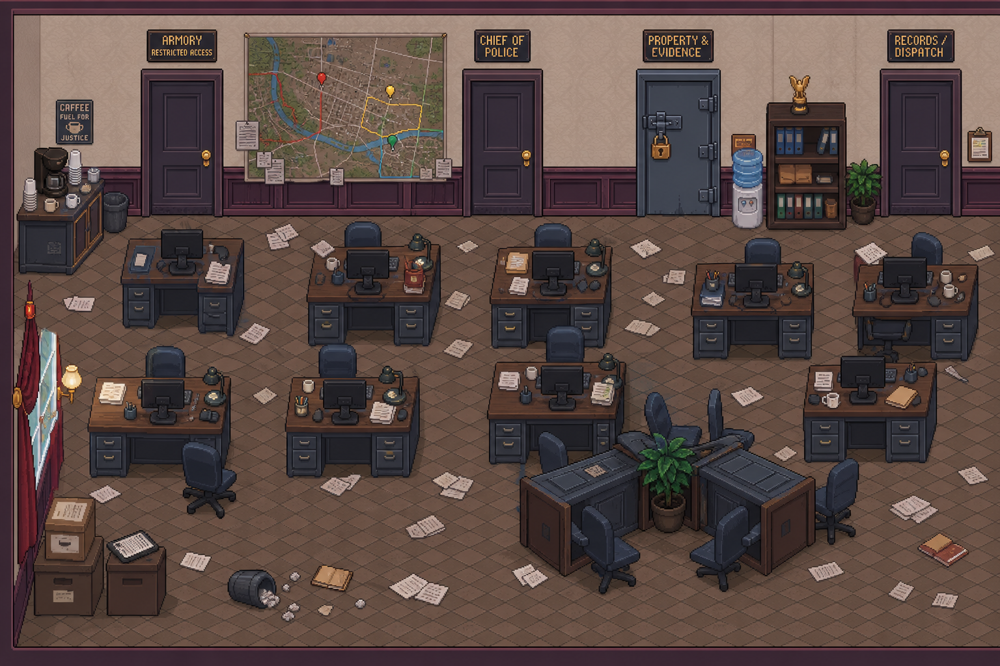

- **The Sally Port.** A short connector off the Bullpen into the station's own vehicle bay — where
  the station was actually breached, late in the outbreak, when officers rushed an injured
  colleague in and something followed unnoticed. A half-lowered emergency shutter and a dropped
  shotgun mark where it happened.

  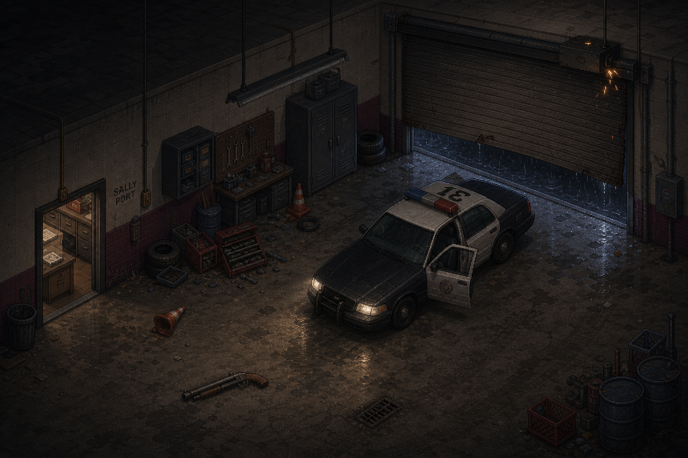

- **Records / Dispatch.** If the station is visited first, Sergeant Calloway is alive here,
  barricaded in. She confirms Deadlock Protocol's scope, tells Jim roughly when the lockdowns
  began, and mentions Corporal Reyes went to check on the K-9 unit around midnight and never came
  back. If a different district is visited first, she doesn't survive, and the same information
  comes from her own notes instead. Either way, the Chief's final broadcast — publicly overriding
  Vanguard's containment order, ending on gunfire — is playable here.

  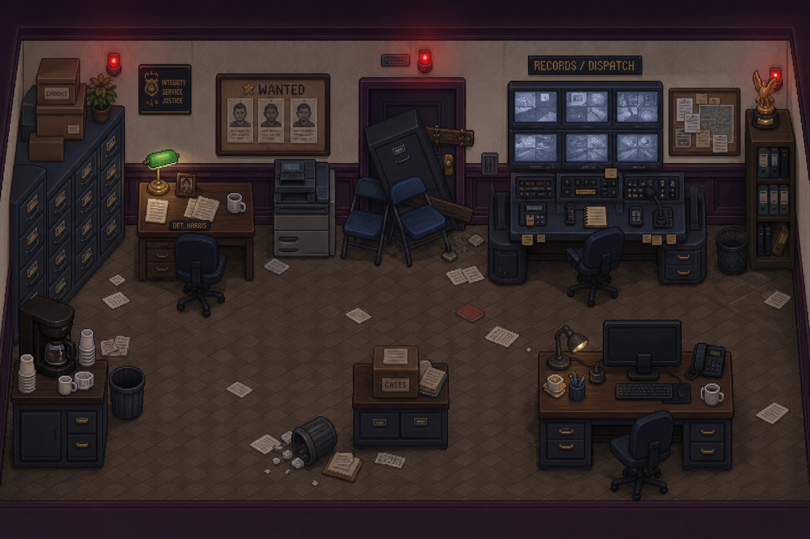

- **The Chief's Office.** Opened with a key Calloway carries. His logbook lists the lockdown
  assignments in order — Holding Cells, Evidence, Armory, the old station house last — and confirms
  he went looking for Reyes himself once Reyes stopped responding. His own fate is left open.

  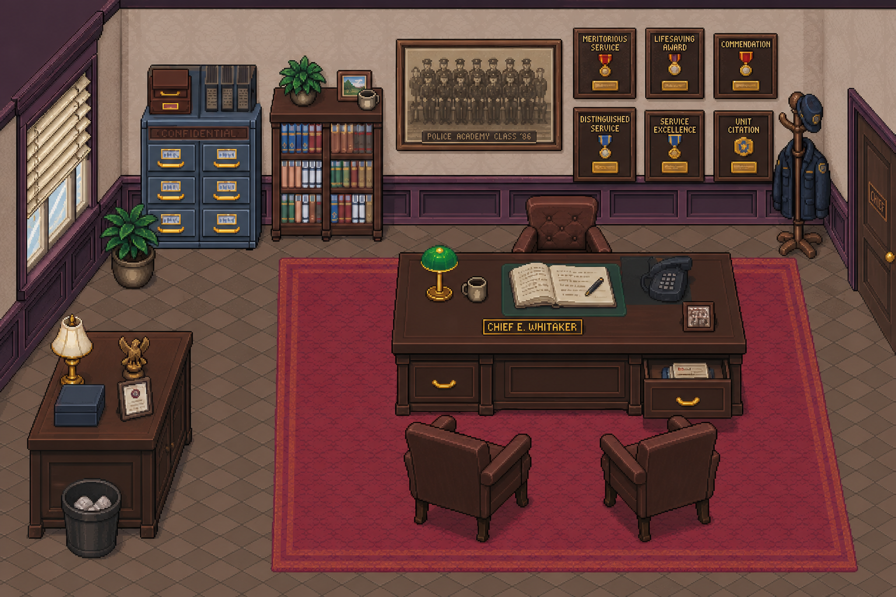

- **The Back Hallway.** Connects the Bullpen to the Break Room and the K-9 Unit Room.

  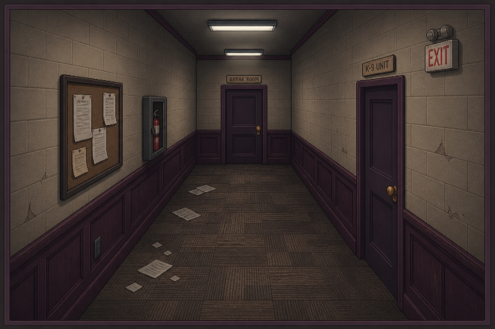

- **The K-9 Unit Room.** Corporal Reyes' body, one kennel gate bent open, and the Armory's own
  control override still clipped to his belt. Investigating triggers the district's signature
  encounter — Diesel and Baxter, Reyes' own K-9 partners, turned — in a tight concrete room with
  nowhere to retreat to.

  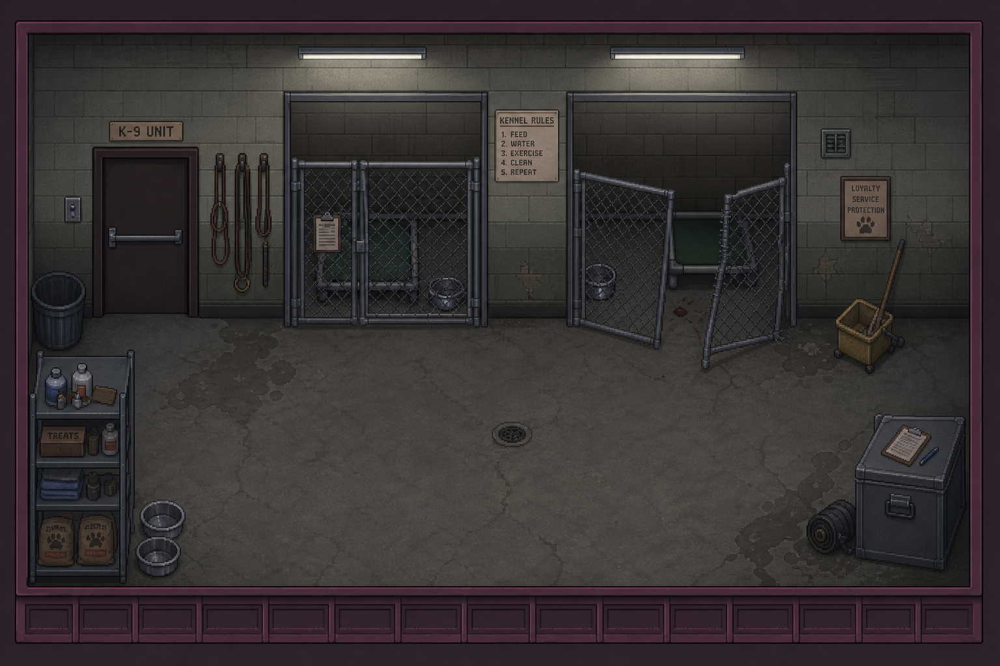

- **The Armory.** Reyes' override resets the Armory's own lockdown. Mostly-emptied gun racks; one
  still holds a clamped-down shotgun and two boxes of shells. A wall panel here also controls the
  Breezeway — the post Reyes was heading to when he stopped to check on his dogs.

  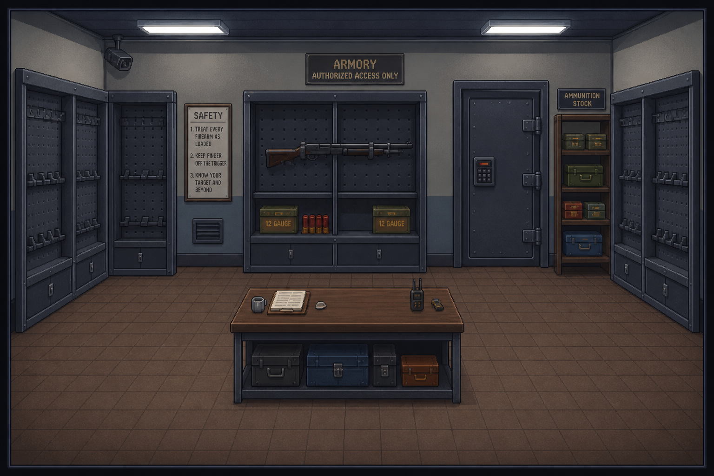

- **The Break Room.** A small, quiet optional stop off the same hallway as the K-9 Unit Room —
  Reyes' locker holds an old photo of him with Diesel and Baxter at their K-9 graduation, plus a
  Medkit and ammunition.

  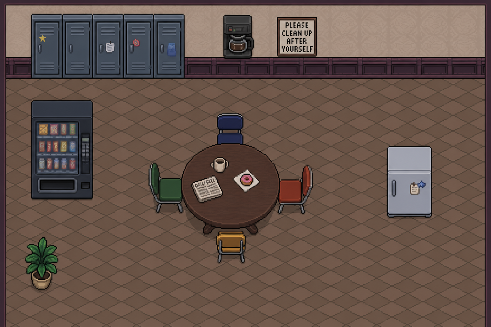

- **The Booking Corridor.** A wider hallway off the Bullpen leading to Booking, the Interview Room,
  and the Holding Cells.

  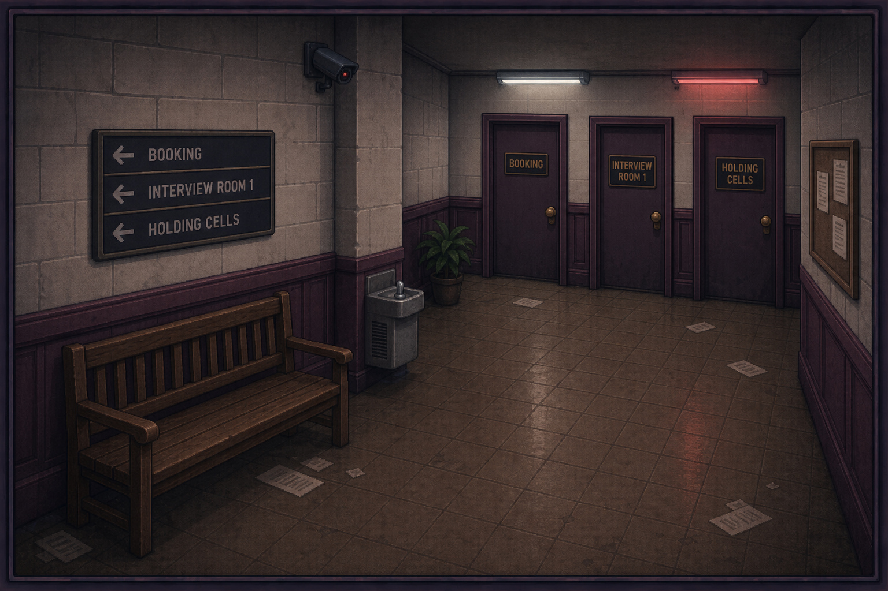

- **Booking & Processing.** A fingerprint station, a mugshot backdrop, and the Holding Cells' own
  control point — a wall terminal logging exactly when and why the first lockdown triggered: a
  detainee mid-processing who stopped being a person Jim can help. Personal-effects lockers nearby,
  one yielding an optional pocketknife.

  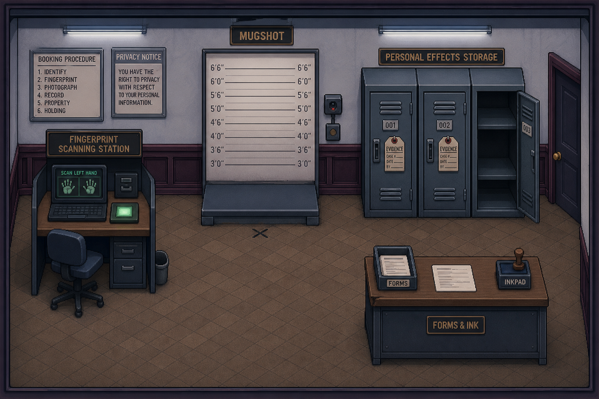

- **The Interview Room.** A recorder left running holds an old interview about unsettling animal
  behavior near North Ridge, filed and forgotten — cross-referencing the newspaper clipping already
  found at Downtown's library ([`Locations/Downtown_Ravenwood.md`](Downtown_Ravenwood.md)) and the
  Monastery's own much older archive of the same pattern
  ([`Locations/Monastery.md`](Monastery.md) → "Outbreak Night").

  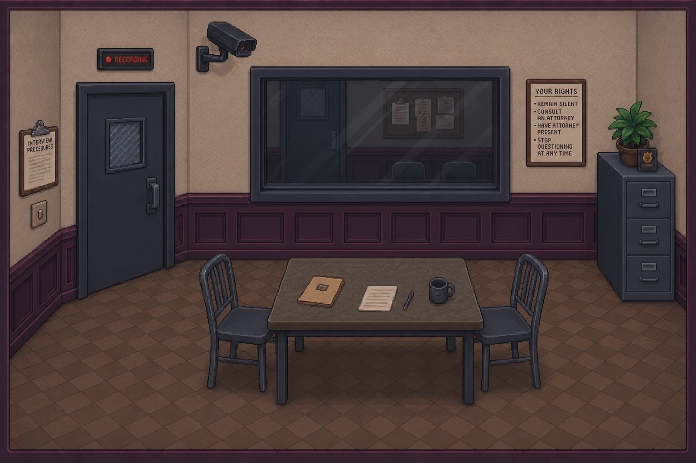

- **The Holding Cells.** Once reset, two working cells — one empty with a torn, discarded uniform
  shirt; one holding a shambler safely behind bars, same convention as the lobby. A second, interior
  control point reachable only from inside resets the Property & Evidence Room's lockdown next,
  automatically re-securing the cell block behind Jim.

  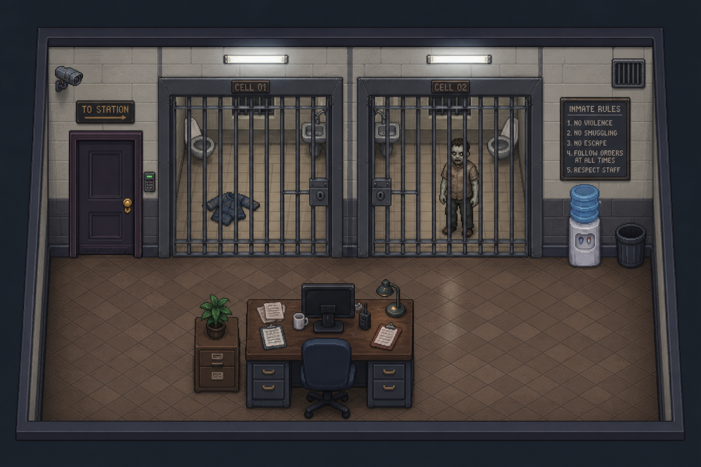

- **The Fire Station** (secondary, optional). Supplies, a dispatch call-sheet board that cuts off
  mid-sentence, and a pair of **bolt cutters** — needed only for a padlocked evidence locker inside
  the Property & Evidence Room, not the room's own door. A bonus-loot detour, not a critical-path
  requirement.

  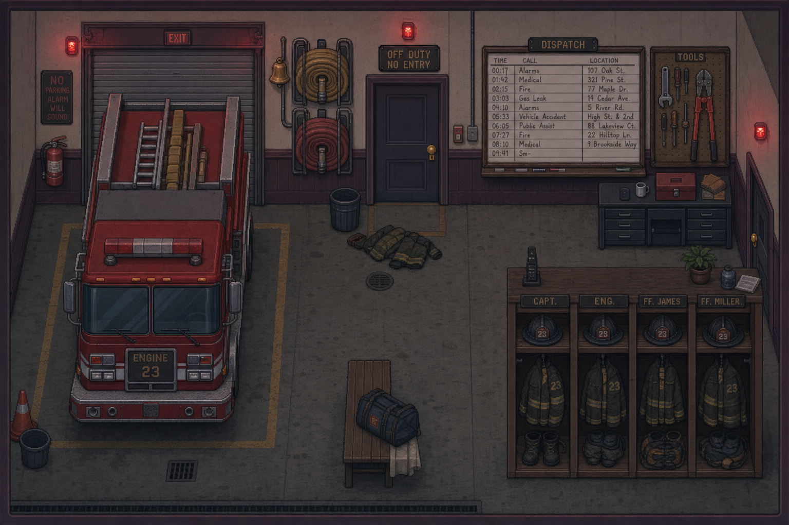

- **The Property & Evidence Room.** Resetting the lockdown from the Holding Cells' interior control
  point releases the room's own door — no separate physical lock stands between Jim and the wall
  terminal that resets the Armory next. A padlocked evidence locker against the back wall (bolt
  cutters, from the Fire Station, optional) holds bonus loot and the **Evidence Room Key**, which
  opens the Courthouse's Clerk's Exhibit Storage across town — a reward chain, not something the
  Lockdown Puzzle depends on. The room's own interior log confirms this was the second zone
  sealed, deliberately, to keep it from Vanguard.

  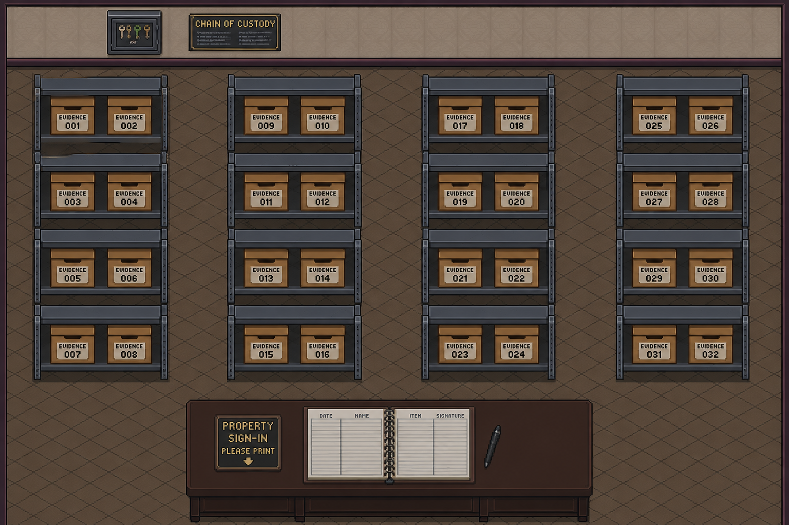

- **The Municipal Garage** (secondary, optional). Supplies, a mechanic's note, a shortcut gate to
  the street grid, and Corporal Reyes' own parked cruiser — he walked the rest of the way in on
  foot.

  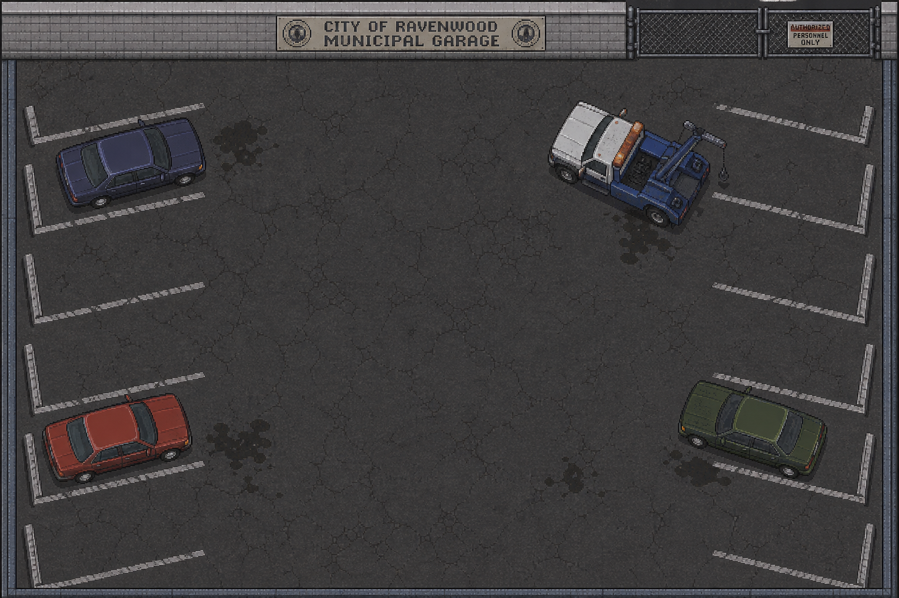

- **The Breezeway.** The Armory's wall panel resets this zone's lockdown, retracting the steel
  shutter over the original antique deadbolt door. The Old Station Skeleton Key, from the Chief's
  Office, still has to turn the physical lock underneath — the last of the four zones, and the one
  Reyes never got to secure himself.

  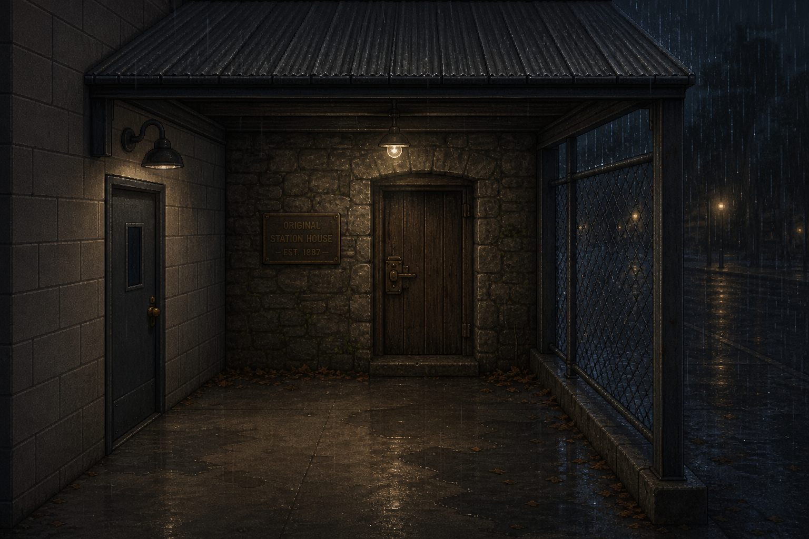

- **The Old Station House.** A single hushed room, stone walls, a wall of every chief/marshal's
  photograph going back to 1887. A dusty glass display case holds the **Authority Crest** — a
  bronze, wedge-shaped medallion bearing a relief portrait of Marshal Josiah Hale, his name and
  title, and a small relief of a skeleton key. Breaking the case retrieves it — the direct payoff
  of the Memorial Park guardhouse note.

  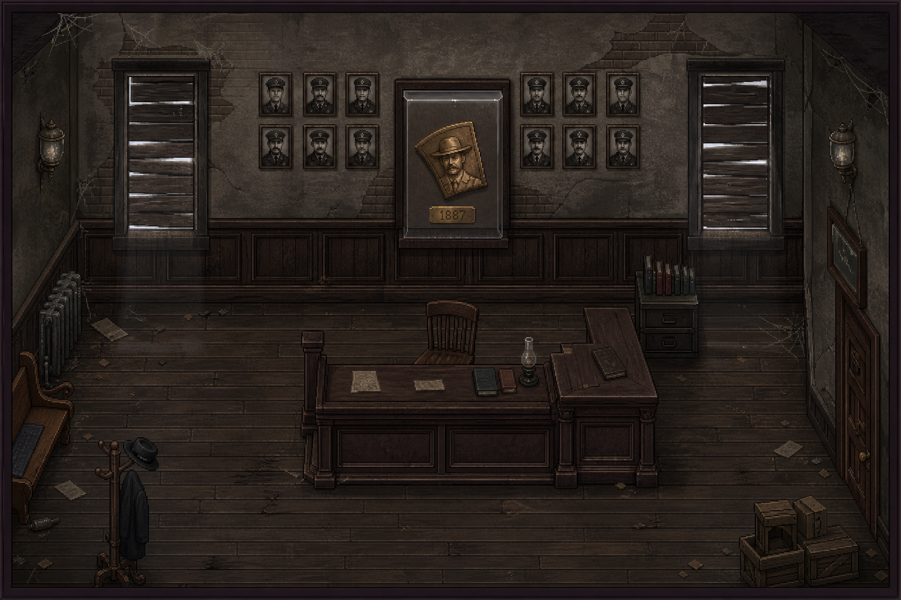

- **The Old Holding Cells.** A small optional area behind the main hall — disused cells repurposed
  for records storage. A damaged 1887 town-charter document lists Hale among five "Incorporators of
  Ravenwood" — the other four now identified as Nathaniel Voss, Elias Thorne, Eleanor Worthy, and
  Matthias Kane, per [`CANON.md`](../CANON.md). A small relay device, easy to miss behind a records
  cabinet, doesn't match any department inventory tag — Vanguard had a listening post in the one
  building the department itself had forgotten about.

  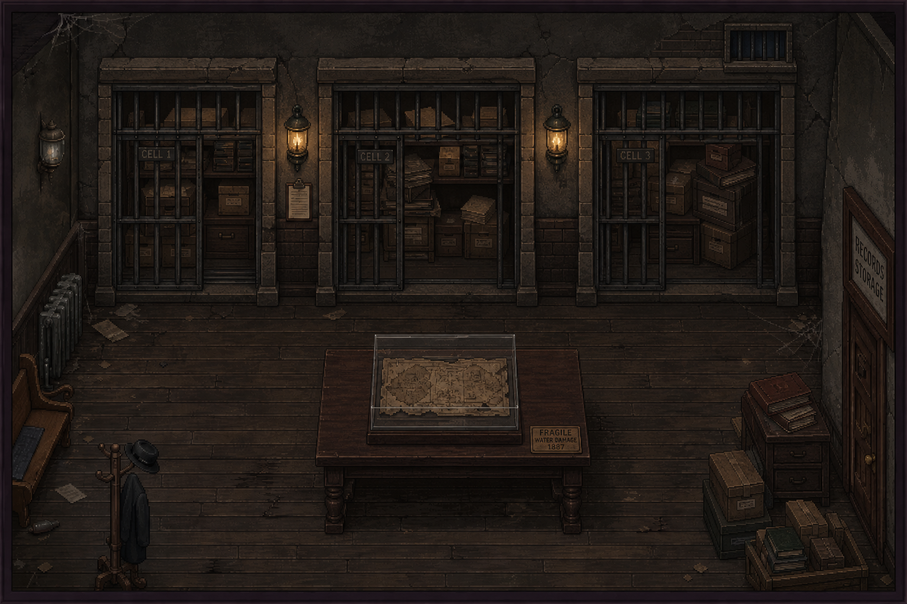

- **The City Courthouse** (secondary, optional). Home to **Walt Ostrander**, the courthouse's
  longtime bailiff, barricaded inside the jury deliberation room — this district's live secondary-
  location NPC. He tells Jim about a mineral-rights case that mysteriously never reached trial (five
  parcels near North Ridge, quietly bought up by shell companies that all dissolved within a year)
  and gives him the combination to the judge's private chambers safe. Plus a Clerk's Exhibit
  Storage room openable with the Evidence Room Key.

  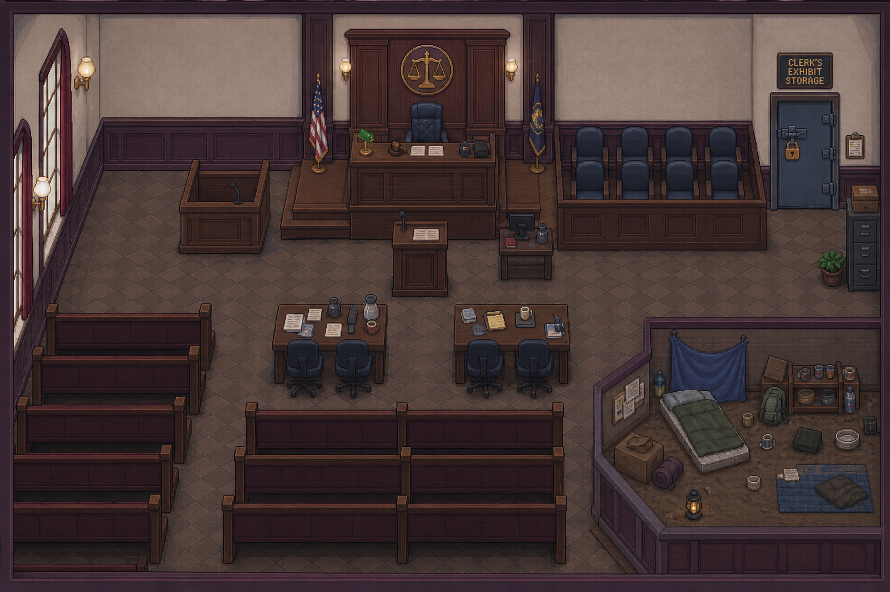

### The Vanguard Sub-Plot (optional)

Per [`CANON.md`](../CANON.md) → "Vanguard's Grip on Ravenwood PD": the officers here aren't secret
Vanguard villains — they're cops who believed they were protecting Ravenwood while Vanguard quietly
turned the department into an unofficial containment arm around them. This sub-plot is optional and
doesn't gate the Authority Crest.

- **Detective Cole's Office.** A small, undisturbed office off the Bullpen — a coffee cup left on
  the desk, a family photo, a corkboard case-map connecting a string of local disappearances.
  Unlocked. Searching the desk turns up **Aaron Cole's hidden investigation** and a duplicate
  **Vanguard Access Card**. See [`Characters/Aaron_Cole.md`](../Characters/Aaron_Cole.md).

  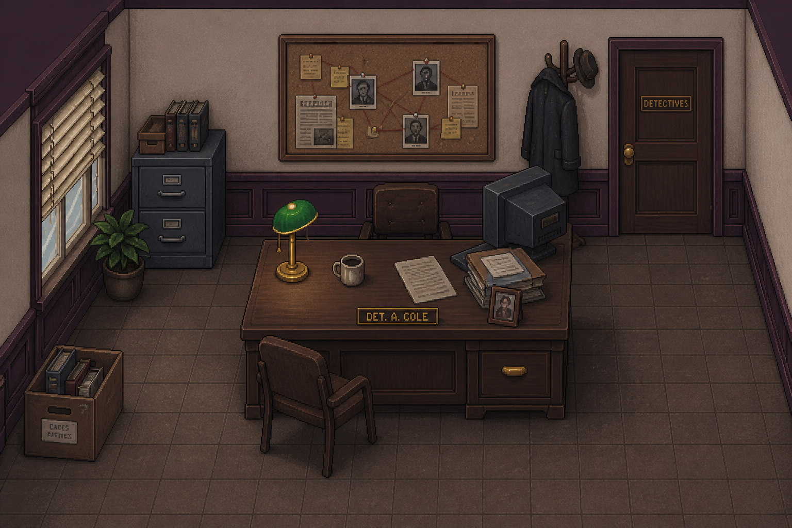

- **The Vanguard Public Safety Liaison Office.** A corporate placard instead of a police one, a
  deliberate "what is this doing here" hook. Opens with the Vanguard Access Card. Inside: a
  filing cabinet holding the **V-CASE classification protocol binder** and the department's own
  **confidential watchlist** — at least one name on it matches a name from the Bullpen's own
  SURVIVORS/MISSING/DECEASED board.

  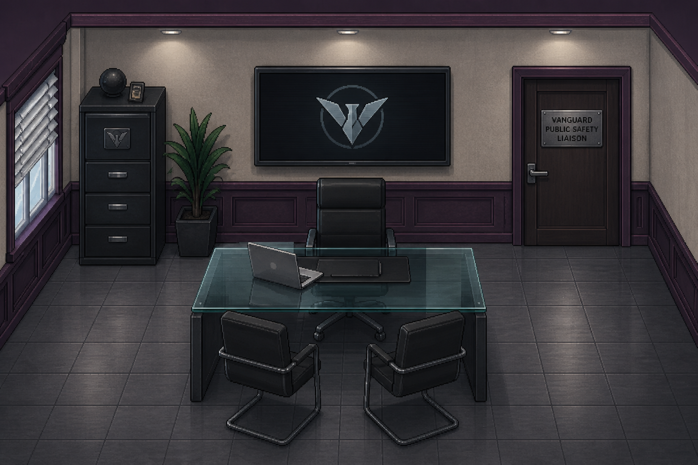

- **The Basement Stairwell → the Cold Cells.** A door off the Booking Corridor, easy to mistake for
  storage access. Opens with the Vanguard Access Card, revealing a quietly renovated basement:
  heavy steel doors, a floor drain, restraint rings, negative-pressure vents, and a sign reading
  "TEMPORARY MEDICAL HOLDING" — nicknamed "the Cold Cells" by the officers who used them. On the
  night of the outbreak, nobody from Vanguard came. One cell door is bent outward from the inside; a
  second has a handwritten note taped beside it: *"Please don't let me turn into one of those
  things."* No body either way.

  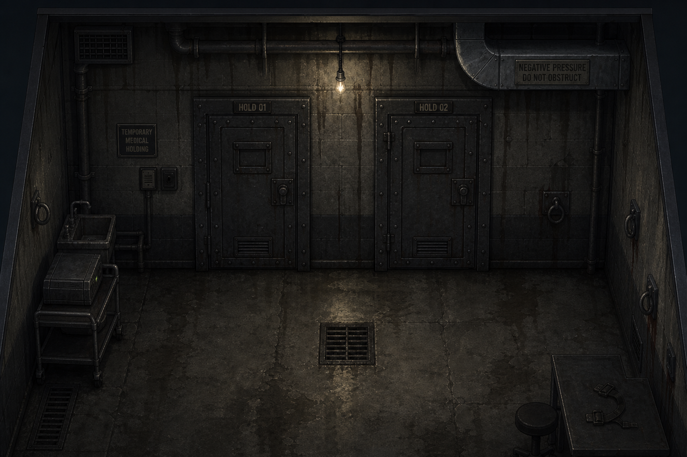

- **The Vanguard Observation Booth.** A hidden space behind the Interview Room's one-way glass,
  reached via a separate door off the Booking Corridor and the same Access Card. Injectors,
  blood-collection supplies, a monitor bank, and a chair with restraints hidden underneath —
  Vanguard's own secret use of "industrial accident" interviews to test whether stress alone can
  trigger Black Vein symptoms.

  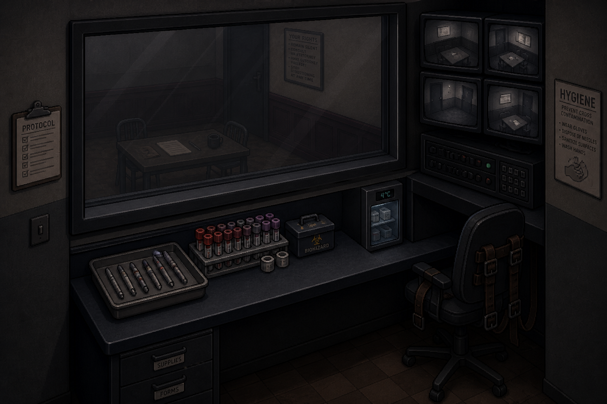

## Important Rooms / Areas

**Modern Annex:** Lobby · Bullpen (hub, security console) · Sally Port · Records/Dispatch · Chief's
Office · Back Hallway · Break Room · K-9 Unit Room · Armory (Zone 3 + Breezeway control) · Booking
Corridor · Booking & Processing (Zone 1 control) · Interview Room · Holding Cells (Zone 1, interior
Zone 2 control) · Property & Evidence Room (Zone 2, Armory control) · Breezeway (Zone 4) ·
Detective Cole's Office · Vanguard Liaison Office · Basement Stairwell → Cold Cells · Vanguard
Observation Booth.

**Original 1887 Station House:** Main Hall (Authority Crest) · Old Holding Cells (hidden Vanguard
relay).

**Secondary Locations:** Ravenwood Fire Station (bolt cutters) · Municipal Garage / Impound Lot ·
City Courthouse.

## Blueprint (Room Connectivity)

> A relational diagram, not a to-scale floor plan — split into one diagram per building/area, same
> convention as [`Ravenwood_Hotel.md`](Ravenwood_Hotel.md)'s blueprint. Solid arrows are always
> available; dashed arrows are gated behind a story condition, labeled on the arrow.
>
> Legend: 👤 NPC · ☠️ enemy/infected/boss · 🗝️ key item · 📄 document · 🔒 lockdown zone control ·
> 🚪 gate/shortcut.

### 1. District Entry → Station Exterior → Lobby → Bullpen (hub)

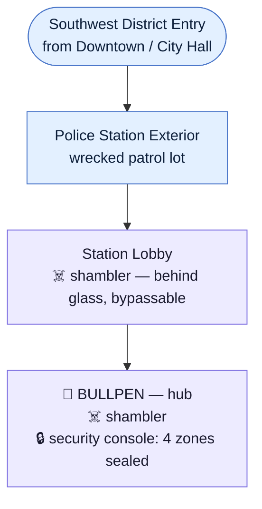
```mermaid
flowchart TD
    ENTRY(["Southwest District Entry<br/>from Downtown / City Hall"])
    EXT["Police Station Exterior<br/>wrecked patrol lot"]
    LOBBY["Station Lobby<br/>☠️ shambler — behind glass, bypassable"]
    BULLPEN["🏢 BULLPEN — hub<br/>☠️ shambler<br/>🔒 security console: 4 zones sealed"]

    ENTRY --> EXT --> LOBBY --> BULLPEN

    classDef room fill:#EDEBFF,stroke:#7C6EE0,color:#1a1a2e
    classDef exterior fill:#E3F0FF,stroke:#4A76C9,color:#0d1f3a
    class ENTRY,EXT exterior
    class LOBBY,BULLPEN room
```

### 2. The Annex Core (branches off the Bullpen)

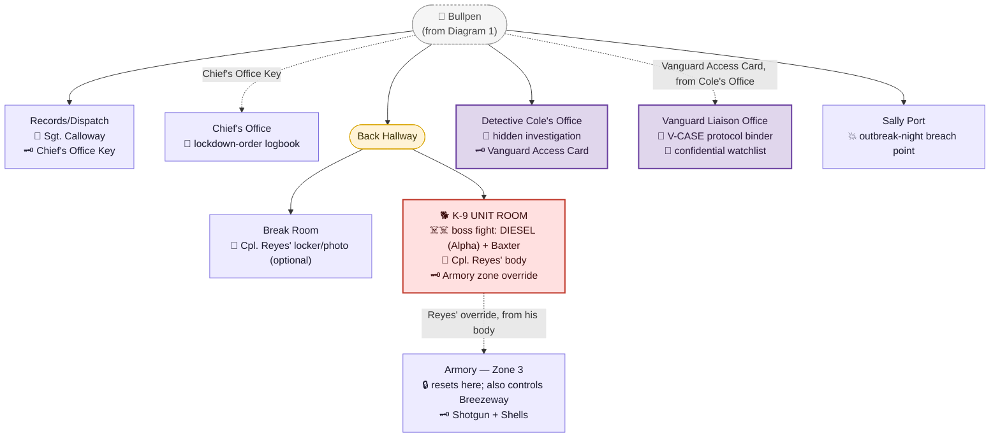
```mermaid
flowchart TD
    BULLPENREF(["🏢 Bullpen<br/>(from Diagram 1)"])
    DISPATCH["Records/Dispatch<br/>👤 Sgt. Calloway<br/>🗝️ Chief's Office Key"]
    CHIEF["Chief's Office<br/>📄 lockdown-order logbook"]
    BREAK["Break Room<br/>👤 Cpl. Reyes' locker/photo (optional)"]
    K9ROOM["🐕 K-9 UNIT ROOM<br/>☠️☠️ boss fight: DIESEL (Alpha) + Baxter<br/>👤 Cpl. Reyes' body<br/>🗝️ Armory zone override"]
    ARMORY["Armory — Zone 3<br/>🔒 resets here; also controls Breezeway<br/>🗝️ Shotgun + Shells"]
    BACKHALL(["Back Hallway"])
    COLE["Detective Cole's Office<br/>📄 hidden investigation<br/>🗝️ Vanguard Access Card"]
    VLIAISON["Vanguard Liaison Office<br/>📄 V-CASE protocol binder<br/>📄 confidential watchlist"]
    SALLYPORT["Sally Port<br/>💥 outbreak-night breach point"]

    BULLPENREF --> DISPATCH
    BULLPENREF -. Chief's Office Key .-> CHIEF
    BULLPENREF --> BACKHALL
    BACKHALL --> BREAK
    BACKHALL --> K9ROOM
    K9ROOM -. Reyes' override, from his body .-> ARMORY
    BULLPENREF --> COLE
    BULLPENREF -. Vanguard Access Card, from Cole's Office .-> VLIAISON
    BULLPENREF --> SALLYPORT

    classDef room fill:#EDEBFF,stroke:#7C6EE0,color:#1a1a2e
    classDef hallway fill:#FFF3D6,stroke:#D9A404,color:#3a2e00
    classDef boss fill:#FFE0E0,stroke:#C0392B,color:#3a0d0d,stroke-width:2px
    classDef ref fill:#F5F5F5,stroke:#999999,color:#444444,stroke-dasharray:3 3
    classDef vanguard fill:#E0D6EC,stroke:#6A3FA0,color:#2a1a3a,stroke-width:2px
    class BULLPENREF ref
    class BACKHALL hallway
    class DISPATCH,CHIEF,BREAK,ARMORY,SALLYPORT room
    class K9ROOM boss
    class COLE,VLIAISON vanguard
```

### 3. The Booking Wing → Zones 1 & 2 (branches off the Bullpen)

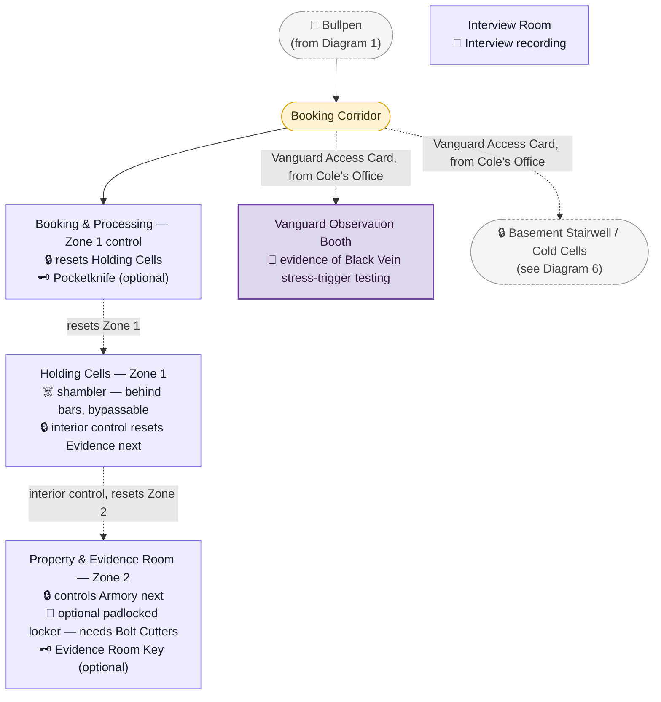
```mermaid
flowchart TD
    BULLPENREF2(["🏢 Bullpen<br/>(from Diagram 1)"])
    BOOKCORR(["Booking Corridor"])
    BOOKING["Booking & Processing — Zone 1 control<br/>🔒 resets Holding Cells<br/>🗝️ Pocketknife (optional)"]
    INTERVIEW["Interview Room<br/>📄 Interview recording"]
    OBSBOOTH["Vanguard Observation Booth<br/>📄 evidence of Black Vein stress-trigger testing"]
    CELLS["Holding Cells — Zone 1<br/>☠️ shambler — behind bars, bypassable<br/>🔒 interior control resets Evidence next"]
    PROPERTY["Property & Evidence Room — Zone 2<br/>🔒 controls Armory next<br/>🔧 optional padlocked locker — needs Bolt Cutters<br/>🗝️ Evidence Room Key (optional)"]
    BASEMENTREF(["🔒 Basement Stairwell / Cold Cells<br/>(see Diagram 6)"])

    BULLPENREF2 --> BOOKCORR
    BOOKCORR --> BOOKING -. resets Zone 1 .-> CELLS
    BOOKCORR -. Vanguard Access Card, from Cole's Office .-> OBSBOOTH
    CELLS -. interior control, resets Zone 2 .-> PROPERTY
    BOOKCORR -. Vanguard Access Card, from Cole's Office .-> BASEMENTREF

    classDef room fill:#EDEBFF,stroke:#7C6EE0,color:#1a1a2e
    classDef hallway fill:#FFF3D6,stroke:#D9A404,color:#3a2e00
    classDef ref fill:#F5F5F5,stroke:#999999,color:#444444,stroke-dasharray:3 3
    classDef vanguard fill:#E0D6EC,stroke:#6A3FA0,color:#2a1a3a,stroke-width:2px
    class BULLPENREF2,BASEMENTREF ref
    class BOOKCORR hallway
    class BOOKING,INTERVIEW,CELLS,PROPERTY room
    class OBSBOOTH vanguard
```

### 4. Armory → Breezeway → Old Station House (Zones 3 & 4)

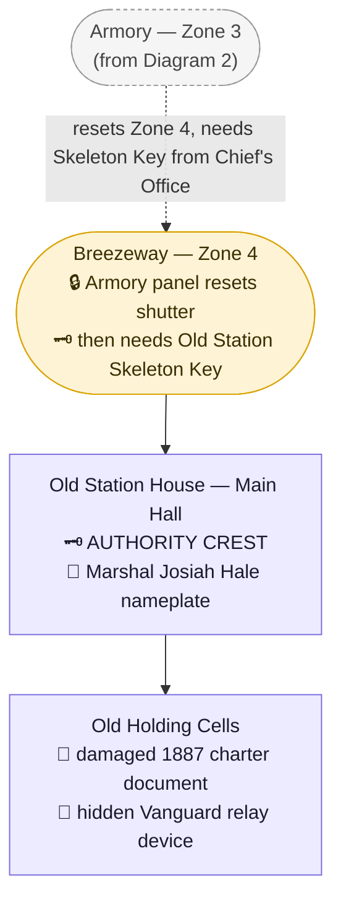
```mermaid
flowchart TD
    ARMORYREF(["Armory — Zone 3<br/>(from Diagram 2)"])
    BREEZE(["Breezeway — Zone 4<br/>🔒 Armory panel resets shutter<br/>🗝️ then needs Old Station Skeleton Key"])
    MAINHALL["Old Station House — Main Hall<br/>🗝️ AUTHORITY CREST<br/>📄 Marshal Josiah Hale nameplate"]
    OLDCELLS["Old Holding Cells<br/>📄 damaged 1887 charter document<br/>📄 hidden Vanguard relay device"]

    ARMORYREF -. resets Zone 4, needs Skeleton Key from Chief's Office .-> BREEZE --> MAINHALL --> OLDCELLS

    classDef room fill:#EDEBFF,stroke:#7C6EE0,color:#1a1a2e
    classDef hallway fill:#FFF3D6,stroke:#D9A404,color:#3a2e00
    classDef ref fill:#F5F5F5,stroke:#999999,color:#444444,stroke-dasharray:3 3
    class ARMORYREF ref
    class BREEZE hallway
    class MAINHALL,OLDCELLS room
```

### 5. The Basement / Cold Cells (branches off the Booking Corridor)

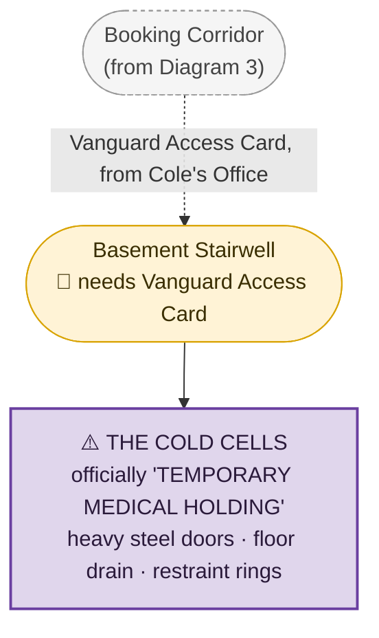
```mermaid
flowchart TD
    BOOKCORRREF(["Booking Corridor<br/>(from Diagram 3)"])
    STAIRS(["Basement Stairwell<br/>🔧 needs Vanguard Access Card"])
    COLDCELLS["⚠️ THE COLD CELLS<br/>officially 'TEMPORARY MEDICAL HOLDING'<br/>heavy steel doors · floor drain · restraint rings"]

    BOOKCORRREF -. Vanguard Access Card, from Cole's Office .-> STAIRS --> COLDCELLS

    classDef hallway fill:#FFF3D6,stroke:#D9A404,color:#3a2e00
    classDef ref fill:#F5F5F5,stroke:#999999,color:#444444,stroke-dasharray:3 3
    classDef vanguard fill:#E0D6EC,stroke:#6A3FA0,color:#2a1a3a,stroke-width:2px
    class BOOKCORRREF ref
    class STAIRS hallway
    class COLDCELLS vanguard
```

### 6. Secondary Locations (reached from the District Entry, not the station directly)

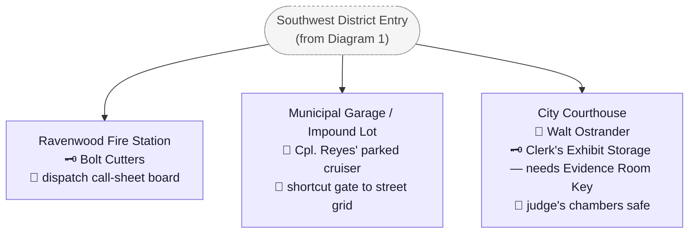
```mermaid
flowchart TD
    ENTRYREF(["Southwest District Entry<br/>(from Diagram 1)"])
    FIRE["Ravenwood Fire Station<br/>🗝️ Bolt Cutters<br/>📄 dispatch call-sheet board"]
    GARAGE["Municipal Garage / Impound Lot<br/>👤 Cpl. Reyes' parked cruiser<br/>🚪 shortcut gate to street grid"]
    COURT["City Courthouse<br/>👤 Walt Ostrander<br/>🗝️ Clerk's Exhibit Storage — needs Evidence Room Key<br/>📄 judge's chambers safe"]

    ENTRYREF --> FIRE
    ENTRYREF --> GARAGE
    ENTRYREF --> COURT

    classDef room fill:#EDEBFF,stroke:#7C6EE0,color:#1a1a2e
    classDef exterior fill:#E3F0FF,stroke:#4A76C9,color:#0d1f3a
    classDef ref fill:#F5F5F5,stroke:#999999,color:#444444,stroke-dasharray:3 3
    class ENTRYREF ref
    class FIRE,GARAGE,COURT room
```

## Characters Encountered

- **[Sergeant Ruth Calloway](../Characters/Ruth_Calloway.md)** — Tier 2 conditional survivor; alive
  only if this is the first district visited.
- **[Corporal Eli Reyes](../Characters/Eli_Reyes.md)** — never seen alive; found dead in the K-9
  Unit Room, killed by his own turned dogs while on his way to isolate the old station house.
- **Chief Marcus Doyle** — never seen alive or dead; self-identifies in the final-broadcast
  recording. Otherwise known only through his logbook. His ultimate fate stays unresolved.
- **[Detective Aaron Cole](../Characters/Aaron_Cole.md)** — never seen alive or dead; disappeared
  before the outbreak, known entirely through his abandoned office and hidden investigation.
- **Walt Ostrander** — the City Courthouse's longtime bailiff, alive, barricaded in the jury
  deliberation room. A one-scene flavor NPC, not a Tier 2/2b conditional survivor — no alive/dead
  branch, no return visit.

## Creatures Encountered

- **[Shamblers](../Creatures/Shambler.md)**, themed to the department (police uniforms) — lobby
  (bypassable), bullpen, and the Holding Cells (bypassable).
- **[Ashen Hounds](../Creatures/Ashen_Hound.md)** — Diesel (Alpha, boss-tier) and Baxter (standard),
  Corporal Reyes' K-9 partners; the district's boss encounter.

## Puzzles

- **The Lockdown Puzzle (main).** See "The Lockdown System," above — reconstruct the trigger order
  of four sealed zones from scattered evidence (Dispatch's timeline, the Chief's logbook, Booking's
  incident log, the Evidence Room's own record, and Reyes' last assignment), then physically route
  through the building resetting them in that order, since resetting one automatically re-secures
  the zone behind it. The old station house — and the Authority Crest — is the last zone freed.
- **The Fire Station → Property Room chain (optional).** Bolt cutters from the Fire Station open a
  padlocked locker inside the Evidence Room, not the room's own door — a deliberate optional
  backtrack for bonus loot and the Courthouse's cross-location key, kept clearly separate from the
  Lockdown Puzzle so the critical path never depends on it.
- **The Vanguard Access Card chain (optional).** Searching Detective Cole's desk yields a single
  card that opens three separate doors across the station (the Liaison Office, the Basement
  Stairwell, and the Observation Booth) — a "one key, whole hidden layer" reveal, distinct from the
  main puzzle's sequence-based logic, meant to land once the player realizes how freely Vanguard
  could already move through the building.

## Key Items

- **Chief's Office Key** ([full item writeup](../Items/Key_Items/Chiefs_Office_Key.md)) — from
  Sergeant Calloway (or her body); opens the Chief's Office.
- **Old Station Skeleton Key** ([full item writeup](../Items/Key_Items/Old_Station_Skeleton_Key.md))
  — Chief's Office desk; the physical lock underneath the Breezeway's electronic shutter, needed
  once the Armory's control panel resets Zone 4.
- **Reyes' Armory Zone Override** ([full item writeup](../Items/Key_Items/Armory_Zone_Override.md))
  — from Corporal Reyes' body in the K-9 Unit Room; resets the Armory's own lockdown and, from
  inside, the Breezeway's control panel.
- **Shotgun** + **Shotgun Shells x12** ([full item writeup](../Items/Consumables/Shotgun_Shells.md))
  — Armory, once its lockdown is reset. The **["Ranger 870" Pump Shotgun](../Weapons/Ranger_870_Pump_Shotgun.md)**.
- **Pocketknife** (optional, [full item writeup](../Items/Key_Items/Pocketknife.md)) — Booking &
  Processing; flavor item, no confirmed mechanical use yet.
- **Bolt Cutters** ([full item writeup](../Items/Key_Items/Bolt_Cutters.md)) — Fire Station; opens
  the Property & Evidence Room's physical padlock (separate from its electronic lockdown).
- **Evidence Room Key** ([full item writeup](../Items/Key_Items/Evidence_Room_Key.md)) — Property
  & Evidence Room; opens the Courthouse's Clerk's Exhibit Storage.
- **Authority Crest** ([full item writeup](../Items/Key_Items/Authority_Crest.md)) — old station
  house display case.
- **Vanguard Access Card** ([full item writeup](../Items/Key_Items/Vanguard_Access_Card.md),
  optional) — Detective Cole's desk; opens the Liaison Office, the Basement Stairwell/Cold Cells,
  and the Observation Booth. Does not gate the Authority Crest.

### Documents

- **SURVIVORS / MISSING / DECEASED whiteboard** (Bullpen) — three running lists that get less
  careful toward the bottom before simply stopping.
- **Emergency Public Safety Directive 7** (Bullpen) — the order to seal Ravenwood rather than
  evacuate it, framed as preventing chemical exposure from spreading.
- **Dispatch radio log, "Unit Twelve, respond Ravenwood Memorial, violent patient, radiology"**
  (Records/Dispatch) — the other half of this event is what Jim finds at
  [`Locations/Hospital.md`](Hospital.md) → "Radiology."
- **Dispatch radio log, "Foundry requesting additional ambulances" / "Negative. Vanguard
  containment directive now active."** (Records/Dispatch) — logged from the other end at
  [`Locations/Foundry_Refinery.md`](Foundry_Refinery.md), one of the earliest signs the night's
  first casualties came from the Foundry.
- **A fragmentary transmission — "...not a chemical...", "...Vanguard knew...", "...mine is
  the...", then static** (Records/Dispatch) — the incomplete police-side half of the Foundry
  manager's warning ([`Locations/Foundry_Refinery.md`](Foundry_Refinery.md)); full context only
  available after visiting the Foundry.
- **The Chief's final broadcast** (Records/Dispatch, audio) — overriding Vanguard's containment
  order, ending on gunfire and static. Immediately preceded by a recorded exchange with St.
  Dymphna Hospital — see [`Locations/Hospital.md`](Hospital.md) → "Outbreak Night" for the same
  exchange from the hospital's side.
- Chief's logbook (Chief's Office) — the lockdown assignment order; his own fate left open.
- Interview recording (Interview Room) — the pre-outbreak North Ridge animal-behavior report,
  filed and forgotten; cross-references Downtown's library and the Monastery's own archives.
- **Dispatch radio log, "We've got two hundred people here." / "I know."** (Records/Dispatch) — the
  order pulling half the Academy's security detail to reinforce Highway 13; see
  [`Locations/Academy.md`](Academy.md).
- **A handwritten sign, "You heard him," recovered from an evidence bag** (Records/Dispatch) — an
  officer used the Chief's own broadcast to refuse Vanguard access to Worthy Academy; full standoff
  at [`Locations/Academy.md`](Academy.md).
- **The Academy's final, unanswered broadcast** (Records/Dispatch) — *"This is Ravenwood Academy
  emergency shelter... we have children here."* Nothing. Nobody at the station is left to answer.
  See [`Locations/Academy.md`](Academy.md).
- **Radio traffic from the Monastery standoff** (Records/Dispatch) — an officer sent to investigate
  armed Vanguard personnel, and his own note that a monk handed him "an old Vanguard memorandum" —
  see [`Locations/Monastery.md`](Monastery.md).
- Marshal Josiah Hale's display-case nameplate (old station house).
- Damaged 1887 town-charter page listing five "Incorporators of Ravenwood" (old holding cells).
- **Judge Reyes's unfiled case folder** (City Courthouse, judge's chambers safe) — five North Ridge
  mineral-rights parcels bought up by five differently-named shell companies in an 18-month window,
  each dissolved within a year; a clerk's sticky note asking "Same PO box. Flag for review?" that
  was never acted on. Given to Jim by Walt Ostrander.
- **Detective Cole's case board and hidden investigation** (his office, optional) — connects a
  string of disappearances via a shared "V-CASE TRANSFERRED" marking, plus an internal email trail
  ending with an officer named Daniels himself "transferred," never seen again. Ends with Cole's own
  note: *"We thought Vanguard was helping us protect Ravenwood. I think Ravenwood is what they've
  been studying."* See [`Characters/Aaron_Cole.md`](../Characters/Aaron_Cole.md).
- **V-CASE classification protocol binder** (Vanguard Liaison Office, optional) — the cover story
  given to officers, and the isolate/restrain/surrender-to-Vanguard procedure for anyone classified
  a V-CASE.
- **Confidential watchlist** (Vanguard Liaison Office, optional) — names flagged for repeated
  hospital visits, unusual injuries, mine/refinery employment, or reports near Vanguard property.
- **Evidence of Black Vein stress-trigger testing** (Vanguard Observation Booth, optional).
- **A handwritten note taped beside a Cold Cells door** (optional) — *"Please don't let me turn
  into one of those things."*

## Major Scripted Events

- Sergeant Calloway's rescue-or-discovery beat (conditional on visit order).
- Discovering Corporal Reyes' body and the two-Ashen-Hound fight in the K-9 Unit Room.
- Reconstructing and reversing the four-zone lockdown, ending at the old station house.
- The Fire Station → Property Room bolt-cutter chain (optional).
- Breaking the display case to retrieve the Authority Crest — direct payoff of the guardhouse note.
- (Optional) Discovering Detective Cole's hidden investigation and using the Vanguard Access Card
  to uncover the Liaison Office, the Cold Cells, and the Observation Booth.
- (Optional) Finding and playing the Chief's final broadcast recording.

## Boss Encounters

- **Diesel, the Alpha Ashen Hound** (see [`Creatures/Ashen_Hound.md`](../Creatures/Ashen_Hound.md))
  — the district's boss, fought in the K-9 Unit Room alongside Baxter (standard-tier add).

## Crest Progression

Source of the **Authority Crest** (Southwest / ORDER wedge / Key symbol — see
[`CANON.md`](../CANON.md) → "The Founders & the Five Crests"). Can be returned to the Founders
Memorial any time Jim backtracks to Memorial Park.

## Exit / Progression to Next Area

Once the Authority Crest is collected and the secondary locations explored, Jim is free to head to
any of the remaining four districts in any order.

## Unresolved Ideas

- The alternate ("Calloway already turned") version of her scene is described in her character file
  but not yet scripted scene-by-scene.
- The Chief's own fate — went looking for Reyes, per his logbook — stays deliberately open.
- Whether Walt Ostrander (City Courthouse) survives past this scene, or ever leaves the jury room —
  deliberately left open; he explicitly refuses to leave with Jim.
- Who was in the Holding Cells' empty cell, and where they ended up — deliberately unstated.
- The Vanguard Liaison's name and fate; Detective Cole's own fate — deliberately unresolved, same
  convention as the Chief.
- Whether Officer Daniels' disappearance (Cole's email trail) ever gets more than a background
  mention, or stays a deliberate implication this has happened before.
