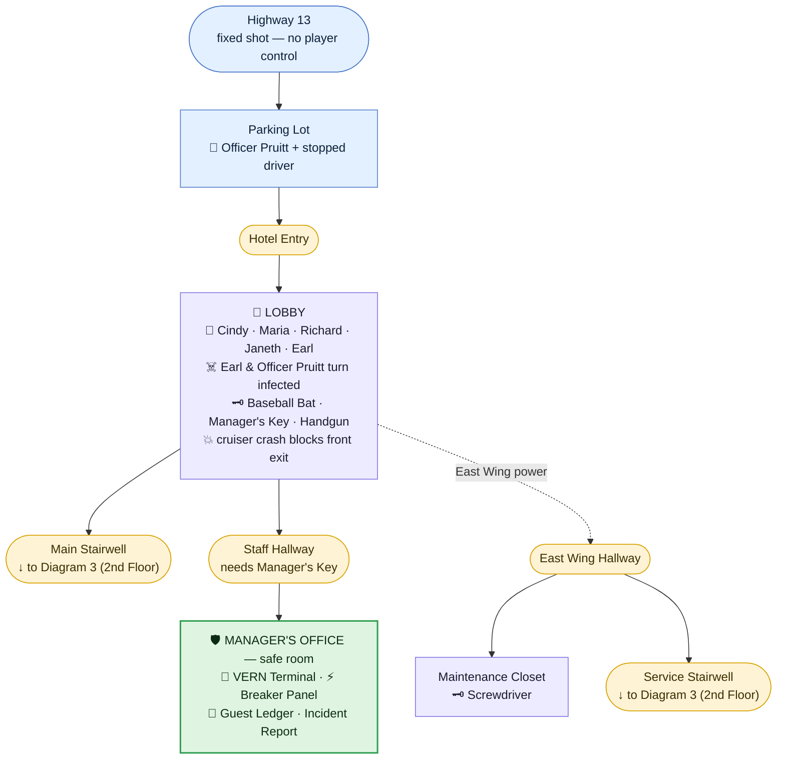
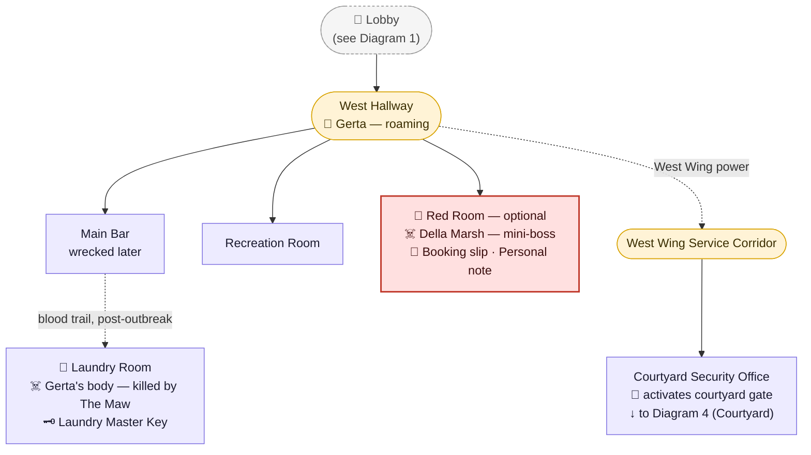
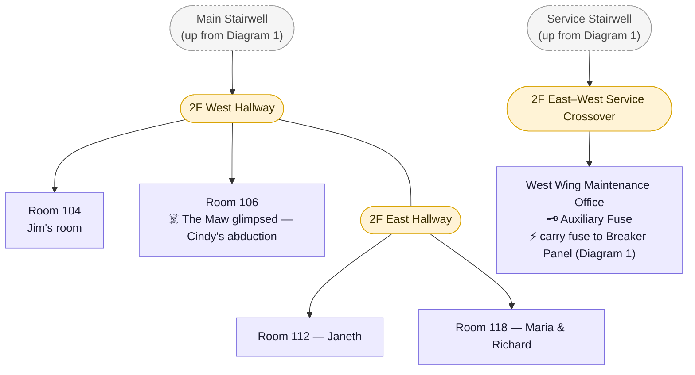
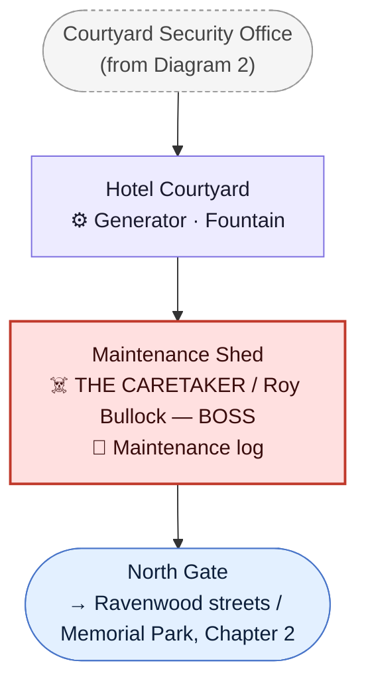

# Ravenwood Hotel

> Content in this file is compiled from two sources:
> [`Deadlock Protocol - Story Design Rebuild.docx`](../Deadlock%20Protocol%20-%20Story%20Design%20Rebuild.docx)
> (original material) and [`AI.json`](../AI.json) (a later planning conversation that revisited
> and fixed several issues in the docx). Where they disagree, [`AI.json`](../AI.json)'s resolution is used — see
> [`CANON.md`](../CANON.md) ("Retcons") for the specific list. The full scene-by-scene script for this chapter
> lives in [`Scripts/Chapter_1_One_Night_Only.md`](../Scripts/Chapter_1_One_Night_Only.md); this file is the higher-level design summary.
>
> Note: earlier material referred to this content as a "Prologue" followed by a separate
> "Chapter 1." Per a later structural decision, **the Prologue has been folded into Chapter 1 —
> "One Night Only"** — there is no separate prologue; the hotel is Chapter 1 in its entirety.

## Purpose in the Overall Story

The Ravenwood Hotel is Chapter 1 of the game — **"One Night Only."** It establishes the
protagonist (Jim Mercer), his relationship with Sarah, and the hotel's cast of stranded guests
during a calm, grounded pre-outbreak night — then serves as the setting for the outbreak's opening
escalation, the "Deadlock Protocol" title-drop, the player's first combat and first firearm, and
the first boss encounter (The Caretaker). The chapter ends with the player's first exit from an
interior space into the streets of Ravenwood, leading directly into Chapter 2 (Memorial Park).

## Arrival / Setup

- Jim Mercer — retired military, now a telecommunications field engineer driving to a relay site
  that's been offline three days — drives into Ravenwood through a heavy storm along Highway 13,
  talking to Sarah by phone. Road signs pass: BLACKWATER, COUNTY LINE, RAVENWOOD — 2 MILES.
- The neon Ravenwood Hotel sign ("EST. 1956 — VACANCY") emerges through the rain. Jim parks his
  Jeep in the hotel lot.
- A police cruiser is seen pulled over near the entrance — **Officer Dale Pruitt** dealing with an
  unclearly-seen, subtly-twitching detained driver (Pruitt's unnamed exposure point) — an early,
  deniable hint of the outbreak.
- Optional parking-lot interactions: open the trunk (survey equipment, tools — reflecting Jim's
  job), examine the hotel sign, examine a storm drain (metallic rattling echoes below, then
  silence), approach the police stop (Pruitt waves Jim inside).
- A second phone call with Sarah occurs under the hotel awning before Jim enters.
- Jim enters through heavy (non-automatic) glass double doors into the lobby.

## Storyline

### Night One (Pre-Outbreak)

- **Lobby Introduction.** Jim meets night clerk **Earl Whitaker** at reception and is given
  **Room 104** ("end of the west hall"). The lobby is populated with other stranded guests:
  **Cindy Sweets** (west lounge couch, Room 106), **Maria & Richard Dalton** (east waiting area,
  Maria visibly pregnant, Room 118), and **Janeth Caldwell** (reading near a hallway lamp, Room
  112). A distant thud from upstairs is heard once, mid-conversation — Earl explains it as the old
  building settling/storm pressure and genuinely believes it; nothing about him should read as
  suspicious or foreknowing.
- **Free Exploration.** The player can freely revisit and talk to Cindy, the Daltons, Janeth, and
  Earl (all optional, deepening characterization before the outbreak), and explore the **Main
  Bar** (unattended), the **Recreation Room** (pool table, dart board, empty), and find **The Red
  Room** speakeasy lounge locked behind a "PRIVATE EVENT CLOSED" placard. The player can also
  proactively knock on **Room 106** any time before going to bed — Cindy answers in her robe for
  an optional, genuinely flirtatious scene that settles into an easier rapport once she learns
  he's married, before the mood shifts into her mentioning hearing "scratching" in the walls (an
  early, deniable hint of The Maw). A hallway glimpse of
  the hotel maid **Gerta** pushing a cleaning cart is a brief, ordinary, non-interactive beat.
- **Room 104.** Jim settles into his room (double bed, TV, rotary phone, small bathroom). Optional
  interactions include looking out the window (briefly seeing something move near the
  crashed-cruiser-to-be area), watching TV (a weather report is interrupted by a burst of police
  chatter warning officers to avoid direct contact — then reverts to normal), and texting Sarah,
  which fails to send ("No signal"). Jim goes to bed; rain and thunder continue; fade to black
  with **no warning sound beforehand** — the outbreak wakes him with nothing to brace for.

### The Outbreak

- **The Wake-Up.** A civil emergency siren and flashing red light jolt Jim awake with no warning.
  Screaming, breaking glass, and gunshots are audible outside and downstairs. A distorted
  loudspeaker announces an emergency quarantine.
- **Second Floor Hallway.** The hallway is in chaos; panicked guests flee. Jim finds **Janeth
  Caldwell** crouched, terrified, refusing to go downstairs. (Optionally, Cindy Sweets can be
  found at her door beforehand, uneasy about noises downstairs — this encounter happens *before*
  Jim goes to bed, not during the outbreak itself.)
- **Lobby Reveal.** Descending to the lobby, Jim finds it wrecked. **Earl Whitaker** is crouched
  over a guest's body, feeding — the game's **first confirmed infected reveal**. Earl rises and
  attacks.
- **First Survival.** Jim grabs a **baseball bat** from the wrecked lounge furniture and fights
  off Earl — the player's first combat encounter.
- **Janeth's Death / Police Cruiser Crash.** As Janeth runs for the front doors, a police cruiser
  crashes violently through the entrance, killing her and permanently blocking the front exit.
- **"Deadlock Protocol."** Over the wrecked cruiser's radio, "Deadlock Protocol is now in effect"
  is announced — the game's title card. This is the end of the "night before" section and the
  start of the chapter's second half.
- **Manager's Office.** Jim searches Earl's body for a **Manager's Key**, unlocks the staff
  hallway, and reaches the **Manager's Office** — the chapter's first safe room, containing a
  **VERN** terminal (see [`CANON.md`](../CANON.md) — VERN is a city-wide save network, not hotel-specific) that
  unlocks save functionality. Optional reads here include the guest ledger (confirming room
  numbers for Jim, Cindy, Janeth, and the Daltons) and an unsigned incident report noting a guest
  (Maria Dalton) was transported to **St. Dymphna Hospital** — the first in-fiction reference to a
  location beyond the hotel.
- **East Wing Power Restoration.** A breaker panel has three switches (Lobby / East Wing / West
  Wing). East Wing powers up cleanly; West Wing immediately trips a blown fuse. A maintenance
  notice reveals the courtyard is the intended emergency evacuation route, but requires full
  auxiliary power. Jim explores the newly-opened East Wing guest hallway (blood trails, panic
  debris) and finds a maintenance closet with a **screwdriver** and a note indicating the West
  Wing fuse was relocated.
- **Second Floor Service Route.** Using the screwdriver, Jim opens the West Wing fuse compartment
  at the breaker panel to confirm it's burned out, then crosses through the East Wing upper floor
  (passing a locked, blood-marked Room 106 — Cindy is unseen but a wet dragging sound is heard),
  through a service stairwell, down into the East Wing's industrial first-floor maintenance
  corridors, and across a second-floor East–West service crossover to a **West Wing maintenance
  office**, recovering the **auxiliary fuse** from a regulator (which powers down the immediate
  area on removal).
- **West Wing Power Restoration.** Installing the fuse and activating the West Wing breaker
  restores power hotel-wide and brings the **courtyard access system online**. Returning upstairs,
  Jim passes Room 106 again — Cindy Sweets bursts out screaming and is violently dragged back
  inside before Jim can reach her; the door slams. West Wing guest security doors now open into
  the hotel bar, the (self-contained, optional) Red Room, the recreation lounge, additional guest
  rooms, and — via a separate service corridor — the courtyard security office.
- **Courtyard Security Office.** Reached via the **West Wing service corridor** (a staff-only
  route at the rear of the West Wing), not through the Red Room. Jim activates the courtyard
  access system remotely from here.
- **The Red Room (optional).** A separate, self-contained speakeasy lounge accessible from the
  West Wing hallway. Untouched by the outbreak's chaos — an eerily undisturbed room with a
  solitary singer, **Della Marsh** ("Della M." on stage — a four-year weekly Red Room performer),
  at the microphone. She's revealed, on approach, to be dead and infected; she attacks once Jim
  gets close (an optional mini-boss encounter). The Red Room has its own entrance and exit — it
  doesn't lead anywhere else.
- **First Firearm.** Passing back through the lobby near the crashed cruiser, an infected police
  officer — **Officer Dale Pruitt**, the same officer seen at the start of the game — bursts from
  the vehicle and attacks. Defeating him yields the game's **first firearm** (a handgun) and
  ammunition, plus his field notepad and a printed dispatch advisory (see Key Items/Documents).
- **Hotel Courtyard.** Jim exits the hotel into the courtyard for the first time — the player's
  first time outdoors since the outbreak began. The north exterior gate is dead ("ACCESS DENIED —
  GENERATOR FAILURE"). A chained-shut maintenance shed and a backup generator sit in the rear of
  the courtyard.
- **Generator Restoration / Boss Fight.** Restoring the generator (a short mechanical
  fuel/ignition/pressure/breaker sequence, which plays to Jim's engineering background) powers the
  gate — but also breaches the maintenance shed from the inside, revealing **The Caretaker** (real
  name **Roy Bullock**, the hotel's longtime maintenance man), mutated by the outbreak, in a boss
  encounter fought across the courtyard.
- **Chapter End.** Defeating the Caretaker leaves the north courtyard gate operational. Jim exits
  the hotel grounds through the gate onto a public street — directly across from Memorial Park —
  beginning Chapter 2.

## Important Rooms / Areas

- **Lobby** — West Lounge (Cindy), East Waiting Area (the Daltons), Reception (Earl), main
  stairs. Wrecked mid-chapter by the police cruiser crash.
- **Room 104** — Jim's guest room; the "night before" scene.
- **Room 106** — Cindy Sweets' room; site of her abduction jumpscare.
- **Main Bar** — unattended pre-outbreak; revisited later, wrecked, with a blood trail toward a
  staff storage door leading to the Laundry Room.
- **The Laundry Room** — a staff area reached via the staff storage door behind the Main Bar;
  industrial washers/dryers, laundry carts. Site of Gerta's death (killed by **The Maw**) — see
  Creatures/Major Scripted Events below and [`Creatures/The_Maw.md`](../Creatures/The_Maw.md).
- **Recreation Room** — pool table, dart board, empty; minor pre-outbreak atmosphere beat.
- **The Red Room** — self-contained optional speakeasy lounge, entrance/exit both from the West
  Wing hallway; site of the Della Marsh encounter. Does not connect to the Security Office.
- **Manager's Office** — the chapter's first safe room; VERN save terminal, guest ledger,
  incident report, breaker panel.
- **Breaker Panel** (inside Manager's Office) — Lobby / East Wing / West Wing power switches;
  central hub for the power-restoration puzzle.
- **East Wing** (guest floors + first floor maintenance areas) — opened by East Wing power;
  contains the maintenance closet/screwdriver and a service stairwell.
- **West Wing Maintenance Office** — reached via a screwed-shut access panel; source of the
  replacement auxiliary fuse.
- **West Wing Service Corridor** — a separate staff-only route at the rear of the West Wing
  leading to the Courtyard Security Office (this replaces the earlier "Red Room backstage" route).
- **Courtyard Security Office** — controls courtyard gate access; reached via the West Wing
  Service Corridor.
- **Hotel Courtyard** — fountain, maintenance shed, backup generator, north exit gate to the
  street/Memorial Park; site of the Caretaker (Roy Bullock) boss fight.

## Blueprint (Room Connectivity)

> Not a to-scale architectural floor plan — a **relational** diagram of how rooms connect, and
> what's in each one, derived directly from `Storyline` and `Scripts/Chapter_1_One_Night_Only.md`
> above. Split into one diagram per floor/area (a single combined diagram rendered too cramped to
> read clearly) — read them top to bottom; each one notes where it picks up from the previous.
> Solid arrows are direct, always-available connections; dashed arrows are connections gated
> behind a story condition (a key, restored power, a blood trail appearing post-outbreak, etc.) —
> the label on the arrow says what unlocks it.
>
> Legend: 👤 NPC · ☠️ enemy/infected/boss · 🗝️ key item · 📄 document · 💾 save point (VERN) ·
> ⚡ power/breaker · 🚪 gate/access control · ⚙️ generator/mechanical.
>
> **Shape/color key** — every hallway/corridor/stairwell is its own node (nothing is folded into
> a single "West Wing" black box); the shape and color just tell you *what kind* of node you're
> looking at at a glance:
>
> - 🟣 **rectangle, purple** — a room with actual content (NPCs, items, enemies, events).
> - 🟡 **pill/stadium, amber** — a hallway, corridor, stairwell, or crossover — a pure connector
>   you pass through, not a destination.
> - 🟢 **rectangle, green** — a safe room (save point).
> - 🔴 **rectangle, red** — a boss or mini-boss encounter room.
> - 🔵 **pill, blue** — exterior space (street, gate, parking lot approach).
> - ⚪ **dashed grey pill** — a pointer back to a node that's defined in full on another diagram
>   (e.g. "(see Diagram 1)") — not a new physical space, just a stitch point between diagrams.

### 1. Exterior → Lobby → East Wing (ground floor)

### 2. Lobby → West Wing (ground floor)

### 3. Second Floor & Service Route

### 4. Courtyard

## Characters Encountered

- **[Jim Mercer](../Characters/Jim_Mercer.md)** — protagonist/player character. Retired military
  (comms/logistics), now a telecommunications field engineer.
- **[Sarah Mercer](../Characters/Sarah_Mercer.md)** — Jim's partner; phone contact only, ending
  after the parking-lot call (see [`CANON.md`](../CANON.md) — no contact resumes until the
  Epilogue).
- **[Earl Whitaker](../Characters/Earl_Whitaker.md)** — hotel night clerk; checks Jim in; becomes
  the chapter's first infected. An ordinary, unsuspecting man with no foreknowledge of the
  outbreak — his death should land harder for it.
- **[Cindy Sweets](../Characters/Cindy_Sweets.md)** — guest, Room 106; present pre-outbreak, later
  heard/glimpsed during the outbreak, dragged away in a jumpscare mid-chapter. Fate beyond that
  scene is not yet established.
- **[Maria Dalton](../Characters/Maria_Dalton.md)** and **[Richard Dalton](../Characters/Richard_Dalton.md)** —
  guests, Room 118, expecting a child; leave for St. Dymphna Hospital shortly before the outbreak
  begins (per the incident report). Their fate is intended to be resolved later, at the hospital,
  once that chapter is written.
- **[Janeth Caldwell](../Characters/Janeth_Caldwell.md)** — guest, Room 112; present pre-outbreak
  and during the initial panic; killed on-screen by the crashing police cruiser.
- **[Gerta](../Characters/Gerta.md)** — hotel maid; a single brief, ordinary hallway encounter
  pre-outbreak. Later found dead in the Laundry Room, killed by The Maw — see below.
- **[Officer Dale Pruitt](../Characters/Dale_Pruitt.md)** — Ravenwood PD; seen at the parking lot
  at the start of the chapter, and again (infected) inside the crashed cruiser later.

## Creatures Encountered

- **Earl Whitaker (infected)** — the chapter's first infected; a named character rather than a
  generic creature type — see [`Characters/Earl_Whitaker.md`](../Characters/Earl_Whitaker.md).
- **Officer Dale Pruitt (infected)** — named character, not a generic creature type — see
  [`Characters/Dale_Pruitt.md`](../Characters/Dale_Pruitt.md).
- **[Della Marsh](../Creatures/Della_Marsh.md)** ("the Red Room Singer," infected) — optional
  mini-boss in the Red Room.
- **[The Caretaker](../Creatures/The_Caretaker.md) / Roy Bullock** (infected) — the chapter's
  boss, fought in the courtyard. See full AI/phase design below.
- **[The Maw](../Creatures/The_Maw.md)** — classification: Ashen Mutant; a heavily mutated,
  territorial stalker/ambush predator whose torso splits open into an enormous feeding mouth.
  Glimpsed only in fragments; responsible for dragging Cindy Sweets into Room 106 and for killing
  Gerta in the Laundry Room. Not directly fought in Chapter 1 by design.
- The source material also references a base infected type by name in passing ("Unlike
  shamblers: the caretaker is intelligent enough to pursue and corner the player aggressively"),
  confirming a standard enemy type called a **[Shambler](../Creatures/Shambler.md)** exists in the
  game (later confirmed directly on-screen in Chapter 2's street-crossing scene).

## Puzzles

- **Power Restoration (East Wing → West Wing).** Restore East Wing power at the breaker panel →
  find a screwdriver in an East Wing maintenance closet → open the West Wing fuse compartment to
  discover it's burned out → traverse a service-stairwell / second-floor crossover route into the
  West Wing maintenance office → recover a replacement auxiliary fuse → return to the breaker
  panel, install the fuse, and activate West Wing power (which also brings courtyard access
  systems online).
- **Courtyard Generator Restoration.** A short mechanical sequence (fuel valve, ignition switch,
  pressure controls, breaker reset) restores the courtyard's backup generator, re-powering the
  exterior gate — and triggers the maintenance shed breach that begins the Caretaker boss fight.

## Key Items

- **Manager's Key** — taken from Earl Whitaker's body; opens the staff hallway to the Manager's
  Office.
- **Baseball Bat** — Jim's first weapon, grabbed from wrecked lobby furniture during the Earl
  Whitaker attack.
- **Screwdriver** — found in an East Wing maintenance closet; used to open the West Wing fuse
  compartment and a screwed-shut maintenance office access panel.
- **Auxiliary Fuse** — recovered from a regulator in the West Wing maintenance office; installed
  at the breaker panel to restore West Wing power.
- **Handgun (+ ammunition)** — the game's first firearm, taken from Officer Pruitt inside the
  crashed cruiser.
- **Laundry-Room Master Key** (optional) — found on Gerta's body; a minor convenience item for
  any staff-only doors not already opened by another route. No mandatory content is gated behind
  it.

### Documents (full text written — see [`Scripts/Chapter_1_One_Night_Only.md`](../Scripts/Chapter_1_One_Night_Only.md) for verbatim content)

- Emergency lockdown notice (breaker panel) — courtyard is the evacuation route, requires full
  auxiliary power.
- Guest ledger (Manager's Office) — room assignments for Jim, Cindy, Janeth, Maria & Richard.
- Incident report (Manager's Office) — Maria Dalton transported to St. Dymphna Hospital, 11:42 PM.
- Maintenance note (East Wing closet) — points to the West Wing fuse relocation.
- Maintenance warning (West Wing office) — do not remove the fuse except on power failure.
- VERN terminal label (Manager's Office) — "RAVENWOOD MUNICIPAL EMERGENCY NETWORK / VANGUARD
  EMERGENCY RESPONSE NODE — TERMINAL 07."
- **Della Marsh's booking slip and personal note** (Red Room backstage, Scene 40) — establishes
  her as a real person (four-year residency; a note to her mother, written as she began feeling
  unwell).
- **Roy Bullock's maintenance log** (courtyard shed, post-Caretaker fight, Scene 44) — years of
  routine entries ending with him noticing sirens and "something in the air" the night of the
  outbreak; the only place his name ("Roy") is confirmed on-screen.
- **Officer Pruitt's field notepad and a printed dispatch advisory** (found on his body, Scene 41)
  — his own account of the traffic stop that exposed him, and Ravenwood PD's Class 4
  public-health-emergency advisory referencing "Deadlock Protocol" standing by pending
  authorization. The notepad's cover ("OFFICER D. PRUITT — RAVENWOOD PD") is the only place his
  full name is confirmed on-screen.

## Major Scripted Events

- Lobby reveal: Earl Whitaker feeding on a guest (first infected reveal).
- Police cruiser crashes through the front entrance, killing Janeth Caldwell and blocking the
  main exit.
- "Deadlock Protocol is now in effect" radio announcement / title card.
- Cindy Sweets' Room 106 jumpscare and abduction (by The Maw).
- Gerta's death, discovered in the Laundry Room (by The Maw) — see [`Characters/Gerta.md`](../Characters/Gerta.md).
- Della Marsh (Red Room singer) reveal — appears to be a survivor, then turns.
- Officer Pruitt jumpscare from inside the crashed cruiser.
- Maintenance shed breach revealing The Caretaker (Roy Bullock).

## Boss Encounters

### The Caretaker / Roy Bullock (Hotel Courtyard)

A mutated former hotel maintenance man — the player's first major mutation encounter, designed as
a physical intimidation boss demonstrating that infection can progress into monstrous forms.
Unlike baseline infected ("shamblers"), the Caretaker actively pursues and corners the player.

- **Phase 1 — Stalk:** deliberate, heavy, unstoppable-feeling advance; wide pathing; destroys
  obstacles; occasional intimidation pauses.
- **Phase 2 — Aggression:** close-range attacks (overhead slam, wide horizontal arm swing,
  shoulder charge, corner grab attempts); high damage, heavy knockback, long recovery windows the
  player is meant to exploit.
- **Phase 3 — Enraged (low health):** faster, more reckless, repeated slam combos, reduced
  stagger; courtyard floodlights flicker violently, destabilizing visibility.
- **Weaknesses:** headshots, environmental spacing, and attack-recovery windows. The
  recently-acquired handgun is highly valuable here; melee remains possible but risky.
- **Arena hazards:** flooded pavement, hedge choke points, generator equipment, fountain
  obstacles, low visibility during rain bursts.

## Crest Progression

Not applicable to this location directly. The five-crest structure (see [`CANON.md`](../CANON.md)) applies to
five outer districts of Ravenwood reached via Memorial Park, not to the Hotel itself.

## Exit / Progression to Next Area

Defeating the Caretaker restores the north courtyard gate. Jim exits the hotel grounds through
this gate onto a public street, directly across from **Memorial Park** — the chapter's end and
the start of Chapter 2. See [`Locations/Memorial_Park.md`](Memorial_Park.md).
