# Chapter 2 — St. Dymphna Hospital

> Scene-by-scene script for the Northeast District — Medical Crest. Rewritten (2026-08-14) to
> match [`Locations/Hospital.md`](../Locations/Hospital.md)'s **Quarantine Puzzle** — see
> [`CANON.md`](../CANON.md) → "Five Puzzle Philosophies." The previous version (a Radiology →
> Laboratory → Administration → Surgical Wing Access Card key chain) is fully superseded; full
> rationale in [`STORY_NOTES.md`](../STORY_NOTES.md).
>
> Richard Dalton's eventual "what do I tell him" payoff scene is deliberately **not** written
> here — see [`Characters/Richard_Dalton.md`](../Characters/Richard_Dalton.md) → "Unresolved
> Ideas."

---

## SCENE 1 — NORTHEAST DISTRICT ENTRY / APPROACH

Jim leaves whichever part of Ravenwood he was in behind. The buildings change again — wider
setbacks, ambulance-only lanes, a helipad windsock on a low rooftop hanging dead in the rain. A
faded blue-and-white sign, one bulb still working out of a dozen, reads **ST. DYMPHNA HOSPITAL —
EMERGENCY →.**

A hospital PA system crackles on somewhere above him, intermittent, looping.

> **PA (RECORDED, DISTANT):** *"...if anyone can hear this... do not enter Emergency..."*

Static. Closer now.

> **PA (RECORDED):** *"...avoid the lower level..."*

He's almost at the entrance when it cycles again, clearer.

> **PA (RECORDED):** *"...if you're police... we're still here..."*

Jim stops for a second. He's not police.

### Crest-count branch (per [`Characters/Jim_Mercer.md`](../Characters/Jim_Mercer.md))

**0–2 crests (Survival / Suspicion / Pattern):**

> **JIM:** *"...Yeah. I know."*

**3+ crests (Anger and past it):**

He doesn't answer the recording at all anymore.

He keeps walking toward the Ambulance Bay.

---

## SCENE 2 — THE AMBULANCE BAY

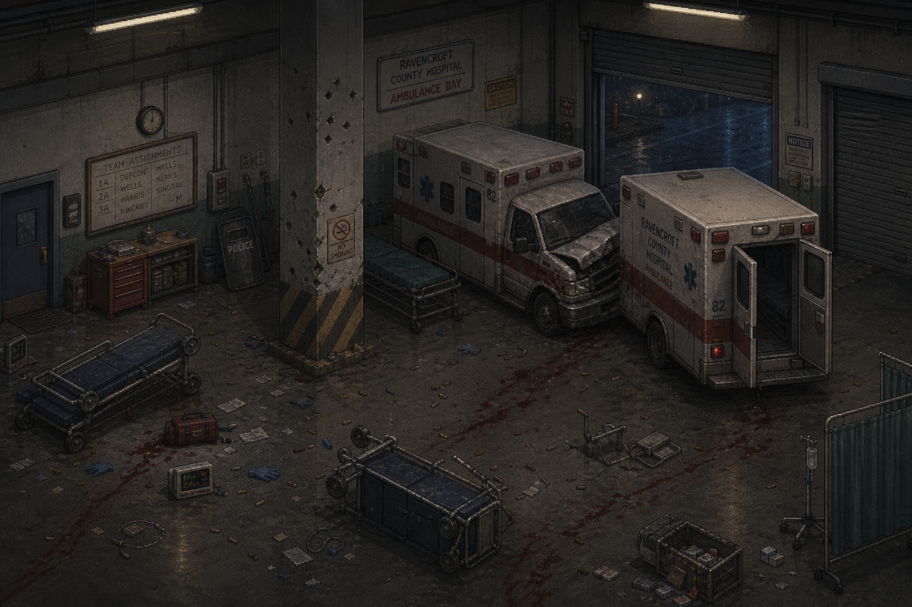

The Ambulance Bay is the hospital's version of the Police Station's wrecked patrol lot: overturned
gurneys, spent shell casings — some RPD, some a caliber Jim doesn't recognize — a crashed ambulance
nosed into a parked one. Blood trails run in more than one direction, crossing each other rather
than leading anywhere in particular.

*Interaction prompt: [SEARCH EQUIPMENT]*

Near an overturned gurney: a fire axe, department-red, hospital property.

*ITEM ACQUIRED: FIRE AXE*

### If Jim has 0–1 emblems: Richard Dalton (alive)

A man bursts out of a side door near the bay, moving too fast for the footing, nearly goes down.
**Richard Dalton** — Jim recognizes him from the hotel lobby.

> **RICHARD:** *"Hey — are you staff? Please tell me you're staff."*
>
> **JIM:** *"No. Richard, right? From the hotel."*

That stops him for half a second.

> **RICHARD:** *"...Jim. You made it out."*
>
> **JIM:** *"Barely. What's going on?"*

> **RICHARD:** *"Maria's in there. Maternity ward. I went to find a doctor and I couldn't find
> anybody, everybody's either gone or dealing with something worse than us—"*

He stops himself.

> **RICHARD:** *"I'm sorry. I know this isn't your problem."*
>
> **JIM:** *"It's fine. Where is she exactly?"*
>
> **RICHARD:** *"Maternity. Third floor, I think. I got turned around twice already."*

> **JIM:** *"I'll find her. Stay somewhere safer than out in the open."*

> **RICHARD:** *"Okay. Just— come back and tell me. Whatever it is. Don't just not come back."*
>
> **JIM:** *"I will."*

He doesn't. Not yet.

> *Design note: Richard's alive-version Tier 2b beat. Jim's eventual return conversation stays
> unwritten per [`Characters/Richard_Dalton.md`](../Characters/Richard_Dalton.md).*

### If Jim has 2+ emblems: Richard Dalton (dead)

No one comes out of the side door. Near the edge of the bay, half-behind an overturned gurney: a
body, face-down, one arm outstretched toward the hospital's side entrance he never reached. Jim
turns him over.

> **JIM:** *"...Richard."*

He doesn't say anything else for a moment.

> **JIM:** *"...I'll find her anyway."*

---

## SCENE 3 — EMERGENCY DEPARTMENT / TRIAGE HALL

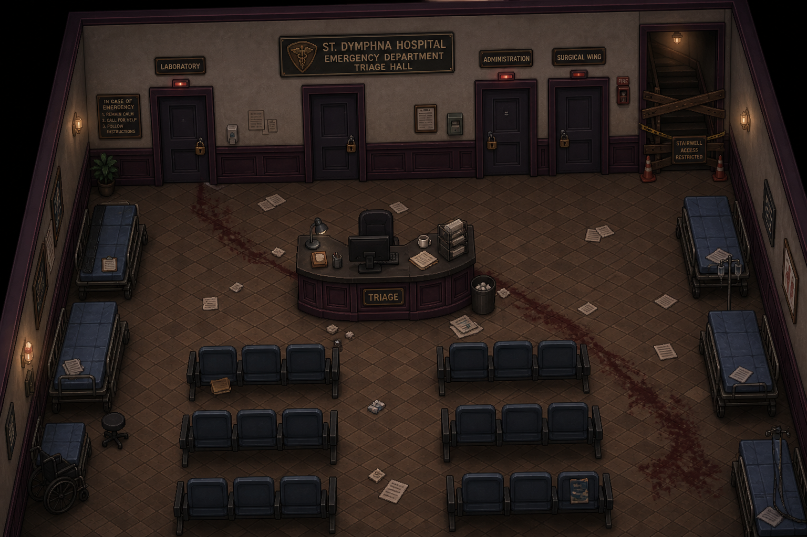

Through the Ambulance Bay's inner doors: the Emergency Department, a wide hall lined with gurneys,
most still made up with clean sheets nobody got to use again. Hallway triage stations sit abandoned
mid-use.

Two doorways stand open with no lock at all: one toward **RADIOLOGY**, one toward the **MATERNITY
WARD** corridor. A dim stairwell near the nurses' station leads down toward the **MORGUE.**

A shambler in scrubs shuffles between two gurneys, unaware.

*Combat: Shambler (hospital gown/scrubs).*

Once it's down, the ED goes quiet enough that Jim can hear a flatlined monitor still cycling
somewhere behind him. It's only once he's already deep into the wing — past Radiology, past the
Morgue stairwell — that the far end of the hall resolves into something he can actually size up:
the Laboratory and Administration standing open beyond the nurses' station, and past them, a
sealed corridor with a control panel glowing at its far end, a barricaded stairwell up beside it
with a hand-lettered sign zip-tied to it: **PSYCH WARD — DO NOT — THEY ARE STILL IN THERE.**

---

## SCENE 4 — RADIOLOGY

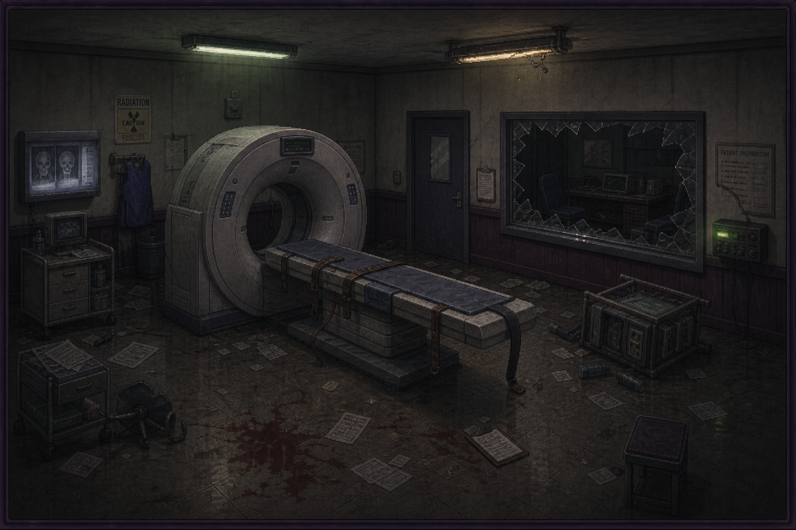

A CT suite, the machine's ring still faintly lit, a restraint gurney buckled open — the straps
snapped rather than unbuckled. A wall-mounted radio on the counter cycles through dead
frequencies.

*Interaction prompt: [EXAMINE RADIO]*

For a moment it catches something.

> **DISPATCH (RADIO, DISTORTED):** *"Unit Twelve, respond Ravenwood Memorial. Violent patient.
> Radiology."*

Static swallows the rest.

> **JIM:** *"...That's here."*

Movement from behind the CT machine — slow at first, then very much not.

*Combat: a tougher single Shambler encounter — the transformed CT-suite patient.*

Once it's down, Jim finds an orderly slumped against the far wall, a torn, laminated page tucked
under his arm rather than any keys.

*Interaction prompt: [TAKE PAGE]*

*ITEM ACQUIRED: ISOLATION MANUAL PAGE*

He must have grabbed it running the wrong direction. A diagram of pressure zones — Air Intake,
Isolation Ward, Surgical Wing, Decontamination Corridor, Exhaust — half the page torn away.

> **JIM:** *"Half a map's better than none."*

> *Design note: cross-references the police dispatch call already documented at
> [`Locations/Police_Station.md`](../Locations/Police_Station.md).*

---

## SCENE 5 — THE LABORATORY

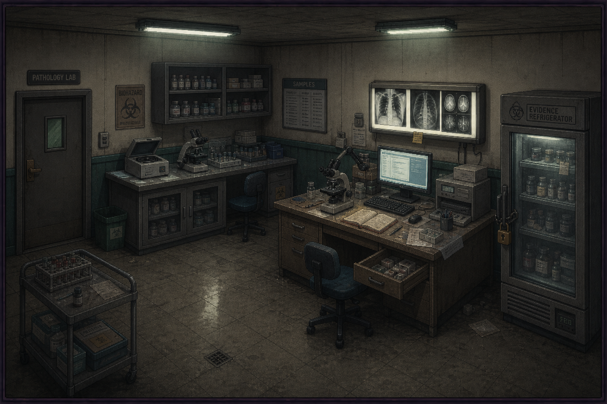

Unlocked, off the ED. A room of microscopes, sample racks, and a pathologist's workstation — a
monitor still on.

*Interaction prompt: [READ MONITOR]*

> *"...preliminary findings inconsistent with any known coagulation or dermatological pathology.
> Cellular activity does not cease following trauma; it accelerates. Necrosis appears to provoke
> rather than suppress cellular activity. Requesting authorization for tissue sampling outside
> Ravenwood — "*

The document ends there, unsent. Jim reads the last line again before he moves on.

### Optional — sample racks

*Interaction prompt: [EXAMINE SAMPLES]*

Labeled vials, several marked: **"DO NOT RELEASE — V. AUTH PENDING."**

### Optional — desk drawer

*Interaction prompt: [SEARCH DESK]*

A printed transfer form, a nurse's signature crossed out and initialed over in a different hand.

> **VANGUARD MEDICAL AUTHORITY — PATIENT TRANSFER**
>
> RECEIVING FACILITY: **VANGUARD MEDICAL AUTHORITY**
>
> *(No hospital name. No address. A nurse's signature, crossed through. Beside it, in a different
> pen: "Signed on behalf of — see attached authorization." No attachment is present.)*

> **JIM:** *"She said no. They signed for her anyway."*

---

## SCENE 6 — ADMINISTRATION

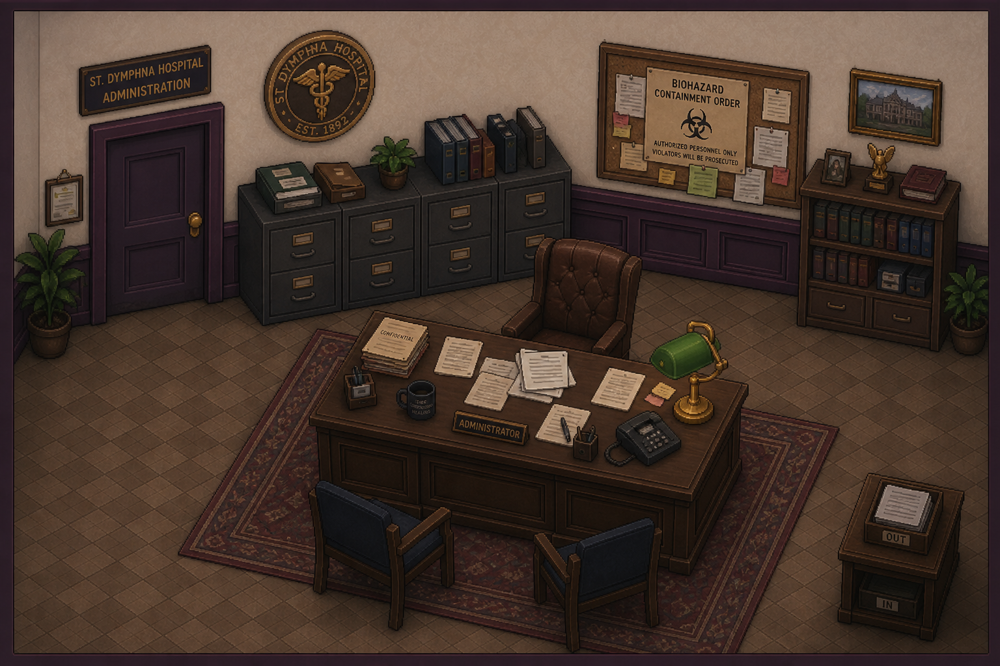

Unlocked, off the ED. A suite of offices, decor a level nicer than anywhere else in the building —
a reception desk with a dead phone system still lit up with unanswered lines blinking red.

*Interaction prompt: [SEARCH FILES]*

### Document — Vanguard's V-CASE protocol for hospital staff

> Near-identical to the Police Station's own material. Procedure: **stabilize and isolate pending
> specialist transfer.** Explicitly barred: biopsies, advanced imaging, tissue samples sent outside
> Ravenwood.

### Document — the Biohazard Containment Order

> A remote-lockdown directive. Justification: **preventing contamination beyond Ravenwood.** No
> signature — issued through infrastructure Vanguard itself installed.

### Document — the administrator's correspondence, increasingly panicked

> Ending on an unanswered message sent twenty minutes before outgoing communications cut out
> entirely: *"You are locking doctors and patients inside a building with this. Please advise."*
> No reply logged.

### Optional — a physician's confused call transcript

*Interaction prompt: [READ TRANSCRIPT]*

> *"Who is this?" / "We have records." / "Cellular activity increases after tissue damage." /
> "...Yes." / "How the hell do you know that?" / "Because you're not the first people to see it."*

> **JIM:** *"Not the first people to see it. Then who was?"*

### Optional — a one-line transmission relayed outward

*Interaction prompt: [EXAMINE RADIO LOG]*

> *"Do not perform invasive treatment unless absolutely necessary."* Relayed, per a routing note,
> to **Worthy Academy** — passed on to shelter staff with no medical training.

### Optional — early triage chart

*Interaction prompt: [EXAMINE CHART]*

> An early intake chart notes a cluster of industrial-trauma admissions, all listing the same
> employer: **Steelgate Refinery.**

### Optional — two nurses' shift-change notes, stapled together

*Interaction prompt: [READ NOTES]*

The handwriting changes partway down the page — one nurse logging a patient as stable at the end
of her shift, the next logging the same patient, an hour later, as already gone. Neither note
mentions the other. Whatever happened in between isn't written down anywhere Jim can find.

Jim sets everything back down.

---

## SCENE 7 — THE MORGUE

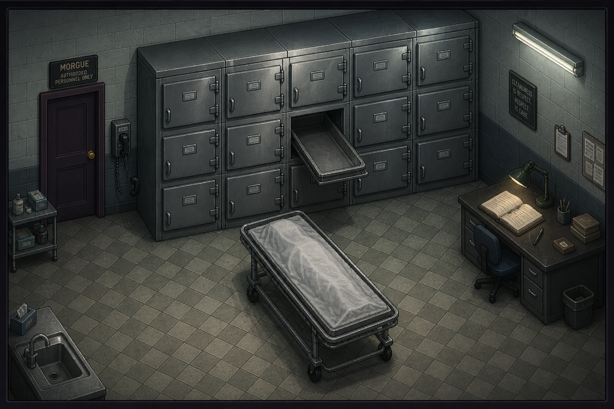

A dim, unmarked stairwell off the nurses' station. Cold, tiled, a wall of drawers, most closed. One
gurney nearby holds a sheet pulled back over nothing at all.

*Interaction prompt: [EXAMINE LOG]*

A logbook lies open on the attendant's desk, the entries stopping mid-sentence:

> *"Bringing down another one from the ED. Getting crowded down here. Going to need — "*

Nothing after it.

*Interaction prompt: [PLAY LAST TRANSMISSION]*

> **ATTENDANT (RECORDING):** *"I need somebody down here. Now. One of these people isn't dead."*

Static. No response was ever recorded.

### Optional — the drawers

*Interaction prompt: [SEARCH DRAWERS]*

One slides open on its own the moment Jim's hand gets near the handle.

*Combat: one Shambler, staged for shock rather than difficulty.*

Once it's down, Jim closes the drawer himself.

---

## SCENE 8 — THE ISOLATION CONTROL PANEL

Where the ED corridor narrows toward the sealed section: a full-wall panel, five gauges under
hand-lettered labels — **AIR INTAKE, ISOLATION WARD, SURGICAL WING, DECONTAMINATION CORRIDOR,
EXHAUST** — each needle sitting in a red, yellow, or green band. A doctor is slumped at the base of
the panel, one hand still resting against it. A laminated card is taped above the controls, in the
same hand as the note in Radiology:

> *"Never create a positive-pressure path from Isolation into General Care."*

*Interaction prompt: [EXAMINE PANEL]*

The isolation manual page from Radiology fits a gap in the panel's own cover where a matching piece
tore away. Even half-complete, it's enough to make sense of the gauges — but one control, a backup
damper override, is missing its physical key entirely. A tag on the empty slot reads **MEDICAL
ARTS BLDG — RM 4.**

> **JIM:** *"...Need to go get that, then."*

*Design note: this is the puzzle's real gate — see [`Locations/Hospital.md`](../Locations/Hospital.md)
→ "The Quarantine System." Jim can attempt the sequence without the damper control, but the
Surgical Wing's door won't hold once he crosses — the game should let the player try and fail once,
learning the rule experientially (a gauge climbing into red, a door re-locking) rather than being
told outright that the backtrack is mandatory.*

---

## SCENE 9 — THE MEDICAL ARTS BUILDING (SECONDARY)

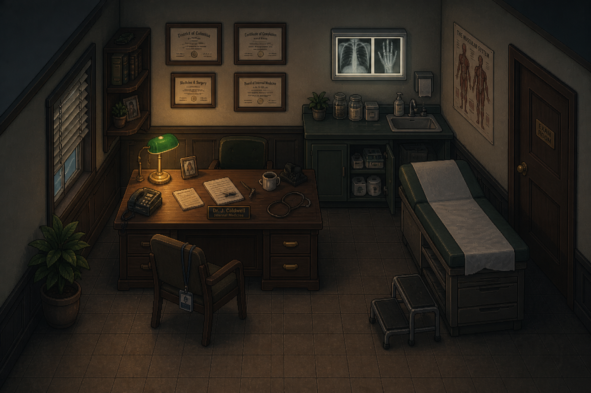

A separate, smaller building down the block — private doctors' offices and an outpatient clinic. A
directory sign in the lobby lists a dozen names, half the letters missing.

*Interaction prompt: [EXAMINE OFFICES]*

Room 4's door stands open — a physician's private practice, mid-shift-change: a coffee cup, a lab
coat on a hook, a desk calendar with the day's remaining appointments never crossed off.

*Interaction prompt: [SEARCH DESK]*

A small mechanical override control, hospital-issue, sits on the blotter exactly where someone set
it down between patients.

*ITEM ACQUIRED: BACKUP DAMPER CONTROL*

---

## SCENE 10 — THE ISOLATION CONTROL PANEL (RETURN)

Back at the panel, the damper control seats into its slot.

*Interaction prompt: [OPERATE PANEL]*

Jim works it the way the torn manual page describes: close General Intake, vent Isolation — the
needle drops out of red — cross while the door's open, then seal Isolation behind him before
pressurizing Surgical. Somewhere down the corridor, a vent releases with a hiss loud enough to make
him flinch, and for a second something moves inside the ductwork above him, too fast to place.

> **JIM:** *"...Nope. Not looking at that."*

The Surgical Wing's door releases. Behind him, Isolation reseals — the corridor's own logic holding
even once he's past it.

---

## SCENE 11 — THE SURGICAL WING

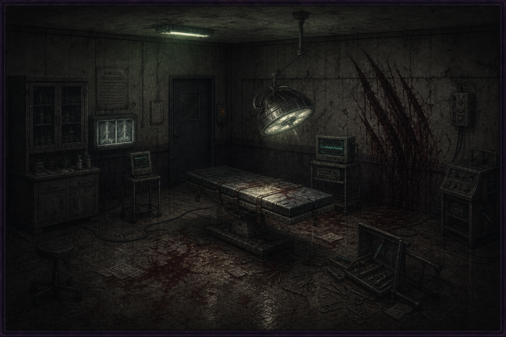

The Surgical Wing is worse than anything else in the building so far — an operating room
mid-procedure, abandoned exactly as it was left. A logbook sits open on a rolling cart near the
door.

*Interaction prompt: [READ SURGICAL LOG]*

> *"Abdominal trauma, extensive. Began standard exploratory procedure. Within minutes, tissue at
> the incision site began regenerating — malformed, disorganized, faster than we could work. We
> stopped the procedure because every incision produced additional growth. Patient did not
> arrest. Patient did not die on the table."*

The entry ends there. Jim looks toward the deeper doors at the back of the wing — the ones marked
**OR 3.**

> **JIM:** *"Didn't die on the table. So where'd he go."*

---

## SCENE 12 — BOSS ENCOUNTER: "THE SURGEON"

OR 3 is dark, lit only by one working surgical lamp still swinging gently on its arm. Something
large is crouched in the far corner, back to Jim.

*Interaction prompt: [ENTER OR 3]*

It turns. Aged, wrinkled human face. Glasses, somehow still on. Where its other arm should be: an
enormous, gnarled, clawed hand-limb, large enough that the rest of its body sits on it rather than
beside it.

> **JIM:** *"...Jesus."*

*Combat: "The Surgeon" (see [`Creatures/Unnamed_Hospital_Boss.md`](../Creatures/Unnamed_Hospital_Boss.md)).
The giant hand doubles as both locomotion and its primary close-range attack. The tranquilizer-gun
arm is a separate, ranged threat.*

Once it's down, it collapses across its own giant hand, finally still.

> **JIM:** *"They called you something, back when you still had a name."*

He doesn't know what.

---

## SCENE 13 — THE ICU

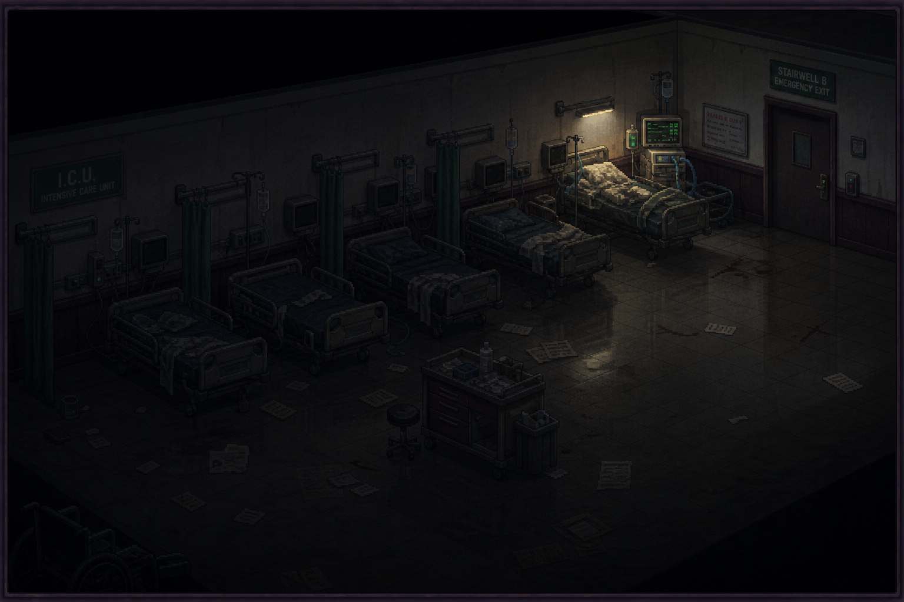

Past OR 3, the ICU — no separate lock; the pressure system already keeps this section's own gauge
in the green. Half the ward sits in total darkness, monitors dead. The other half hums quietly on
backup power.

*Interaction prompt: [EXAMINE POWER SPLIT]*

> **JIM:** *"Half the room has power. Half doesn't. That's not a failure. That's a choice."*

In the lit half: one bed, one working ventilator, and two bodies — a patient, and beside him, a
nurse who clearly didn't leave when she could have.

*Interaction prompt: [READ CHART]*

> *"Mr. Palmer is ventilator dependent. We cannot move him without power."*

Underneath, a different hand:

> *"I'll stay."*

Jim looks at both of them a moment longer than the room asks for. He doesn't say anything.

---

## SCENE 14 — ST. DYMPHNA CHAPEL

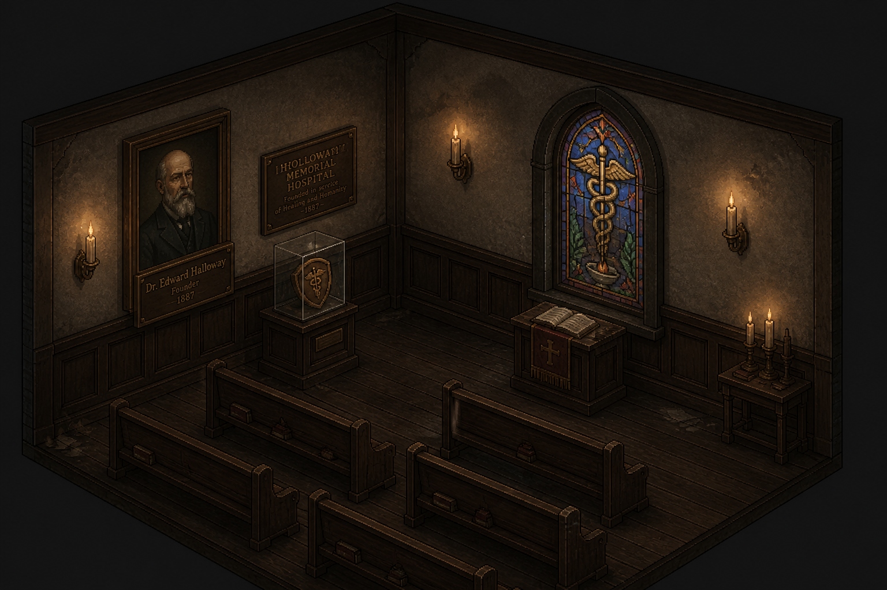

Unlocked, past the ICU. A small, hushed room, entirely unlike anywhere else in the hospital — a
dozen pews, a modest stained-glass window. A portrait hangs beside a small brass founding plaque.

> **DR. NATHANIEL VOSS**
> **FOUNDING PHYSICIAN**
> **1887**

*Interaction prompt: [OPEN CASE]*

A glass-fronted case beside the portrait — an actual working latch, not brittle antique glass.

*ITEM ACQUIRED: MEDICAL CREST*

He looks back at the empty pews.

> **JIM:** *"Hope whatever you built held up better than the building did."*

---

## SCENE 15 — THE MATERNITY WARD

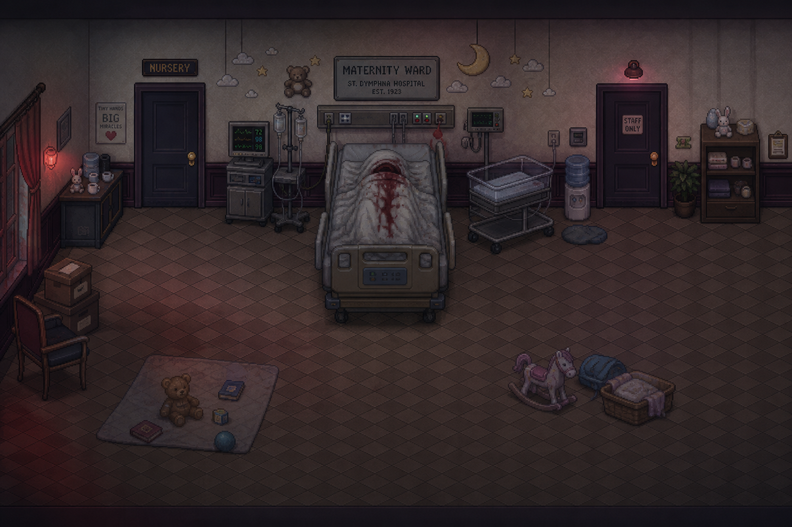

Off the Emergency Department, unlocked. Inside: a private room, one bed. **Maria Dalton** — Jim
recognizes her instantly. She's clearly just given birth; the scene reads as finished rather than
in progress. She didn't survive it.

> **JIM:** *"...Maria."*

He stands there for a moment.

> **JIM:** *"Richard's outside. He doesn't know."*

*(This line only plays if Richard is alive per Scene 2's conditional branch.)*

Movement, low and fast, from beneath the far side of the bed.

*Combat: The Broodling (see [`Creatures/Broodling.md`](../Creatures/Broodling.md)) — small
profile, fast and low, scrabbling rather than walking.*

Once it's down, Jim doesn't stay in the room longer than he has to.

> **JIM:** *"...I'm sorry."*

He says it to her, not to what he just fought.

---

## SCENE 16 — THE NICU

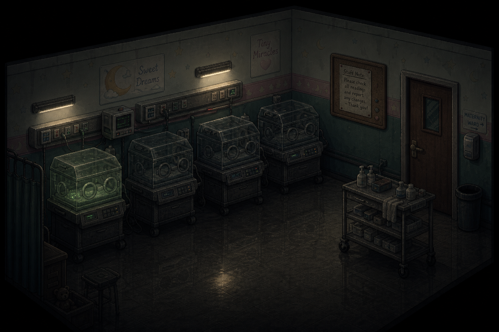

A small room adjacent to Maternity — no lock. Rows of incubators, most dark and empty. One still
runs on backup power, humming quietly, with nothing inside it.

*Interaction prompt: [READ NOTE]*

> *"Attempted to move the infants to the sub-basement shelter at 1:10 AM. Could not get the second
> group past the ED. Returning them here. Will try again when it's quieter."*

No further entry.

> **JIM:** *"...Yeah."*

He leaves the incubator running.

---

## SCENE 17 — THE VANGUARD QUARANTINE CHECKPOINT (SECONDARY, OPTIONAL)

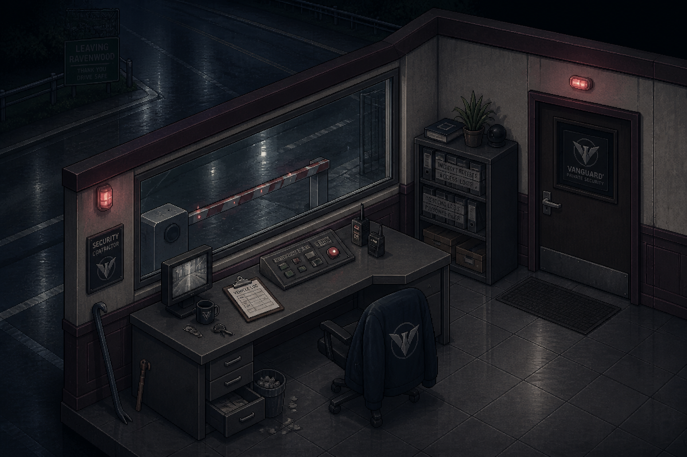

A small guard checkpoint at the district's edge, where the road out of Ravenwood is blocked with
the same kind of barrier Jim's already seen at Memorial Park. A Vanguard-branded booth, dark, door
hanging open.

*Interaction prompt: [SEARCH BOOTH]*

A logbook on the counter, checkpoint traffic recorded in a clipped hand.

*Interaction prompt: [READ LOG]*

> Entries cross-referencing **"Emergency Public Safety Directive 7,"** and a later entry timed to
> the Highway 13 confrontation: *"Checkpoint requests reinforcement. RPD non-compliant. Advise."*
> No response logged after that entry.

Jim reads it twice before he moves on.

### Optional — the equipment locker

*Interaction prompt: [SEARCH LOCKER]*

A flat steel pry bar.

*ITEM ACQUIRED: PRY BAR*

---

## SCENE 18 — THE PSYCHIATRIC / BEHAVIORAL HEALTH WARD (OPTIONAL)

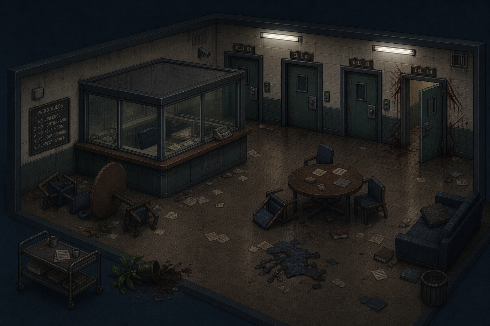

Back at the Emergency Department, the pry bar forces the barricaded stairwell.

*Interaction prompt: [FORCE BARRICADE]*

> **JIM:** *"'They are still in there.' Great."*

Up the stairwell: a nurses' station and a row of locked cells, several standing open, one bent
outward. Documents are scattered across the counter, several stamped **"V-CASE TRANSFERRED."**

*Interaction prompt: [READ FILES]*

> Names, dates, and transfer stamps matching the Police Station's own confidential watchlist
> almost exactly.

Jim doesn't say anything. He's already seen this stamp once tonight.

Shapes move between the cells — more than one.

*Combat: multiple Shamblers (hospital gowns) in a tight nurses'-station-and-cells layout — the
district's most dangerous optional encounter.*

Once the ward is clear, Jim doesn't linger.

---

## SCENE 19 — THE HOSPITAL PARKING STRUCTURE (SECONDARY, OPTIONAL)

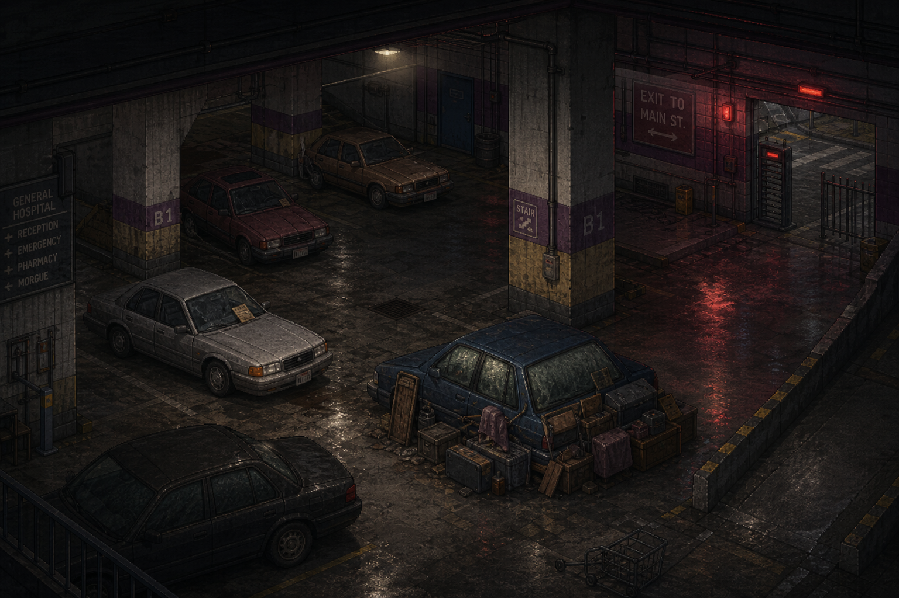

A multi-level parking structure adjoining the hospital, mostly abandoned cars. One car near the
ramp has its windows covered from the inside with taped-up cardboard and a blanket.

*Interaction prompt: [EXAMINE VEHICLE]*

Jim looks through a gap in the cardboard. Doesn't need to open the door to know.

> **JIM:** *"...You held out longer than the door would've."*

He doesn't open it.

### Optional — supply cart

*Interaction prompt: [SEARCH SUPPLY CART]*

*ITEM AVAILABLE (optional): MEDKIT, HANDGUN AMMUNITION.*

A rear exit ramp, gate chain-cut and standing open, leads directly onto the surrounding street
grid.

*Navigation shortcut: this ramp provides a direct route between the Parking Structure and the
wider district street grid.*

---

**END OF WRITTEN MATERIAL FOR ST. DYMPHNA HOSPITAL**

*Once the Medical Crest is collected and the secondary locations explored, Jim is free to head to
any of the remaining districts in any order. All five Chapter 2 districts now have complete
scripts matching their own puzzle philosophy (2026-08-14) — see
[`STORY_NOTES.md`](../STORY_NOTES.md) → "Five Puzzle Philosophies — script rewrite."*
