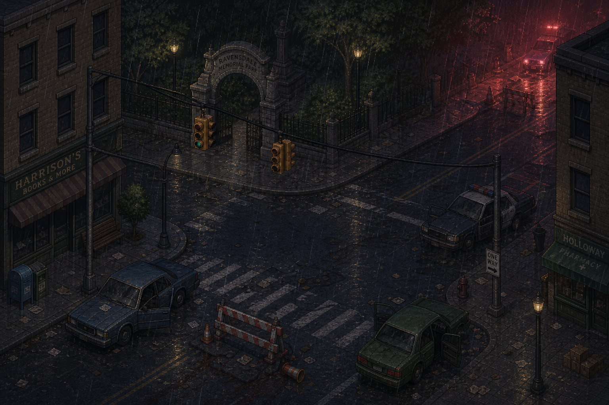
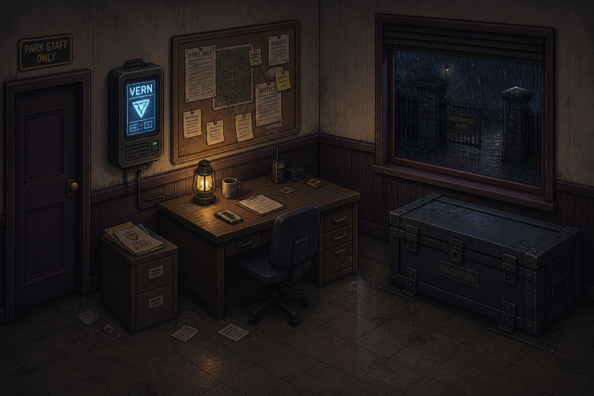
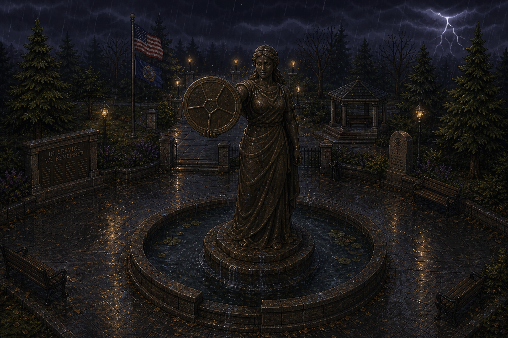
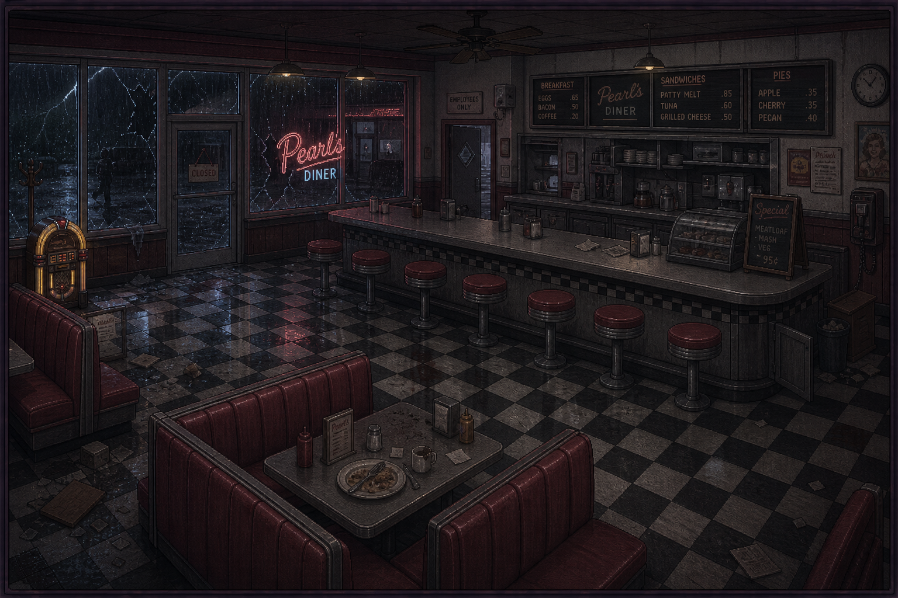
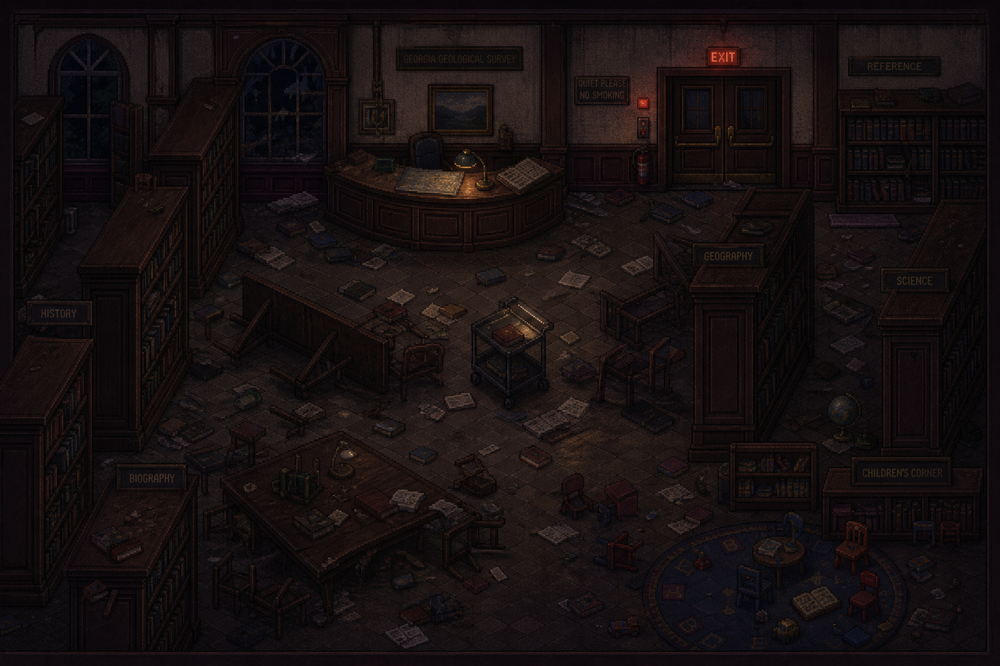
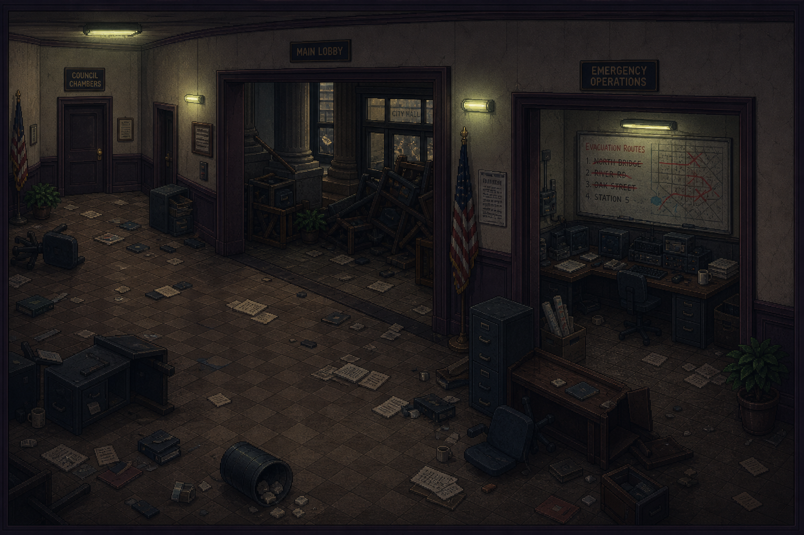

# Chapter 2 — Ravenwood (Downtown & Memorial Park)

> Scene-by-scene script, continuing the numbering convention from [`Chapter_1_One_Night_Only.md`](Chapter_1_One_Night_Only.md)
> (numbering restarts at Scene 1 for this chapter). Covers the street crossing, Memorial Park
> (clearing it, the guardhouse, the Founders Memorial), and the Downtown introduction (Pearl's
> Diner, the Public Library, City Hall) — Scenes 1–21, ending as Jim first steps into the open-order
> district phase.
>
> **File split, 2026-08-13:** this file originally continued straight into the Police Station
> district as Scenes 22–45. Per the project owner's request ("we should split each district into
> its own file to make it easier"), that content has been moved to its own file,
> [`Chapter_2_Police_Station.md`](Chapter_2_Police_Station.md) (renumbered there as Scenes 1–24),
> matching the standalone-per-district convention already established for
> [`Chapter_2_Hospital.md`](Chapter_2_Hospital.md). This file now covers only the shared
> Downtown/Memorial Park content every district route passes through before splitting off — see
> [`Scripts/README.md`](README.md) for the current file list and
> [`STORY_NOTES.md`](../STORY_NOTES.md) for the full rationale/mechanical details of the split.
>
> Status: all of Scenes 1–21 here are drawn from material marked `FINALIZED CANON — LOCKED` in
> [`AI.json`](../AI.json).

---

## SCENE 1 — NORTH COURTYARD GATE / STREET ENTRY

Jim steps through the north courtyard gate. The hotel wall falls away behind him. For the first
time since arriving in Ravenwood: he is outside. The storm has not let up. Rain hammers the empty
street ahead. Emergency lighting from somewhere deeper in the city throws pale red across the wet
pavement.

*SFX: heavy rain; distant sirens — multiple, not close; wind through power lines overhead;
something burning somewhere to the east — low crackling; a car alarm cycling weakly in the
distance before dying.*

Jim stops just outside the gate. Takes it in. The street runs east to west in front of him.

At his feet, right at the threshold of the gate — a dark stain smears across the wet pavement,
thinning under the rain but not gone yet. Not his. It leads away from the hotel wall, roughly
parallel to the direction he needs to go, and disappears into the dark ahead. Jim looks at it a
second longer than he means to.

> **JIM:** *"...Okay."*

He doesn't say anything else about it. He starts walking, and without quite deciding to, he starts
following it.

To his left: a row of parked vehicles sits abandoned along the curb. One has its doors hanging
open. A purse lies in the gutter beside it — contents scattered across the wet asphalt.

To his right: a traffic barrier has been partially dragged across the road. Orange cones surround
it. A police flashlight lies on the ground nearby — still on — rolling slowly in the wind against
the curb.

Ahead: the street runs straight for approximately half a block before the entrance to Memorial
Park becomes visible through the rain. Iron fence posts. A stone archway. A gate standing open.

> **JIM:** *"…Whole town's gone."*

*Player control — linear. The player can move forward only; the street to the east and west is
currently blocked by raised emergency bollards (see below) and inaccessible. On return visits,
once the bollards are lowered, the street opens in both directions.*

---

## SCENE 2 — STREET DETAILS

*AI-generated room concept, for visual reference — see [`Locations/Memorial_Park.md`](../Locations/Memorial_Park.md) for the full room writeup.*

As Jim crosses the street toward the park entrance:

### Optional interaction — abandoned vehicle

Jim passes the open-doored car along the curb.

*Interaction prompt: [EXAMINE VEHICLE]*

Inside: a child's stuffed animal sits on the back seat. A cracked phone lies face-down on the
passenger floor. Jim tries the phone. Dead.

> **JIM:** *"Come on."*

He sets it back down.

### Optional interaction — police flashlight

Jim already has his own clipped to his belt, but he checks this one anyway — cracked lens,
still lit, rolling in slow half-circles against the curb. He pockets the batteries and leaves the
rest.

*Interaction prompt: [TAKE BATTERIES]*

*ITEM ACQUIRED: FLASHLIGHT BATTERIES*

> **JIM:** *"Can always use more of these."*

### Optional interaction — traffic barrier / bollard notice

*Interaction prompt: [EXAMINE BARRIER]*

A laminated notice has been zip-tied to the barrier frame. Barely readable through the rain.

> **RAVENWOOD EMERGENCY MANAGEMENT**
>
> **ROAD CLOSURE — AUTHORIZED PERSONNEL ONLY**
>
> By order of Ravenwood PD and County Emergency Services — all civilian foot and vehicle traffic
> is restricted beyond this point until further notice.
>
> Deadlock Protocol is in effect.
>
> Comply with all officer instructions immediately.
>
> Failure to comply may result in detention.
>
> This is not a drill.

Jim lowers his eyes from the notice. Looks up at the empty street ahead.

> **JIM:** *"Comply with all officer instructions."*

A beat.

> **JIM:** *"Sure."*

### The bollards themselves

Heavy retractable steel bollards are raised on both sides of the street, roughly twenty feet from
the park entrance in each direction — eight to ten posts sitting flush against each other, blocking
the full road width. A small weatherproof control panel is mounted beside each line.

*Interaction prompt: [EXAMINE BOLLARDS]*

> **JIM:** *"Emergency lockdown barriers. Someone raised these on purpose."*

He tries the control panel immediately.

> **PANEL DISPLAY:** RAVENWOOD EMERGENCY MANAGEMENT — BOLLARD SYSTEM — ACTIVE — AUTHORIZATION
> REQUIRED

Locked. Jim can't lower them yet. The park entrance directly ahead is the only way forward.

---

## SCENE 3 — FIRST INFECTED ON THE STREET

Halfway across the street: movement. A lone infected stumbles out from the gap between two parked
vehicles approximately thirty feet ahead. It does not immediately notice Jim. It moves
erratically — listing sideways — head rolling — wrong in the way they are all wrong. Then it stops.
Turns slowly toward Jim. It sees him.

*The player's options:*

- **[AVOID]** — Jim moves quietly along the far side of the parked cars toward the park gate — the
  infected loses him in the rain.
- **[ENGAGE]** — combat begins — the infected is a **standard shambler**, manageable alone.

*Either path leads to the park entrance. The choice is the player's.*

> *Design note: this is the game's first confirmed on-screen depiction of a standard "shambler"
> infected — see [`CANON.md`](../CANON.md).*

The trail thins as it goes — rain doing what rain does to anything it's given enough time
with — and by now it's little more than scattered dark spots, easy to miss if Jim wasn't already
looking for them. It doesn't lead to the park gate. It goes wide of the archway, angling off toward
a stretch of low hedges along the outer fence line, and stops.

There, half-flattened into the wet grass — a robe. Hotel-issue, pale, soaked through and gone
heavy with rain. Torn open down one side, the fabric pulled rather than cut, like something forced
its way out of it or forced its way in. Empty.

Jim crouches beside it. Doesn't touch it, not at first.

> **JIM:** *"...Cindy."*

He says it quietly — not a question, not really an announcement either. More like confirming
something to himself that he already suspected the moment he saw the color of it. No body. No
trail continuing past this point — whatever went this way either doubled back toward the street or
stopped needing the ground under it. Jim stays crouched there a beat longer than the rain gives
him any reason to.

> **JIM:** *"I'm sorry."*

He doesn't know what exactly he's apologizing for. He stands up anyway, leaves the robe where it
is, and looks toward the park gate a few dozen feet ahead.

> *Design/story note: this deliberately does NOT resolve Cindy Sweets' fate — see
> [`CANON.md`](../CANON.md) and [`STORY_NOTES.md`](../STORY_NOTES.md), where it remains an
> explicitly open question. This is an escalation of dread, not a resolution: confirmation that
> whatever took her came this way, with no body and no further trail to say what happened after.
> The robe is identifiable as hers by design — hotel-issue, matching both her Scene 14
> characterization and the Scene 29 abduction in
> [`Chapter_1_One_Night_Only.md`](Chapter_1_One_Night_Only.md) — but nothing here should be read as
> confirming she's dead, alive, or turned.*

---

## SCENE 4 — MEMORIAL PARK — SOUTH GATE ARRIVAL

Jim reaches the south gate of Memorial Park. The iron gate stands open. The stone archway above
bears carved lettering — weathered but readable: **MEMORIAL PARK — EST. 1891.** Jim steps through
the archway. The park spreads out ahead of him.

*SFX: rain on stone pathways; wind through mature trees; distant thunder rolling across the ridge;
the city sounds beginning to muffle behind the park fence.*

The park is large. Dark. Lit only by: intermittent lightning; a handful of path lights still
running on emergency power — dim amber along the walking paths; the faint red glow of the city
emergency lighting bleeding over the fence line.

Ahead through the rain: the walking path leads deeper into the park. In the far distance — barely
visible through the trees and the storm — the silhouette of the statue at the park's center. Jim
does not approach it yet.

---

## SCENE 5 — FIRST LOOK INSIDE THE PARK

*Player control returns.*

Jim stands just inside the south gate. The park is immediately wrong. Not chaos — not the hotel
lobby — not the street. Something quieter than that. The kind of wrong that comes from a place
that should have people in it being completely empty. Benches sit vacant along the paths. A coffee
cup has been knocked from one bench onto the stone path — the contents long washed away by rain.
An umbrella lies abandoned near the central fountain — turned inside out by the wind. The amber
path lights flicker softly overhead.

Then: movement. Two infected visible from Jim's position near the gate. One moves slowly along the
western path near the fence line. One crouches near an overturned park bench midway up the
central path — its back to Jim. Neither has noticed him yet.

---

## SCENE 6 — CLEARING THE PARK

Total infected in the park on arrival: **FOUR.**

- One along the western fence path.
- One crouching near the central path bench.
- One near the base of the large oak tree northeast of the guardhouse.
- One inside the guardhouse itself — visible through the window — moving slowly.

*The player may approach and handle them in any order. No reinforcements — the fence is intact
and the remaining three gates are locked from the outside.*

Once all four are dealt with: the park is secure.

### The guardhouse infected

The infected inside the guardhouse requires the player to open the guardhouse door to engage.

*Interaction prompt: [OPEN DOOR]*

The door swings inward. The infected turns immediately. Close quarters. The guardhouse interior is
tight — a desk, a chair, a filing cabinet, the VERN terminal on the wall. The infected is dealt
with in the confined space.

After: Jim stands in the guardhouse doorway. Breathing. Listening. Rain on the roof. Wind through
the trees outside. Nothing else moving.

> **JIM:** *"Alright."*

He steps fully inside. Pulls the guardhouse door shut behind him.

---

## SCENE 7 — SECURING THE SOUTH GATE

After clearing the park:

*Interaction prompt (near the south gate): [SECURE GATE]*

Jim finds a heavy sliding bolt mechanism on the inside of the south gate frame. He drives it home.
**CLUNK.** The gate is now secured from the inside.

> **JIM:** *"That's something at least."*

*The south gate can still be opened from the inside by Jim at any time, but nothing is getting in
from the outside without force.*

---

## SCENE 8 — GUARDHOUSE INTERIOR

*AI-generated room concept, for visual reference — see [`Locations/Memorial_Park.md`](../Locations/Memorial_Park.md) for the full room writeup.*

The guardhouse is small. A single room barely large enough for two people. Contains:

- wooden desk — scarred with years of use
- swivel chair
- filing cabinet — two drawers
- wall-mounted VERN terminal — screen dark — awaiting activation
- large metal inventory chest bolted to the floor beside the desk
- corkboard above the desk covered in papers — maintenance schedules, park maps, handwritten notes
- small window overlooking the south gate and the street beyond
- battery-powered emergency lantern on the desk — still burning — low
- a **Ravenwood Emergency Management keycard** — sitting on the desk beside the lantern

The room smells of old paper and rain. It feels safe. Temporarily. *The player should recognize
this feeling from Room 104. That same false permanence.*

### Optional interaction — keycard

*Interaction prompt: [TAKE KEYCARD]*

Jim picks it up. A small laminated card — orange and white — the Ravenwood Emergency Management
seal on the front. Printed below the seal:

> STREET INFRASTRUCTURE OVERRIDE
>
> SECTOR 4 — MEMORIAL PARK PERIMETER

*ITEM ACQUIRED: BOLLARD OVERRIDE KEYCARD*

> **JIM:** *"Handy."*

---

## SCENE 9 — VERN TERMINAL ACTIVATION

*Interaction prompt: [ACTIVATE VERN]*

The terminal flickers to life.

> **VERN:** VANGUARD EMERGENCY RESPONSE NODE / MEMORIAL PARK — TERMINAL 02 / RAVENWOOD MUNICIPAL
> NETWORK / DEADLOCK PROTOCOL: ACTIVE / EXTERNAL COMMUNICATIONS: OFFLINE / LOCAL NETWORK: PARTIAL

*Save functionality unlocked. Inventory chest unlocked simultaneously.*

Jim looks at the terminal for a moment.

> **JIM:** *"Terminal 02."*

He glances back toward the hotel direction through the small window.

> **JIM:** *"Wonder what Terminal 01 was."*

---

## SCENE 10 — CORKBOARD DOCUMENTS

The corkboard above the desk holds several items. The player may examine them individually.

### Document 1 — Park Maintenance Schedule

*Interaction prompt: [READ SCHEDULE]*

A printed weekly maintenance schedule — filled in by hand in several places. Routine entries:

> MON — Path lights west side. Check fountain pump.
>
> TUE — Fence inspection north and east.
>
> WED — Groundskeeping — central lawn.
>
> THU — Gate mechanism lubrication — all four.
>
> FRI — Generator fuel check. General cleanup.

Nothing unusual. Jim glances at it briefly and moves on.

### Document 2 — Park Map

*Interaction prompt: [EXAMINE MAP]*

A laminated park map — the kind sold in the small rack near the entrance. **RAVENWOOD MEMORIAL
PARK.** Marked on the map: central monument (labeled FOUNDERS MEMORIAL); four gate locations
(North/South/East/West); guardhouse (labeled PARK SECURITY); walking paths; central fountain;
bench areas; public restrooms (east side).

Jim studies the map. The four gates are clearly marked. The monument sits precisely at the
geographic center of the park.

*MAP ADDED TO INVENTORY.*

### Document 3 — Handwritten Note, Page 1

*Interaction prompt: [READ NOTE]*

A handwritten note — two pages — pinned separately. The handwriting is uneven. An older person's
hand. Someone who spent a lot of time alone with their thoughts.

> Been the groundskeeper here going on nineteen years.
>
> Know every inch of this park.
>
> Know the fountain pump makes a grinding noise in cold weather.
>
> Know the north gate sticks unless you lift it slightly when you turn the key.
>
> Know the big oak near the east path lost a branch in the storm of '09 and never quite grew back
> right.
>
> But I have never understood that statue.
>
> She's been here longer than me. Longer than anyone I've asked.
>
> The plaque she's holding — the five slots cut into it — nobody I've ever spoken to knows what
> goes in them.
>
> Parks department says it's decorative.
>
> I don't believe that.
>
> Something that precise isn't decorative.
>
> Those slots were made to hold something specific.
>
> You can see it in the tolerances — the way the edges are machined.
>
> Whatever fits in there was made at the same time as the plaque.
>
> Made together. Meant to go together.

Jim lowers the first page. Picks up the second.

### Document 3 — Handwritten Note, Page 2

> Mentioned it to a visitor once — a man who said he was a historian from the university over in
> Harlan.
>
> He got very quiet when I described the slots.
>
> Asked me if I'd ever seen anything like them anywhere else in town.
>
> I said I didn't think so.
>
> He said —
>
> "Look at the police station. The old building. Not the annex — the original 1890s structure.
> There's something on the wall inside the main hall that you might find interesting."
>
> Never got his name.
>
> Never saw him again after that afternoon.
>
> Always meant to go look.
>
> Never did.
>
> Nineteen years.
>
> Should've gone and looked.

Jim sets the note down on the desk. Stares at it for a moment.

> **JIM:** *"Police station."*

He looks at the park map still in his hand. The south gate. The street beyond. The direction of
the city.

---

## SCENE 11 — INVENTORY CHEST

*Interaction prompt: [OPEN CHEST]*

The heavy chest opens smoothly on well-oiled hinges. Currently empty. Available for item storage
throughout the game.

> **JIM:** *"At least something in this town works."*

---

## SCENE 12 — APPROACH TO THE FOUNDERS MEMORIAL

After securing the park and reading the guardhouse notes: Jim steps back out into the rain. The
park is quiet now. Only the sound of rain on stone pathways, wind through the trees, distant
thunder over the ridge, and the low hum of the remaining path lights.

Jim moves along the central walking path toward the monument. The amber path lights guide him
forward through the dark. The statue becomes more visible with each step. First: the silhouette. A
female figure rising above the treeline — larger than expected — dark against the storm sky. Then:
details emerge through the rain.

---

## SCENE 13 — THE STATUE

*AI-generated room concept, for visual reference — see [`Locations/Memorial_Park.md`](../Locations/Memorial_Park.md) for the full room writeup.*

Jim stops at the edge of the water basin surrounding the monument. He looks up at her. The statue
stands approximately ten feet tall on a wide stone base. Dark bronze. Weathered with age — green
oxidation along the shoulders and crown.

Her posture is civic. Deliberate. Not religious. Not military. The posture of someone who built
something and knew it would last. Her left arm extends outward slightly — open-handed — as if
presenting something to whoever approaches. Her right arm holds the plaque against her side —
angled outward — facing the approach path. Her expression is neutral. Forward-facing. Calm in the
way that old things are calm — not because nothing is wrong — but because they have seen worse.
Rain runs down her face in thin rivulets.

At her base: the water basin is full to the brim from the storm. Dark water reflects lightning
overhead. Jim stares up at her for a long moment.

> **JIM:** *"Who were you?"*

He lowers his eyes to the plaque.

---

## SCENE 14 — THE PLAQUE

Jim steps carefully along the narrow stone edge of the basin to reach the plaque directly. It
faces outward toward the approach path. Large. Circular. Dark metal — the same bronze as the
statue herself. A small five-sided pentagon sits at the exact center, a single weathered letter
cast into it — a **"V"**, worn nearly smooth, easy to miss if you're not looking for it. Around
that center hub, five recessed wedge-shaped sockets ring outward like a compass rose, each
precisely machined — beveled edges — an exact trapezoidal cavity, empty and waiting for something
that clearly used to sit there. Not a marking. An absence — like a missing puzzle piece. Currently:
all five are empty.

Around the outer rim of the plaque — cast into the metal in small capital letters — a single line
of text runs the full circumference:

> WHAT WAS DIVIDED SHALL BE WHOLE.
>
> WHAT WAS HIDDEN SHALL BE OPENED.
>
> — THE FOUNDERS OF RAVENWOOD — 1887 —

Jim reads it twice. Then looks at the five empty wedges. His eyes move across them slowly. Each
one has a faint engraving beneath it — small, almost worn away by time and weather, but readable
if you look closely. Jim leans in.

*Interaction prompt: [EXAMINE SLOTS]*

---

## SCENE 15 — THE FIVE SLOTS

Jim examines each wedge in turn. The engravings beneath each one read:

- **Wedge 1 — top (north):** FAITH
- **Wedge 2 — upper right (northeast):** MEDICINE
- **Wedge 3 — lower right (southeast):** KNOWLEDGE
- **Wedge 4 — lower left (southwest):** ORDER
- **Wedge 5 — upper left (northwest):** INDUSTRY

Jim straightens up slowly. He looks at the five words arranged around the empty medallion — and
then at how they're arranged. It isn't random. The wedge at the top faces due north, roughly
toward the hills. The one at the lower left faces southwest. Each wedge on this statue is pointed
the same direction as whatever it's missing.

> **JIM:** *"Five slots."*

A beat. He looks at the lower-left wedge — ORDER — and the direction it's facing, then back toward
the guardhouse. Thinks about the note. *Look at the police station. The old building.*

> **JIM:** *"Five directions."*

He looks up at the statue's face. The rain runs down her expression unchanged.

> *Design note: this is the game's built-in hint system for the five districts — each empty
> wedge's position on the statue points in the general compass direction of the district its
> emblem belongs to (see [`CANON.md`](../CANON.md) → "The Founders & the Five Crests"). It's read
> directly off the statue, available from the very first visit, not something that unlocks only
> after finding an emblem elsewhere.*

---

## SCENE 16 — THE BASIN

Before leaving: Jim looks down at the water basin surrounding the base. The dark water is deep —
deeper than it looks. The storm has filled it well beyond its normal level. Jim can see the very
top of the stone base beneath the surface — just barely — suggesting the base goes significantly
deeper when the water is drained.

*Interaction prompt: [EXAMINE BASIN]*

> **JIM:** *"Something underneath there."*

He crouches slightly — peering through the dark water at the submerged base. A faint seam is
visible along the stone — the outline of something deliberate in the construction. A door. Or the
suggestion of one. Jim stands back up.

> **JIM:** *"Need to drain it first."*

He looks at the empty slots in the plaque. Then at the city beyond the park fence. The connection
is clear without anyone saying it aloud.

---

## SCENE 17 — DEPARTURE / LOWERING THE BOLLARDS

Jim turns away from the statue. Walks back along the central path toward the guardhouse and the
south gate. The park is quiet behind him. The statue remains at the center of it — patient — the
way something built to last is patient.

Jim reaches the south gate. Looks out through the iron bars at the street beyond. The bollards on
both sides still raised. He takes the keycard from his pocket. Looks at it briefly. Then looks east
along the street toward the direction of the city. The dark buildings of Ravenwood stretch away
into the storm. Police lights flash somewhere several blocks away. Something burns faintly further
east — a low orange glow against the rain clouds.

> **JIM:** *"Alright, Ravenwood."*

He turns toward the bollard control panel beside the gate.

*Interaction prompt: [USE KEYCARD]*

> **PANEL DISPLAY:** AUTHORIZATION ACCEPTED / LOWERING BARRIERS

*SFX: heavy mechanical grinding; steel posts descending slowly into the road surface; hydraulic
hiss locking flush with the asphalt.*

The street opens. East and west. The city waits. Jim steps through the gate onto the open street.

*Player control — full open world. The Ravenwood city exploration phase begins.*

---

## SCENE 18 — DOWNTOWN RAVENWOOD ENTRY

Jim steps into the streets of Ravenwood proper. The storm continues hammering the city. Rain
sheets across empty roads. Traffic lights swing violently overhead on their cables. Some still
cycle through green, yellow, red, as if nothing has happened. Others hang dark and dead. Police
lights flash faintly several blocks north. A car alarm wails somewhere deeper in the city. Smoke
rises from a building two streets east.

The scale of what has happened to Ravenwood becomes immediately visible. This is no longer just
the hotel. This is an entire city.

---

## SCENE 19 — PEARL'S DINER

*AI-generated room concept, for visual reference — see [`Locations/Downtown_Ravenwood.md`](../Locations/Downtown_Ravenwood.md) for the full room writeup.*

Pearl's Diner sits on the corner of Main Street and Caldwell Avenue. A classic roadside diner.
Neon sign still buzzing faintly overhead: **PEARL'S — OPEN 24 HOURS.**

The front windows are partially shattered. Rain blows through the broken glass onto the
checkerboard floor inside. The door hangs open. Jim steps inside. The diner is empty but feels
recently abandoned. Coffee cups still sit on the counter. A half eaten plate of food sits at the
far booth. A ceiling fan rotates slowly overhead. The kitchen beyond the service window is dark.

Environmental details: a jukebox in the corner still cycling through songs quietly; menu boards
above the counter with daily specials still posted; a tip jar beside the register — still full;
personal photographs pinned beside the kitchen window — staff photos; a handwritten note taped to
the register.

*Interaction prompt: [READ NOTE]*

> "If anyone comes in — food is in the back. Help yourself. We went to find the Hargrove family on
> Dellwood Street. God help us all. — Pearl"

Jim lowers the note slowly. The jukebox quietly moves to the next song.

*Available supplies: food items; a Medkit behind the counter; a flashlight in the lost-and-found
box beneath the register.*

---

## SCENE 20 — RAVENWOOD PUBLIC LIBRARY

*AI-generated room concept, for visual reference — see [`Locations/Downtown_Ravenwood.md`](../Locations/Downtown_Ravenwood.md) for the full room writeup.*

The Ravenwood Public Library sits mid-block on Jefferson Street. A civic building from the 1930s.
Stone steps leading up to heavy wooden doors. One door hangs partially open. Inside: the library is
dark except for emergency lighting near the exits. Tall shelves cast long shadows across the
reading room floor. Rain drums against the high windows overhead. The building feels enormous and
hollow.

Environmental details: reading tables overturned near the entrance; books scattered across the
floor; a librarian's cart abandoned mid-aisle; emergency exit signs casting red light across the
stacks; a children's reading corner near the east wall — small chairs overturned, picture books
scattered across the floor.

The reference section at the rear contains local history documents, Ravenwood founding records,
geological surveys of the surrounding mountain region, and archived newspaper editions.

*Interaction prompt: [EXAMINE GEOLOGICAL SURVEY]*

A large survey map of the Ravenwood mountain region sits open on the reference desk. Someone has
been here recently. Several sections of the underground tunnel system beneath the mountain have
been circled in red pen. Handwritten notes fill the margins. The handwriting is precise. Clinical.
The notes reference **Black Vein** by name. Jim stares at the map for a long moment.

> **JIM:** *"...Someone knew."*

*Interaction prompt: [EXAMINE NEWSPAPER ARCHIVE]*

A bound volume of the *Ravenwood Gazette* sits open nearby. The most recent edition visible is
dated three weeks before the outbreak. Headline: **STEELGATE REFINERY ANNOUNCES TEMPORARY
CLOSURE / MANAGEMENT CITES ROUTINE MAINTENANCE.** A smaller article below the fold: **UNUSUAL
ANIMAL DEATHS REPORTED NEAR NORTH RIDGE / WILDLIFE OFFICIALS INVESTIGATING.**

Jim reads both articles slowly. Sets the volume down.

---

## SCENE 21 — CITY HALL

*AI-generated room concept, for visual reference — see [`Locations/Downtown_Ravenwood.md`](../Locations/Downtown_Ravenwood.md) for the full room writeup.*

Ravenwood City Hall dominates the north end of the downtown plaza. A large civic building with
stone columns and wide stone steps leading to the main entrance. An American flag still flies from
the rooftop flagpole, whipping violently in the storm.

The main entrance doors have been barricaded from the inside — furniture visible through the
lobby windows piled against the doors. Someone barricaded themselves in here. A side maintenance
entrance on the building's east face remains accessible.

Inside: emergency lighting casts pale yellow light across government corridors. The building
feels abandoned but recently occupied. Environmental details: overturned office furniture;
scattered documents across hallway floors; a mayor's office on the second floor (door locked, key
required); a municipal emergency operations room in the basement (partially active on backup
power); a city council chamber on the main floor (chairs overturned, a podium knocked sideways).

The emergency operations room in the basement contains active radio equipment still broadcasting
intermittently; a city emergency response timeline documenting the official government response
hour by hour (it ends abruptly); a whiteboard with a hand-drawn map of Ravenwood — evacuation
routes marked in red, all crossed out one by one; and a personal recorder left on the desk.

*Interaction prompt: [PLAY RECORDER]*

> **AUDIO LOG — ENTRY 1:** *"This is Deputy Administrator Carl Hess. Time is approximately 11 PM.
> We are receiving reports of a public health emergency originating from the northeast district.
> State authorities have been contacted. Quarantine protocols are being discussed."*
>
> **AUDIO LOG — ENTRY 2:** *"It's moving faster than anything in the protocols covers. We've lost
> contact with the northeast substation. The governor's office is not responding."*
>
> **AUDIO LOG — ENTRY 3:** *"Deadlock Protocol has been authorized. God help anyone still out
> there."*

The recorder clicks off. Jim sets it down slowly.

---

**END OF WRITTEN MATERIAL FOR DOWNTOWN / MEMORIAL PARK**

*Once City Hall is explored, Jim is free to head into any of the five open-order districts. Each
one now has (or will have) its own standalone script file, restarting its own Scene 1 count:*

- [`Chapter_2_Police_Station.md`](Chapter_2_Police_Station.md) — Southwest District / Authority
  Crest. Written in full (24 scenes), including the optional Vanguard sub-plot.
- [`Chapter_2_Hospital.md`](Chapter_2_Hospital.md) — Northeast District / Medical Crest. Written in
  full (17 scenes).
- Academy (Southeast/Knowledge), Foundry (Northwest/Industry), and Monastery (North/Faith) each
  have a full location-design file in [`Locations/`](../Locations/) but no `Scripts/` file yet —
  planned as the same kind of standalone file, per [`STORY_NOTES.md`](../STORY_NOTES.md).
