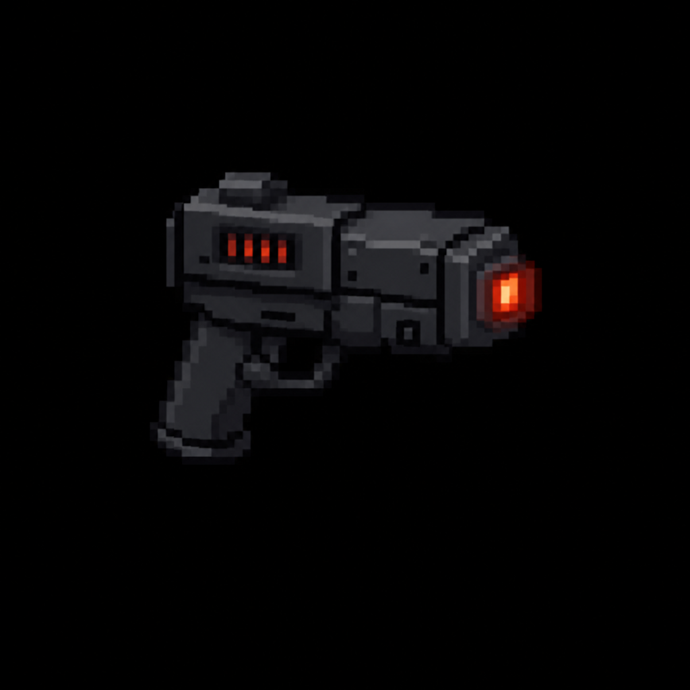

# "CRN-09 Decimator Beam" Prototype Heavy

> Transcribed from [`Deadlock Weapons and Items.docx`](../Deadlock%20Weapons%20and%20Items.docx),
> uploaded 2026-08-13. Category: Vanguard Experimental Prototype Set.
>
> **Naming:** kept as the in-universe document name — this is a fictional sci-fi prototype with no
> real-world firearm analog — see [`Sentinel_9_Service_Pistol.md`](Sentinel_9_Service_Pistol.md)
> and [`STORY_NOTES.md`](../STORY_NOTES.md) for the settled naming convention.

*AI-generated inventory-icon concept (2026-08-13), style-anchored to the real uploaded weapon
sprites.*

## Description

An unstable energy projector that fires a short-range beam of concentrated ionized particles.
Shreds flesh and bone, but overheats rapidly and drains bio-cells quickly. Considered too dangerous
for regular field deployment.

## Stats

| Stat | Value |
|---|---|
| Damage | 10 × 15 hits per second (beam ticks) |
| Fire Rate | Continuous |
| Bullet Speed | 999 (instant beam) |
| Handling | 1.1s |
| Mag Size | 100 energy |
| Scoped | false |
| Recoil | 0° |
| Noise lvl | 28 |
| Sight Range | +30 px |

## Story Placement

Not yet placed in any scripted content. Its "too dangerous for regular field deployment" framing
and "bio-cells" resource (distinct from every other weapon's conventional ammo) mark it as a
Vanguard black-project item, consistent with its grouping alongside the Thunderlance Railgun —
plausibly a Chapter 3 (underground Vanguard facility) find, but nothing is locked here.
