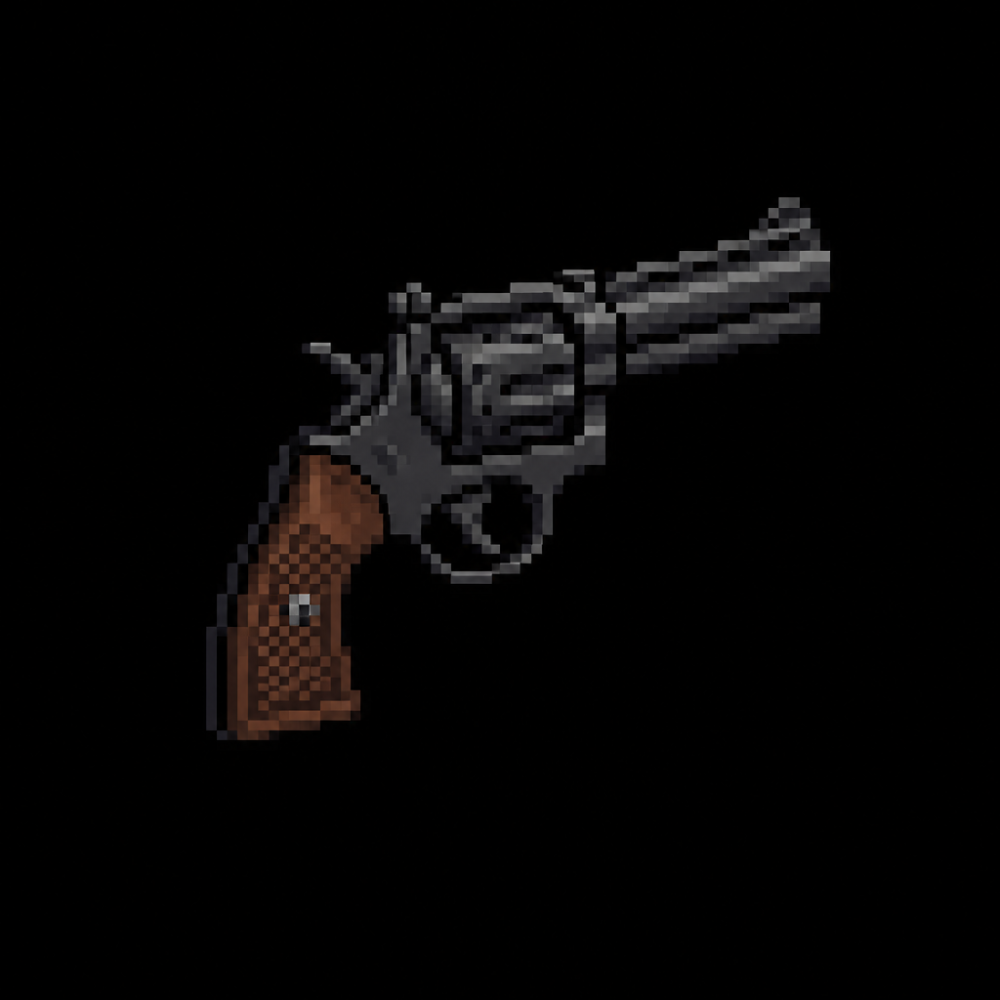

# "Ironback .357" Heavy Revolver

> Transcribed from [`Deadlock Weapons and Items.docx`](../Deadlock%20Weapons%20and%20Items.docx),
> uploaded 2026-08-13. Category: Standard Firearm.
>
> **Naming, settled 2026-08-13:** the in-universe name stays as the primary name — see
> [`Sentinel_9_Service_Pistol.md`](Sentinel_9_Service_Pistol.md) for the full naming rationale
> (the "Samurai Edge" precedent) and [`STORY_NOTES.md`](../STORY_NOTES.md) for the complete
> back-and-forth.
>
> **Real-World Basis:** a .357 Magnum six-shot revolver, in the vein of a **Colt Python**-style
> platform — consistent with "a brutally powerful six-shot revolver favored by old-school
> hunters." Flavor/grounding detail only; caliber is recorded in the Stats table below, not the
> name.

*AI-generated inventory-icon concept (2026-08-13), style-anchored to the real uploaded weapon
sprites.*

## Description

A brutally powerful six-shot revolver favored by old-school hunters. Every trigger pull hits like a
truck, but the recoil and slow handling demand precision. Perfect for players who want high-risk,
high-reward single-shot impact.

## Stats

| Stat | Value |
|---|---|
| Caliber | .357 Magnum |
| Damage | 62 |
| Fire Rate | 0.65s |
| Bullet Speed | 34 |
| Handling | 0.70s |
| Mag Size | 6 |
| Scoped | false |
| Recoil | 8.5° |
| Noise lvl | 35 |
| Sight Range | +70 px |

## Story Placement

Not yet placed in any scripted content. The "old-school hunters" flavor text suggests a rural
civilian source rather than a Vanguard/RPD one — plausibly a good fit for a residential or
hunting-adjacent location in a future district (e.g. the Northeast/Medical district's planned
Ravenwood Animal Clinic, or the North/Faith district's planned Hillside Residential Street — see
`MASTER_STORY.md` → "Secondary Locations"), but this is speculation, not a decision made here.
