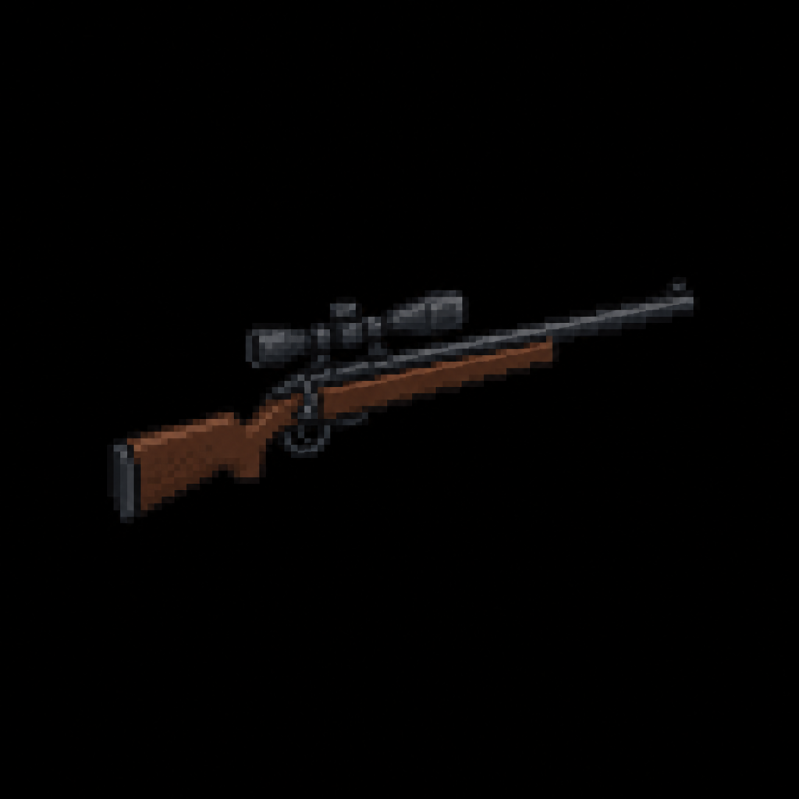

# "Longview .308" Bolt-Action Sniper Rifle

> Transcribed from [`Deadlock Weapons and Items.docx`](../Deadlock%20Weapons%20and%20Items.docx),
> uploaded 2026-08-13. Category: Standard Firearm.
>
> **Naming, settled 2026-08-13:** the in-universe name stays as the primary name — see
> [`Sentinel_9_Service_Pistol.md`](Sentinel_9_Service_Pistol.md) for the full naming rationale
> (the "Samurai Edge" precedent) and [`STORY_NOTES.md`](../STORY_NOTES.md) for the complete
> back-and-forth.
>
> **Real-World Basis:** a .308 Winchester bolt-action rifle, in the vein of a **Remington
> 700**-style platform — consistent with "a precision long-range rifle designed for hunting large
> game." Flavor/grounding detail only; caliber is recorded in the Stats table below, not the name.

*AI-generated inventory-icon concept (2026-08-13), style-anchored to the real uploaded weapon
sprites.*

## Description

A precision long-range rifle designed for hunting large game. When scoped in, enemies at great
distances can be engaged safely. Slow cycling and long ready time, but unmatched critical precision.

## Stats

| Stat | Value |
|---|---|
| Caliber | .308 Winchester |
| Damage | 95 |
| Fire Rate | 1.8s |
| Bullet Speed | 44 |
| Handling | 1.0s |
| Mag Size | 5 |
| Scoped | true |
| Recoil | 4.0° |
| Noise lvl | 38 |
| Sight Range | +180 px |

## Story Placement

Not yet placed in any scripted content. Its longest-in-class Sight Range (+180 px) suggests it's
best suited to an open/elevated location with real sightlines — a natural fit for the North/Faith
district's planned **Overlook Trail** (a wide vista over the city — see
[`MASTER_STORY.md`](../MASTER_STORY.md) → "Secondary Locations") once that district is written, but
this is speculation, not a decision made here.
