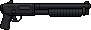

# "Ranger 870" Pump Shotgun

> Transcribed from [`Deadlock Weapons and Items.docx`](../Deadlock%20Weapons%20and%20Items.docx),
> uploaded 2026-08-13. Category: Standard Firearm.
>
> **Naming, settled 2026-08-13:** the in-universe name stays as the primary name — see
> [`Sentinel_9_Service_Pistol.md`](Sentinel_9_Service_Pistol.md) for the full naming rationale
> (the "Samurai Edge" precedent) and [`STORY_NOTES.md`](../STORY_NOTES.md) for the complete
> back-and-forth.
>
> **Real-World Basis:** functionally a 12-gauge pump-action shotgun, closest to a **Remington
> 870**-style platform (the "870" in this weapon's own name is already a direct nod to that real
> gun). Flavor/grounding detail only; caliber is recorded in the Stats table below, not the name.

*Real in-game sprite, uploaded by the project owner (2026-08-13).*

## Description

A rugged 12-gauge shotgun commonly owned by local hunters. Its manual pump makes follow-up shots
slow, but the sheer stopping power at close range is unmatched. Ideal for clearing hallways,
dispatching Shamblers, and delivering devastating takedowns when cornered.

## Stats

| Stat | Value |
|---|---|
| Caliber | 12-gauge |
| Damage | 14 × 8 pellets |
| Fire Rate | 1.1s |
| Bullet Speed | 19 |
| Handling | 0.85s |
| Mag Size | 6 |
| Scoped | false |
| Recoil | 10.0° |
| Noise lvl | 40 |
| Sight Range | +40 px |

## Story Placement

**Strong, unconfirmed match — flagged, not silently applied:** [`Locations/Police_Station.md`](../Locations/Police_Station.md)
already establishes the Police Station Armory's reward as "a clamped-down shotgun and two boxes of
shells" (the game's **second firearm**, per [`MASTER_STORY.md`](../MASTER_STORY.md) and
[`Scripts/Chapter_2_Ravenwood.md`](../Scripts/Chapter_2_Ravenwood.md)) — described there generically
as a "pump-action shotgun." The Ranger 870's own description ("a rugged 12-gauge shotgun... manual
pump") matches that beat closely, including the pump-action detail. **This is very likely meant to
be that same shotgun**, but no existing file names the model — it's only ever called "the shotgun."
Treating this as confirmed is a proposal pending explicit approval; once approved, the generic
"shotgun" references in `Police_Station.md`, `Creatures/Ashen_Hound.md`,
`Creatures/Zombie_Conglomerate.md`, and `Scripts/Chapter_2_Ravenwood.md` should be updated to name
it specifically.
